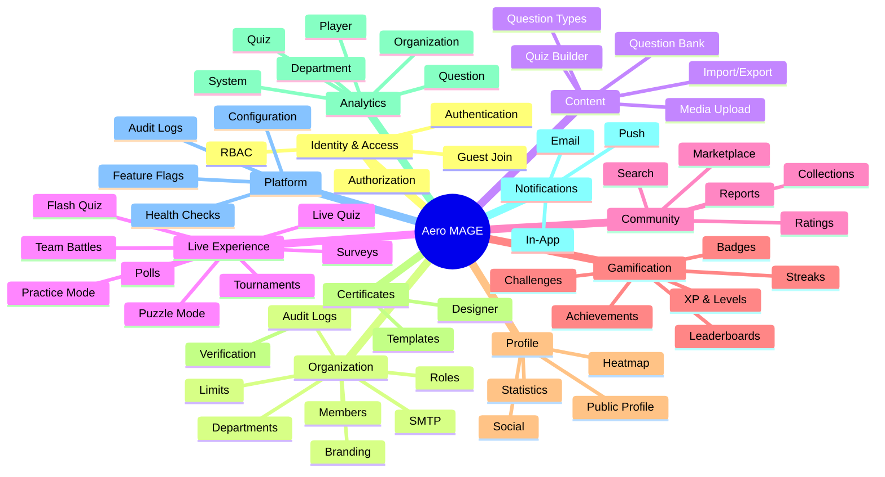
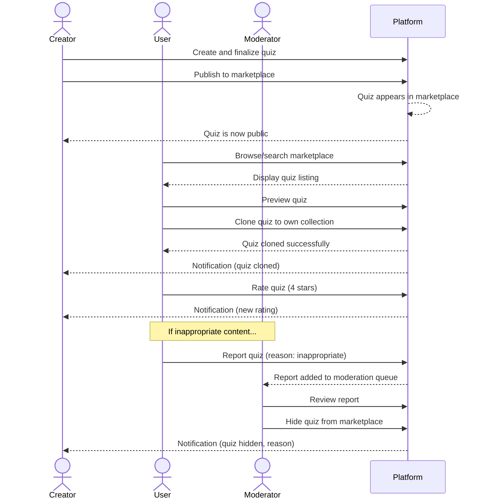
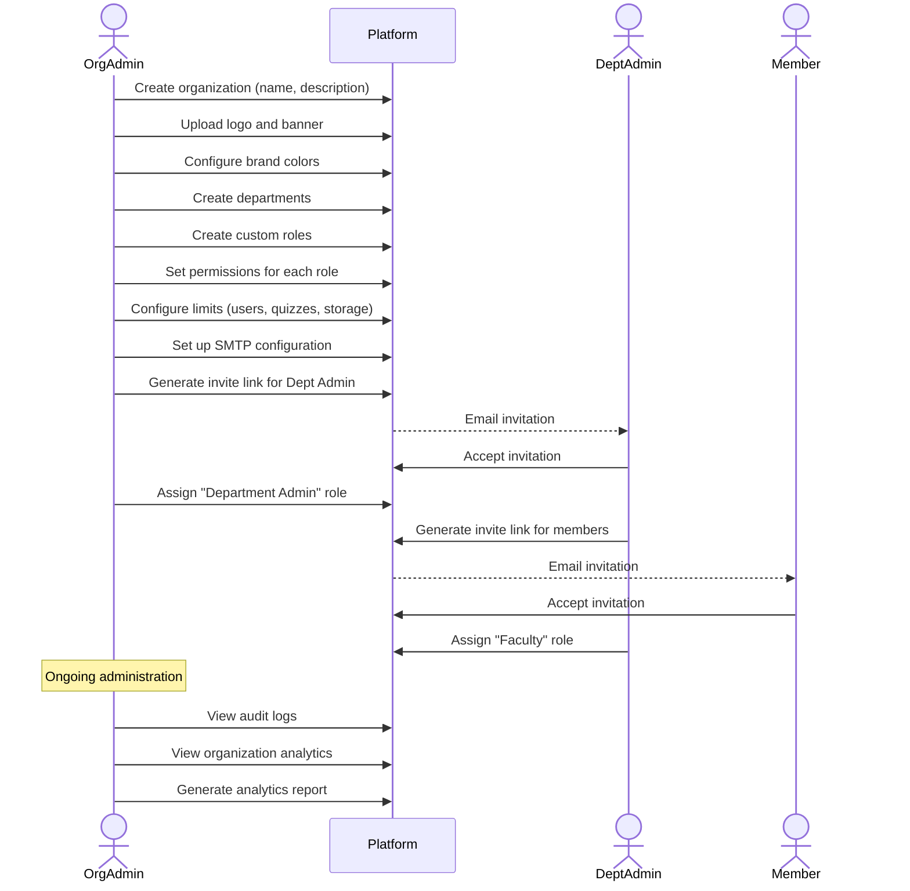
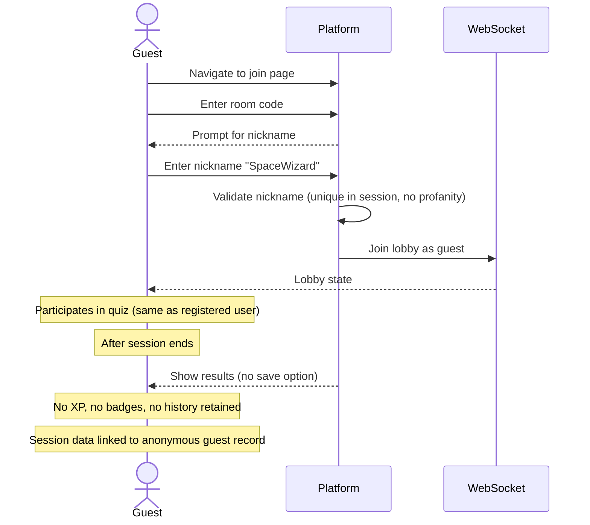
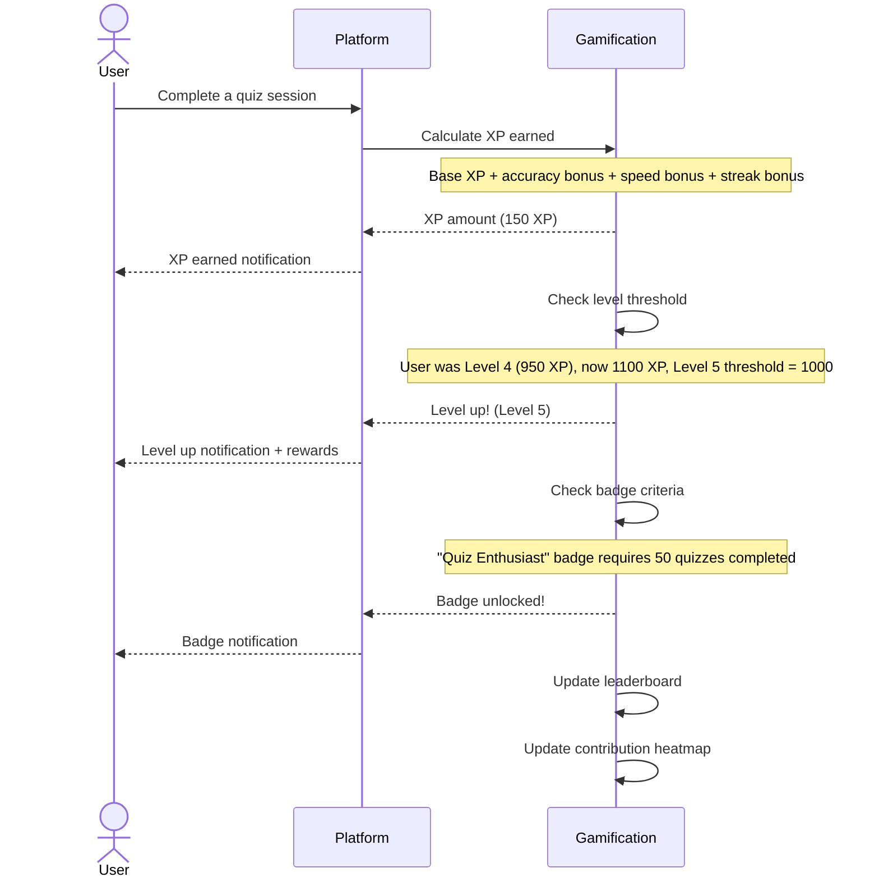

# 01 — Master Product Requirements Document (PRD)

**Document ID:** AERO-PRD-001  
**Version:** 1.0  
**Last Updated:** 2026-07-16  
**Author:** Product Architect  
**Status:** Approved  
**Classification:** Internal — Engineering

---

## Table of Contents

1. [Purpose](#1-purpose)
2. [Product Vision](#2-product-vision)
3. [Mission Statement](#3-mission-statement)
4. [Strategic Goals](#4-strategic-goals)
5. [Target Audience](#5-target-audience)
6. [User Personas](#6-user-personas)
7. [Competitive Analysis](#7-competitive-analysis)
8. [Key Differentiators](#8-key-differentiators)
9. [Feature Inventory](#9-feature-inventory)
10. [User Stories](#10-user-stories)
11. [Use Cases](#11-use-cases)
12. [Functional Requirements](#12-functional-requirements)
13. [Non-Functional Requirements](#13-non-functional-requirements)
14. [Acceptance Criteria](#14-acceptance-criteria)
15. [Success Metrics & KPIs](#15-success-metrics--kpis)
16. [Product Roadmap Summary](#16-product-roadmap-summary)
17. [Assumptions](#17-assumptions)
18. [Constraints](#18-constraints)
19. [Dependencies](#19-dependencies)
20. [Risks & Mitigations](#20-risks--mitigations)
21. [Out of Scope](#21-out-of-scope)
22. [Future Expansion](#22-future-expansion)
23. [References](#23-references)

---

## 1. Purpose

This Master Product Requirements Document (PRD) serves as the **definitive product specification** for Aero MAGE. It captures the complete product vision, business requirements, user stories, functional specifications, non-functional requirements, and acceptance criteria necessary for engineering teams to design, build, test, and deploy the platform.

This document is the foundational artifact from which all other documentation — architecture, database design, API specifications, frontend/backend blueprints, and testing strategies — are derived. Every feature described herein must be traceable through the [Requirements Traceability Matrix](./56-requirements-traceability-matrix.md) to its implementing API endpoint, database table, UI component, and test case.

### 1.1 Intended Audience

| Audience | Usage |
|----------|-------|
| Product Managers | Feature prioritization, roadmap alignment |
| Solution Architects | System design, technology decisions |
| Backend Engineers | API design, business logic implementation |
| Frontend Engineers | UI/UX implementation, component design |
| QA Engineers | Test case derivation, acceptance criteria |
| DevOps Engineers | Infrastructure requirements, scaling needs |
| Security Engineers | Security requirements, compliance |
| Stakeholders | Product understanding, investment decisions |

### 1.2 Document Conventions

- **SHALL** — Mandatory requirement. Must be implemented in the specified version.
- **SHOULD** — Strongly recommended. Should be implemented unless a documented trade-off justifies omission.
- **MAY** — Optional. Can be deferred without impacting core functionality.
- **[V1]** — Required for Version 1 (MVP).
- **[V2]** — Planned for Version 2.
- **[V3]** — Planned for Version 3.
- **[FUTURE]** — Documented for future consideration; no committed timeline.

---

## 2. Product Vision

### 2.1 Vision Statement

> **Aero MAGE is the next-generation real-time interactive learning platform that transforms passive education into active, engaging experiences through live quizzes, gamified learning, community-driven content, and enterprise-grade organization management.**

### 2.2 Elevator Pitch

Aero MAGE enables educators, trainers, community leaders, and organizations to create and deliver interactive learning experiences in real time. Unlike existing platforms that focus narrowly on simple quiz delivery, Aero MAGE provides a complete ecosystem — from content creation and collaborative question banks, to live sessions with advanced host controls, to a free community marketplace, to deep analytics and gamification — all within a platform that scales from a single classroom to a global enterprise.

### 2.3 Problem Statement

The current landscape of interactive learning platforms suffers from several critical gaps:

1. **Fragmented Tools** — Educators use separate tools for quizzes (Kahoot), polls (Mentimeter), surveys (Google Forms), and analytics (spreadsheets). There is no unified platform that combines all interactive learning modalities.

2. **Limited Organization Support** — Existing platforms offer basic team features but lack enterprise-grade organization management with departments, custom roles, branding, audit trails, and configurable limits.

3. **No Community Ecosystem** — Content is siloed. There is no open marketplace where educators can share, discover, clone, and improve learning content collaboratively.

4. **Shallow Gamification** — Most platforms offer basic points and a session leaderboard. No platform provides a comprehensive gamification system with XP, levels, badges, achievements, daily streaks, seasonal rankings, and a contribution heatmap.

5. **Poor Scalability** — Many platforms struggle with concurrent users during peak times (exam periods, training sessions), and their architectures cannot gracefully scale.

6. **Limited Question Types** — Most platforms support only 4–6 question types. Complex assessment needs (code questions, formula questions, case studies, hotspot questions) are unsupported.

7. **No Offline or Practice Mode** — Real-time-only platforms provide no mechanism for self-paced practice, revision, or asynchronous learning.

### 2.4 Solution

Aero MAGE addresses every gap identified above through a modular, scalable platform that:

- Unifies quizzes, polls, surveys, tournaments, team battles, and practice modes under one roof
- Provides enterprise-grade multi-tenant organization management
- Offers a free community marketplace for content discovery and sharing
- Implements deep gamification (XP, levels, 50+ badges, achievements, streaks, ranks)
- Supports 22+ question types including code, formula, drawing, and case study
- Scales from 1,000 to millions of users through a modular monolith architecture designed for future decomposition
- Provides comprehensive analytics at every level (system, organization, department, quiz, question, player)

---

## 3. Mission Statement

> **To democratize interactive learning by providing an open, scalable, and feature-rich platform that empowers educators, organizations, and communities to create engaging learning experiences — accessible to everyone, configurable for any need, and designed to grow from a classroom to a global platform.**

### 3.1 Core Values

| Value | Description |
|-------|-------------|
| **Openness** | The marketplace is free. Content sharing is encouraged. No paywalls on core learning features. |
| **Configurability** | Every limit, behavior, and feature is configurable — not hardcoded. Organizations, hosts, and admins can tailor the platform to their needs. |
| **Modularity** | Every feature is a self-contained module that can be developed, tested, deployed, and scaled independently. |
| **Engagement** | Learning should be active, not passive. Gamification, real-time interaction, and social features drive continuous engagement. |
| **Scalability** | Architecture decisions are made with future scale in mind. No redesign required when user base grows 1000x. |
| **Security** | Enterprise-grade security from day one. RBAC, audit logging, encryption, and OWASP compliance are non-negotiable. |
| **Accessibility** | The platform is usable by everyone, including users with disabilities. WCAG 2.1 AA compliance is the baseline. |

---

## 4. Strategic Goals

### 4.1 Short-Term Goals (V1 — 0–6 Months)

| ID | Goal | Metric |
|----|------|--------|
| SG-01 | Launch a fully functional live quiz platform | Successful live sessions with 100+ concurrent users |
| SG-02 | Support organization creation and management | 10+ organizations onboarded |
| SG-03 | Implement core gamification (XP, levels, badges) | Average user engagement > 3 sessions/week |
| SG-04 | Launch the community marketplace | 100+ published quizzes |
| SG-05 | Achieve < 200ms average API response time | P95 latency measured |
| SG-06 | Zero critical security vulnerabilities | OWASP Top 10 audit passed |

### 4.2 Medium-Term Goals (V2 — 6–12 Months)

| ID | Goal | Metric |
|----|------|--------|
| MG-01 | Scale to 10,000+ concurrent users | Load test validation |
| MG-02 | Add advanced game modes (tournaments, team battles) | 50+ tournaments created |
| MG-03 | Implement advanced analytics with scheduled reports | 80% of org admins using analytics |
| MG-04 | Migrate file storage to AWS S3 | Zero local file dependencies |
| MG-05 | Add push notifications | 60% of users enabling push |
| MG-06 | Certificate system with verification | 1,000+ certificates generated |

### 4.3 Long-Term Goals (V3 — 12–24 Months)

| ID | Goal | Metric |
|----|------|--------|
| LG-01 | Scale to 100,000+ concurrent users | Horizontal scaling validated |
| LG-02 | Add AI-powered features (question generation, adaptive learning) | 30% of quizzes using AI |
| LG-03 | Mobile applications (iOS, Android) | 40% of users on mobile |
| LG-04 | LMS integrations (Moodle, Google Classroom) | 5+ LMS integrations |
| LG-05 | Internationalization (i18n) — 10+ languages | 20% non-English user base |
| LG-06 | Enterprise SSO (SAML, SCIM) | 10+ enterprise customers |

---

## 5. Target Audience

### 5.1 Primary Audiences

| Segment | Description | Key Needs |
|---------|-------------|-----------|
| **K-12 Schools** | Teachers conducting classroom quizzes, assessments, and interactive lessons | Easy quiz creation, student engagement, basic analytics, fun gamification |
| **Universities** | Professors, lecturers conducting lectures with live interaction, assessments, and exams | Department management, faculty roles, advanced question types, analytics, certificates |
| **Corporate Training** | HR teams, L&D departments conducting employee training and assessments | Organization branding, custom roles, SMTP config, audit logs, certificates, analytics |
| **Community Creators** | Independent educators, content creators, tutors | Marketplace publishing, public profile, followers, gamification, recognition |
| **Online Learning Platforms** | Platforms integrating interactive quizzes into their existing offerings | API access, embeddable sessions, white-label potential |

### 5.2 Secondary Audiences

| Segment | Description |
|---------|-------------|
| **Event Organizers** | Using live polls and quizzes during conferences, workshops, meetups |
| **Social Groups** | Friends, clubs, communities hosting fun quiz competitions |
| **Self-Learners** | Individuals using practice mode and marketplace content for self-study |
| **Researchers** | Using surveys and polls for data collection |

### 5.3 Market Size Estimation

| Metric | Estimate |
|--------|----------|
| Global EdTech Market (2026) | $400B+ |
| Interactive Learning Segment | $15B+ |
| Target Addressable Market | $2B+ |
| Initial Target Users (V1) | 1,000–10,000 |
| Growth Target (V2) | 100,000+ |
| Scale Target (V3) | 1,000,000+ |

---

## 6. User Personas

### 6.1 Persona: Sarah — The University Professor

| Attribute | Detail |
|-----------|--------|
| **Name** | Sarah Mitchell |
| **Age** | 42 |
| **Role** | Professor of Computer Science |
| **Organization** | State University |
| **Tech Savviness** | High |
| **Primary Goal** | Make lectures interactive, assess student understanding in real-time |
| **Secondary Goal** | Track student performance over the semester |
| **Pain Points** | Existing tools lack advanced question types (code, formula); no department-level analytics; no way to share question banks with colleagues |
| **Feature Needs** | Code questions, formula questions, department question bank, quiz analytics, faculty analytics, student performance tracking, certificate generation |
| **Usage Frequency** | 3–5 times per week |
| **Devices** | Laptop (primary), tablet (secondary) |

**User Journey:**
1. Sarah creates a quiz with 15 questions (mix of MCQ, code, and fill-in-blank)
2. She schedules the quiz for her next lecture
3. During the lecture, she starts the session — students join via QR code
4. She monitors real-time responses and pauses to explain difficult concepts
5. After the session, she reviews question-level analytics to identify weak areas
6. She shares the quiz with her department's question bank for colleagues to use
7. At semester end, she generates participation certificates for all students

---

### 6.2 Persona: Marcus — The Corporate Trainer

| Attribute | Detail |
|-----------|--------|
| **Name** | Marcus Johnson |
| **Age** | 35 |
| **Role** | Learning & Development Manager |
| **Organization** | Global Tech Corp (2,000 employees) |
| **Tech Savviness** | Medium |
| **Primary Goal** | Deliver engaging compliance and skills training |
| **Secondary Goal** | Generate reports for management; issue completion certificates |
| **Pain Points** | Current tools don't support organization branding; no audit trail for compliance; limited analytics for management reporting |
| **Feature Needs** | Organization branding, custom SMTP, audit logs, certificates, department structure, analytics exports, scheduled reports |
| **Usage Frequency** | 2–3 times per week |
| **Devices** | Laptop only |

**User Journey:**
1. Marcus sets up an organization with the company branding (logo, colors)
2. He creates departments (Engineering, Sales, HR, Operations)
3. He assigns department admins and configures roles
4. He creates a compliance quiz and schedules it for the Engineering department
5. Employees receive email notifications and join the live session
6. After completion, Marcus reviews department analytics and exports a report
7. Completion certificates are automatically generated and emailed to participants
8. The audit log records every action for compliance purposes

---

### 6.3 Persona: Aisha — The High School Teacher

| Attribute | Detail |
|-----------|--------|
| **Name** | Aisha Rahman |
| **Age** | 28 |
| **Role** | Biology Teacher |
| **Organization** | Lincoln High School |
| **Tech Savviness** | Medium |
| **Primary Goal** | Make biology lessons fun and interactive for teenagers |
| **Secondary Goal** | Track which topics students struggle with |
| **Pain Points** | Students lose interest quickly; existing tools are boring and repetitive; no gamification to motivate students |
| **Feature Needs** | Fun gamification, image/video questions, quick quiz creation, leaderboards, streaks, badges, simple analytics |
| **Usage Frequency** | Daily |
| **Devices** | Laptop, phone (to monitor sessions on the go) |

**User Journey:**
1. Aisha browses the marketplace for biology quizzes and clones one about cell biology
2. She customizes the quiz — adds image questions showing cell diagrams
3. She starts a flash quiz (5 minutes, rapid-fire) at the beginning of class
4. Students join with a room code and compete on the leaderboard
5. The class cheers as the leaderboard updates in real time
6. After class, Aisha checks which questions had the lowest accuracy
7. Students earn XP and badges, motivating them to participate tomorrow

---

### 6.4 Persona: Dev — The Community Creator

| Attribute | Detail |
|-----------|--------|
| **Name** | Dev Patel |
| **Age** | 24 |
| **Role** | Independent Educator / Content Creator |
| **Organization** | None (individual user) |
| **Tech Savviness** | High |
| **Primary Goal** | Build a following by creating high-quality quiz content |
| **Secondary Goal** | Get recognized in the community; earn badges and climb leaderboards |
| **Pain Points** | No platform lets him build a public profile around quiz creation; no marketplace analytics; no recognition system |
| **Feature Needs** | Public profile, marketplace publishing, followers/following, contribution heatmap, badges, achievements, creator analytics |
| **Usage Frequency** | Daily |
| **Devices** | Laptop, phone |

**User Journey:**
1. Dev creates a series of JavaScript quizzes with code questions
2. He publishes them to the marketplace with appropriate tags and categories
3. His quizzes get cloned and rated by other users
4. He earns XP for quiz creation and badges for reaching milestones
5. His profile shows a contribution heatmap (GitHub-style) and his quiz stats
6. Other users follow him to get notified of new quizzes
7. He pins his "Top Creator" badge on his profile

---

### 6.5 Persona: Jamie — The Guest Participant

| Attribute | Detail |
|-----------|--------|
| **Name** | Jamie (no last name — guest) |
| **Age** | 19 |
| **Role** | University Student (not registered) |
| **Organization** | None |
| **Tech Savviness** | High |
| **Primary Goal** | Join a live quiz quickly without creating an account |
| **Secondary Goal** | None — just participate and have fun |
| **Pain Points** | Doesn't want to create an account; just wants to join with a nickname and play |
| **Feature Needs** | Guest join with nickname, room code/QR join, participate in live session, see leaderboard |
| **Limitations** | Cannot create quizzes, cannot access history, no profile, no gamification, no marketplace |
| **Usage Frequency** | Occasional (when invited) |
| **Devices** | Phone (primary) |

**User Journey:**
1. Jamie's professor shares a room code on the projector
2. Jamie opens the platform on their phone and enters the room code
3. Jamie enters a nickname "SpaceWizard" and joins the lobby
4. The quiz starts — Jamie answers questions on their phone
5. Jamie sees their ranking on the leaderboard
6. After the quiz, Jamie's session ends — no data is retained

---

### 6.6 Persona: Priya — The Organization Admin

| Attribute | Detail |
|-----------|--------|
| **Name** | Priya Sharma |
| **Age** | 38 |
| **Role** | IT Administrator |
| **Organization** | EduTech University |
| **Tech Savviness** | Very High |
| **Primary Goal** | Set up and manage the university's Aero MAGE instance |
| **Secondary Goal** | Ensure security, compliance, and proper access control |
| **Pain Points** | Needs granular role management; audit trails for compliance; configurable limits per department |
| **Feature Needs** | Organization setup, department creation, role management, RBAC configuration, SMTP setup, audit logs, member management, storage limits, branding |
| **Usage Frequency** | Weekly (administration tasks) |
| **Devices** | Laptop |

**User Journey:**
1. Priya creates the EduTech University organization
2. She uploads the university logo and configures the brand colors
3. She creates departments: Computer Science, Mathematics, Physics, Chemistry
4. She creates custom roles: Department Head, Senior Faculty, Junior Faculty, Teaching Assistant
5. She configures permissions for each role
6. She generates invitation links for department heads
7. She sets up SMTP for organization-branded emails
8. She configures limits: max 500 users, 100 quizzes per department, 50 questions per quiz
9. She reviews audit logs weekly for compliance

---

### 6.7 Persona: Alex — The Super Admin

| Attribute | Detail |
|-----------|--------|
| **Name** | Alex Torres |
| **Age** | 32 |
| **Role** | Platform Administrator |
| **Organization** | Aero MAGE (the platform itself) |
| **Tech Savviness** | Expert |
| **Primary Goal** | Monitor and manage the entire platform |
| **Secondary Goal** | Respond to reports, manage feature flags, ensure platform health |
| **Pain Points** | Needs system-wide visibility; needs to toggle features; needs to handle moderation |
| **Feature Needs** | System analytics, user management, organization management, feature flags, moderation queue, system configuration, health monitoring |
| **Usage Frequency** | Daily |
| **Devices** | Laptop |

---

## 7. Competitive Analysis

### 7.1 Competitor Matrix

| Feature | Kahoot! | Quizizz | Mentimeter | Slido | Google Forms | **Aero MAGE** |
|---------|---------|---------|------------|-------|-------------|---------------|
| Live Quizzes | ✅ | ✅ | ✅ | ✅ | ❌ | ✅ |
| Self-Paced Practice | ❌ | ✅ | ❌ | ❌ | ❌ | ✅ |
| Polls/Surveys | ❌ | ❌ | ✅ | ✅ | ✅ | ✅ |
| Team Battles | ✅ (Basic) | ❌ | ❌ | ❌ | ❌ | ✅ (Advanced) |
| Tournaments | ❌ | ❌ | ❌ | ❌ | ❌ | ✅ |
| Organization Management | ✅ (Basic) | ✅ (Basic) | ✅ (Basic) | ❌ | ❌ | ✅ (Enterprise) |
| Department Structure | ❌ | ❌ | ❌ | ❌ | ❌ | ✅ |
| Custom Roles (RBAC) | ❌ | ❌ | ❌ | ❌ | ❌ | ✅ |
| Community Marketplace | ✅ (Paid) | ❌ | ❌ | ❌ | ❌ | ✅ (Free) |
| Gamification | ✅ (Basic) | ✅ (Basic) | ❌ | ❌ | ❌ | ✅ (Deep) |
| Contribution Heatmap | ❌ | ❌ | ❌ | ❌ | ❌ | ✅ |
| Public Profile | ❌ | ❌ | ❌ | ❌ | ❌ | ✅ |
| Followers/Following | ❌ | ❌ | ❌ | ❌ | ❌ | ✅ |
| Certificates | ❌ | ❌ | ❌ | ❌ | ❌ | ✅ |
| Certificate Designer | ❌ | ❌ | ❌ | ❌ | ❌ | ✅ |
| Code Questions | ❌ | ❌ | ❌ | ❌ | ❌ | ✅ |
| Formula Questions | ❌ | ❌ | ❌ | ❌ | ❌ | ✅ |
| Drawing Questions | ❌ | ❌ | ❌ | ❌ | ❌ | ✅ |
| Hotspot Questions | ❌ | ❌ | ❌ | ❌ | ❌ | ✅ |
| 20+ Question Types | ❌ (4) | ❌ (5) | ❌ (6) | ❌ (3) | ❌ (6) | ✅ (22+) |
| Audit Logs | ❌ | ❌ | ❌ | ❌ | ❌ | ✅ |
| Feature Flags | ❌ | ❌ | ❌ | ❌ | ❌ | ✅ |
| Configurable Limits | ❌ | ❌ | ❌ | ❌ | ❌ | ✅ |
| Custom SMTP | ❌ | ❌ | ❌ | ❌ | ❌ | ✅ |
| Free Tier | Limited | Limited | Limited | Limited | ✅ | ✅ (Full) |
| Open Marketplace | Paid | ❌ | ❌ | ❌ | ❌ | ✅ (Free) |
| Question Bank Sharing | ❌ | ❌ | ❌ | ❌ | ❌ | ✅ |
| Daily Streaks | ❌ | ❌ | ❌ | ❌ | ❌ | ✅ |
| Weekly Challenges | ❌ | ❌ | ❌ | ❌ | ❌ | ✅ |

### 7.2 Competitive Advantages

1. **All-in-One Platform** — Aero MAGE replaces 4–5 separate tools with a single, unified platform.
2. **Free Marketplace** — Unlike Kahoot's paid marketplace, Aero MAGE's marketplace is completely free — fostering community and collaboration.
3. **Enterprise-Grade Organization Model** — No competitor offers departments, custom RBAC, configurable limits, audit logs, and custom SMTP together.
4. **Deep Gamification** — The most comprehensive gamification system in the interactive learning space.
5. **22+ Question Types** — Far exceeding the 4–6 types offered by competitors.
6. **Social Features** — Public profiles, followers, contribution heatmaps — turning quiz creation into a recognized community contribution (like GitHub for learning content).
7. **Certificate System** — Built-in certificate designer with public verification — no external tools needed.

---

## 8. Key Differentiators

### 8.1 The "GitHub for Learning Content" Vision

Aero MAGE is not just a quiz tool — it is a **content creation and collaboration platform** for learning. The marketplace, public profiles, contribution heatmaps, and social features create a GitHub-like experience where:

- Creators build reputations through quality content
- Content is discoverable, clonable, and improvable
- Contributions are visualized (heatmap) and rewarded (badges, XP)
- The community collectively raises the quality of learning materials

### 8.2 The "Enterprise + Community" Dual Nature

Most platforms are either enterprise tools (Slido) or consumer products (Kahoot). Aero MAGE uniquely serves both:

- **Enterprise**: Organizations, departments, custom roles, audit logs, branding, SMTP, certificates
- **Community**: Public profiles, marketplace, gamification, social features, streaks

### 8.3 Configurable Everything

Unlike competitors that hardcode limits and behaviors, Aero MAGE treats configuration as a first-class concern:

- Quiz limits, question limits, timer durations — all configurable
- XP rules, scoring formulas — host-configurable per session
- Feature availability — toggleable via feature flags
- Organization limits — configurable per org

---

## 9. Feature Inventory

### 9.1 Feature Categories



### 9.2 Complete Feature List

#### 9.2.1 Authentication & Identity

| ID | Feature | Version | Priority |
|----|---------|---------|----------|
| F-AUTH-001 | Email/password registration | V1 | Critical |
| F-AUTH-002 | Email/password login | V1 | Critical |
| F-AUTH-003 | Google OAuth login | V1 | Critical |
| F-AUTH-004 | Guest join (nickname only, no account) | V1 | Critical |
| F-AUTH-005 | JWT access token (short-lived) | V1 | Critical |
| F-AUTH-006 | JWT refresh token (long-lived, rotatable) | V1 | Critical |
| F-AUTH-007 | Email verification | V1 | High |
| F-AUTH-008 | Password reset via email | V1 | High |
| F-AUTH-009 | Account deactivation | V1 | Medium |
| F-AUTH-010 | Session management (view active sessions) | V2 | Medium |
| F-AUTH-011 | Multi-device logout | V2 | Medium |
| F-AUTH-012 | Two-factor authentication (TOTP) | V3 | Low |
| F-AUTH-013 | Enterprise SSO (SAML) | V3 | Low |
| F-AUTH-014 | SCIM provisioning | V3 | Low |

#### 9.2.2 User Management

| ID | Feature | Version | Priority |
|----|---------|---------|----------|
| F-USER-001 | User profile (avatar, banner, bio) | V1 | Critical |
| F-USER-002 | Profile editing | V1 | Critical |
| F-USER-003 | Avatar upload | V1 | High |
| F-USER-004 | Banner upload | V1 | Medium |
| F-USER-005 | Account settings (email, password, display name) | V1 | High |
| F-USER-006 | Notification preferences | V1 | High |
| F-USER-007 | Privacy settings | V1 | Medium |
| F-USER-008 | User search | V1 | Medium |
| F-USER-009 | Follow/unfollow users | V1 | Medium |
| F-USER-010 | Followers list | V1 | Medium |
| F-USER-011 | Following list | V1 | Medium |
| F-USER-012 | Block users | V2 | Low |
| F-USER-013 | Report users | V2 | Medium |
| F-USER-014 | User activity feed | V1 | Medium |
| F-USER-015 | Contribution heatmap | V1 | High |

#### 9.2.3 Organization Management

| ID | Feature | Version | Priority |
|----|---------|---------|----------|
| F-ORG-001 | Create organization | V1 | Critical |
| F-ORG-002 | Organization profile (name, description) | V1 | Critical |
| F-ORG-003 | Organization branding (logo) | V1 | High |
| F-ORG-004 | Organization branding (banner) | V1 | Medium |
| F-ORG-005 | Organization branding (theme colors) | V1 | Medium |
| F-ORG-006 | Create departments | V1 | Critical |
| F-ORG-007 | Department management (CRUD) | V1 | Critical |
| F-ORG-008 | Member invitation via email | V1 | Critical |
| F-ORG-009 | Member invitation via link | V1 | High |
| F-ORG-010 | Join requests (approval flow) | V1 | High |
| F-ORG-011 | Member role assignment | V1 | Critical |
| F-ORG-012 | Custom role creation | V1 | Critical |
| F-ORG-013 | Permission management | V1 | Critical |
| F-ORG-014 | Member removal | V1 | High |
| F-ORG-015 | Member listing with filters | V1 | High |
| F-ORG-016 | Organization settings | V1 | High |
| F-ORG-017 | Configurable limits (max users) | V1 | High |
| F-ORG-018 | Configurable limits (max quizzes) | V1 | High |
| F-ORG-019 | Configurable limits (max questions per quiz) | V1 | High |
| F-ORG-020 | Configurable limits (storage) | V1 | High |
| F-ORG-021 | SMTP configuration | V1 | Medium |
| F-ORG-022 | Certificate templates | V1 | Medium |
| F-ORG-023 | Organization audit logs | V1 | High |
| F-ORG-024 | Organization analytics dashboard | V1 | High |
| F-ORG-025 | Organization deactivation (soft delete) | V1 | Medium |
| F-ORG-026 | Transfer organization ownership | V2 | Low |
| F-ORG-027 | Organization NOT displayed on user public profiles | V1 | Critical |

#### 9.2.4 RBAC (Role-Based Access Control)

| ID | Feature | Version | Priority |
|----|---------|---------|----------|
| F-RBAC-001 | Predefined roles (Guest through Super Admin) | V1 | Critical |
| F-RBAC-002 | Custom role creation within organizations | V1 | Critical |
| F-RBAC-003 | Granular permissions (resource:action format) | V1 | Critical |
| F-RBAC-004 | Role-permission mapping | V1 | Critical |
| F-RBAC-005 | Permission inheritance (role hierarchy) | V1 | High |
| F-RBAC-006 | Role assignment to users | V1 | Critical |
| F-RBAC-007 | Permission evaluation middleware | V1 | Critical |
| F-RBAC-008 | Default role assignment on registration | V1 | High |
| F-RBAC-009 | Multiple roles per user (within org context) | V1 | Medium |
| F-RBAC-010 | System roles vs. organization roles distinction | V1 | Critical |

#### 9.2.5 Quiz Builder

| ID | Feature | Version | Priority |
|----|---------|---------|----------|
| F-QUIZ-001 | Create quiz | V1 | Critical |
| F-QUIZ-002 | Edit quiz | V1 | Critical |
| F-QUIZ-003 | Delete quiz (soft delete) | V1 | Critical |
| F-QUIZ-004 | Quiz settings (title, description, category, tags) | V1 | Critical |
| F-QUIZ-005 | Quiz cover image | V1 | Medium |
| F-QUIZ-006 | Add questions to quiz | V1 | Critical |
| F-QUIZ-007 | Reorder questions (drag and drop) | V1 | High |
| F-QUIZ-008 | Duplicate question within quiz | V1 | Medium |
| F-QUIZ-009 | Import questions from question bank | V1 | High |
| F-QUIZ-010 | Quiz timer configuration (per-question or total) | V1 | Critical |
| F-QUIZ-011 | Quiz scoring configuration | V1 | High |
| F-QUIZ-012 | Quiz difficulty setting | V1 | Medium |
| F-QUIZ-013 | Quiz language setting | V1 | Medium |
| F-QUIZ-014 | Quiz visibility (private, organization, public) | V1 | Critical |
| F-QUIZ-015 | Quiz preview | V1 | High |
| F-QUIZ-016 | Quiz versioning | V2 | Medium |
| F-QUIZ-017 | Quiz templates | V2 | Low |
| F-QUIZ-018 | Quiz archive | V1 | Medium |
| F-QUIZ-019 | Quiz restore from archive | V1 | Medium |
| F-QUIZ-020 | Quiz clone | V1 | High |
| F-QUIZ-021 | Quiz shuffle questions option | V1 | High |
| F-QUIZ-022 | Quiz shuffle answers option | V1 | High |
| F-QUIZ-023 | Quiz passing score configuration | V1 | Medium |
| F-QUIZ-024 | Quiz attempt limits | V2 | Medium |
| F-QUIZ-025 | Quiz bulk operations | V2 | Low |

#### 9.2.6 Question Types

| ID | Feature | Type | Version | Priority |
|----|---------|------|---------|----------|
| F-QT-001 | Single Choice | Core | V1 | Critical |
| F-QT-002 | Multiple Choice | Core | V1 | Critical |
| F-QT-003 | True/False | Core | V1 | Critical |
| F-QT-004 | Fill in the Blank | Core | V1 | Critical |
| F-QT-005 | Ordering (sequence) | Core | V1 | High |
| F-QT-006 | Matching (pairs) | Core | V1 | High |
| F-QT-007 | Image-based (select on image) | Media | V1 | High |
| F-QT-008 | Audio-based (listen and answer) | Media | V1 | Medium |
| F-QT-009 | Video-based (watch and answer) | Media | V1 | Medium |
| F-QT-010 | Code (write/evaluate code) | Advanced | V1 | High |
| F-QT-011 | Numerical (exact or range) | Core | V1 | High |
| F-QT-012 | Formula / Math (LaTeX) | Advanced | V2 | Medium |
| F-QT-013 | Poll (no correct answer) | Interactive | V1 | High |
| F-QT-014 | Survey (multi-question, no score) | Interactive | V1 | Medium |
| F-QT-015 | Drawing (canvas-based) | Advanced | V2 | Low |
| F-QT-016 | Hotspot (click on area) | Advanced | V2 | Medium |
| F-QT-017 | Drag and Drop | Advanced | V2 | Medium |
| F-QT-018 | Timeline (chronological ordering) | Advanced | V2 | Low |
| F-QT-019 | Word Cloud (open response, aggregated) | Interactive | V2 | Low |
| F-QT-020 | Essay (long-form text) | Advanced | V2 | Medium |
| F-QT-021 | Case Study (multi-part scenario) | Advanced | V2 | Medium |
| F-QT-022 | Puzzle (logic-based) | Game | V2 | Low |

#### 9.2.7 Question Bank

| ID | Feature | Version | Priority |
|----|---------|---------|----------|
| F-QB-001 | Private question bank (per user) | V1 | Critical |
| F-QB-002 | Department question bank | V1 | High |
| F-QB-003 | Organization question bank | V1 | High |
| F-QB-004 | Public question bank (marketplace) | V1 | High |
| F-QB-005 | Shared question bank (between specific users) | V2 | Medium |
| F-QB-006 | Question cloning | V1 | High |
| F-QB-007 | Question versioning | V2 | Medium |
| F-QB-008 | Question tagging | V1 | High |
| F-QB-009 | Question categories | V1 | High |
| F-QB-010 | Question difficulty levels | V1 | High |
| F-QB-011 | Question language | V1 | Medium |
| F-QB-012 | Question search and filter | V1 | High |
| F-QB-013 | Bulk import (CSV) | V1 | High |
| F-QB-014 | Bulk import (JSON) | V1 | Medium |
| F-QB-015 | Bulk import (Excel) | V2 | Medium |
| F-QB-016 | Bulk export | V1 | Medium |
| F-QB-017 | Question analytics (usage, accuracy) | V1 | Medium |
| F-QB-018 | Question review/approval workflow | V2 | Low |

#### 9.2.8 Live Quiz Engine

| ID | Feature | Version | Priority |
|----|---------|---------|----------|
| F-LIVE-001 | Create live session from quiz | V1 | Critical |
| F-LIVE-002 | Session lifecycle (Draft→Scheduled→Lobby→Countdown→Live→Paused→Completed→Archived) | V1 | Critical |
| F-LIVE-003 | Join via room code | V1 | Critical |
| F-LIVE-004 | Join via QR code | V1 | Critical |
| F-LIVE-005 | Join via invite link | V1 | High |
| F-LIVE-006 | Waiting room / lobby | V1 | Critical |
| F-LIVE-007 | Countdown before start | V1 | High |
| F-LIVE-008 | Host control: Start session | V1 | Critical |
| F-LIVE-009 | Host control: Pause session | V1 | Critical |
| F-LIVE-010 | Host control: Resume session | V1 | Critical |
| F-LIVE-011 | Host control: Skip question | V1 | High |
| F-LIVE-012 | Host control: Reopen question | V1 | Medium |
| F-LIVE-013 | Host control: Extend timer | V1 | High |
| F-LIVE-014 | Host control: Lock room | V1 | High |
| F-LIVE-015 | Host control: Unlock room | V1 | High |
| F-LIVE-016 | Host control: Hide leaderboard | V1 | Medium |
| F-LIVE-017 | Host control: Show leaderboard | V1 | Medium |
| F-LIVE-018 | Host control: Allow late join | V1 | High |
| F-LIVE-019 | Host control: Disallow late join | V1 | High |
| F-LIVE-020 | Host control: End session | V1 | Critical |
| F-LIVE-021 | Real-time question delivery | V1 | Critical |
| F-LIVE-022 | Real-time answer submission | V1 | Critical |
| F-LIVE-023 | Real-time scoring | V1 | Critical |
| F-LIVE-024 | Real-time leaderboard | V1 | Critical |
| F-LIVE-025 | Server-side timer synchronization | V1 | Critical |
| F-LIVE-026 | Host reconnection recovery | V1 | Critical |
| F-LIVE-027 | Participant reconnection recovery | V1 | Critical |
| F-LIVE-028 | Session state persistence | V1 | Critical |
| F-LIVE-029 | Concurrent session limits (configurable) | V1 | High |
| F-LIVE-030 | Participant count display | V1 | High |
| F-LIVE-031 | Answer distribution display (after question) | V1 | High |
| F-LIVE-032 | Question results explanation | V1 | Medium |
| F-LIVE-033 | Session summary screen | V1 | High |
| F-LIVE-034 | Session replay/review | V2 | Medium |
| F-LIVE-035 | Spectator mode | V2 | Low |
| F-LIVE-036 | Live streaming integration | V3 | Low |

#### 9.2.9 Game Modes

| ID | Feature | Version | Priority |
|----|---------|---------|----------|
| F-MODE-001 | Practice mode (self-paced, no live session) | V1 | High |
| F-MODE-002 | Flash quiz (rapid-fire, short timer) | V1 | High |
| F-MODE-003 | Team battles (team formation, team scoring) | V2 | High |
| F-MODE-004 | Tournament mode (brackets, rounds, elimination) | V2 | Medium |
| F-MODE-005 | Poll mode (anonymous/named, no scoring) | V1 | High |
| F-MODE-006 | Survey mode (multi-question, no scoring) | V1 | Medium |
| F-MODE-007 | Puzzle mode (logic-based, progressive difficulty) | V2 | Low |
| F-MODE-008 | Custom mode (host-defined rules) | V3 | Low |

#### 9.2.10 Marketplace

| ID | Feature | Version | Priority |
|----|---------|---------|----------|
| F-MKT-001 | Publish quiz to marketplace | V1 | Critical |
| F-MKT-002 | Unpublish from marketplace | V1 | High |
| F-MKT-003 | Clone quiz from marketplace | V1 | Critical |
| F-MKT-004 | Rate quiz (1–5 stars) | V1 | High |
| F-MKT-005 | Favorite quiz | V1 | High |
| F-MKT-006 | Like quiz | V1 | Medium |
| F-MKT-007 | Bookmark quiz | V1 | Medium |
| F-MKT-008 | Report quiz | V1 | High |
| F-MKT-009 | Collections (curated lists) | V1 | Medium |
| F-MKT-010 | Featured quizzes (admin-curated) | V1 | Medium |
| F-MKT-011 | Trending quizzes (algorithm-driven) | V1 | Medium |
| F-MKT-012 | Category browsing | V1 | High |
| F-MKT-013 | Tag-based discovery | V1 | High |
| F-MKT-014 | Full-text search | V1 | Critical |
| F-MKT-015 | Advanced filters (difficulty, question count, rating, language) | V1 | High |
| F-MKT-016 | Sort options (newest, most popular, highest rated) | V1 | High |
| F-MKT-017 | Quiz preview before cloning | V1 | High |
| F-MKT-018 | Moderation queue (post-report) | V1 | High |
| F-MKT-019 | Creator profile link | V1 | Medium |
| F-MKT-020 | Clone count tracking | V1 | Medium |
| F-MKT-021 | Marketplace analytics for creators | V1 | Medium |
| F-MKT-022 | Comments/reviews | V2 | Medium |
| F-MKT-023 | Version history in marketplace | V2 | Low |

#### 9.2.11 Gamification

| ID | Feature | Version | Priority |
|----|---------|---------|----------|
| F-GAM-001 | XP earning (quiz participation) | V1 | Critical |
| F-GAM-002 | XP earning (quiz creation) | V1 | High |
| F-GAM-003 | XP earning (marketplace contribution) | V1 | High |
| F-GAM-004 | XP earning (daily login) | V1 | Medium |
| F-GAM-005 | Host-configurable XP rules per session | V1 | High |
| F-GAM-006 | Level progression (XP thresholds) | V1 | Critical |
| F-GAM-007 | Level-up rewards | V1 | Medium |
| F-GAM-008 | Coins system (earning) | V1 | Medium |
| F-GAM-009 | Coins system (spending — future) | V2 | Low |
| F-GAM-010 | Badge system (50+ badges) | V1 | High |
| F-GAM-011 | Badge categories (creation, participation, social, mastery) | V1 | High |
| F-GAM-012 | Badge rarity (common, uncommon, rare, epic, legendary) | V1 | Medium |
| F-GAM-013 | Achievement system (milestones) | V1 | High |
| F-GAM-014 | Progressive achievements (tiers) | V1 | Medium |
| F-GAM-015 | Titles (earned from achievements) | V1 | Medium |
| F-GAM-016 | Ranks (based on XP/level) | V1 | Medium |
| F-GAM-017 | Global leaderboard | V1 | High |
| F-GAM-018 | Country leaderboard | V1 | Medium |
| F-GAM-019 | Seasonal leaderboard (monthly reset) | V2 | Medium |
| F-GAM-020 | Daily streaks (consecutive login/participation) | V1 | High |
| F-GAM-021 | Streak rewards | V1 | Medium |
| F-GAM-022 | Streak protection (one missed day grace) | V2 | Low |
| F-GAM-023 | Weekly challenges (system-generated) | V2 | Medium |
| F-GAM-024 | GitHub-style contribution heatmap | V1 | High |
| F-GAM-025 | Anti-exploitation measures (XP caps, duplicate detection) | V1 | High |

#### 9.2.12 Public Profile

| ID | Feature | Version | Priority |
|----|---------|---------|----------|
| F-PROF-001 | Public profile page | V1 | Critical |
| F-PROF-002 | Avatar display | V1 | Critical |
| F-PROF-003 | Banner display | V1 | Medium |
| F-PROF-004 | Bio / about section | V1 | High |
| F-PROF-005 | Contribution heatmap | V1 | High |
| F-PROF-006 | Quiz statistics (created, played, win rate) | V1 | High |
| F-PROF-007 | Achievement showcase | V1 | High |
| F-PROF-008 | Pinned achievements (user-selected, max 5) | V1 | Medium |
| F-PROF-009 | Follower count | V1 | High |
| F-PROF-010 | Following count | V1 | High |
| F-PROF-011 | Recent activity feed | V1 | Medium |
| F-PROF-012 | Created quizzes (public) | V1 | High |
| F-PROF-013 | Marketplace statistics (publishes, clones, avg rating) | V1 | Medium |
| F-PROF-014 | Level and title display | V1 | Medium |
| F-PROF-015 | XP progress bar | V1 | Medium |
| F-PROF-016 | No organization information displayed | V1 | Critical |

#### 9.2.13 Certificates

| ID | Feature | Version | Priority |
|----|---------|---------|----------|
| F-CERT-001 | Participation certificate | V1 | High |
| F-CERT-002 | Completion certificate | V1 | High |
| F-CERT-003 | Winner certificate | V1 | High |
| F-CERT-004 | Runner-up certificate | V1 | Medium |
| F-CERT-005 | Custom certificate type | V2 | Medium |
| F-CERT-006 | Certificate templates (pre-built) | V1 | High |
| F-CERT-007 | Certificate designer (drag-and-drop) | V2 | Medium |
| F-CERT-008 | Dynamic field injection (name, date, score, quiz title) | V1 | High |
| F-CERT-009 | Unique verification ID per certificate | V1 | Critical |
| F-CERT-010 | Public certificate verification page | V1 | High |
| F-CERT-011 | PDF generation | V1 | Critical |
| F-CERT-012 | Bulk certificate generation | V1 | High |
| F-CERT-013 | Certificate gallery on profile | V1 | Medium |
| F-CERT-014 | Organization-branded certificates | V1 | High |
| F-CERT-015 | Certificate download | V1 | Critical |
| F-CERT-016 | Certificate email delivery | V1 | Medium |

#### 9.2.14 Analytics

| ID | Feature | Version | Priority |
|----|---------|---------|----------|
| F-ANA-001 | System-level analytics (Super Admin) | V1 | Critical |
| F-ANA-002 | Organization-level analytics | V1 | Critical |
| F-ANA-003 | Department-level analytics | V1 | High |
| F-ANA-004 | Faculty-level analytics | V1 | High |
| F-ANA-005 | Quiz-level analytics | V1 | Critical |
| F-ANA-006 | Question-level analytics | V1 | High |
| F-ANA-007 | Player-level analytics | V1 | High |
| F-ANA-008 | Marketplace analytics | V1 | Medium |
| F-ANA-009 | Real-time analytics (during live sessions) | V1 | High |
| F-ANA-010 | Historical trend analysis | V1 | Medium |
| F-ANA-011 | Comparison analytics (period over period) | V2 | Medium |
| F-ANA-012 | Charts and visualizations | V1 | High |
| F-ANA-013 | Heatmaps (time-based activity) | V1 | Medium |
| F-ANA-014 | Export to CSV | V1 | High |
| F-ANA-015 | Export to PDF | V2 | Medium |
| F-ANA-016 | Export to Excel | V2 | Medium |
| F-ANA-017 | Scheduled email reports | V2 | Medium |
| F-ANA-018 | Custom date range filters | V1 | High |
| F-ANA-019 | Dashboard widgets (configurable) | V2 | Medium |

#### 9.2.15 Notifications

| ID | Feature | Version | Priority |
|----|---------|---------|----------|
| F-NOTIF-001 | In-app notifications (bell icon) | V1 | Critical |
| F-NOTIF-002 | Real-time notification delivery (WebSocket) | V1 | Critical |
| F-NOTIF-003 | Email notifications (transactional) | V1 | High |
| F-NOTIF-004 | Push notifications | V2 | Medium |
| F-NOTIF-005 | Notification templates (parameterized) | V1 | High |
| F-NOTIF-006 | User notification preferences (per channel, per type) | V1 | High |
| F-NOTIF-007 | Notification categories | V1 | Medium |
| F-NOTIF-008 | Read/unread tracking | V1 | Critical |
| F-NOTIF-009 | Mark all as read | V1 | High |
| F-NOTIF-010 | Notification history (with pagination) | V1 | High |
| F-NOTIF-011 | Batch/digest notifications | V2 | Medium |
| F-NOTIF-012 | Notification sounds | V2 | Low |

#### 9.2.16 Platform Administration

| ID | Feature | Version | Priority |
|----|---------|---------|----------|
| F-ADMIN-001 | User management (list, search, deactivate) | V1 | Critical |
| F-ADMIN-002 | Organization management | V1 | Critical |
| F-ADMIN-003 | System configuration management | V1 | Critical |
| F-ADMIN-004 | Feature flags management | V1 | Critical |
| F-ADMIN-005 | Moderation queue (reported content) | V1 | High |
| F-ADMIN-006 | System health dashboard | V1 | High |
| F-ADMIN-007 | Audit log viewer | V1 | High |
| F-ADMIN-008 | System-wide announcements | V2 | Medium |
| F-ADMIN-009 | Scheduled maintenance mode | V2 | Medium |

---

## 10. User Stories

### 10.1 Authentication Stories

| ID | As a... | I want to... | So that... | Priority | Version |
|----|---------|-------------|-----------|----------|---------|
| US-AUTH-001 | Visitor | register with email and password | I can create an account and access the platform | Critical | V1 |
| US-AUTH-002 | Visitor | register/login with Google | I can quickly access the platform without remembering another password | Critical | V1 |
| US-AUTH-003 | Visitor | join a quiz as a guest with just a nickname | I can participate without creating an account | Critical | V1 |
| US-AUTH-004 | User | log in with email and password | I can access my account | Critical | V1 |
| US-AUTH-005 | User | reset my password via email | I can regain access if I forget my password | High | V1 |
| US-AUTH-006 | User | verify my email address | my account is confirmed and I can access all features | High | V1 |
| US-AUTH-007 | User | stay logged in across sessions | I don't have to log in every time I visit | High | V1 |
| US-AUTH-008 | User | log out from all devices | I can secure my account if a device is compromised | Medium | V2 |
| US-AUTH-009 | User | deactivate my account | my data is retained but I'm no longer active | Medium | V1 |
| US-AUTH-010 | User | view my active sessions | I know which devices are logged in | Medium | V2 |

### 10.2 Quiz Creation Stories

| ID | As a... | I want to... | So that... | Priority | Version |
|----|---------|-------------|-----------|----------|---------|
| US-QUIZ-001 | User | create a new quiz with a title and description | I can build learning content | Critical | V1 |
| US-QUIZ-002 | User | add questions of various types to my quiz | I can create diverse assessments | Critical | V1 |
| US-QUIZ-003 | User | reorder questions by dragging them | I can organize the quiz flow logically | High | V1 |
| US-QUIZ-004 | User | set a timer per question or for the whole quiz | I can control pacing | Critical | V1 |
| US-QUIZ-005 | User | set the quiz visibility (private/org/public) | I can control who sees my quiz | Critical | V1 |
| US-QUIZ-006 | User | preview my quiz before publishing | I can verify it looks correct | High | V1 |
| US-QUIZ-007 | User | duplicate a question within my quiz | I can save time creating similar questions | Medium | V1 |
| US-QUIZ-008 | User | import questions from my question bank | I can reuse existing content | High | V1 |
| US-QUIZ-009 | User | add a cover image to my quiz | my quiz looks visually appealing | Medium | V1 |
| US-QUIZ-010 | User | configure scoring rules for my quiz | I can customize how points are awarded | High | V1 |
| US-QUIZ-011 | User | tag my quiz with categories and tags | my quiz is discoverable | High | V1 |
| US-QUIZ-012 | User | set a difficulty level for my quiz | participants know what to expect | Medium | V1 |
| US-QUIZ-013 | User | archive a quiz I no longer need | it's hidden but recoverable | Medium | V1 |
| US-QUIZ-014 | User | clone an existing quiz | I can create variations without starting from scratch | High | V1 |
| US-QUIZ-015 | User | enable question/answer shuffling | I can prevent answer copying | High | V1 |

### 10.3 Live Quiz Stories

| ID | As a... | I want to... | So that... | Priority | Version |
|----|---------|-------------|-----------|----------|---------|
| US-LIVE-001 | Host | start a live session from my quiz | participants can join and play in real time | Critical | V1 |
| US-LIVE-002 | Host | see a room code and QR code in the lobby | participants can easily join | Critical | V1 |
| US-LIVE-003 | Host | see who joined the waiting room | I know when to start | Critical | V1 |
| US-LIVE-004 | Host | pause the session | I can address questions or take a break | Critical | V1 |
| US-LIVE-005 | Host | resume a paused session | the quiz continues where it left off | Critical | V1 |
| US-LIVE-006 | Host | skip a question | I can move past a problematic question | High | V1 |
| US-LIVE-007 | Host | extend the timer on a question | participants have more time if needed | High | V1 |
| US-LIVE-008 | Host | lock the room | no new participants can join mid-quiz | High | V1 |
| US-LIVE-009 | Host | toggle late join on/off | I control whether latecomers can join | High | V1 |
| US-LIVE-010 | Host | hide/show the leaderboard | I can control competitive pressure | Medium | V1 |
| US-LIVE-011 | Host | end the session at any time | the quiz concludes and results are saved | Critical | V1 |
| US-LIVE-012 | Host | see real-time answer statistics | I understand how participants are performing | High | V1 |
| US-LIVE-013 | Host | reconnect to a session after disconnection | the session continues without loss | Critical | V1 |
| US-LIVE-014 | Participant | join a session via room code | I can participate in a live quiz | Critical | V1 |
| US-LIVE-015 | Participant | join a session via QR code | I can join quickly by scanning | Critical | V1 |
| US-LIVE-016 | Participant | see the question and answer options | I can respond to the quiz | Critical | V1 |
| US-LIVE-017 | Participant | submit my answer before the timer runs out | my response is recorded | Critical | V1 |
| US-LIVE-018 | Participant | see the leaderboard after each question | I know my standing | High | V1 |
| US-LIVE-019 | Participant | reconnect after a network drop | I don't lose my progress | Critical | V1 |
| US-LIVE-020 | Participant | see the session summary at the end | I know my final score and rank | High | V1 |

### 10.4 Organization Stories

| ID | As a... | I want to... | So that... | Priority | Version |
|----|---------|-------------|-----------|----------|---------|
| US-ORG-001 | User | create a new organization | I can manage my institution on the platform | Critical | V1 |
| US-ORG-002 | Org Admin | upload my organization's logo and banner | the platform reflects our branding | High | V1 |
| US-ORG-003 | Org Admin | create departments within my organization | I can organize members by division | Critical | V1 |
| US-ORG-004 | Org Admin | create custom roles with specific permissions | I can control what each member type can do | Critical | V1 |
| US-ORG-005 | Org Admin | invite members via email or invite link | people can join my organization | Critical | V1 |
| US-ORG-006 | Org Admin | approve or reject join requests | I control who enters the organization | High | V1 |
| US-ORG-007 | Org Admin | assign roles to members | each member has appropriate access | Critical | V1 |
| US-ORG-008 | Org Admin | configure limits (users, quizzes, storage) | I can manage resource usage | High | V1 |
| US-ORG-009 | Org Admin | set up custom SMTP for organization emails | emails appear from our domain | Medium | V1 |
| US-ORG-010 | Org Admin | view audit logs | I can track who did what and when | High | V1 |
| US-ORG-011 | Org Admin | view organization analytics | I understand usage patterns and performance | High | V1 |
| US-ORG-012 | Org Admin | remove a member from the organization | I can manage my team | High | V1 |
| US-ORG-013 | Member | see my organization's branding on the platform | I feel part of my institution | Medium | V1 |
| US-ORG-014 | Member | access organization-specific question banks | I can use shared content | High | V1 |

### 10.5 Marketplace Stories

| ID | As a... | I want to... | So that... | Priority | Version |
|----|---------|-------------|-----------|----------|---------|
| US-MKT-001 | User | browse the marketplace for quizzes | I can discover learning content | Critical | V1 |
| US-MKT-002 | User | search for quizzes by keyword | I can find specific content | Critical | V1 |
| US-MKT-003 | User | filter quizzes by category, difficulty, rating | I can narrow down results | High | V1 |
| US-MKT-004 | User | preview a quiz before cloning | I know what I'm getting | High | V1 |
| US-MKT-005 | User | clone a quiz to my collection | I can use and customize it | Critical | V1 |
| US-MKT-006 | User | rate a quiz (1–5 stars) | I can share my assessment of quality | High | V1 |
| US-MKT-007 | User | favorite a quiz | I can find it again later | High | V1 |
| US-MKT-008 | User | report inappropriate content | the community stays safe | High | V1 |
| US-MKT-009 | Creator | publish my quiz to the marketplace | others can discover and use it | Critical | V1 |
| US-MKT-010 | Creator | see how many times my quiz was cloned | I understand my impact | Medium | V1 |
| US-MKT-011 | Creator | see ratings on my published quizzes | I get community feedback | High | V1 |
| US-MKT-012 | Creator | create collections of related quizzes | I can curate learning paths | Medium | V1 |
| US-MKT-013 | Moderator | review reported quizzes | I can take action on inappropriate content | High | V1 |
| US-MKT-014 | Moderator | hide/remove reported quizzes | the marketplace stays clean | High | V1 |

### 10.6 Gamification Stories

| ID | As a... | I want to... | So that... | Priority | Version |
|----|---------|-------------|-----------|----------|---------|
| US-GAM-001 | User | earn XP for participating in quizzes | I feel rewarded for engagement | Critical | V1 |
| US-GAM-002 | User | earn XP for creating quizzes | I'm incentivized to create content | High | V1 |
| US-GAM-003 | User | level up when I earn enough XP | I can see my progression | Critical | V1 |
| US-GAM-004 | User | earn badges for achievements | I feel recognized for milestones | High | V1 |
| US-GAM-005 | User | see my position on the global leaderboard | I know how I rank | High | V1 |
| US-GAM-006 | User | maintain a daily streak | I'm motivated to engage daily | High | V1 |
| US-GAM-007 | User | see my contribution heatmap on my profile | I can visualize my activity over time | High | V1 |
| US-GAM-008 | User | pin my favorite achievements on my profile | I can showcase what I'm proud of | Medium | V1 |
| US-GAM-009 | User | earn titles based on achievements | I have a distinctive identity | Medium | V1 |
| US-GAM-010 | Host | configure XP multipliers for my session | I can incentivize participation | High | V1 |
| US-GAM-011 | User | complete weekly challenges | I have goals to work toward | Medium | V2 |

### 10.7 Profile Stories

| ID | As a... | I want to... | So that... | Priority | Version |
|----|---------|-------------|-----------|----------|---------|
| US-PROF-001 | User | have a public profile page | others can see my activity and achievements | Critical | V1 |
| US-PROF-002 | User | customize my avatar and banner | my profile reflects my identity | High | V1 |
| US-PROF-003 | User | write a bio | visitors know about me | High | V1 |
| US-PROF-004 | User | see my quiz statistics (created, played, win rate) | I can track my learning journey | High | V1 |
| US-PROF-005 | User | follow other users | I stay updated on their activity | Medium | V1 |
| US-PROF-006 | User | see my recent activity | I can review what I've done | Medium | V1 |
| US-PROF-007 | Visitor | view any public profile | I can learn about other users | Critical | V1 |
| US-PROF-008 | User | verify that my organization is NOT shown on my public profile | my organizational membership is private | Critical | V1 |

### 10.8 Certificate Stories

| ID | As a... | I want to... | So that... | Priority | Version |
|----|---------|-------------|-----------|----------|---------|
| US-CERT-001 | Host | configure certificates for my session | participants receive proof of participation | High | V1 |
| US-CERT-002 | Host | choose a certificate template | I don't have to design from scratch | High | V1 |
| US-CERT-003 | Participant | receive a certificate after completing a session | I have proof of my achievement | High | V1 |
| US-CERT-004 | Participant | download my certificate as PDF | I can save and share it | Critical | V1 |
| US-CERT-005 | Anyone | verify a certificate using its unique ID | I can confirm its authenticity | High | V1 |
| US-CERT-006 | Org Admin | use organization branding on certificates | certificates reflect our institution | High | V1 |
| US-CERT-007 | Host | generate certificates in bulk for all participants | I save time after large sessions | High | V1 |

### 10.9 Analytics Stories

| ID | As a... | I want to... | So that... | Priority | Version |
|----|---------|-------------|-----------|----------|---------|
| US-ANA-001 | Host | see quiz-level analytics (completion rate, avg score, time) | I understand quiz effectiveness | Critical | V1 |
| US-ANA-002 | Host | see question-level analytics (accuracy, avg time, distribution) | I identify problematic questions | High | V1 |
| US-ANA-003 | Org Admin | see organization analytics (active users, sessions, trends) | I understand platform adoption | High | V1 |
| US-ANA-004 | Dept Admin | see department analytics | I understand my department's engagement | High | V1 |
| US-ANA-005 | Super Admin | see system-wide analytics | I monitor platform health and growth | Critical | V1 |
| US-ANA-006 | Any admin | export analytics to CSV | I can process data externally | High | V1 |
| US-ANA-007 | Any admin | filter analytics by date range | I can analyze specific periods | High | V1 |
| US-ANA-008 | Org Admin | receive scheduled analytics reports via email | I get regular updates automatically | Medium | V2 |

### 10.10 Notification Stories

| ID | As a... | I want to... | So that... | Priority | Version |
|----|---------|-------------|-----------|----------|---------|
| US-NOTIF-001 | User | receive in-app notifications for important events | I stay informed | Critical | V1 |
| US-NOTIF-002 | User | see a notification badge (count) on the bell icon | I know there are unread notifications | Critical | V1 |
| US-NOTIF-003 | User | mark notifications as read | I can manage my notification list | High | V1 |
| US-NOTIF-004 | User | configure which notifications I receive | I'm not overwhelmed | High | V1 |
| US-NOTIF-005 | User | receive email notifications for critical events | I don't miss important updates | High | V1 |
| US-NOTIF-006 | Member | receive a notification when invited to an organization | I know someone wants me to join | High | V1 |
| US-NOTIF-007 | User | receive a notification when someone follows me | I know about my growing audience | Medium | V1 |
| US-NOTIF-008 | Creator | receive a notification when my quiz is cloned | I know my content is being used | Medium | V1 |

---

## 11. Use Cases

### 11.1 UC-001: Host Conducts a Live Quiz

```mermaid
sequenceDiagram
    actor Host
    actor Participant
    participant Platform
    participant WebSocket

    Host->>Platform: Create quiz with questions
    Host->>Platform: Start live session
    Platform-->>Host: Generate room code + QR
    Host->>Host: Share room code with class

    Participant->>Platform: Enter room code
    Platform->>WebSocket: Join lobby room
    WebSocket-->>Host: Participant joined (name, count)
    WebSocket-->>Participant: Lobby state (waiting)

    Host->>WebSocket: Start quiz
    WebSocket-->>Participant: Countdown (3..2..1)
    WebSocket-->>Participant: Question #1 delivered

    loop For each question
        Participant->>WebSocket: Submit answer
        WebSocket-->>Host: Answer statistics update
        Note over WebSocket: Timer expires or all answered
        WebSocket-->>Participant: Correct answer + explanation
        WebSocket-->>Participant: Leaderboard update
        WebSocket-->>Participant: Next question
    end

    WebSocket-->>Host: Session summary
    WebSocket-->>Participant: Final results + rank
    Platform-->>Participant: Certificate (if configured)
```

**Preconditions:**
- Host has a registered account
- Host has created a quiz with at least 1 question
- Participants have internet access

**Postconditions:**
- Session is saved with all responses
- Leaderboard is finalized
- XP is awarded to participants
- Analytics data is recorded
- Certificates generated (if configured)

**Alternative Flows:**
- Host disconnects → Server maintains session state → Host reconnects and resumes
- Participant disconnects → Session continues → Participant reconnects and catches up
- Host pauses → All participants see "Paused" → Host resumes
- Host ends early → Session marked as completed with partial data

---

### 11.2 UC-002: User Publishes to Marketplace



---

### 11.3 UC-003: Organization Admin Sets Up Organization



---

### 11.4 UC-004: Guest Joins a Live Session



**Business Rules:**
- Guest cannot create quizzes
- Guest cannot access quiz history
- Guest has no profile
- Guest earns no XP, badges, or achievements
- Guest data is not associated with any persistent account
- Guest nicknames must be unique within a session
- Guest nicknames are validated against a profanity filter

---

### 11.5 UC-005: User Earns XP and Levels Up



---

## 12. Functional Requirements

### 12.1 Authentication & Identity (FR-AUTH)

| ID | Requirement | Priority | Version |
|----|------------|----------|---------|
| FR-AUTH-001 | The system SHALL support user registration with email, password, and display name | Critical | V1 |
| FR-AUTH-002 | The system SHALL validate email format and uniqueness during registration | Critical | V1 |
| FR-AUTH-003 | The system SHALL hash passwords using bcrypt with a minimum cost factor of 12 | Critical | V1 |
| FR-AUTH-004 | The system SHALL enforce password complexity: minimum 8 characters, at least 1 uppercase, 1 lowercase, 1 digit, 1 special character | Critical | V1 |
| FR-AUTH-005 | The system SHALL send a verification email upon registration with a time-limited token (24 hours) | High | V1 |
| FR-AUTH-006 | The system SHALL issue a JWT access token (15-minute expiry) upon successful authentication | Critical | V1 |
| FR-AUTH-007 | The system SHALL issue a JWT refresh token (7-day expiry, rotatable) upon successful authentication | Critical | V1 |
| FR-AUTH-008 | The system SHALL rotate refresh tokens on each use (one-time use) | Critical | V1 |
| FR-AUTH-009 | The system SHALL support Google OAuth 2.0 authentication | Critical | V1 |
| FR-AUTH-010 | The system SHALL support guest join with a nickname for live sessions only | Critical | V1 |
| FR-AUTH-011 | The system SHALL validate guest nicknames for uniqueness within a session and against a profanity filter | High | V1 |
| FR-AUTH-012 | The system SHALL support password reset via email with a time-limited token (1 hour) | High | V1 |
| FR-AUTH-013 | The system SHALL rate-limit login attempts to 5 per minute per IP | Critical | V1 |
| FR-AUTH-014 | The system SHALL rate-limit registration to 3 per hour per IP | High | V1 |
| FR-AUTH-015 | The system SHALL rate-limit password reset requests to 3 per hour per email | High | V1 |
| FR-AUTH-016 | The system SHALL invalidate all refresh tokens upon password change | Critical | V1 |
| FR-AUTH-017 | The system SHALL log all authentication events (login, logout, failed attempts) | High | V1 |

### 12.2 Organization Management (FR-ORG)

| ID | Requirement | Priority | Version |
|----|------------|----------|---------|
| FR-ORG-001 | The system SHALL allow registered users to create organizations | Critical | V1 |
| FR-ORG-002 | The system SHALL support organization profiles with name, description, logo, banner, and theme colors | High | V1 |
| FR-ORG-003 | The system SHALL support creating departments within an organization | Critical | V1 |
| FR-ORG-004 | The system SHALL support custom role creation with granular permissions within an organization | Critical | V1 |
| FR-ORG-005 | The system SHALL support member invitation via email and invitation link | Critical | V1 |
| FR-ORG-006 | The system SHALL support join request approval workflows | High | V1 |
| FR-ORG-007 | The system SHALL enforce configurable limits on organizations (max users, max quizzes, max questions per quiz, storage) | High | V1 |
| FR-ORG-008 | The system SHALL support custom SMTP configuration per organization for branded emails | Medium | V1 |
| FR-ORG-009 | The system SHALL maintain audit logs for all organization-level actions | High | V1 |
| FR-ORG-010 | The system SHALL NOT display organization membership on user public profiles | Critical | V1 |
| FR-ORG-011 | The system SHALL support organization deactivation (soft delete) | Medium | V1 |
| FR-ORG-012 | The system SHALL isolate organization data (members of Org A cannot see Org B's internal content) | Critical | V1 |

### 12.3 Quiz Engine (FR-QUIZ)

| ID | Requirement | Priority | Version |
|----|------------|----------|---------|
| FR-QUIZ-001 | The system SHALL support creating quizzes with title, description, category, tags, cover image, difficulty, and language | Critical | V1 |
| FR-QUIZ-002 | The system SHALL support adding questions of 22+ types to a quiz | Critical | V1 |
| FR-QUIZ-003 | The system SHALL support per-question and per-quiz timer configuration | Critical | V1 |
| FR-QUIZ-004 | The system SHALL support quiz visibility levels: private, department, organization, public | Critical | V1 |
| FR-QUIZ-005 | The system SHALL support question reordering via drag and drop | High | V1 |
| FR-QUIZ-006 | The system SHALL support question and answer shuffling (configurable per quiz) | High | V1 |
| FR-QUIZ-007 | The system SHALL support quiz cloning (full deep copy) | High | V1 |
| FR-QUIZ-008 | The system SHALL support quiz archiving and restoration (soft delete) | Medium | V1 |
| FR-QUIZ-009 | The system SHALL support quiz preview mode | High | V1 |
| FR-QUIZ-010 | The system SHALL validate quiz completeness before allowing live sessions (at least 1 question, all questions valid) | Critical | V1 |

### 12.4 Live Session (FR-SESSION)

| ID | Requirement | Priority | Version |
|----|------------|----------|---------|
| FR-SESSION-001 | The system SHALL support session states: Draft, Scheduled, Lobby, Countdown, Live, Paused, Completed, Archived | Critical | V1 |
| FR-SESSION-002 | The system SHALL generate a unique 6-character alphanumeric room code per session | Critical | V1 |
| FR-SESSION-003 | The system SHALL generate a QR code for session join | Critical | V1 |
| FR-SESSION-004 | The system SHALL support session join via room code, QR code, and invite link | Critical | V1 |
| FR-SESSION-005 | The system SHALL maintain server-authoritative timers (not client-side) | Critical | V1 |
| FR-SESSION-006 | The system SHALL deliver questions to all participants simultaneously via WebSocket | Critical | V1 |
| FR-SESSION-007 | The system SHALL validate and score answers server-side | Critical | V1 |
| FR-SESSION-008 | The system SHALL compute and broadcast leaderboard updates after each question | Critical | V1 |
| FR-SESSION-009 | The system SHALL support all host controls (pause, resume, skip, reopen, extend timer, lock/unlock, hide/show leaderboard, allow/disallow late join, end) | Critical | V1 |
| FR-SESSION-010 | The system SHALL support host reconnection — session state preserved, host resumes control | Critical | V1 |
| FR-SESSION-011 | The system SHALL support participant reconnection — current question state restored, previous answers retained | Critical | V1 |
| FR-SESSION-012 | The system SHALL persist session state to the database at regular intervals (every question transition) for crash recovery | Critical | V1 |
| FR-SESSION-013 | The system SHALL support configurable concurrent session limits per quiz | High | V1 |
| FR-SESSION-014 | The system SHALL automatically clean up abandoned sessions after a configurable timeout (default: 2 hours) | High | V1 |

### 12.5 Marketplace (FR-MKT)

| ID | Requirement | Priority | Version |
|----|------------|----------|---------|
| FR-MKT-001 | The system SHALL allow users to publish quizzes to the marketplace (free, no payment) | Critical | V1 |
| FR-MKT-002 | The system SHALL support full-text search across marketplace quizzes | Critical | V1 |
| FR-MKT-003 | The system SHALL support filtering by category, difficulty, rating, question count, language | High | V1 |
| FR-MKT-004 | The system SHALL support sorting by newest, most popular, highest rated, most cloned | High | V1 |
| FR-MKT-005 | The system SHALL support quiz cloning from marketplace to user's collection | Critical | V1 |
| FR-MKT-006 | The system SHALL support 1–5 star ratings | High | V1 |
| FR-MKT-007 | The system SHALL support favorites, likes, and bookmarks | High | V1 |
| FR-MKT-008 | The system SHALL support content reporting with reasons | High | V1 |
| FR-MKT-009 | The system SHALL automatically hide content after reaching a configurable report threshold (default: 5) | High | V1 |
| FR-MKT-010 | The system SHALL maintain a moderation queue for reported content | High | V1 |
| FR-MKT-011 | The system SHALL support "Featured" (admin-curated) and "Trending" (algorithm-driven) sections | Medium | V1 |
| FR-MKT-012 | The system SHALL support user-created collections | Medium | V1 |

### 12.6 Gamification (FR-GAM)

| ID | Requirement | Priority | Version |
|----|------------|----------|---------|
| FR-GAM-001 | The system SHALL award XP for quiz participation based on: base XP + accuracy bonus + speed bonus + streak bonus | Critical | V1 |
| FR-GAM-002 | The system SHALL award XP for quiz creation and marketplace publishing | High | V1 |
| FR-GAM-003 | The system SHALL support host-configurable XP multipliers per session | High | V1 |
| FR-GAM-004 | The system SHALL enforce daily XP caps to prevent exploitation (configurable, default: 5000 XP/day) | High | V1 |
| FR-GAM-005 | The system SHALL compute levels based on cumulative XP thresholds (non-linear progression) | Critical | V1 |
| FR-GAM-006 | The system SHALL support 50+ badges across categories (creation, participation, social, mastery) with rarity tiers | High | V1 |
| FR-GAM-007 | The system SHALL maintain global, country, and seasonal leaderboards | High | V1 |
| FR-GAM-008 | The system SHALL track daily streaks (consecutive days of activity) and award streak bonuses | High | V1 |
| FR-GAM-009 | The system SHALL generate a contribution heatmap (365-day rolling, daily activity count) | High | V1 |
| FR-GAM-010 | XP SHALL never become negative | Critical | V1 |
| FR-GAM-011 | Leaderboards SHALL freeze after a quiz session ends (no retroactive changes) | High | V1 |

### 12.7 Notifications (FR-NOTIF)

| ID | Requirement | Priority | Version |
|----|------------|----------|---------|
| FR-NOTIF-001 | The system SHALL deliver in-app notifications in real time via WebSocket | Critical | V1 |
| FR-NOTIF-002 | The system SHALL send transactional emails for critical events (registration, password reset, org invitations) | High | V1 |
| FR-NOTIF-003 | The system SHALL support user notification preferences (per channel, per notification type) | High | V1 |
| FR-NOTIF-004 | The system SHALL use parameterized notification templates | High | V1 |
| FR-NOTIF-005 | The system SHALL track read/unread status and support "mark all as read" | High | V1 |
| FR-NOTIF-006 | The system SHALL support notification history with pagination | High | V1 |
| FR-NOTIF-007 | The system SHALL be architecturally ready for push notifications (V2) without requiring major refactoring | Medium | V1 |

### 12.8 Certificates (FR-CERT)

| ID | Requirement | Priority | Version |
|----|------------|----------|---------|
| FR-CERT-001 | The system SHALL support certificate types: participation, completion, winner, runner-up | High | V1 |
| FR-CERT-002 | The system SHALL support pre-built certificate templates | High | V1 |
| FR-CERT-003 | The system SHALL inject dynamic fields: recipient name, date, quiz title, score, rank | High | V1 |
| FR-CERT-004 | The system SHALL generate a unique verification ID per certificate (UUID) | Critical | V1 |
| FR-CERT-005 | The system SHALL support a public verification page where anyone can verify a certificate by its ID | High | V1 |
| FR-CERT-006 | The system SHALL generate certificates as PDF files | Critical | V1 |
| FR-CERT-007 | The system SHALL support bulk certificate generation for all session participants | High | V1 |
| FR-CERT-008 | The system SHALL support organization branding on certificates | High | V1 |

### 12.9 Analytics (FR-ANA)

| ID | Requirement | Priority | Version |
|----|------------|----------|---------|
| FR-ANA-001 | The system SHALL provide analytics at system, organization, department, faculty, quiz, question, and player levels | Critical | V1 |
| FR-ANA-002 | The system SHALL display real-time analytics during live sessions (answer distribution, accuracy, response time) | High | V1 |
| FR-ANA-003 | The system SHALL support date range filtering for all analytics | High | V1 |
| FR-ANA-004 | The system SHALL support exporting analytics to CSV | High | V1 |
| FR-ANA-005 | The system SHALL display analytics as charts (bar, line, pie, donut) and tables | High | V1 |
| FR-ANA-006 | The system SHALL compute trending metrics (growth rate, comparison vs previous period) | Medium | V1 |

---

## 13. Non-Functional Requirements

### 13.1 Performance (NFR-PERF)

| ID | Requirement | Target | Version |
|----|------------|--------|---------|
| NFR-PERF-001 | API response time for standard CRUD operations | < 300ms (P95) | V1 |
| NFR-PERF-002 | API response time for search queries | < 500ms (P95) | V1 |
| NFR-PERF-003 | WebSocket message delivery latency | < 100ms (P95) | V1 |
| NFR-PERF-004 | Live quiz question delivery to all participants | < 200ms (P95) | V1 |
| NFR-PERF-005 | Leaderboard computation and broadcast | < 150ms (P95) | V1 |
| NFR-PERF-006 | Login / authentication flow | < 300ms (P95) | V1 |
| NFR-PERF-007 | Quiz join (room code → lobby) | < 200ms (P95) | V1 |
| NFR-PERF-008 | Certificate PDF generation | < 5 seconds | V1 |
| NFR-PERF-009 | Page load time (initial) | < 3 seconds (3G) | V1 |
| NFR-PERF-010 | Time to Interactive (TTI) | < 2 seconds (4G) | V1 |

### 13.2 Scalability (NFR-SCALE)

| ID | Requirement | Target | Version |
|----|------------|--------|---------|
| NFR-SCALE-001 | Concurrent users (total platform) | 1,000 (V1), 100,000 (V3) | V1–V3 |
| NFR-SCALE-002 | Concurrent WebSocket connections per server | 5,000 (V1), 50,000 with Redis (V2) | V1–V2 |
| NFR-SCALE-003 | Concurrent live sessions | 100 (V1), 10,000 (V3) | V1–V3 |
| NFR-SCALE-004 | Max participants per session | 500 (V1), 5,000 (V3) | V1–V3 |
| NFR-SCALE-005 | Database connections | 50 connection pool (V1) | V1 |
| NFR-SCALE-006 | File storage | 100 GB local (V1), unlimited S3 (V2) | V1–V2 |

### 13.3 Availability (NFR-AVAIL)

| ID | Requirement | Target | Version |
|----|------------|--------|---------|
| NFR-AVAIL-001 | Uptime SLA | 99.5% (V1), 99.9% (V3) | V1–V3 |
| NFR-AVAIL-002 | Planned maintenance window | < 1 hour/month, off-peak | V1 |
| NFR-AVAIL-003 | Unplanned downtime recovery | < 30 minutes | V1 |
| NFR-AVAIL-004 | Data backup frequency | Daily (V1), hourly (V3) | V1–V3 |
| NFR-AVAIL-005 | Backup retention | 30 days | V1 |

### 13.4 Security (NFR-SEC)

| ID | Requirement | Version |
|----|------------|---------|
| NFR-SEC-001 | All data in transit SHALL be encrypted via TLS 1.2+ | V1 |
| NFR-SEC-002 | Passwords SHALL be hashed with bcrypt (cost factor ≥ 12) | V1 |
| NFR-SEC-003 | All user input SHALL be validated server-side | V1 |
| NFR-SEC-004 | The system SHALL be resistant to OWASP Top 10 vulnerabilities | V1 |
| NFR-SEC-005 | The system SHALL implement CSRF protection for all state-changing requests | V1 |
| NFR-SEC-006 | The system SHALL sanitize all output to prevent XSS | V1 |
| NFR-SEC-007 | The system SHALL use parameterized queries to prevent SQL injection | V1 |
| NFR-SEC-008 | The system SHALL implement rate limiting on all public endpoints | V1 |
| NFR-SEC-009 | File uploads SHALL be validated for type, size, and content | V1 |
| NFR-SEC-010 | The system SHALL maintain comprehensive audit logs | V1 |
| NFR-SEC-011 | JWT tokens SHALL be signed with RS256 or HS256 with a strong secret | V1 |
| NFR-SEC-012 | Sensitive configuration SHALL be stored in environment variables, never in code | V1 |

### 13.5 Reliability (NFR-REL)

| ID | Requirement | Version |
|----|------------|---------|
| NFR-REL-001 | Live sessions SHALL survive server restarts (state persisted to DB) | V1 |
| NFR-REL-002 | No data loss on participant or host disconnection during live sessions | V1 |
| NFR-REL-003 | Failed email notifications SHALL be retried up to 3 times with exponential backoff | V1 |
| NFR-REL-004 | Database transactions SHALL be used for multi-step operations | V1 |
| NFR-REL-005 | Abandoned sessions SHALL be automatically cleaned up | V1 |

### 13.6 Usability (NFR-USE)

| ID | Requirement | Version |
|----|------------|---------|
| NFR-USE-001 | The platform SHALL be responsive across desktop, tablet, and mobile | V1 |
| NFR-USE-002 | The platform SHALL comply with WCAG 2.1 Level AA | V1 |
| NFR-USE-003 | The platform SHALL support keyboard navigation for all interactive elements | V1 |
| NFR-USE-004 | Error messages SHALL be user-friendly and actionable | V1 |
| NFR-USE-005 | Loading states SHALL be shown for all async operations | V1 |
| NFR-USE-006 | Empty states SHALL provide helpful guidance | V1 |

### 13.7 Maintainability (NFR-MAINT)

| ID | Requirement | Version |
|----|------------|---------|
| NFR-MAINT-001 | Code SHALL follow documented coding standards (see [Coding Standards](./50-coding-standards.md)) | V1 |
| NFR-MAINT-002 | Minimum 80% unit test coverage on business logic | V1 |
| NFR-MAINT-003 | All API endpoints SHALL have integration tests | V1 |
| NFR-MAINT-004 | All modules SHALL follow the repository-service-controller pattern | V1 |
| NFR-MAINT-005 | Configuration SHALL be externalized (no hardcoded values) | V1 |
| NFR-MAINT-006 | Feature flags SHALL gate all optional features | V1 |

---

## 14. Acceptance Criteria

### 14.1 Authentication Acceptance Criteria

| ID | Given... | When... | Then... |
|----|----------|---------|---------|
| AC-AUTH-001 | A visitor with a valid email and password | They submit the registration form | An account is created, verification email is sent, and a success message is shown |
| AC-AUTH-002 | A visitor with an already-registered email | They submit the registration form | An error "Email already registered" is shown (without confirming the email exists to prevent enumeration) |
| AC-AUTH-003 | A registered user with correct credentials | They submit the login form | An access token and refresh token are returned, user is redirected to dashboard |
| AC-AUTH-004 | A registered user with incorrect password | They submit the login form | An error "Invalid email or password" is shown (generic to prevent enumeration) |
| AC-AUTH-005 | A user with a valid Google account | They click "Continue with Google" | They are authenticated via OAuth, a new account is created if needed, and they are redirected to dashboard |
| AC-AUTH-006 | A visitor with a valid room code | They enter the room code and a nickname | They are connected to the lobby as a guest participant |
| AC-AUTH-007 | An access token has expired | The client makes an API request | The server returns 401, the client uses the refresh token to obtain a new access token |
| AC-AUTH-008 | A refresh token has been used once | The client attempts to use it again | The server rejects it and invalidates all tokens for that user (rotation violation = potential compromise) |

### 14.2 Live Quiz Acceptance Criteria

| ID | Given... | When... | Then... |
|----|----------|---------|---------|
| AC-LIVE-001 | A host has a quiz with 10 questions | They click "Start Live Session" | A session is created in Lobby state, a room code and QR code are generated |
| AC-LIVE-002 | A session is in Lobby state with 5 participants | The host clicks "Start Quiz" | A countdown appears for all participants, then the first question is delivered simultaneously |
| AC-LIVE-003 | A question is live with a 30-second timer | The timer expires | Answer submissions are locked, correct answer is revealed, leaderboard is updated and broadcast |
| AC-LIVE-004 | The host loses network connection | They reconnect within 2 minutes | They see the current session state and can resume control |
| AC-LIVE-005 | A participant loses network connection | They reconnect within the session | They see the current question (or next question if the missed one expired) and their previous answers are intact |
| AC-LIVE-006 | The host clicks "Pause" during a live question | The action is processed | All participant timers freeze, a "Paused" overlay appears for everyone |
| AC-LIVE-007 | A session is paused | The host clicks "Resume" | Timers resume from where they paused, participants continue answering |
| AC-LIVE-008 | The last question is completed | The system processes final scores | A session summary is shown to host and participants, XP is awarded, session moves to "Completed" state |

### 14.3 Marketplace Acceptance Criteria

| ID | Given... | When... | Then... |
|----|----------|---------|---------|
| AC-MKT-001 | A user has a completed quiz | They click "Publish to Marketplace" | The quiz appears in the marketplace with their name as creator |
| AC-MKT-002 | A quiz has been reported 5 times (default threshold) | The 5th report is submitted | The quiz is automatically hidden from marketplace and added to the moderation queue |
| AC-MKT-003 | A user searches "JavaScript basics" | The search results load | Relevant quizzes are shown, sorted by relevance, with title, creator, rating, question count |
| AC-MKT-004 | A user clones a marketplace quiz | They click "Clone" | A full copy (quiz + all questions) is created in their personal quiz list |

### 14.4 Gamification Acceptance Criteria

| ID | Given... | When... | Then... |
|----|----------|---------|---------|
| AC-GAM-001 | A user completes a quiz with 80% accuracy | XP is calculated | They earn base XP (100) + accuracy bonus (40) = 140 XP |
| AC-GAM-002 | A user has 950 XP and earns 150 XP | Their XP total reaches 1100 | They level up from Level 4 to Level 5, receive a level-up notification |
| AC-GAM-003 | A user has logged in 7 consecutive days | They log in on day 7 | Their streak counter shows 7, they receive a "Week Warrior" streak bonus |
| AC-GAM-004 | A user has earned 5000 XP today (daily cap) | They complete another quiz | XP is NOT awarded, a message explains the daily cap |
| AC-GAM-005 | A quiz session ends | Leaderboard is finalized | The leaderboard positions cannot be retroactively changed |

---

## 15. Success Metrics & KPIs

### 15.1 Product Metrics

| Metric | Definition | Target (V1 - 6 months) | Target (V2 - 12 months) |
|--------|-----------|------------------------|--------------------------|
| Monthly Active Users (MAU) | Unique users with at least 1 session/month | 5,000 | 50,000 |
| Daily Active Users (DAU) | Unique users with at least 1 action/day | 500 | 5,000 |
| DAU/MAU Ratio | Engagement stickiness | > 0.10 | > 0.15 |
| Sessions Per User | Average live sessions per user per month | 3 | 5 |
| Quizzes Created | Total quizzes created per month | 500 | 5,000 |
| Marketplace Publications | Total marketplace publishes per month | 100 | 1,000 |
| Average Session Duration | Time spent in live quiz sessions | 15 min | 20 min |
| Net Promoter Score (NPS) | User satisfaction | > 30 | > 50 |

### 15.2 Engagement Metrics

| Metric | Definition | Target |
|--------|-----------|--------|
| Average Questions Per Quiz | Content depth | > 10 |
| Average Participants Per Session | Session engagement | > 15 |
| Marketplace Clone Rate | Clones / views | > 5% |
| Marketplace Rating Average | Community quality | > 3.5 / 5 |
| Badge Unlock Rate | Users unlocking at least 1 badge | > 60% |
| Streak Retention | Users maintaining 7+ day streaks | > 20% |
| Daily Active Creators | Users creating content daily | > 50 (V1) |

### 15.3 Technical Metrics

| Metric | Definition | Target |
|--------|-----------|--------|
| API P95 Latency | 95th percentile response time | < 300ms |
| WebSocket P95 Latency | 95th percentile message delivery | < 100ms |
| Uptime | Platform availability | > 99.5% |
| Error Rate | 5xx responses / total responses | < 0.1% |
| Deployment Frequency | Releases per week | 2+ |
| Mean Time to Recovery (MTTR) | Average recovery from incidents | < 30 min |
| Test Coverage | Unit test code coverage | > 80% |

### 15.4 Organization Metrics

| Metric | Definition | Target (V1) |
|--------|-----------|-------------|
| Organizations Created | Total orgs on platform | 50+ |
| Average Members Per Org | Org size | 20+ |
| Org-Created Quizzes | Quizzes created within orgs | 30% of total |
| Department Utilization | Orgs using departments | > 50% |
| Certificate Generation | Certs generated per month | 500+ |

---

## 16. Product Roadmap Summary

> Full roadmap details in [54-roadmap.md](./54-roadmap.md)

### 16.1 Version 1 — Foundation (Months 0–6)

**Theme:** Core platform with live quizzes, organizations, marketplace, and gamification.

Key deliverables:
- Authentication (email, Google, guest)
- User profiles with gamification
- Organization management with departments and RBAC
- Quiz builder with 15+ question types
- Live quiz engine with full host controls
- Practice mode
- Community marketplace (free)
- Gamification (XP, levels, badges, streaks, heatmap)
- Basic certificates
- In-app + email notifications
- System, org, and quiz analytics
- Search and discovery
- Admin dashboard

### 16.2 Version 2 — Growth (Months 6–12)

**Theme:** Advanced modes, scaling, and richer features.

Key deliverables:
- Team battles
- Tournament mode
- Puzzle mode
- Certificate designer
- Advanced analytics (scheduled reports, PDF export)
- Push notifications
- AWS S3 migration
- Redis for Socket.IO scaling
- Weekly challenges
- Comments/reviews on marketplace
- Session replay
- Advanced question types (drawing, hotspot, drag-drop, timeline, word cloud, essay, case study)

### 16.3 Version 3 — Scale (Months 12–24)

**Theme:** Enterprise features, mobile, AI, internationalization.

Key deliverables:
- Mobile apps (React Native)
- AI question generation
- Adaptive learning paths
- Enterprise SSO (SAML)
- SCIM provisioning
- Internationalization (10+ languages)
- Live streaming integration
- Custom game modes
- API for third-party integrations
- LMS integrations (Moodle, Google Classroom)
- Horizontal scaling infrastructure

---

## 17. Assumptions

| ID | Assumption | Impact if Wrong |
|----|-----------|----------------|
| A-001 | Users have modern browsers (Chrome 90+, Firefox 90+, Safari 14+, Edge 90+) | May need polyfills and fallbacks |
| A-002 | Internet connectivity is reliable for live quiz participants | Need robust offline/reconnection handling |
| A-003 | Organizations will not exceed 10,000 members in V1 | May need query optimization and pagination improvements |
| A-004 | English is the primary language for V1 | UI and content are in English only |
| A-005 | Local file storage is sufficient for V1 (< 100 GB) | Need to accelerate S3 migration |
| A-006 | A single server can handle V1 traffic (< 1,000 concurrent users) | Need to deploy multiple instances earlier |
| A-007 | Users will primarily access via desktop/laptop | Mobile-responsive but not mobile-optimized |
| A-008 | PostgreSQL handles V1 query patterns without additional caching | May need Redis caching earlier |
| A-009 | Guest users are a small percentage (< 20%) of total participants | Session data storage implications |
| A-010 | Quiz creation is done in advance, not during live sessions | Real-time quiz editing is not needed |

---

## 18. Constraints

| ID | Constraint | Reason |
|----|-----------|--------|
| C-001 | No Docker in V1 | Simplicity for initial deployment; manual deployment with PM2 |
| C-002 | Modular monolith architecture (not microservices) | Reduced operational complexity; easier debugging; microservices are premature optimization at V1 scale |
| C-003 | PostgreSQL only (no NoSQL) | Relational data model is the best fit; ACID compliance needed; avoid multi-database operational burden |
| C-004 | Local file storage in V1 | Cost reduction; S3 migration planned for V2 |
| C-005 | No paid features or billing in V1 | Marketplace is free; monetization is a V3+ consideration |
| C-006 | No mobile apps in V1 | Web-first; mobile via responsive design; native apps in V3 |
| C-007 | English only in V1 | Internationalization (i18n) planned for V3 |
| C-008 | JWT-based auth only (no session cookies) | Stateless authentication; easier horizontal scaling |
| C-009 | No WebRTC or video streaming in V1 | Complex infrastructure; planned for V3 |
| C-010 | No AI features in V1 | Requires ML infrastructure; planned for V3 |

---

## 19. Dependencies

| ID | Dependency | Type | Risk |
|----|-----------|------|------|
| D-001 | Node.js LTS runtime | Technical | Low — stable, well-maintained |
| D-002 | PostgreSQL 15+ | Technical | Low — industry standard |
| D-003 | AWS infrastructure (EC2, eventually RDS, S3) | Infrastructure | Medium — vendor lock-in mitigated by standard APIs |
| D-004 | Google OAuth API | External Service | Low — stable API, fallback to email auth |
| D-005 | SMTP service for emails | External Service | Medium — fallback to console logging in dev |
| D-006 | Socket.IO library | Technical | Low — mature, well-maintained, large community |
| D-007 | React 18+ ecosystem | Technical | Low — industry standard |
| D-008 | TailwindCSS 3+ | Technical | Low — widely adopted |
| D-009 | TanStack Query v5 | Technical | Low — excellent caching/sync library |
| D-010 | Framer Motion | Technical | Low — animation library, replaceable |
| D-011 | PDF generation library (e.g., PDFKit, Puppeteer) | Technical | Medium — certificate generation dependency |
| D-012 | QR code generation library | Technical | Low — simple, many options available |

---

## 20. Risks & Mitigations

| ID | Risk | Probability | Impact | Mitigation |
|----|------|------------|--------|------------|
| R-001 | WebSocket scalability under high load | Medium | High | Architecture designed for Redis adapter (V2); load testing in V1; configurable session limits |
| R-002 | Database performance with complex analytics queries | Medium | Medium | Proper indexing; query optimization; materialized views for dashboards; future read replicas |
| R-003 | Local file storage running out of space | Medium | High | Monitoring and alerts; S3 migration planned for V2; configurable storage limits per org |
| R-004 | Quiz session state loss during server restart | Low | Critical | Session state persisted to database after every question transition; recovery protocol documented |
| R-005 | Content moderation overwhelm (marketplace abuse) | Medium | Medium | Automated threshold-based hiding; community reporting; moderation queue; configurable thresholds |
| R-006 | XP/gamification exploitation (farming, bots) | Medium | Medium | Daily XP caps; duplicate detection; rate limiting; anomaly detection (V2) |
| R-007 | Single point of failure (monolith) | Low (V1) | High (V2+) | Modular architecture enables future decomposition; PM2 cluster mode; load balancer |
| R-008 | JWT token compromise | Low | Critical | Short-lived access tokens (15 min); refresh token rotation; password change invalidates all tokens |
| R-009 | Scope creep delaying V1 launch | High | High | Strict V1/V2/V3 feature gating; feature flags; prioritized backlog |
| R-010 | Real-time synchronization conflicts (multiple devices) | Low | Medium | Server-authoritative state; last-write-wins with conflict logging |

---

## 21. Out of Scope

The following items are explicitly **NOT included** in any planned version and are documented here to prevent scope confusion:

| Item | Reason |
|------|--------|
| Payment processing / billing | Platform is free; monetization strategy TBD |
| Video conferencing / WebRTC | Out of product scope; use dedicated tools |
| LMS replacement (full course management) | Aero MAGE augments, not replaces, LMS |
| Content creation tools (document editor, slide builder) | Out of product scope |
| Email marketing campaigns | Use dedicated marketing tools |
| SMS notifications | Cost prohibitive; push notifications preferred |
| Desktop applications (Electron) | Web-first; no desktop app planned |
| Blockchain certificate verification | Unnecessary complexity; UUID-based verification sufficient |
| Cryptocurrency / NFT rewards | Not aligned with product values |
| White-label SaaS (fully customizable deployments per customer) | Operational complexity; shared instance with org branding instead |

---

## 22. Future Expansion

### 22.1 Documented Extension Points

Every module is designed with future expansion in mind. Specific extension points include:

| Extension Point | Current (V1) | Future |
|----------------|-------------|--------|
| Authentication providers | Email, Google | GitHub, Microsoft, Apple, SAML, SCIM |
| Question types | 15+ types | Plugin-based question type registration |
| Notification channels | In-app, email | Push, SMS, Slack, Webhook |
| File storage | Local filesystem | S3, Azure Blob, GCS (provider interface) |
| Search engine | PostgreSQL full-text | Elasticsearch, Meilisearch |
| Caching | None (V1) | Redis (V2) |
| Real-time scaling | Single server Socket.IO | Redis adapter, horizontal scaling |
| Analytics engine | In-app queries | ClickHouse, BigQuery for heavy analytics |
| AI integration | None | OpenAI, Gemini for question generation, grading |
| Mobile | Responsive web | React Native iOS + Android |
| Internationalization | English | i18n framework, RTL support, 10+ languages |
| Accessibility | WCAG 2.1 AA | WCAG 2.1 AAA, screen reader testing |
| Game modes | 8 modes | Community-created custom game modes |
| Integrations | None | LMS (Moodle, Canvas, Google Classroom), Zapier, Webhooks |

### 22.2 Architecture for Extensibility

The modular monolith architecture with clear module boundaries, event-driven communication, and the repository pattern ensures that:

1. **Modules can be extracted to microservices** when scale demands it
2. **New question types can be added** without modifying existing code (strategy pattern)
3. **New notification channels** plug into the existing notification service interface
4. **New authentication providers** plug into the existing auth module
5. **Storage providers** implement a common interface (strategy pattern), enabling seamless migration

---

## 23. References

| Document | Relationship |
|----------|-------------|
| [02-business-rules.md](./02-business-rules.md) | Detailed business rules derived from this PRD |
| [03-state-machines.md](./03-state-machines.md) | State transitions for entities defined here |
| [04-system-architecture.md](./04-system-architecture.md) | Architecture implementing these requirements |
| [05-domain-driven-design.md](./05-domain-driven-design.md) | Domain model for entities described here |
| [07-database-design.md](./07-database-design.md) | Database schema for data entities defined here |
| [16-rbac.md](./16-rbac.md) | Permission matrix for roles defined here |
| [17-live-quiz-engine.md](./17-live-quiz-engine.md) | Detailed live quiz design from requirements here |
| [28-api-design.md](./28-api-design.md) | API implementing endpoints for features defined here |
| [49-testing-strategy.md](./49-testing-strategy.md) | Test cases derived from acceptance criteria here |
| [54-roadmap.md](./54-roadmap.md) | Detailed roadmap for versions referenced here |
| [56-requirements-traceability-matrix.md](./56-requirements-traceability-matrix.md) | Traceability from requirements to implementation |

---

*End of Document — AERO-PRD-001 v1.0*
