# 03 — State Machines

**Document ID:** AERO-SM-003  
**Version:** 1.0  
**Last Updated:** 2026-07-16  
**Author:** Systems Analyst  
**Status:** Approved  
**Classification:** Internal — Engineering

---

## Table of Contents

1. [Purpose](#1-purpose)
2. [State Machine Conventions](#2-state-machine-conventions)
3. [Live Session State Machine](#3-live-session-state-machine)
4. [Quiz State Machine](#4-quiz-state-machine)
5. [User Account State Machine](#5-user-account-state-machine)
6. [Organization State Machine](#6-organization-state-machine)
7. [Marketplace Listing State Machine](#7-marketplace-listing-state-machine)
8. [Certificate State Machine](#8-certificate-state-machine)
9. [Notification State Machine](#9-notification-state-machine)
10. [Invitation State Machine](#10-invitation-state-machine)
11. [Join Request State Machine](#11-join-request-state-machine)
12. [Moderation Report State Machine](#12-moderation-report-state-machine)
13. [Question State Machine](#13-question-state-machine)
14. [Session Participant State Machine](#14-session-participant-state-machine)
15. [Background Job State Machine](#15-background-job-state-machine)
16. [Implementation Guidelines](#16-implementation-guidelines)
17. [References](#17-references)

---

## 1. Purpose

This document defines every state machine in the Aero MAGE platform. State machines are critical for:

- **Enforcing valid transitions** — Preventing invalid state changes (e.g., a completed session cannot go back to "Live")
- **Documenting behavior** — Every state and transition is explicitly defined
- **Driving implementation** — Backend services enforce these state machines
- **Supporting debugging** — Understanding what state an entity is in and what transitions are valid

Every entity with a lifecycle has a state machine defined here. Each state machine includes:
- A Mermaid diagram
- A state table (name, description, entry actions, exit actions)
- A transition table (from → to, trigger, guard conditions, side effects)
- Error handling (invalid transitions)

---

## 2. State Machine Conventions

### State Naming
- States use `PascalCase` in diagrams and documentation
- States use `snake_case` in database columns and code
- Example: "InProgress" in docs → `in_progress` in code

### Transition Naming
- Transitions are named as verbs describing the action that triggers them
- Example: `start`, `pause`, `complete`, `archive`

### Guard Conditions
- Conditions that must be true for a transition to occur
- Documented as `[condition]` in transition tables

### Side Effects
- Actions that occur when a transition happens
- Examples: send notification, award XP, log audit event

---

## 3. Live Session State Machine

This is the most critical state machine in the platform. It governs the entire lifecycle of a live quiz session.

### 3.1 State Diagram

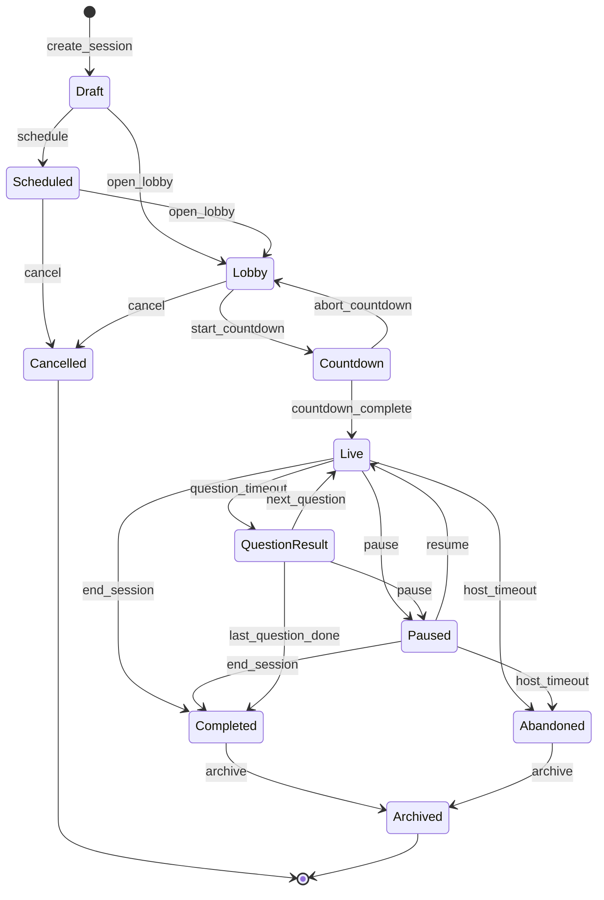

### 3.2 State Descriptions

| State | DB Value | Description | Entry Actions | Exit Actions |
|-------|----------|-------------|---------------|-------------|
| **Draft** | `draft` | Session created but not yet opened to participants. Host is configuring settings. | Create session record; generate room code | — |
| **Scheduled** | `scheduled` | Session is scheduled for a future date/time. Automatic transition to Lobby at scheduled time. | Record scheduled datetime; create scheduler job | Cancel scheduler job if transitioning away |
| **Lobby** | `lobby` | Waiting room is open. Participants can join. Host sees participant list. QR code and room code are active. | Broadcast lobby open event; enable join | Broadcast lobby closed event |
| **Countdown** | `countdown` | Short countdown (3–10 seconds) before quiz begins. No new state changes allowed during countdown. | Broadcast countdown event; start countdown timer | — |
| **Live** | `live` | Quiz is actively running. Current question is displayed. Timer is ticking. Answers are being submitted. | Deliver current question to all participants | Persist session state to database |
| **Paused** | `paused` | Host has paused the session. All timers frozen. Participants see "Paused" overlay. | Freeze timer; broadcast pause event | Resume timer from paused value |
| **QuestionResult** | `question_result` | Question has ended (timer expired or all answered). Showing correct answer and leaderboard. | Compute scores; update leaderboard; broadcast results | — |
| **Completed** | `completed` | All questions answered or host ended session. Final results displayed. | Compute final scores; award XP; generate certificates (async); broadcast completion; save all data | — |
| **Cancelled** | `cancelled` | Session cancelled before going live. No participant data. | Broadcast cancellation; release room code | — |
| **Abandoned** | `abandoned` | Host disconnected and did not reconnect within timeout (default: 30 min). | Broadcast abandonment; save partial data; release room code | — |
| **Archived** | `archived` | Historical record. No longer active. Used for analytics and review. | Move to archive storage | — |

### 3.3 Transition Table

| From | To | Trigger | Guard Conditions | Side Effects |
|------|----|---------|-----------------|-------------|
| — | Draft | `create_session` | Quiz has ≥ 1 question; user has `room:create` permission | Create session record; generate room code and QR |
| Draft | Scheduled | `schedule` | Scheduled datetime is in the future | Create scheduler job |
| Draft | Lobby | `open_lobby` | None | Broadcast lobby open |
| Scheduled | Lobby | `open_lobby` | Current time ≥ scheduled time OR manual trigger | Cancel scheduler job; broadcast lobby open |
| Scheduled | Cancelled | `cancel` | None | Release room code; notify subscribers |
| Lobby | Countdown | `start_countdown` | At least 1 participant in lobby | Broadcast countdown (3..2..1) |
| Lobby | Cancelled | `cancel` | None | Disconnect all participants; release room code |
| Countdown | Live | `countdown_complete` | Countdown timer reached 0 | Deliver first question |
| Countdown | Lobby | `abort_countdown` | Host aborts | Reset countdown state |
| Live | Paused | `pause` | Session is in live question state | Freeze timer; persist current state |
| Live | QuestionResult | `question_timeout` | Timer expired OR all participants answered | Compute scores; update leaderboard |
| Live | Completed | `end_session` | Host manually ends | Skip remaining questions; compute final results |
| Live | Abandoned | `host_timeout` | Host disconnected for > configured timeout | Save partial state; notify participants |
| Paused | Live | `resume` | None | Resume timer from paused value |
| Paused | Completed | `end_session` | Host manually ends while paused | Compute final results |
| Paused | Abandoned | `host_timeout` | Host disconnected for > timeout while paused | Save partial state |
| QuestionResult | Live | `next_question` | More questions remaining | Deliver next question |
| QuestionResult | Completed | `last_question_done` | No more questions remaining | Compute final scores; award XP |
| QuestionResult | Paused | `pause` | Host pauses during results display | Freeze results display |
| Completed | Archived | `archive` | Auto after 24 hours OR manual | Move to archive |
| Abandoned | Archived | `archive` | Auto after 24 hours OR manual | Move to archive |

### 3.4 Invalid Transitions (Must Be Rejected)

| From | To | Reason |
|------|----|--------|
| Completed | Live | Sessions cannot be restarted after completion |
| Completed | Lobby | Sessions cannot be reopened after completion |
| Archived | Any | Archived sessions are immutable |
| Cancelled | Any | Cancelled sessions are terminal |
| Live | Draft | Cannot go backwards |
| Paused | Lobby | Cannot return to lobby from a started session |
| Live | Lobby | Cannot return to lobby from a started session |

---

## 4. Quiz State Machine

### 4.1 State Diagram

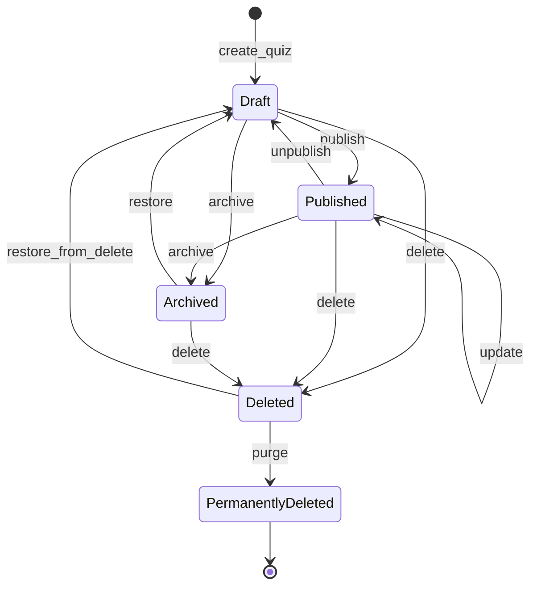

### 4.2 State Descriptions

| State | DB Value | Description | Entry Actions | Exit Actions |
|-------|----------|-------------|---------------|-------------|
| **Draft** | `draft` | Quiz is being created/edited. Not visible to others (unless shared). | — | — |
| **Published** | `published` | Quiz is finalized. Can be used for live sessions. May be listed on marketplace. | Validate quiz completeness | — |
| **Archived** | `archived` | Quiz is hidden from listings but data is retained. Cannot be used for new sessions. | Remove from active listings | — |
| **Deleted** | `deleted` | Soft-deleted. Hidden from everything. 30-day recovery window. | Set `deleted_at` timestamp | — |
| **PermanentlyDeleted** | — | Data and associated files are permanently removed. | Delete all data and files | — |

### 4.3 Transition Table

| From | To | Trigger | Guard Conditions | Side Effects |
|------|----|---------|-----------------|-------------|
| — | Draft | `create_quiz` | User has `quiz:create` permission | Create quiz record |
| Draft | Published | `publish` | Quiz has ≥ 1 valid question; title and settings are complete | Mark as published; index for search |
| Draft | Archived | `archive` | None | Remove from listings |
| Published | Draft | `unpublish` | No active live sessions using this quiz | Remove from marketplace (if listed); remove from search index |
| Published | Archived | `archive` | No active live sessions | Remove from all listings and marketplace |
| Published | Published | `update` | No active live sessions | Re-validate completeness |
| Archived | Draft | `restore` | None | — |
| Any active | Deleted | `delete` | User has `quiz:delete` permission; no active live sessions | Set `deleted_at`; remove from all listings; schedule purge in 30 days |
| Deleted | Draft | `restore_from_delete` | Within 30-day window | Clear `deleted_at`; cancel purge schedule |
| Deleted | PermanentlyDeleted | `purge` | 30 days elapsed OR admin manual purge | Delete all associated data, questions, media files |

---

## 5. User Account State Machine

### 5.1 State Diagram

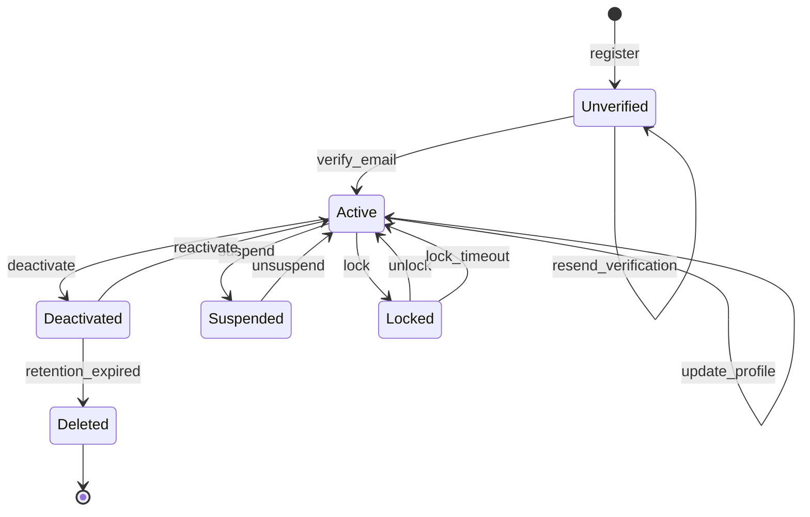

### 5.2 State Descriptions

| State | DB Value | Description | Entry Actions | Exit Actions |
|-------|----------|-------------|---------------|-------------|
| **Unverified** | `unverified` | Registered but email not yet verified. Limited platform access. | Send verification email | — |
| **Active** | `active` | Fully functional account. All permissions active. | — | — |
| **Locked** | `locked` | Temporarily locked due to too many failed login attempts. Auto-unlocks after timeout. | Set lock timestamp; send security notification | Clear lock timestamp |
| **Deactivated** | `deactivated` | User voluntarily deactivated. 30-day grace period for reactivation. | Hide from search/listings; disable login | Restore visibility |
| **Suspended** | `suspended` | Administratively suspended for policy violation. | Revoke all tokens; send notification; hide from public | Restore access |
| **Deleted** | `deleted` | Permanently deleted. All personal data removed. | Delete personal data; anonymize session history | — |

### 5.3 Transition Table

| From | To | Trigger | Guard Conditions | Side Effects |
|------|----|---------|-----------------|-------------|
| — | Unverified | `register` | Valid email and password | Create user; send verification email |
| Unverified | Active | `verify_email` | Valid verification token; token not expired | Mark email as verified |
| Active | Deactivated | `deactivate` | User-initiated | Revoke all tokens; hide profile; schedule deletion in 30 days |
| Active | Suspended | `suspend` | Admin action with documented reason | Revoke all tokens; log reason |
| Active | Locked | `lock` | 10+ consecutive failed login attempts | Set lock timestamp; auto-unlock after 30 min |
| Locked | Active | `unlock` | Admin action OR lock timeout (30 min) | Clear lock; reset failed attempt counter |
| Deactivated | Active | `reactivate` | User logs in within 30-day window | Cancel deletion schedule; restore profile visibility |
| Deactivated | Deleted | `retention_expired` | 30 days since deactivation | Permanent data deletion; anonymize contributions |
| Suspended | Active | `unsuspend` | Admin action | Restore access; send notification |

---

## 6. Organization State Machine

### 6.1 State Diagram

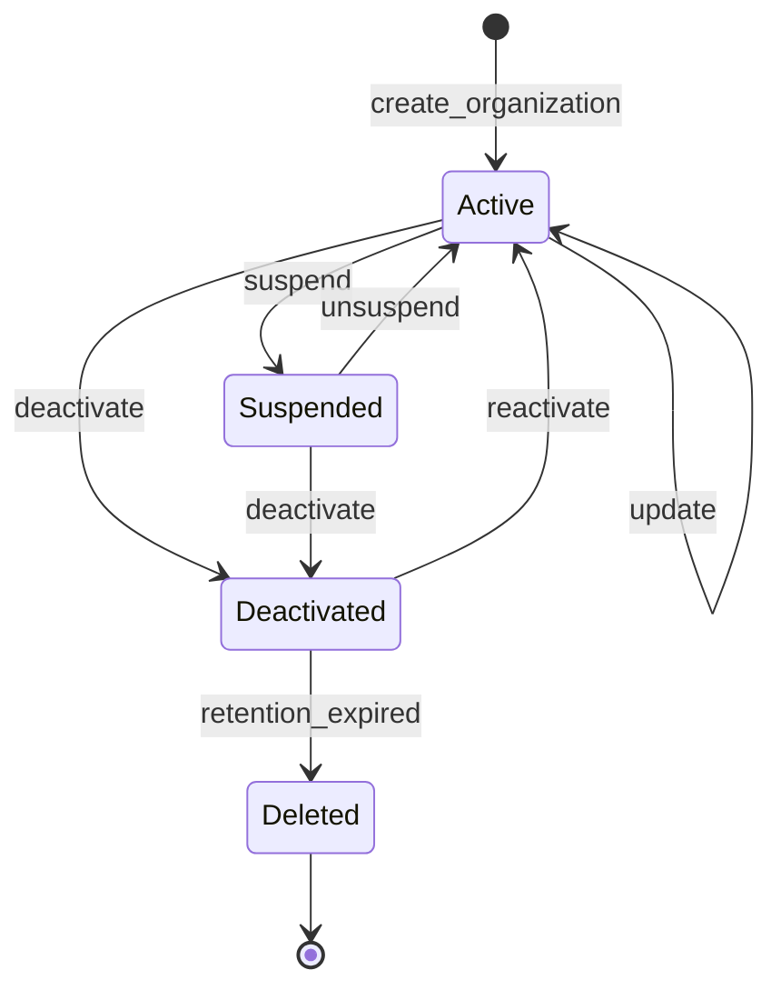

### 6.2 State Descriptions

| State | DB Value | Description |
|-------|----------|-------------|
| **Active** | `active` | Organization is operational. Members can access all features. |
| **Deactivated** | `deactivated` | Voluntarily deactivated by Org Admin. 90-day retention before deletion. Members lose access. |
| **Suspended** | `suspended` | Suspended by Super Admin for policy violations. Members lose access. |
| **Deleted** | `deleted` | Permanently deleted after retention period. All data removed. |

### 6.3 Transition Table

| From | To | Trigger | Guard Conditions | Side Effects |
|------|----|---------|-----------------|-------------|
| — | Active | `create_organization` | User has verified email | Create org; assign creator as Org Admin |
| Active | Deactivated | `deactivate` | Org Admin action | Revoke member access; schedule deletion in 90 days |
| Active | Suspended | `suspend` | Super Admin action with reason | Revoke member access; log reason; notify Org Admin |
| Deactivated | Active | `reactivate` | Super Admin OR Org Admin within retention period | Restore member access; cancel deletion schedule |
| Deactivated | Deleted | `retention_expired` | 90 days elapsed | Delete all org data, quizzes, question banks |
| Suspended | Active | `unsuspend` | Super Admin action | Restore member access; notify Org Admin |
| Suspended | Deactivated | `deactivate` | Super Admin action | Change to deactivated; start 90-day retention clock |

---

## 7. Marketplace Listing State Machine

### 7.1 State Diagram

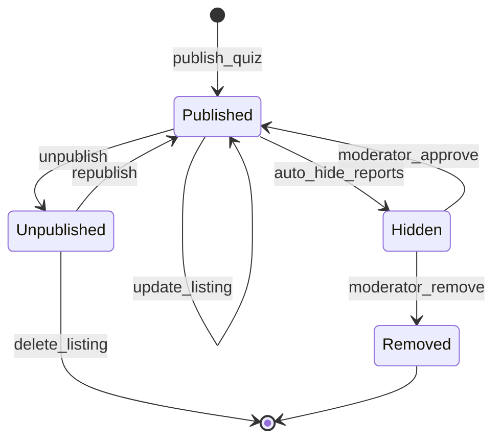

### 7.2 State Descriptions

| State | DB Value | Description |
|-------|----------|-------------|
| **Published** | `published` | Visible on marketplace. Searchable. Can be cloned, rated, favorited. |
| **Hidden** | `hidden` | Automatically hidden after exceeding report threshold. In moderation queue. Not visible publicly. |
| **Unpublished** | `unpublished` | Creator voluntarily removed from marketplace. Quiz still exists for the creator. |
| **Removed** | `removed` | Moderator permanently removed for policy violation. Creator notified with reason. |

### 7.3 Transition Table

| From | To | Trigger | Guard Conditions | Side Effects |
|------|----|---------|-----------------|-------------|
| — | Published | `publish_quiz` | Quiz has ≥ 1 question; user has `marketplace:publish` permission | Create listing; index for search |
| Published | Published | `update_listing` | Creator action | Re-index for search |
| Published | Hidden | `auto_hide_reports` | Report count ≥ threshold (default: 5) | Remove from search; add to moderation queue; notify creator |
| Published | Unpublished | `unpublish` | Creator action | Remove from search; remove from listings |
| Hidden | Published | `moderator_approve` | Moderator reviews and approves | Clear reports; re-index; notify creator |
| Hidden | Removed | `moderator_remove` | Moderator reviews and removes | Delete listing; notify creator with reason; increment creator violation count |
| Unpublished | Published | `republish` | Creator action; quiz still valid | Re-index for search |

---

## 8. Certificate State Machine

### 8.1 State Diagram

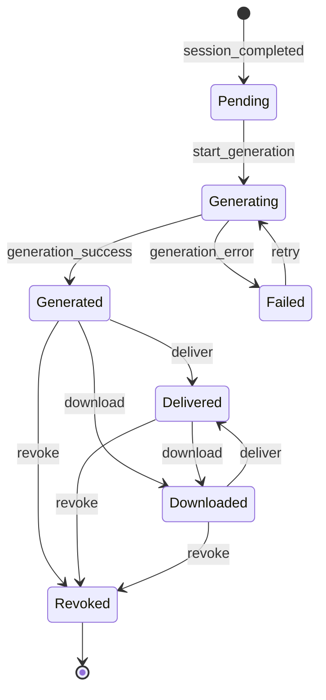

### 8.2 State Descriptions

| State | DB Value | Description |
|-------|----------|-------------|
| **Pending** | `pending` | Certificate is queued for generation (session just completed). |
| **Generating** | `generating` | PDF is being generated. Background job in progress. |
| **Generated** | `generated` | PDF successfully generated. Ready for delivery/download. |
| **Failed** | `failed` | PDF generation failed. Will be retried. |
| **Delivered** | `delivered` | Certificate has been emailed to the recipient. |
| **Downloaded** | `downloaded` | Certificate has been downloaded by the recipient. |
| **Revoked** | `revoked` | Certificate has been revoked (e.g., cheating detected). Verification page shows "Revoked". |

---

## 9. Notification State Machine

### 9.1 State Diagram

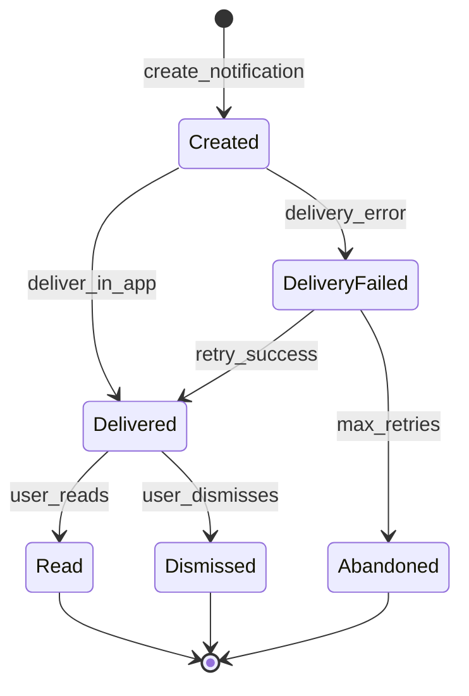

### 9.2 Email Notification Sub-State Machine

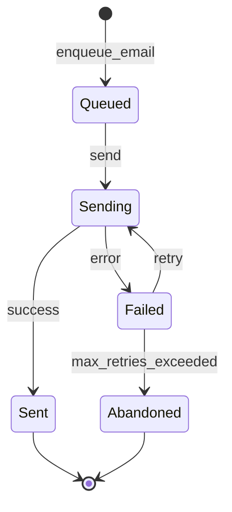

### 9.3 State Descriptions

| State | DB Value | Description |
|-------|----------|-------------|
| **Created** | `created` | Notification record created, pending delivery. |
| **Delivered** | `delivered` | Notification delivered to user's in-app notification feed. |
| **Read** | `read` | User has seen/read the notification. |
| **Dismissed** | `dismissed` | User dismissed the notification without reading. |
| **DeliveryFailed** | `delivery_failed` | Delivery attempt failed (user offline and WebSocket unavailable). |
| **Abandoned** | `abandoned` | Max delivery retries exceeded. Notification remains in history but not retried. |

---

## 10. Invitation State Machine

### 10.1 State Diagram

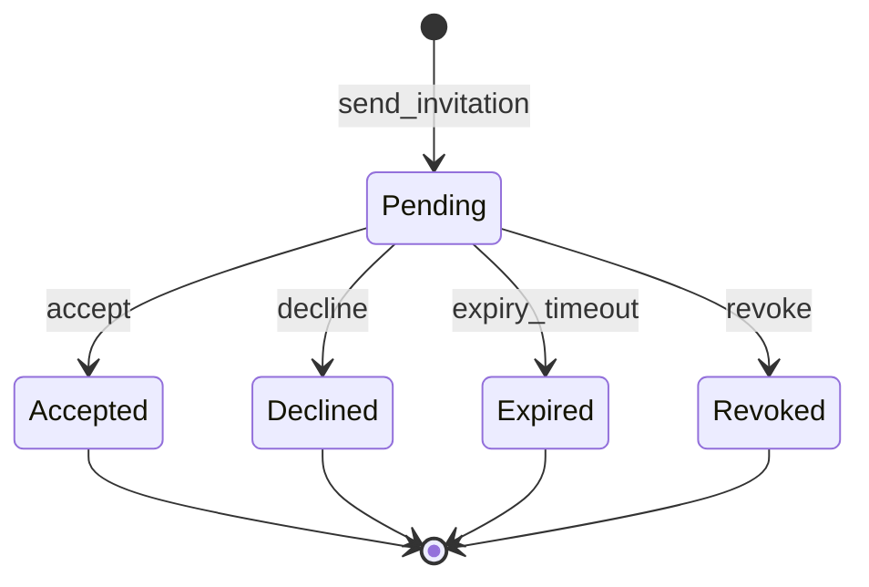

### 10.2 State Descriptions

| State | DB Value | Description |
|-------|----------|-------------|
| **Pending** | `pending` | Invitation sent, awaiting response. |
| **Accepted** | `accepted` | Invitee accepted. User added to organization. |
| **Declined** | `declined` | Invitee explicitly declined. |
| **Expired** | `expired` | Invitation expired after configured timeout (default: 7 days). |
| **Revoked** | `revoked` | Invitation revoked by the sender/admin before acceptance. |

### 10.3 Transition Table

| From | To | Trigger | Guard Conditions | Side Effects |
|------|----|---------|-----------------|-------------|
| — | Pending | `send_invitation` | Inviter has `member:invite` permission; invitee not already a member | Send email notification; create invitation record |
| Pending | Accepted | `accept` | Invitation not expired; not revoked | Add user to organization with assigned role; send welcome notification |
| Pending | Declined | `decline` | Invitation not expired | Notify inviter |
| Pending | Expired | `expiry_timeout` | 7 days elapsed since creation | Mark as expired (scheduler job) |
| Pending | Revoked | `revoke` | Admin action | Mark as revoked; revoke invitation link |

---

## 11. Join Request State Machine

### 11.1 State Diagram

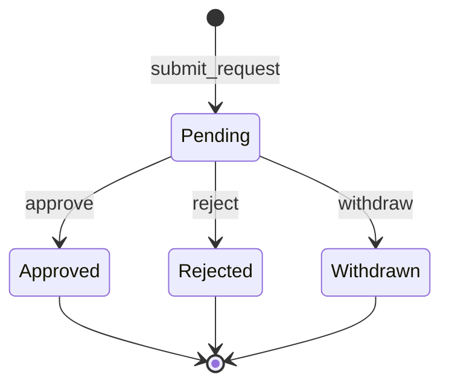

### 11.2 State Descriptions

| State | DB Value | Description |
|-------|----------|-------------|
| **Pending** | `pending` | User requested to join. Awaiting admin approval. |
| **Approved** | `approved` | Admin approved. User added to organization. |
| **Rejected** | `rejected` | Admin rejected with optional reason. |
| **Withdrawn** | `withdrawn` | User cancelled their own request. |

### 11.3 Transition Table

| From | To | Trigger | Guard Conditions | Side Effects |
|------|----|---------|-----------------|-------------|
| — | Pending | `submit_request` | User not already a member; user has not been rejected in last 30 days | Notify org admins |
| Pending | Approved | `approve` | Admin has `member:approve` permission | Add user to org; notify user |
| Pending | Rejected | `reject` | Admin has `member:approve` permission | Notify user with reason; 30-day cooldown before re-request |
| Pending | Withdrawn | `withdraw` | Request owner action | No notification |

---

## 12. Moderation Report State Machine

### 12.1 State Diagram

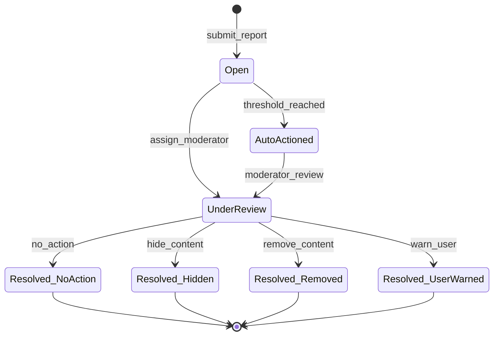

### 12.2 State Descriptions

| State | DB Value | Description |
|-------|----------|-------------|
| **Open** | `open` | Report submitted. Awaiting review. |
| **AutoActioned** | `auto_actioned` | Report threshold reached. Content automatically hidden. Awaiting moderator final decision. |
| **UnderReview** | `under_review` | Moderator is actively reviewing the report. |
| **Resolved_NoAction** | `resolved_no_action` | Report reviewed. No policy violation found. Content remains published. |
| **Resolved_Hidden** | `resolved_hidden` | Content temporarily hidden pending creator correction. |
| **Resolved_Removed** | `resolved_removed` | Content permanently removed for policy violation. |
| **Resolved_UserWarned** | `resolved_user_warned` | Creator warned. Content may or may not be hidden. |

---

## 13. Question State Machine

### 13.1 State Diagram

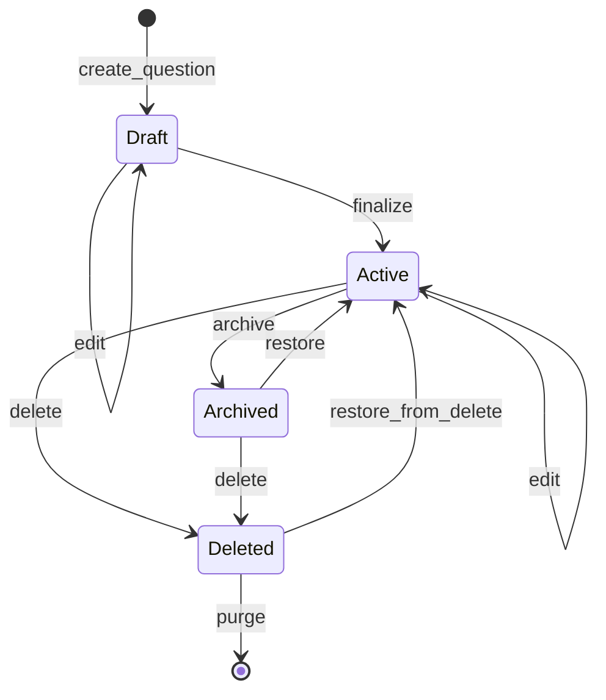

### 13.2 State Descriptions

| State | DB Value | Description |
|-------|----------|-------------|
| **Draft** | `draft` | Question is being created. Not yet usable in quizzes. |
| **Active** | `active` | Question is finalized and usable in quizzes and question banks. |
| **Archived** | `archived` | Question is hidden from active use but data retained. |
| **Deleted** | `deleted` | Soft-deleted. 30-day recovery window. |

---

## 14. Session Participant State Machine

### 14.1 State Diagram

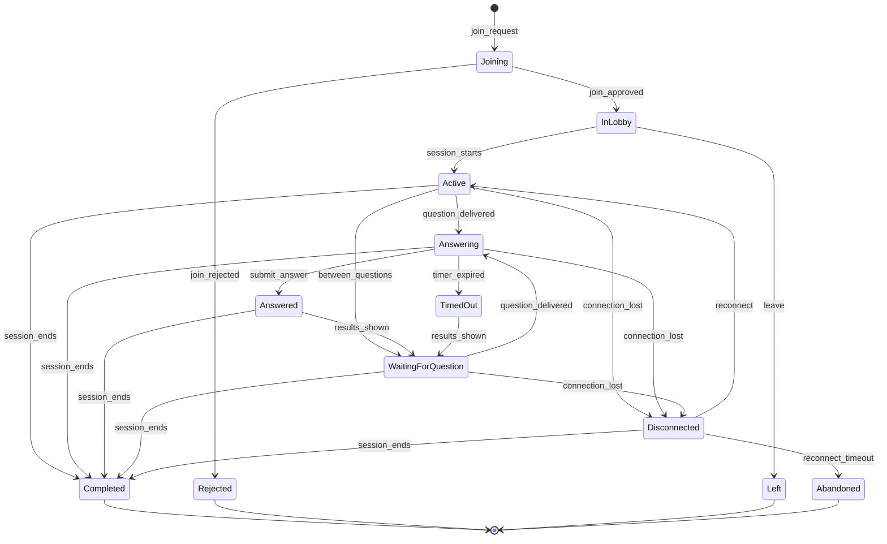

### 14.2 State Descriptions

| State | DB Value | Description |
|-------|----------|-------------|
| **Joining** | `joining` | Player is in the process of joining (validating nickname, checking room capacity). |
| **InLobby** | `in_lobby` | Player is in the waiting room before the quiz starts. |
| **Active** | `active` | Player is connected and in the session (general connected state). |
| **Answering** | `answering` | A question has been delivered and the player has not yet answered. |
| **Answered** | `answered` | Player has submitted their answer for the current question. |
| **TimedOut** | `timed_out` | Timer expired before player answered. Question marked as unanswered. |
| **WaitingForQuestion** | `waiting_for_question` | Between questions. Viewing results/leaderboard. Waiting for next question. |
| **Disconnected** | `disconnected` | Player lost connection. Grace period for reconnection. |
| **Completed** | `completed` | Session ended. Player's results are finalized. |
| **Left** | `left` | Player voluntarily left the session. |
| **Abandoned** | `abandoned` | Player disconnected and did not reconnect within timeout. |
| **Rejected** | `rejected` | Player's join request was rejected (room full, room locked, nickname taken). |

---

## 15. Background Job State Machine

### 15.1 State Diagram

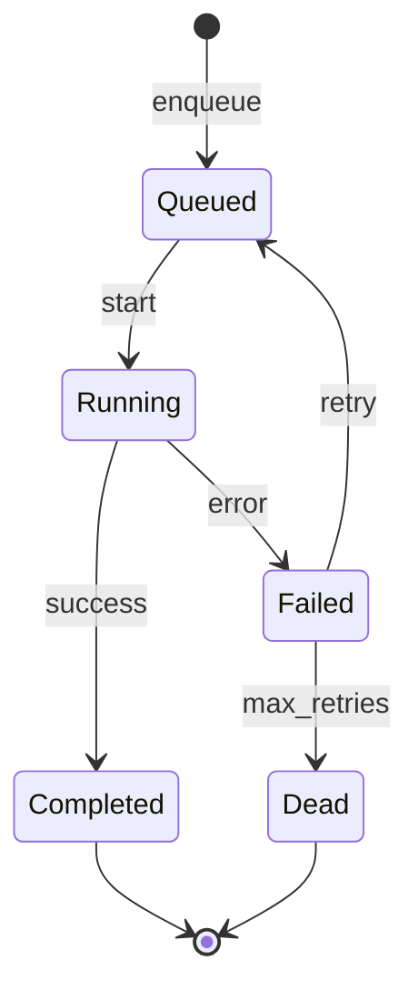

### 15.2 State Descriptions

| State | DB Value | Description |
|-------|----------|-------------|
| **Queued** | `queued` | Job is in the queue waiting to be picked up by a worker. |
| **Running** | `running` | Job is currently being executed. |
| **Completed** | `completed` | Job finished successfully. |
| **Failed** | `failed` | Job encountered an error. Will be retried if retries remain. |
| **Dead** | `dead` | Job exceeded maximum retry attempts. Requires manual intervention. |

### 15.3 Retry Policy

| Job Type | Max Retries | Backoff Strategy | Backoff Values |
|----------|-------------|-----------------|----------------|
| Email send | 3 | Exponential | 1 min, 5 min, 15 min |
| Certificate generation | 3 | Exponential | 2 min, 10 min, 30 min |
| Analytics aggregation | 2 | Fixed | 5 min |
| Session cleanup | 2 | Fixed | 10 min |
| File cleanup | 2 | Fixed | 5 min |
| Notification delivery | 3 | Exponential | 30 sec, 2 min, 10 min |

---

## 16. Implementation Guidelines

### 16.1 State Machine Pattern

All state machines MUST be implemented using a consistent pattern:

```
// Pseudocode — State Machine Implementation Pattern
class StateMachine {
    validTransitions = {
        'draft': ['scheduled', 'lobby', 'cancelled'],
        'scheduled': ['lobby', 'cancelled'],
        'lobby': ['countdown', 'cancelled'],
        // ... all valid transitions
    }

    transition(currentState, targetState, context) {
        if (!validTransitions[currentState]?.includes(targetState)) {
            throw InvalidStateTransitionError(currentState, targetState)
        }
        // Execute guard conditions
        // Execute entry/exit actions
        // Persist new state
        // Emit state change event
    }
}
```

### 16.2 Database Storage

- State columns MUST use `VARCHAR(50)` type (not enums) to allow new states without migrations
- State changes MUST be recorded in the audit log
- State changes MUST emit domain events for subscribers

### 16.3 Concurrency

- State transitions MUST use optimistic locking (`version` column) to prevent race conditions
- If a concurrent state change is detected, the transition MUST be retried or rejected

### 16.4 Event Emission

Every state transition MUST emit a domain event in the format:

```
{entity_type}.{old_state}_to_{new_state}
```

Example events:
- `session.lobby_to_countdown`
- `session.live_to_paused`
- `quiz.draft_to_published`
- `user.active_to_deactivated`
- `invitation.pending_to_accepted`

---

## 17. References

| Document | Relationship |
|----------|-------------|
| [01-master-prd.md](./01-master-prd.md) | Features defining entity lifecycles |
| [02-business-rules.md](./02-business-rules.md) | Business rules governing state transitions |
| [06-event-catalog.md](./06-event-catalog.md) | Domain events emitted by state transitions |
| [07-database-design.md](./07-database-design.md) | Database columns storing state values |
| [17-live-quiz-engine.md](./17-live-quiz-engine.md) | Detailed session lifecycle implementation |
| [43-scheduler-background-jobs.md](./43-scheduler-background-jobs.md) | Automated state transitions via scheduler |

---

*End of Document — AERO-SM-003 v1.0*
