# 04 — System Architecture

**Document ID:** AERO-ARCH-004  
**Version:** 1.0  
**Last Updated:** 2026-07-16  
**Author:** Solution Architect  
**Status:** Approved  
**Classification:** Internal — Engineering

---

## Table of Contents

1. [Purpose](#1-purpose)
2. [Architecture Overview](#2-architecture-overview)
3. [Architecture Style: Modular Monolith](#3-architecture-style-modular-monolith)
4. [High-Level Architecture Diagram](#4-high-level-architecture-diagram)
5. [Component Architecture](#5-component-architecture)
6. [Technology Stack Justification](#6-technology-stack-justification)
7. [Request Flow Architecture](#7-request-flow-architecture)
8. [Authentication Flow](#8-authentication-flow)
9. [Authorization Flow](#9-authorization-flow)
10. [Live Quiz Flow](#10-live-quiz-flow)
11. [Marketplace Flow](#11-marketplace-flow)
12. [Notification Flow](#12-notification-flow)
13. [Analytics Flow](#13-analytics-flow)
14. [File Upload Flow](#14-file-upload-flow)
15. [Deployment Architecture](#15-deployment-architecture)
16. [Cross-Cutting Concerns](#16-cross-cutting-concerns)
17. [Scalability Strategy](#17-scalability-strategy)
18. [Future Architecture Evolution](#18-future-architecture-evolution)
19. [References](#19-references)

---

## 1. Purpose

This document defines the complete system architecture for Aero MAGE. It serves as the architectural blueprint from which all backend, frontend, database, and infrastructure decisions derive. Every technology choice is justified. Every data flow is diagrammed. Every cross-cutting concern is addressed.

---

## 2. Architecture Overview

Aero MAGE uses a **Modular Monolith** architecture deployed on **AWS**. The system consists of:

- A **React/Vite** single-page application (SPA) as the frontend
- A **Node.js/Express.js** API server as the backend
- **Socket.IO** for real-time WebSocket communication
- **PostgreSQL** as the primary database
- **Local filesystem** for file storage (V1), migrating to **AWS S3** in V2

### 2.1 Architecture Principles

| Principle | Description |
|-----------|-------------|
| **Modular Monolith** | Single deployable unit, but internally organized as independent modules with clear boundaries |
| **Configuration over Hardcoding** | All thresholds, limits, and behaviors are configurable via database or environment variables |
| **Repository Pattern** | Data access is abstracted behind repository interfaces |
| **Service Layer** | Business logic lives in services, not controllers or repositories |
| **No Business Logic in Controllers** | Controllers handle HTTP concerns only (request parsing, response formatting) |
| **Domain Events** | Modules communicate via domain events, reducing direct coupling |
| **Soft Delete** | Data is never permanently deleted without explicit intent |
| **Audit Everything** | Every mutation is logged with who, what, when, old/new values |
| **UUIDs** | All primary keys are UUIDs. No sequential IDs exposed externally |
| **Fail Safely** | Errors are caught, logged, and return user-friendly messages |

---

## 3. Architecture Style: Modular Monolith

### 3.1 Why Not Microservices?

| Factor | Microservices | Modular Monolith | Decision |
|--------|--------------|-----------------|----------|
| Operational complexity | High (service discovery, distributed tracing, API gateways) | Low (single deployment) | **Modular Monolith** — team size and V1 scale don't justify microservices overhead |
| Debugging | Complex (distributed logging, correlation IDs) | Simple (single process, shared logs) | **Modular Monolith** |
| Data consistency | Eventual consistency (saga pattern) | Strong consistency (database transactions) | **Modular Monolith** — ACID transactions across modules |
| Deployment | Per-service deployment | Single deployment | **Modular Monolith** — simpler CI/CD |
| Scaling | Independent service scaling | Vertical scaling + PM2 cluster | **Modular Monolith** — adequate for V1-V2 scale |
| Future migration | — | Designed for extraction | **Modular Monolith** — modules have clean boundaries for future microservice extraction |

> See [ADR-001: Modular Monolith](./decisions/ADR-001-modular-monolith.md) for the complete decision record.

### 3.2 Module Boundaries

Each module is a self-contained unit with:
- Its own controllers, services, repositories, DTOs, validators
- Clear public interfaces (what other modules can call)
- Domain events for cross-module communication
- No direct database access to another module's tables

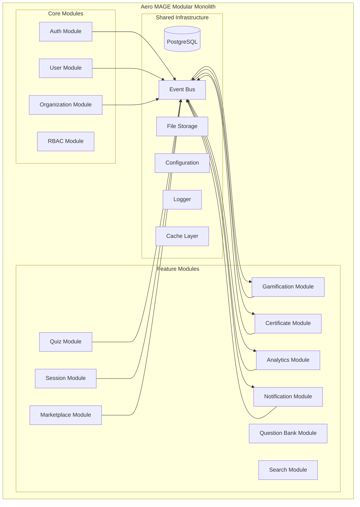
```mermaid
graph TB
    subgraph "Aero MAGE Modular Monolith"
        subgraph "Core Modules"
            AUTH[Auth Module]
            USER[User Module]
            ORG[Organization Module]
            RBAC[RBAC Module]
        end

        subgraph "Feature Modules"
            QUIZ[Quiz Module]
            SESSION[Session Module]
            QB[Question Bank Module]
            MKT[Marketplace Module]
            GAM[Gamification Module]
            CERT[Certificate Module]
            ANA[Analytics Module]
            NOTIF[Notification Module]
            SEARCH[Search Module]
        end

        subgraph "Shared Infrastructure"
            DB[(PostgreSQL)]
            FS[File Storage]
            EVENTS[Event Bus]
            CONFIG[Configuration]
            LOGGER[Logger]
            CACHE[Cache Layer]
        end
    end

    AUTH --> EVENTS
    USER --> EVENTS
    ORG --> EVENTS
    QUIZ --> EVENTS
    SESSION --> EVENTS
    MKT --> EVENTS
    GAM --> EVENTS
    CERT --> EVENTS
    ANA --> EVENTS
    NOTIF --> EVENTS

    EVENTS --> GAM
    EVENTS --> NOTIF
    EVENTS --> ANA
    EVENTS --> CERT
```

### 3.3 Inter-Module Communication Rules

| Rule | Description |
|------|-------------|
| **No direct DB access** | Module A MUST NOT query Module B's database tables directly |
| **Use public interfaces** | Module A calls Module B's exported service functions |
| **Use events for side effects** | Cross-cutting concerns (XP awards, notifications, analytics) use domain events |
| **No circular dependencies** | Module dependency graph must be a DAG (directed acyclic graph) |
| **Shared kernel** | Common types, utilities, and interfaces live in a shared package |

---

## 4. High-Level Architecture Diagram

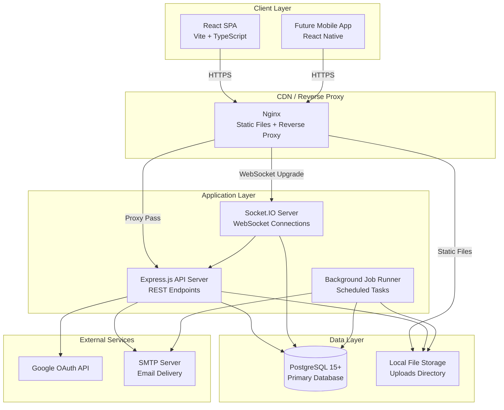
```mermaid
graph TB
    subgraph "Client Layer"
        WEB[React SPA<br/>Vite + TypeScript]
        MOBILE[Future Mobile App<br/>React Native]
    end

    subgraph "CDN / Reverse Proxy"
        NGINX[Nginx<br/>Static Files + Reverse Proxy]
    end

    subgraph "Application Layer"
        API[Express.js API Server<br/>REST Endpoints]
        WS[Socket.IO Server<br/>WebSocket Connections]
        JOBS[Background Job Runner<br/>Scheduled Tasks]
    end

    subgraph "Data Layer"
        PG[(PostgreSQL 15+<br/>Primary Database)]
        FILES[Local File Storage<br/>Uploads Directory]
    end

    subgraph "External Services"
        GOOGLE[Google OAuth API]
        SMTP_SVC[SMTP Server<br/>Email Delivery]
    end

    WEB -->|HTTPS| NGINX
    MOBILE -->|HTTPS| NGINX
    NGINX -->|Proxy Pass| API
    NGINX -->|WebSocket Upgrade| WS
    NGINX -->|Static Files| FILES

    API --> PG
    API --> FILES
    API --> SMTP_SVC
    API --> GOOGLE

    WS --> PG
    WS --> API

    JOBS --> PG
    JOBS --> SMTP_SVC
    JOBS --> FILES
```

---

## 5. Component Architecture

### 5.1 Frontend Components

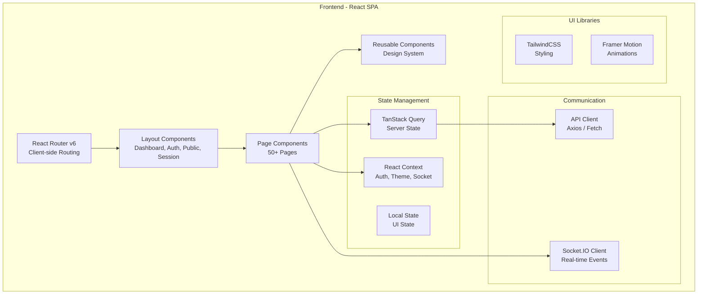
```mermaid
graph TB
    subgraph "Frontend - React SPA"
        ROUTER[React Router v6<br/>Client-side Routing]
        LAYOUTS[Layout Components<br/>Dashboard, Auth, Public, Session]
        PAGES[Page Components<br/>50+ Pages]
        COMPS[Reusable Components<br/>Design System]
        
        subgraph "State Management"
            TQ[TanStack Query<br/>Server State]
            CONTEXT[React Context<br/>Auth, Theme, Socket]
            LOCAL[Local State<br/>UI State]
        end

        subgraph "Communication"
            AXIOS[API Client<br/>Axios / Fetch]
            SOCKET_CLIENT[Socket.IO Client<br/>Real-time Events]
        end

        subgraph "UI Libraries"
            TAILWIND[TailwindCSS<br/>Styling]
            FRAMER[Framer Motion<br/>Animations]
        end
    end

    ROUTER --> LAYOUTS
    LAYOUTS --> PAGES
    PAGES --> COMPS
    PAGES --> TQ
    PAGES --> CONTEXT
    TQ --> AXIOS
    PAGES --> SOCKET_CLIENT
```

### 5.2 Backend Components

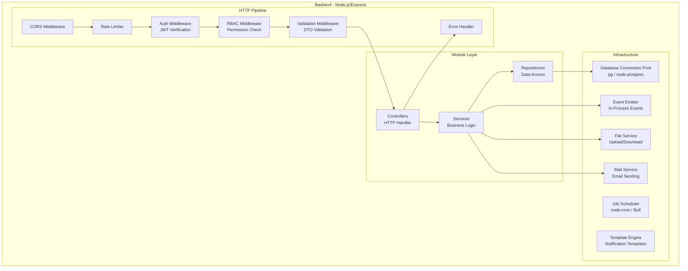
```mermaid
graph TB
    subgraph "Backend - Node.js/Express"
        subgraph "HTTP Pipeline"
            MW_CORS[CORS Middleware]
            MW_RATE[Rate Limiter]
            MW_AUTH[Auth Middleware<br/>JWT Verification]
            MW_RBAC[RBAC Middleware<br/>Permission Check]
            MW_VALID[Validation Middleware<br/>DTO Validation]
            MW_ERR[Error Handler]
        end

        subgraph "Module Layer"
            CTRL[Controllers<br/>HTTP Handler]
            SVC[Services<br/>Business Logic]
            REPO[Repositories<br/>Data Access]
        end

        subgraph "Infrastructure"
            DB_POOL[Database Connection Pool<br/>pg / node-postgres]
            EVENT_BUS[Event Emitter<br/>In-Process Events]
            FILE_SVC[File Service<br/>Upload/Download]
            MAIL_SVC[Mail Service<br/>Email Sending]
            JOB_SVC[Job Scheduler<br/>node-cron / Bull]
            TEMPLATE_ENG[Template Engine<br/>Notification Templates]
        end
    end

    MW_CORS --> MW_RATE --> MW_AUTH --> MW_RBAC --> MW_VALID --> CTRL
    CTRL --> SVC
    SVC --> REPO
    SVC --> EVENT_BUS
    REPO --> DB_POOL
    SVC --> FILE_SVC
    SVC --> MAIL_SVC
    CTRL --> MW_ERR
```

---

## 6. Technology Stack Justification

### 6.1 Frontend

| Technology | Purpose | Why This Choice | Alternatives Considered |
|-----------|---------|----------------|------------------------|
| **React 18+** | UI framework | Industry standard; massive ecosystem; component model fits quiz UI complexity; team expertise | Vue.js (smaller ecosystem), Svelte (less mature), Angular (over-engineered for this use case) |
| **Vite** | Build tool | Fastest HMR; ESBuild-powered; excellent DX; native ESM support | Create React App (deprecated), Webpack (slower), Parcel (smaller community) |
| **TypeScript** | Type safety | Catches bugs at compile time; better IDE support; self-documenting; industry standard for professional projects | Plain JavaScript (less safe), Flow (abandoned by community) |
| **TailwindCSS** | Styling | Utility-first; rapid UI development; excellent design system support; no naming conflicts; small production bundle (purged) | CSS Modules (more boilerplate), styled-components (runtime overhead), SASS (less systematic) |
| **React Router v6** | Routing | De facto standard for React routing; nested routes; data loading support | TanStack Router (newer, less battle-tested), Next.js (server-side, overhead for SPA) |
| **TanStack Query v5** | Server state | Best-in-class data fetching, caching, and synchronization; reduces Redux-like boilerplate by 90%; built-in optimistic updates | SWR (fewer features), Redux Toolkit Query (heavier), Apollo Client (GraphQL-specific) |
| **Socket.IO Client** | WebSocket | Paired with Socket.IO server; automatic reconnection; fallback transports; rooms/namespaces | Raw WebSocket (no fallback, manual reconnection), Pusher (vendor lock-in) |
| **Framer Motion** | Animations | Most capable React animation library; declarative API; gesture support; layout animations | react-spring (less intuitive), CSS animations (limited), GSAP (not React-native) |

### 6.2 Backend

| Technology | Purpose | Why This Choice | Alternatives Considered |
|-----------|---------|----------------|------------------------|
| **Node.js 20+ LTS** | Runtime | Non-blocking I/O perfect for real-time quiz sessions; shared TypeScript with frontend; massive npm ecosystem | Deno (ecosystem gap), Bun (too new), Go (no TypeScript sharing), Python/Django (slower for real-time) |
| **Express.js** | HTTP framework | Minimal, flexible; proven at scale; massive middleware ecosystem; team expertise | Fastify (faster but smaller ecosystem), Koa (less middleware), NestJS (opinionated, heavy for modular monolith — DI framework would conflict with our module pattern) |
| **Socket.IO** | WebSocket | Automatic reconnection; room management; namespace isolation; middleware support; Redis adapter for scaling | ws (too low-level), µWebSockets (C++ binding complexity), Pusher/Ably (vendor lock-in, cost) |
| **TypeScript** | Type safety | Same benefits as frontend; shared types between frontend/backend | Plain JavaScript |

### 6.3 Database

| Technology | Purpose | Why This Choice | Alternatives Considered |
|-----------|---------|----------------|------------------------|
| **PostgreSQL 15+** | Primary database | ACID compliance; excellent JSON support; full-text search built-in; mature, reliable; rich indexing (B-tree, GIN, GiST); UUIDs native; window functions for analytics | MySQL (fewer features), MongoDB (no ACID, schema drift), CockroachDB (over-engineered for V1) |

> See [ADR-002: PostgreSQL](./decisions/ADR-002-postgresql-over-nosql.md) for the complete decision record.

### 6.4 Infrastructure

| Technology | Purpose | Why This Choice | Alternatives Considered |
|-----------|---------|----------------|------------------------|
| **AWS EC2** | Compute | Full control; flexible instance sizing; PM2 process management | ECS/Fargate (Docker dependency), Lambda (cold starts unacceptable for WebSocket), Heroku (scaling limits) |
| **Local Filesystem** | File storage (V1) | Simplicity; no external dependency; cost savings; clear migration path to S3 | S3 from day 1 (premature; adds complexity and cost for V1 scale) |
| **Nginx** | Reverse proxy | Battle-tested; WebSocket support; static file serving; TLS termination | HAProxy (less familiar), Caddy (less ecosystem), AWS ALB (cost) |
| **PM2** | Process manager | Node.js native; cluster mode; zero-downtime reload; monitoring; log management | systemd (less Node-specific), Docker (not used in V1), forever (less features) |

> See [ADR-004: Socket.IO](./decisions/ADR-004-socket-io-realtime.md) and [ADR-005: Local Storage](./decisions/ADR-005-local-storage-v1.md) for decision records.

---

## 7. Request Flow Architecture

### 7.1 HTTP Request Flow

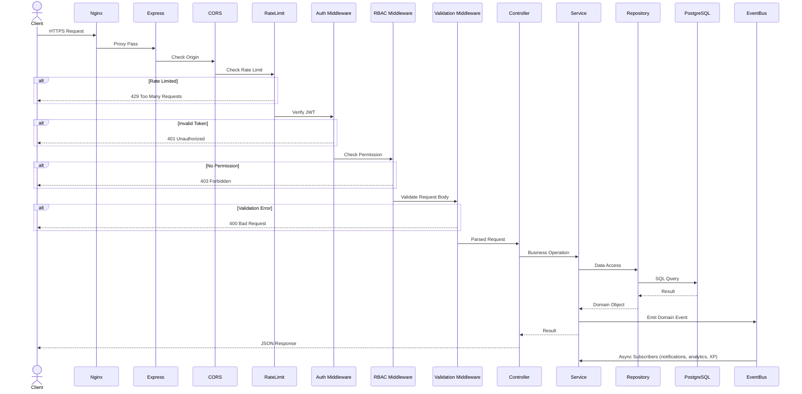
```mermaid
sequenceDiagram
    actor Client
    participant Nginx
    participant Express
    participant CORS
    participant RateLimit
    participant AuthMW as Auth Middleware
    participant RBACMW as RBAC Middleware
    participant ValidMW as Validation Middleware
    participant Controller
    participant Service
    participant Repository
    participant PostgreSQL
    participant EventBus

    Client->>Nginx: HTTPS Request
    Nginx->>Express: Proxy Pass
    Express->>CORS: Check Origin
    CORS->>RateLimit: Check Rate Limit
    
    alt Rate Limited
        RateLimit-->>Client: 429 Too Many Requests
    end

    RateLimit->>AuthMW: Verify JWT
    
    alt Invalid Token
        AuthMW-->>Client: 401 Unauthorized
    end

    AuthMW->>RBACMW: Check Permission
    
    alt No Permission
        RBACMW-->>Client: 403 Forbidden
    end

    RBACMW->>ValidMW: Validate Request Body
    
    alt Validation Error
        ValidMW-->>Client: 400 Bad Request
    end

    ValidMW->>Controller: Parsed Request
    Controller->>Service: Business Operation
    Service->>Repository: Data Access
    Repository->>PostgreSQL: SQL Query
    PostgreSQL-->>Repository: Result
    Repository-->>Service: Domain Object
    Service->>EventBus: Emit Domain Event
    Service-->>Controller: Result
    Controller-->>Client: JSON Response

    EventBus->>Service: Async Subscribers (notifications, analytics, XP)
```

### 7.2 Middleware Pipeline Order

```
1. Helmet (security headers)
2. CORS
3. Body Parser (JSON, 10 MB limit)
4. Request Logger (morgan)
5. Rate Limiter (per route group)
6. Auth Middleware (JWT verification, optional for public routes)
7. RBAC Middleware (permission check, per route)
8. Validation Middleware (DTO validation, per route)
9. Controller Handler
10. Error Handler (catches all unhandled errors)
```

### 7.3 Standard API Response Envelope

```json
// Success Response
{
    "success": true,
    "data": { ... },
    "meta": {
        "page": 1,
        "limit": 20,
        "total": 150,
        "totalPages": 8
    },
    "timestamp": "2026-07-16T12:00:00Z"
}

// Error Response
{
    "success": false,
    "error": {
        "code": "QUIZ_101",
        "message": "Quiz not found",
        "details": null
    },
    "timestamp": "2026-07-16T12:00:00Z"
}
```

---

## 8. Authentication Flow

### 8.1 Email/Password Login Flow

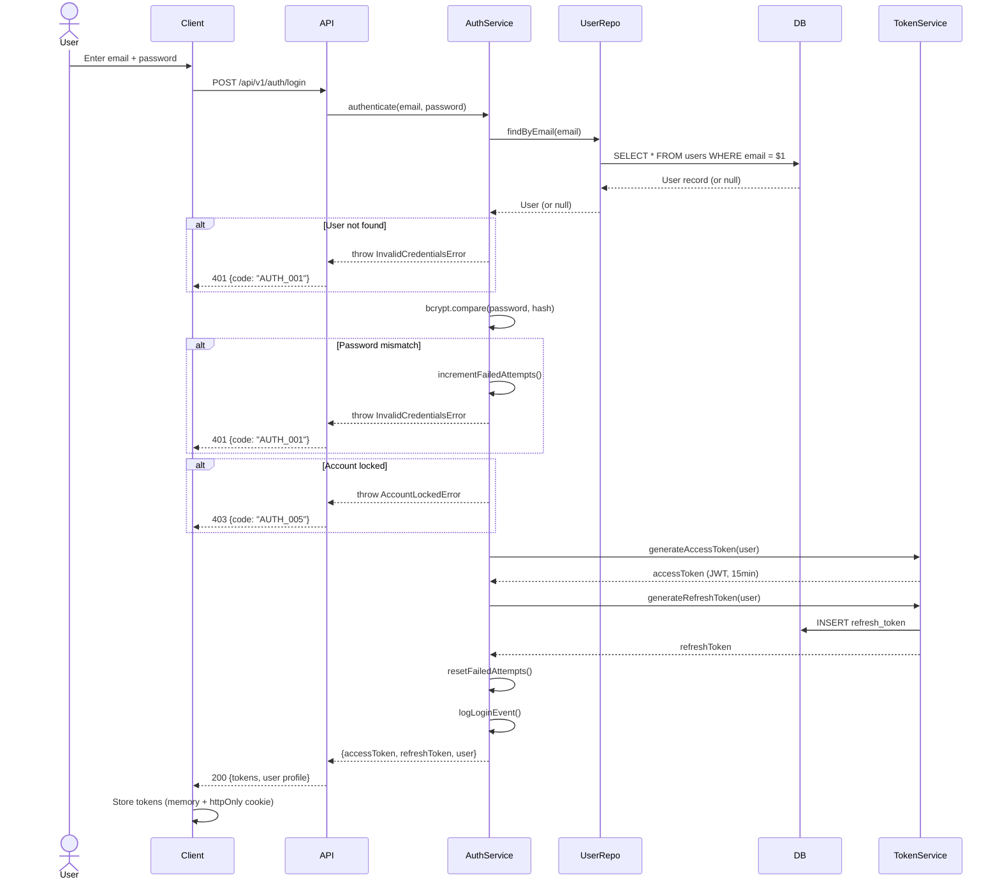
```mermaid
sequenceDiagram
    actor User
    participant Client
    participant API
    participant AuthService
    participant UserRepo
    participant DB
    participant TokenService

    User->>Client: Enter email + password
    Client->>API: POST /api/v1/auth/login
    API->>AuthService: authenticate(email, password)
    AuthService->>UserRepo: findByEmail(email)
    UserRepo->>DB: SELECT * FROM users WHERE email = $1
    DB-->>UserRepo: User record (or null)
    UserRepo-->>AuthService: User (or null)

    alt User not found
        AuthService-->>API: throw InvalidCredentialsError
        API-->>Client: 401 {code: "AUTH_001"}
    end

    AuthService->>AuthService: bcrypt.compare(password, hash)

    alt Password mismatch
        AuthService->>AuthService: incrementFailedAttempts()
        AuthService-->>API: throw InvalidCredentialsError
        API-->>Client: 401 {code: "AUTH_001"}
    end

    alt Account locked
        AuthService-->>API: throw AccountLockedError
        API-->>Client: 403 {code: "AUTH_005"}
    end

    AuthService->>TokenService: generateAccessToken(user)
    TokenService-->>AuthService: accessToken (JWT, 15min)
    AuthService->>TokenService: generateRefreshToken(user)
    TokenService->>DB: INSERT refresh_token
    TokenService-->>AuthService: refreshToken

    AuthService->>AuthService: resetFailedAttempts()
    AuthService->>AuthService: logLoginEvent()

    AuthService-->>API: {accessToken, refreshToken, user}
    API-->>Client: 200 {tokens, user profile}
    Client->>Client: Store tokens (memory + httpOnly cookie)
```

### 8.2 Token Refresh Flow

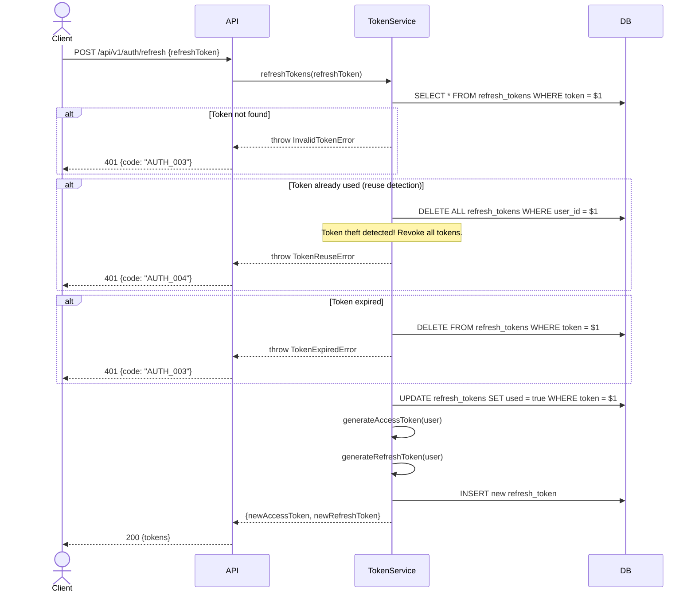
```mermaid
sequenceDiagram
    actor Client
    participant API
    participant TokenService
    participant DB

    Client->>API: POST /api/v1/auth/refresh {refreshToken}
    API->>TokenService: refreshTokens(refreshToken)
    TokenService->>DB: SELECT * FROM refresh_tokens WHERE token = $1

    alt Token not found
        TokenService-->>API: throw InvalidTokenError
        API-->>Client: 401 {code: "AUTH_003"}
    end

    alt Token already used (reuse detection)
        TokenService->>DB: DELETE ALL refresh_tokens WHERE user_id = $1
        Note over TokenService: Token theft detected! Revoke all tokens.
        TokenService-->>API: throw TokenReuseError
        API-->>Client: 401 {code: "AUTH_004"}
    end

    alt Token expired
        TokenService->>DB: DELETE FROM refresh_tokens WHERE token = $1
        TokenService-->>API: throw TokenExpiredError
        API-->>Client: 401 {code: "AUTH_003"}
    end

    TokenService->>DB: UPDATE refresh_tokens SET used = true WHERE token = $1
    TokenService->>TokenService: generateAccessToken(user)
    TokenService->>TokenService: generateRefreshToken(user)
    TokenService->>DB: INSERT new refresh_token

    TokenService-->>API: {newAccessToken, newRefreshToken}
    API-->>Client: 200 {tokens}
```

### 8.3 Google OAuth Flow

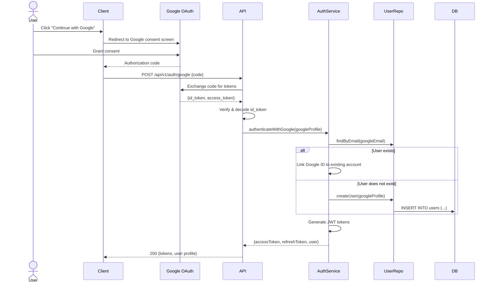
```mermaid
sequenceDiagram
    actor User
    participant Client
    participant GoogleAuth as Google OAuth
    participant API
    participant AuthService
    participant UserRepo
    participant DB

    User->>Client: Click "Continue with Google"
    Client->>GoogleAuth: Redirect to Google consent screen
    User->>GoogleAuth: Grant consent
    GoogleAuth-->>Client: Authorization code
    Client->>API: POST /api/v1/auth/google {code}
    API->>GoogleAuth: Exchange code for tokens
    GoogleAuth-->>API: {id_token, access_token}
    API->>API: Verify & decode id_token
    API->>AuthService: authenticateWithGoogle(googleProfile)
    AuthService->>UserRepo: findByEmail(googleEmail)

    alt User exists
        AuthService->>AuthService: Link Google ID to existing account
    else User does not exist
        AuthService->>UserRepo: createUser(googleProfile)
        UserRepo->>DB: INSERT INTO users (...)
    end

    AuthService->>AuthService: Generate JWT tokens
    AuthService-->>API: {accessToken, refreshToken, user}
    API-->>Client: 200 {tokens, user profile}
```

### 8.4 Guest Join Flow

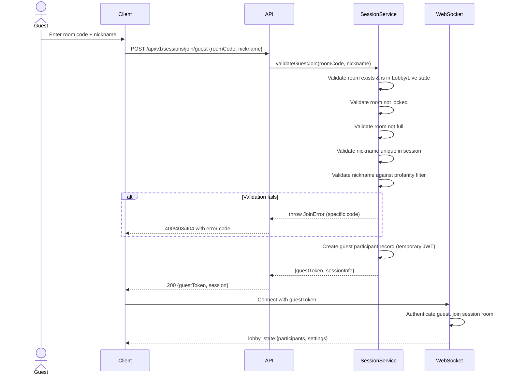
```mermaid
sequenceDiagram
    actor Guest
    participant Client
    participant API
    participant SessionService
    participant WebSocket

    Guest->>Client: Enter room code + nickname
    Client->>API: POST /api/v1/sessions/join/guest {roomCode, nickname}
    API->>SessionService: validateGuestJoin(roomCode, nickname)

    SessionService->>SessionService: Validate room exists & is in Lobby/Live state
    SessionService->>SessionService: Validate room not locked
    SessionService->>SessionService: Validate room not full
    SessionService->>SessionService: Validate nickname unique in session
    SessionService->>SessionService: Validate nickname against profanity filter

    alt Validation fails
        SessionService-->>API: throw JoinError (specific code)
        API-->>Client: 400/403/404 with error code
    end

    SessionService->>SessionService: Create guest participant record (temporary JWT)
    SessionService-->>API: {guestToken, sessionInfo}
    API-->>Client: 200 {guestToken, session}

    Client->>WebSocket: Connect with guestToken
    WebSocket->>WebSocket: Authenticate guest, join session room
    WebSocket-->>Client: lobby_state {participants, settings}
```

---

## 9. Authorization Flow

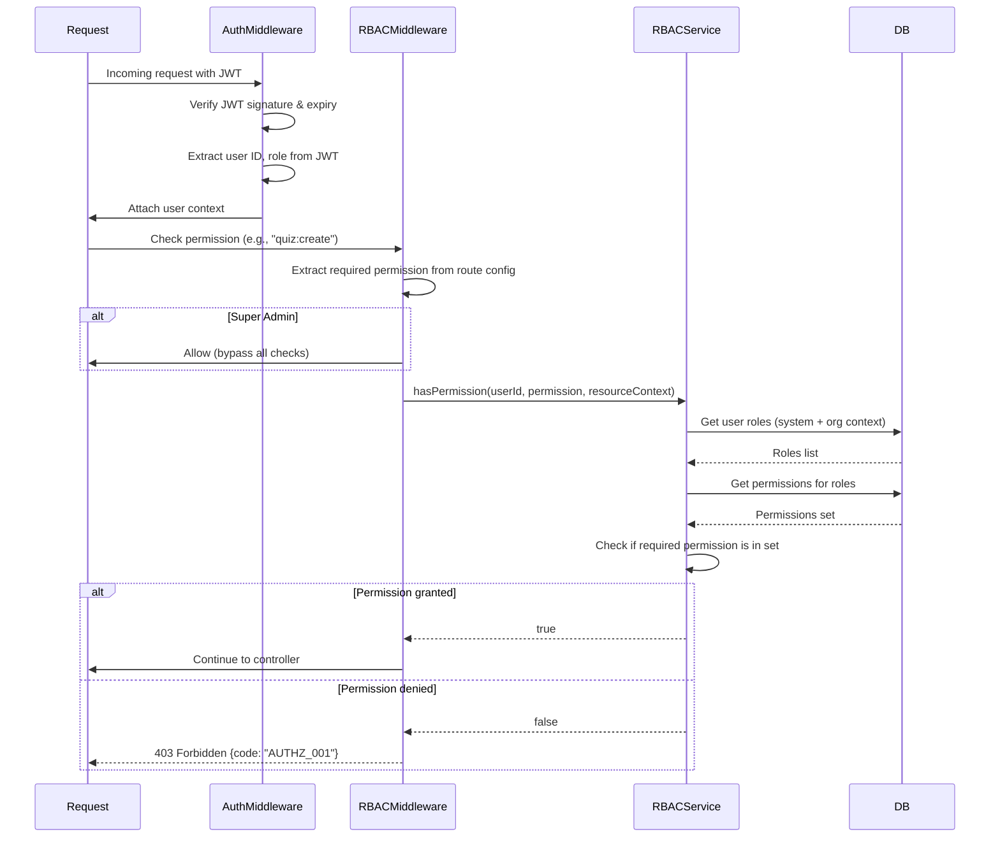
```mermaid
sequenceDiagram
    participant Request
    participant AuthMiddleware
    participant RBACMiddleware
    participant RBACService
    participant DB

    Request->>AuthMiddleware: Incoming request with JWT
    AuthMiddleware->>AuthMiddleware: Verify JWT signature & expiry
    AuthMiddleware->>AuthMiddleware: Extract user ID, role from JWT
    AuthMiddleware->>Request: Attach user context

    Request->>RBACMiddleware: Check permission (e.g., "quiz:create")
    RBACMiddleware->>RBACMiddleware: Extract required permission from route config

    alt Super Admin
        RBACMiddleware->>Request: Allow (bypass all checks)
    end

    RBACMiddleware->>RBACService: hasPermission(userId, permission, resourceContext)
    RBACService->>DB: Get user roles (system + org context)
    DB-->>RBACService: Roles list
    RBACService->>DB: Get permissions for roles
    DB-->>RBACService: Permissions set
    RBACService->>RBACService: Check if required permission is in set

    alt Permission granted
        RBACService-->>RBACMiddleware: true
        RBACMiddleware->>Request: Continue to controller
    else Permission denied
        RBACService-->>RBACMiddleware: false
        RBACMiddleware-->>Request: 403 Forbidden {code: "AUTHZ_001"}
    end
```

---

## 10. Live Quiz Flow

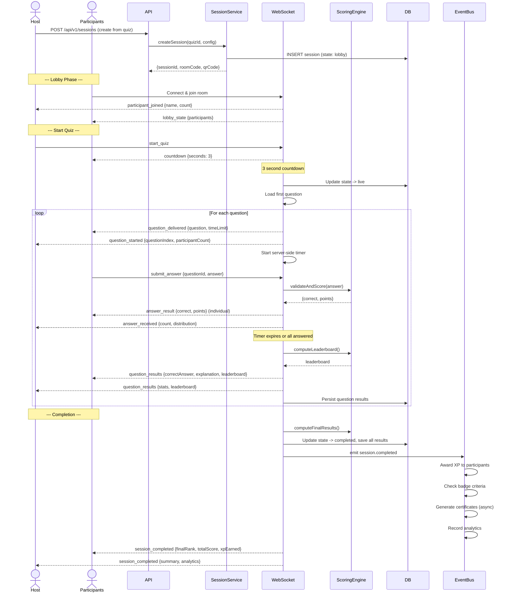
```mermaid
sequenceDiagram
    actor Host
    actor Participants
    participant API
    participant SessionService
    participant WebSocket
    participant ScoringEngine
    participant DB
    participant EventBus

    Host->>API: POST /api/v1/sessions (create from quiz)
    API->>SessionService: createSession(quizId, config)
    SessionService->>DB: INSERT session (state: lobby)
    SessionService-->>API: {sessionId, roomCode, qrCode}

    Note over Host, Participants: --- Lobby Phase ---
    
    Participants->>WebSocket: Connect & join room
    WebSocket-->>Host: participant_joined {name, count}
    WebSocket-->>Participants: lobby_state {participants}

    Note over Host, Participants: --- Start Quiz ---

    Host->>WebSocket: start_quiz
    WebSocket-->>Participants: countdown {seconds: 3}
    Note over WebSocket: 3 second countdown
    WebSocket->>DB: Update state -> live
    WebSocket->>WebSocket: Load first question

    loop For each question
        WebSocket-->>Participants: question_delivered {question, timeLimit}
        WebSocket-->>Host: question_started {questionIndex, participantCount}
        WebSocket->>WebSocket: Start server-side timer

        Participants->>WebSocket: submit_answer {questionId, answer}
        WebSocket->>ScoringEngine: validateAndScore(answer)
        ScoringEngine-->>WebSocket: {correct, points}
        WebSocket-->>Participants: answer_result {correct, points} (individual)
        WebSocket-->>Host: answer_received {count, distribution}

        Note over WebSocket: Timer expires or all answered
        WebSocket->>ScoringEngine: computeLeaderboard()
        ScoringEngine-->>WebSocket: leaderboard

        WebSocket-->>Participants: question_results {correctAnswer, explanation, leaderboard}
        WebSocket-->>Host: question_results {stats, leaderboard}
        WebSocket->>DB: Persist question results
    end

    Note over Host, Participants: --- Completion ---

    WebSocket->>ScoringEngine: computeFinalResults()
    WebSocket->>DB: Update state -> completed, save all results
    WebSocket->>EventBus: emit session.completed
    
    EventBus->>EventBus: Award XP to participants
    EventBus->>EventBus: Check badge criteria
    EventBus->>EventBus: Generate certificates (async)
    EventBus->>EventBus: Record analytics

    WebSocket-->>Participants: session_completed {finalRank, totalScore, xpEarned}
    WebSocket-->>Host: session_completed {summary, analytics}
```

---

## 11. Marketplace Flow

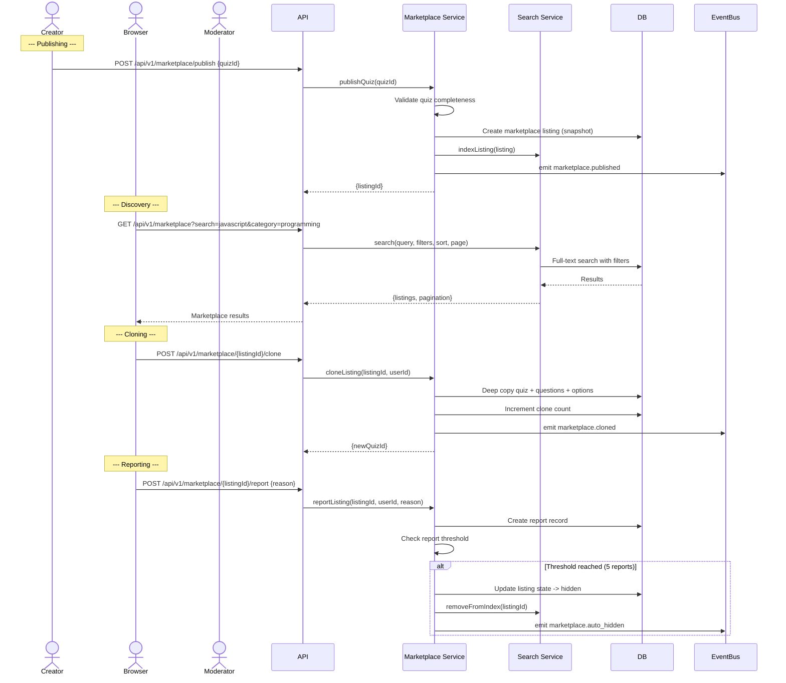
```mermaid
sequenceDiagram
    actor Creator
    actor Browser
    actor Moderator
    participant API
    participant MktService as Marketplace Service
    participant SearchService as Search Service
    participant DB
    participant EventBus

    Note over Creator: --- Publishing ---
    Creator->>API: POST /api/v1/marketplace/publish {quizId}
    API->>MktService: publishQuiz(quizId)
    MktService->>MktService: Validate quiz completeness
    MktService->>DB: Create marketplace listing (snapshot)
    MktService->>SearchService: indexListing(listing)
    MktService->>EventBus: emit marketplace.published
    MktService-->>API: {listingId}

    Note over Browser: --- Discovery ---
    Browser->>API: GET /api/v1/marketplace?search=javascript&category=programming
    API->>SearchService: search(query, filters, sort, page)
    SearchService->>DB: Full-text search with filters
    DB-->>SearchService: Results
    SearchService-->>API: {listings, pagination}
    API-->>Browser: Marketplace results

    Note over Browser: --- Cloning ---
    Browser->>API: POST /api/v1/marketplace/{listingId}/clone
    API->>MktService: cloneListing(listingId, userId)
    MktService->>DB: Deep copy quiz + questions + options
    MktService->>DB: Increment clone count
    MktService->>EventBus: emit marketplace.cloned
    MktService-->>API: {newQuizId}

    Note over Browser: --- Reporting ---
    Browser->>API: POST /api/v1/marketplace/{listingId}/report {reason}
    API->>MktService: reportListing(listingId, userId, reason)
    MktService->>DB: Create report record
    MktService->>MktService: Check report threshold

    alt Threshold reached (5 reports)
        MktService->>DB: Update listing state -> hidden
        MktService->>SearchService: removeFromIndex(listingId)
        MktService->>EventBus: emit marketplace.auto_hidden
    end
```

---

## 12. Notification Flow

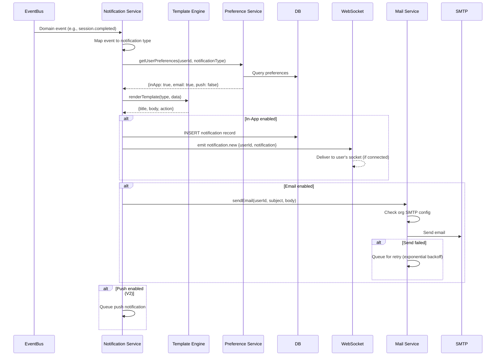
```mermaid
sequenceDiagram
    participant EventBus
    participant NotifService as Notification Service
    participant TemplateEngine as Template Engine
    participant PreferenceService as Preference Service
    participant DB
    participant WebSocket
    participant MailService as Mail Service
    participant SMTP

    EventBus->>NotifService: Domain event (e.g., session.completed)
    NotifService->>NotifService: Map event to notification type

    NotifService->>PreferenceService: getUserPreferences(userId, notificationType)
    PreferenceService->>DB: Query preferences
    PreferenceService-->>NotifService: {inApp: true, email: true, push: false}

    NotifService->>TemplateEngine: renderTemplate(type, data)
    TemplateEngine-->>NotifService: {title, body, action}

    alt In-App enabled
        NotifService->>DB: INSERT notification record
        NotifService->>WebSocket: emit notification.new {userId, notification}
        WebSocket-->>WebSocket: Deliver to user's socket (if connected)
    end

    alt Email enabled
        NotifService->>MailService: sendEmail(userId, subject, body)
        MailService->>MailService: Check org SMTP config
        MailService->>SMTP: Send email
        alt Send failed
            MailService->>MailService: Queue for retry (exponential backoff)
        end
    end

    alt Push enabled (V2)
        NotifService->>NotifService: Queue push notification
    end
```

---

## 13. Analytics Flow

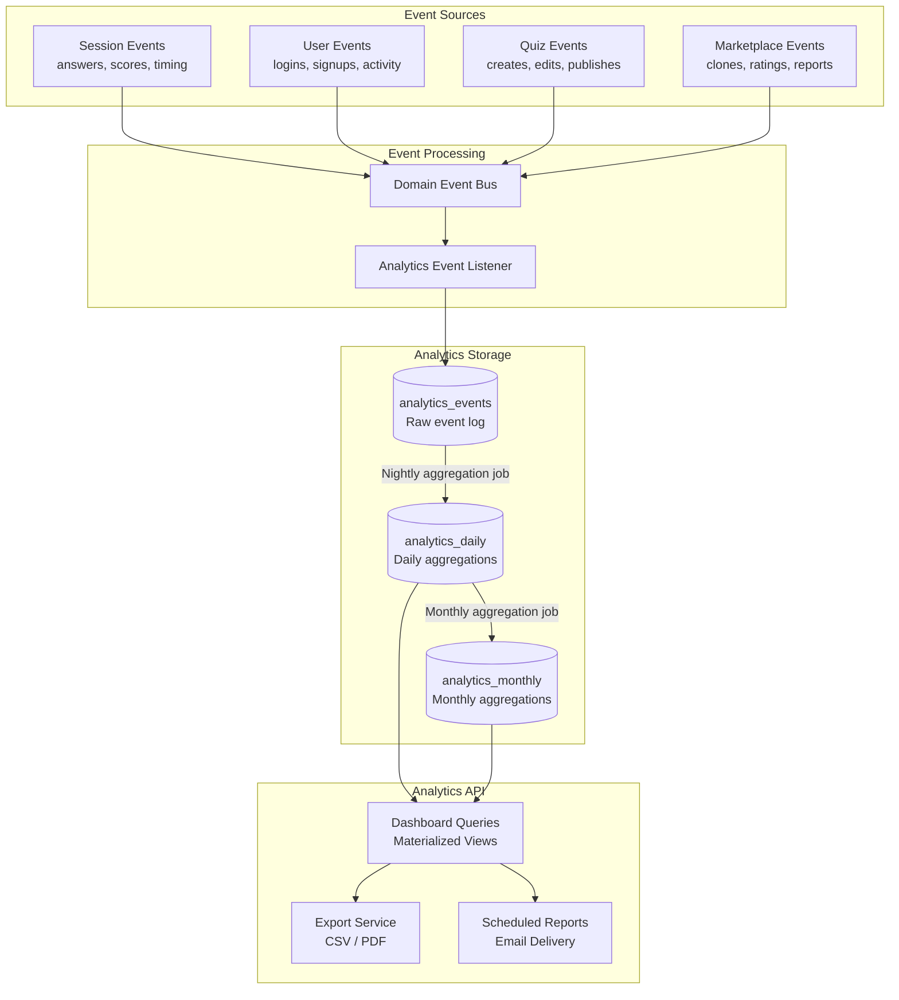
```mermaid
graph TB
    subgraph "Event Sources"
        SESSION_EVENTS[Session Events<br/>answers, scores, timing]
        USER_EVENTS[User Events<br/>logins, signups, activity]
        QUIZ_EVENTS[Quiz Events<br/>creates, edits, publishes]
        MKT_EVENTS[Marketplace Events<br/>clones, ratings, reports]
    end

    subgraph "Event Processing"
        EVENT_BUS[Domain Event Bus]
        ANA_LISTENER[Analytics Event Listener]
    end

    subgraph "Analytics Storage"
        RAW_EVENTS[(analytics_events<br/>Raw event log)]
        AGG_DAILY[(analytics_daily<br/>Daily aggregations)]
        AGG_MONTHLY[(analytics_monthly<br/>Monthly aggregations)]
    end

    subgraph "Analytics API"
        DASHBOARD[Dashboard Queries<br/>Materialized Views]
        EXPORT[Export Service<br/>CSV / PDF]
        SCHEDULED[Scheduled Reports<br/>Email Delivery]
    end

    SESSION_EVENTS --> EVENT_BUS
    USER_EVENTS --> EVENT_BUS
    QUIZ_EVENTS --> EVENT_BUS
    MKT_EVENTS --> EVENT_BUS

    EVENT_BUS --> ANA_LISTENER
    ANA_LISTENER --> RAW_EVENTS

    RAW_EVENTS -->|Nightly aggregation job| AGG_DAILY
    AGG_DAILY -->|Monthly aggregation job| AGG_MONTHLY

    AGG_DAILY --> DASHBOARD
    AGG_MONTHLY --> DASHBOARD
    DASHBOARD --> EXPORT
    DASHBOARD --> SCHEDULED
```

---

## 14. File Upload Flow

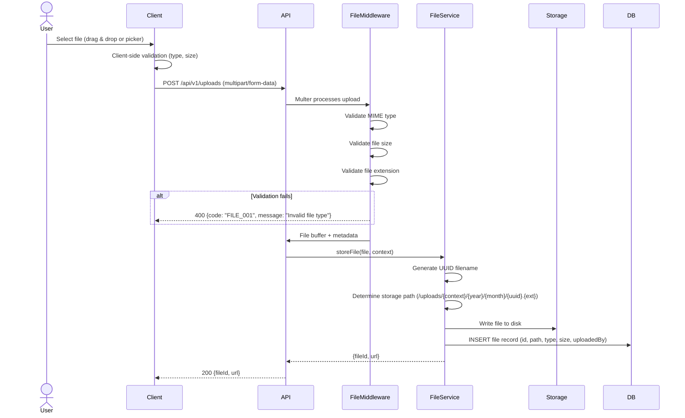
```mermaid
sequenceDiagram
    actor User
    participant Client
    participant API
    participant FileMiddleware
    participant FileService
    participant Storage
    participant DB

    User->>Client: Select file (drag & drop or picker)
    Client->>Client: Client-side validation (type, size)
    Client->>API: POST /api/v1/uploads (multipart/form-data)

    API->>FileMiddleware: Multer processes upload
    FileMiddleware->>FileMiddleware: Validate MIME type
    FileMiddleware->>FileMiddleware: Validate file size
    FileMiddleware->>FileMiddleware: Validate file extension

    alt Validation fails
        FileMiddleware-->>Client: 400 {code: "FILE_001", message: "Invalid file type"}
    end

    FileMiddleware->>API: File buffer + metadata
    API->>FileService: storeFile(file, context)
    FileService->>FileService: Generate UUID filename
    FileService->>FileService: Determine storage path (/uploads/{context}/{year}/{month}/{uuid}.{ext})
    FileService->>Storage: Write file to disk
    FileService->>DB: INSERT file record (id, path, type, size, uploadedBy)
    FileService-->>API: {fileId, url}
    API-->>Client: 200 {fileId, url}
```

### 14.1 Storage Directory Structure (V1 — Local)

```
/uploads/
├── avatars/
│   └── 2026/07/{uuid}.webp
├── banners/
│   └── 2026/07/{uuid}.webp
├── quiz-covers/
│   └── 2026/07/{uuid}.webp
├── question-media/
│   ├── images/
│   │   └── 2026/07/{uuid}.webp
│   ├── audio/
│   │   └── 2026/07/{uuid}.mp3
│   └── video/
│       └── 2026/07/{uuid}.mp4
├── certificates/
│   └── 2026/07/{uuid}.pdf
├── org-logos/
│   └── 2026/07/{uuid}.webp
├── org-banners/
│   └── 2026/07/{uuid}.webp
└── imports/
    └── 2026/07/{uuid}.csv
```

---

## 15. Deployment Architecture

### 15.1 V1 Deployment (Single Server)

```mermaid
graph TB
    subgraph "AWS EC2 Instance"
        NGINX_D[Nginx<br/>:80, :443]
        PM2_D[PM2 Process Manager]

        subgraph "PM2 Cluster"
            APP1[Node.js App Instance 1<br/>:3001]
            APP2[Node.js App Instance 2<br/>:3002]
            APP3[Node.js App Instance 3<br/>:3003]
            APP4[Node.js App Instance 4<br/>:3004]
        end

        PG_D[(PostgreSQL<br/>:5432)]
        FILES_D[/uploads/<br/>Local Storage]
    end

    CLIENT[Internet<br/>Users] -->|HTTPS| NGINX_D
    NGINX_D -->|Round Robin| APP1
    NGINX_D -->|Round Robin| APP2
    NGINX_D -->|Round Robin| APP3
    NGINX_D -->|Round Robin| APP4

    APP1 --> PG_D
    APP2 --> PG_D
    APP3 --> PG_D
    APP4 --> PG_D

    APP1 --> FILES_D
    APP2 --> FILES_D
    APP3 --> FILES_D
    APP4 --> FILES_D
```

### 15.2 V2+ Deployment (Multi-Server)

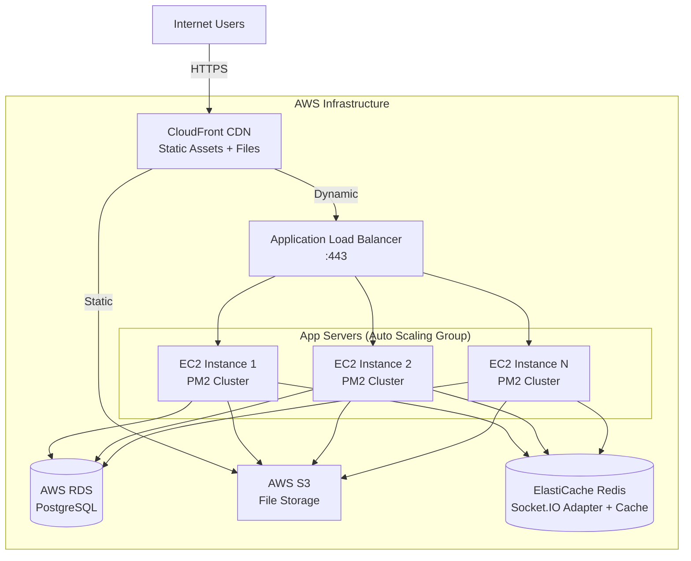
```mermaid
graph TB
    subgraph "AWS Infrastructure"
        ALB[Application Load Balancer<br/>:443]

        subgraph "App Servers (Auto Scaling Group)"
            EC2_1[EC2 Instance 1<br/>PM2 Cluster]
            EC2_2[EC2 Instance 2<br/>PM2 Cluster]
            EC2_N[EC2 Instance N<br/>PM2 Cluster]
        end

        RDS[(AWS RDS<br/>PostgreSQL)]
        S3[AWS S3<br/>File Storage]
        REDIS_D[(ElastiCache Redis<br/>Socket.IO Adapter + Cache)]
        CF[CloudFront CDN<br/>Static Assets + Files]
    end

    USERS[Internet Users] -->|HTTPS| CF
    CF -->|Dynamic| ALB
    CF -->|Static| S3

    ALB --> EC2_1
    ALB --> EC2_2
    ALB --> EC2_N

    EC2_1 --> RDS
    EC2_2 --> RDS
    EC2_N --> RDS

    EC2_1 --> S3
    EC2_1 --> REDIS_D
    EC2_2 --> S3
    EC2_2 --> REDIS_D
    EC2_N --> S3
    EC2_N --> REDIS_D
```

---

## 16. Cross-Cutting Concerns

### 16.1 Logging

| Aspect | Implementation |
|--------|----------------|
| Library | Winston (structured JSON logging) |
| Levels | error, warn, info, http, debug |
| Format | `{timestamp, level, message, requestId, userId, module, ...meta}` |
| Output (Dev) | Console (colorized) |
| Output (Prod) | File + CloudWatch |
| Request logging | Morgan middleware (HTTP method, URL, status, response time) |
| Sensitive data | Passwords, tokens, PII MUST never be logged |

### 16.2 Error Handling

| Aspect | Implementation |
|--------|----------------|
| Pattern | Centralized error handler middleware |
| Custom errors | `AppError` base class with code, status, message |
| Unhandled rejections | Caught at process level, logged, graceful shutdown |
| Client errors | User-friendly messages; detailed errors only in development |
| Operational errors | Logged, monitored, alerted |
| Programming errors | Logged, process restarted by PM2 |

### 16.3 Configuration Management

| Aspect | Implementation |
|--------|----------------|
| Environment variables | `.env` files (per environment) loaded by `dotenv` |
| Runtime config | Database-stored configuration (hot-reloadable) |
| Validation | Configuration validated at startup (fail fast) |
| Secrets | Environment variables only; never in code or config files |
| Hierarchy | Env vars > DB config > Default values |

### 16.4 Naming Conventions

| Context | Convention | Example |
|---------|-----------|---------|
| Database tables | snake_case, singular | `user`, `quiz`, `live_session` |
| Database columns | snake_case | `created_at`, `is_active`, `display_name` |
| API routes | kebab-case, plural nouns | `/api/v1/quiz-sessions`, `/api/v1/question-banks` |
| JavaScript variables | camelCase | `quizSession`, `questionBank` |
| JavaScript classes | PascalCase | `QuizService`, `SessionController` |
| JavaScript constants | UPPER_SNAKE_CASE | `MAX_QUESTIONS`, `DEFAULT_TIMER` |
| Files (modules) | camelCase | `quizService.ts`, `sessionController.ts` |
| Files (config/types) | camelCase | `databaseConfig.ts`, `quizTypes.ts` |
| Folders | camelCase | `questionBank/`, `liveSession/` |
| Environment variables | UPPER_SNAKE_CASE | `DATABASE_URL`, `JWT_SECRET` |
| Permission strings | resource:action | `quiz:create`, `room:start` |
| Event names | domain.action | `session.completed`, `quiz.published` |
| Error codes | DOMAIN_NNN | `AUTH_001`, `QUIZ_101` |

---

## 17. Scalability Strategy

### 17.1 Scaling Phases

| Phase | Users | Strategy | Key Changes |
|-------|-------|----------|-------------|
| **V1** | 1,000 | Single server, PM2 cluster mode | 4 Node.js processes, single PostgreSQL instance |
| **V1.5** | 5,000 | Optimized single server | Connection pooling tuning, query optimization, add Redis for caching |
| **V2** | 10,000–50,000 | Horizontal scaling | Multiple EC2 instances, Redis for Socket.IO adapter, AWS RDS, S3 |
| **V3** | 100,000+ | Full cloud-native | Auto-scaling groups, read replicas, CDN, potential microservice extraction |

### 17.2 Database Scaling

| Scale | Strategy |
|-------|----------|
| V1 | Single PostgreSQL instance, proper indexing, connection pool (50 connections) |
| V1.5 | Query optimization, materialized views for analytics dashboards |
| V2 | AWS RDS with read replicas (separate reads from writes), table partitioning for analytics |
| V3 | Connection pooler (PgBouncer), sharding consideration for very large tables |

### 17.3 WebSocket Scaling

| Scale | Strategy |
|-------|----------|
| V1 | Single Socket.IO server with PM2 sticky sessions |
| V2 | Redis adapter for Socket.IO (enables multi-server WebSocket) |
| V3 | Dedicated WebSocket servers, horizontal scaling with Redis pub/sub |

### 17.4 File Storage Scaling

| Scale | Strategy |
|-------|----------|
| V1 | Local filesystem (100 GB limit) |
| V2 | AWS S3 with CloudFront CDN |
| V3 | S3 with lifecycle policies, image optimization pipeline |

---

## 18. Future Architecture Evolution

### 18.1 Microservice Extraction Candidates

When scale demands it, these modules are the strongest candidates for extraction into independent services:

| Module | Reason | Trigger |
|--------|--------|---------|
| **Session Engine** | Highest load during peak times; independent scaling needed | >50,000 concurrent sessions |
| **Notification Service** | Independent scaling; different SLA | >1M notifications/day |
| **Analytics Service** | Heavy queries; should not impact main app performance | Query latency affecting API |
| **Certificate Service** | CPU-intensive PDF generation; bursty workload | >10,000 certs/day |
| **Search Service** | Could benefit from Elasticsearch migration | Marketplace >100K listings |

### 18.2 Technology Evolution Path

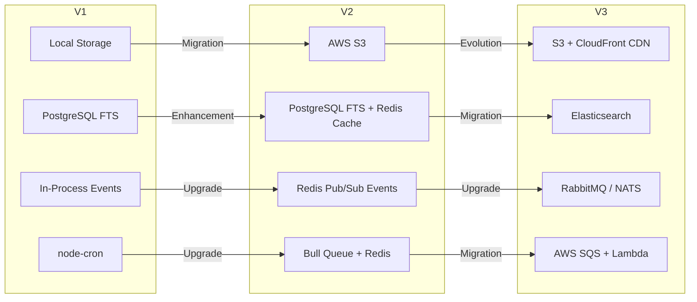
```mermaid
graph LR
    subgraph "V1"
        A1[Local Storage]
        A2[PostgreSQL FTS]
        A3[In-Process Events]
        A4[node-cron]
    end

    subgraph "V2"
        B1[AWS S3]
        B2[PostgreSQL FTS + Redis Cache]
        B3[Redis Pub/Sub Events]
        B4[Bull Queue + Redis]
    end

    subgraph "V3"
        C1[S3 + CloudFront CDN]
        C2[Elasticsearch]
        C3[RabbitMQ / NATS]
        C4[AWS SQS + Lambda]
    end

    A1 -->|Migration| B1 -->|Evolution| C1
    A2 -->|Enhancement| B2 -->|Migration| C2
    A3 -->|Upgrade| B3 -->|Upgrade| C3
    A4 -->|Upgrade| B4 -->|Migration| C4
```

---

## 19. References

| Document | Relationship |
|----------|-------------|
| [01-master-prd.md](./01-master-prd.md) | Product requirements driving architecture |
| [05-domain-driven-design.md](./05-domain-driven-design.md) | Domain model underlying module boundaries |
| [07-database-design.md](./07-database-design.md) | Database architecture |
| [09-backend-architecture.md](./09-backend-architecture.md) | Detailed backend module structure |
| [11-frontend-architecture.md](./11-frontend-architecture.md) | Frontend architecture |
| [17-live-quiz-engine.md](./17-live-quiz-engine.md) | Live quiz architectural details |
| [38-websocket-events.md](./38-websocket-events.md) | WebSocket protocol |
| [47-deployment-infrastructure.md](./47-deployment-infrastructure.md) | Deployment details |
| [decisions/](./decisions/) | Architecture Decision Records |

---

*End of Document — AERO-ARCH-004 v1.0*
