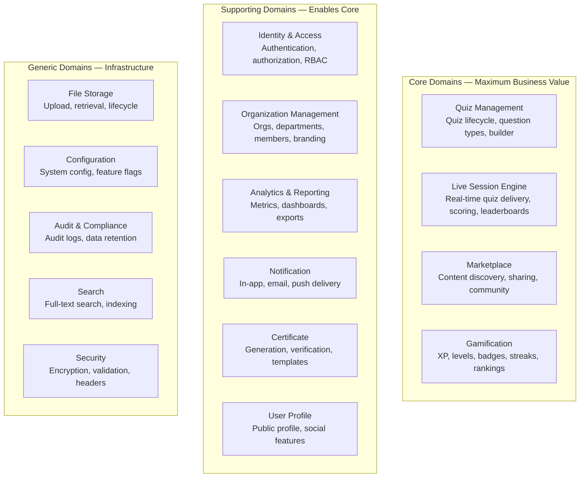
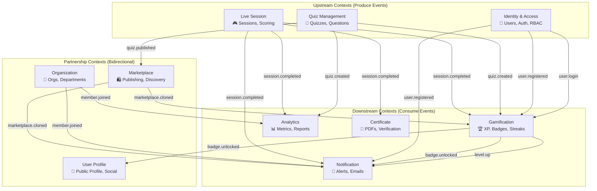
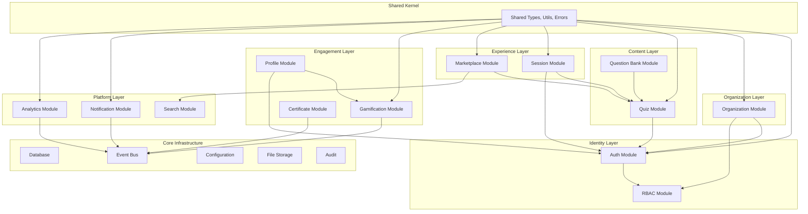
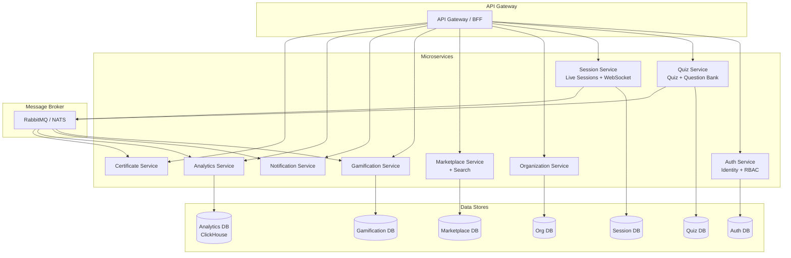

# 05 — Domain-Driven Design

**Document ID:** AERO-DDD-005  
**Version:** 1.0  
**Last Updated:** 2026-07-16  
**Author:** Domain Architect  
**Status:** Approved  
**Classification:** Internal — Engineering

---

## Table of Contents

1. [Purpose](#1-purpose)
2. [Strategic Design](#2-strategic-design)
3. [Core Domains](#3-core-domains)
4. [Supporting Domains](#4-supporting-domains)
5. [Generic Domains](#5-generic-domains)
6. [Context Map](#6-context-map)
7. [Bounded Contexts](#7-bounded-contexts)
8. [Aggregates](#8-aggregates)
9. [Domain Events](#9-domain-events)
10. [Value Objects](#10-value-objects)
11. [Domain Services](#11-domain-services)
12. [Module Dependency Graph](#12-module-dependency-graph)
13. [Future Microservice Boundaries](#13-future-microservice-boundaries)
14. [References](#14-references)

---

## 1. Purpose

This document defines the Domain-Driven Design (DDD) model for Aero MAGE. DDD provides a structured approach to decomposing the system into manageable domains, each with clear boundaries, responsibilities, and ownership. This decomposition directly informs:

- Module boundaries in the modular monolith
- Database table ownership (which module owns which tables)
- API endpoint grouping
- Team ownership assignments
- Future microservice extraction

---

## 2. Strategic Design

### 2.1 Domain Classification



### 2.2 Domain Priority

| Priority | Domains | Rationale |
|----------|---------|-----------|
| **Highest** | Live Session Engine, Quiz Management | These ARE the product. Without them, there is no platform. |
| **High** | Gamification, Marketplace, Identity & Access | Core differentiators and fundamental infrastructure |
| **Medium** | Organization, Analytics, Notification, Profile | Important but not the primary value proposition |
| **Lower** | Certificate, Search, Storage, Config, Audit | Supporting infrastructure |

---

## 3. Core Domains

### 3.1 Quiz Management Domain

**Responsibility:** The complete lifecycle of quizzes and questions — creation, editing, configuration, versioning, and deletion.

| Aspect | Detail |
|--------|--------|
| **Aggregate Root** | Quiz |
| **Entities** | Quiz, Question, QuestionOption, QuestionMedia |
| **Value Objects** | QuizSettings, TimerConfig, ScoringConfig, Difficulty, QuizVisibility |
| **Services** | QuizService, QuestionService, QuestionBankService, QuizCloneService, BulkImportService |
| **Events Produced** | quiz.created, quiz.updated, quiz.published, quiz.archived, quiz.deleted, question.created, question.updated |
| **Events Consumed** | session.completed (to update quiz play count) |
| **Owned Tables** | quiz, question, question_option, question_media, question_bank_entry, quiz_tag, quiz_category |

### 3.2 Live Session Engine Domain

**Responsibility:** Everything related to running a live quiz session — lobby, real-time question delivery, answer collection, scoring, leaderboards, and session recovery.

| Aspect | Detail |
|--------|--------|
| **Aggregate Root** | Session |
| **Entities** | Session, SessionParticipant, SessionResponse, SessionLeaderboard, SessionQuestion |
| **Value Objects** | RoomCode, SessionState, Score, TimerState, HostControls |
| **Services** | SessionService, ScoringEngine, LeaderboardService, SessionRecoveryService, TimerService |
| **Events Produced** | session.created, session.started, session.paused, session.resumed, session.completed, session.abandoned, participant.joined, participant.left, answer.submitted, leaderboard.updated |
| **Events Consumed** | None directly (self-contained during live operation) |
| **Owned Tables** | session, session_participant, session_response, session_leaderboard, session_question_state |
| **WebSocket** | Primary consumer and producer of all live quiz WebSocket events |

### 3.3 Marketplace Domain

**Responsibility:** Content publishing, discovery, community interaction (ratings, favorites, reports), and moderation.

| Aspect | Detail |
|--------|--------|
| **Aggregate Root** | MarketplaceListing |
| **Entities** | MarketplaceListing, Rating, Favorite, Bookmark, Report, Collection, CollectionItem |
| **Value Objects** | ListingState, RatingValue, TrendingScore, ReportReason |
| **Services** | MarketplaceService, ModerationService, TrendingService, CollectionService |
| **Events Produced** | marketplace.published, marketplace.unpublished, marketplace.cloned, marketplace.rated, marketplace.reported, marketplace.hidden, marketplace.removed |
| **Events Consumed** | quiz.updated (to flag listing as potentially outdated) |
| **Owned Tables** | marketplace_listing, marketplace_rating, marketplace_favorite, marketplace_bookmark, marketplace_report, marketplace_collection, marketplace_collection_item |

### 3.4 Gamification Domain

**Responsibility:** XP, levels, badges, achievements, titles, ranks, streaks, leaderboards, coins, and the contribution heatmap.

| Aspect | Detail |
|--------|--------|
| **Aggregate Root** | UserGamification (per-user gamification state) |
| **Entities** | UserGamification, Badge, Achievement, UserBadge, UserAchievement, Streak, LeaderboardEntry, HeatmapEntry, WeeklyChallenge |
| **Value Objects** | XPAmount, Level, BadgeRarity, StreakCount, CoinBalance |
| **Services** | XPService, LevelService, BadgeService, AchievementService, StreakService, LeaderboardService, HeatmapService, ChallengeService |
| **Events Produced** | xp.earned, level.up, badge.unlocked, achievement.unlocked, streak.updated, streak.broken, challenge.completed |
| **Events Consumed** | session.completed, quiz.created, marketplace.published, user.login (for streak tracking) |
| **Owned Tables** | user_gamification, badge, achievement, user_badge, user_achievement, user_streak, global_leaderboard, country_leaderboard, season_leaderboard, heatmap_entry, coin_transaction, weekly_challenge, user_challenge |

---

## 4. Supporting Domains

### 4.1 Identity & Access Domain

**Responsibility:** User registration, authentication (email, Google, guest), JWT token management, RBAC, and permission evaluation.

| Aspect | Detail |
|--------|--------|
| **Aggregate Root** | User |
| **Entities** | User, RefreshToken, PasswordResetToken, VerificationToken |
| **Value Objects** | Email, HashedPassword, TokenPair, OAuthProfile |
| **Services** | AuthService, TokenService, PasswordService, OAuthService, GuestService |
| **Events Produced** | user.registered, user.verified, user.login, user.logout, user.password_changed, user.deactivated |
| **Events Consumed** | None |
| **Owned Tables** | user, refresh_token, password_reset_token, email_verification_token, login_history |

**RBAC Sub-Domain:**

| Aspect | Detail |
|--------|--------|
| **Entities** | Role, Permission, RolePermission, UserRole |
| **Services** | RBACService, PermissionService, RoleService |
| **Events Produced** | role.created, role.updated, permission.changed |
| **Owned Tables** | role, permission, role_permission, user_role |

### 4.2 Organization Domain

**Responsibility:** Multi-tenant organization management — creation, departments, members, branding, invitations, join requests, and org-scoped configuration.

| Aspect | Detail |
|--------|--------|
| **Aggregate Root** | Organization |
| **Entities** | Organization, Department, OrganizationMember, Invitation, JoinRequest, OrganizationSettings, OrganizationBranding |
| **Value Objects** | OrganizationName, InvitationLink, BrandingTheme, OrgLimits |
| **Services** | OrganizationService, DepartmentService, MemberService, InvitationService, JoinRequestService, OrgConfigService |
| **Events Produced** | org.created, org.updated, org.deactivated, department.created, member.joined, member.removed, member.role_changed, invitation.sent, invitation.accepted, join_request.submitted, join_request.approved |
| **Events Consumed** | None |
| **Owned Tables** | organization, department, organization_member, invitation, join_request, organization_settings, organization_branding |

### 4.3 Analytics Domain

**Responsibility:** Data collection, aggregation, dashboard computation, reporting, and data export.

| Aspect | Detail |
|--------|--------|
| **Aggregate Root** | AnalyticsEvent |
| **Entities** | AnalyticsEvent, DailyAggregate, MonthlyAggregate, ScheduledReport |
| **Value Objects** | MetricValue, DateRange, AggregationType |
| **Services** | AnalyticsService, AggregationService, ReportService, ExportService |
| **Events Produced** | report.generated, report.exported |
| **Events Consumed** | Almost all domain events (session.completed, quiz.created, user.registered, marketplace.published, etc.) |
| **Owned Tables** | analytics_event, analytics_daily, analytics_monthly, scheduled_report |

### 4.4 Notification Domain

**Responsibility:** Multi-channel notification delivery (in-app, email, push), templates, user preferences, and delivery tracking.

| Aspect | Detail |
|--------|--------|
| **Aggregate Root** | Notification |
| **Entities** | Notification, NotificationTemplate, NotificationPreference, EmailQueue |
| **Value Objects** | NotificationType, NotificationChannel, DeliveryStatus |
| **Services** | NotificationService, TemplateService, PreferenceService, EmailService, PushService (V2) |
| **Events Produced** | notification.created, notification.delivered, notification.read, email.sent, email.failed |
| **Events Consumed** | Almost all domain events (translates events into user notifications) |
| **Owned Tables** | notification, notification_template, notification_preference, email_queue |

### 4.5 Certificate Domain

**Responsibility:** Certificate template management, dynamic certificate generation, PDF rendering, and public verification.

| Aspect | Detail |
|--------|--------|
| **Aggregate Root** | Certificate |
| **Entities** | Certificate, CertificateTemplate |
| **Value Objects** | CertificateType, VerificationId, TemplateField |
| **Services** | CertificateService, PDFGeneratorService, VerificationService, TemplateService |
| **Events Produced** | certificate.generated, certificate.delivered, certificate.revoked |
| **Events Consumed** | session.completed (triggers certificate generation) |
| **Owned Tables** | certificate, certificate_template |

### 4.6 User Profile Domain

**Responsibility:** Public profile management, social features (follow/unfollow), activity feed, and profile customization.

| Aspect | Detail |
|--------|--------|
| **Aggregate Root** | UserProfile |
| **Entities** | UserProfile, Follow, ActivityFeedEntry |
| **Value Objects** | Avatar, Banner, Bio, ProfileSlug |
| **Services** | ProfileService, FollowService, ActivityFeedService |
| **Events Produced** | profile.updated, user.followed, user.unfollowed |
| **Events Consumed** | quiz.created, session.completed, badge.unlocked, marketplace.published (for activity feed) |
| **Owned Tables** | user_profile, follow, activity_feed |

---

## 5. Generic Domains

### 5.1 File Storage Domain

| Aspect | Detail |
|--------|--------|
| **Services** | FileStorageService (interface), LocalStorageProvider (V1), S3StorageProvider (V2) |
| **Strategy Pattern** | Storage provider is swappable via configuration |
| **Owned Tables** | file_upload |

### 5.2 Configuration Domain

| Aspect | Detail |
|--------|--------|
| **Services** | ConfigService, FeatureFlagService |
| **Owned Tables** | system_config, feature_flag |

### 5.3 Audit Domain

| Aspect | Detail |
|--------|--------|
| **Services** | AuditService, DataRetentionService |
| **Owned Tables** | audit_log |

### 5.4 Search Domain

| Aspect | Detail |
|--------|--------|
| **Services** | SearchService (uses PostgreSQL full-text search in V1, Elasticsearch in V3) |
| **Owned Tables** | search_index (materialized view or dedicated table) |

---

## 6. Context Map

The context map shows how bounded contexts interact with each other:



### 6.1 Integration Patterns

| Pattern | Used Between | Description |
|---------|-------------|-------------|
| **Event-driven** | Session → Gamification, Notifications, Analytics, Certificates | Loose coupling via domain events |
| **Direct call** | Quiz → Session (session needs quiz data) | Synchronous service call via public interface |
| **Direct call** | Organization → RBAC (permission checks need org context) | Synchronous service call |
| **Shared kernel** | All contexts share types from `@shared/types` | Common value objects, DTOs, error classes |

---

## 7. Bounded Contexts

Each bounded context has explicit boundaries that define:
- What data it owns
- What operations it exposes
- What events it produces and consumes
- How it communicates with other contexts

### 7.1 Boundary Definitions

| Context | Owns | Exposes (Public Interface) | Hidden (Internal) |
|---------|------|---------------------------|-------------------|
| **Identity** | Users, tokens, auth state | `authenticate()`, `verifyToken()`, `getUserById()` | Token storage, password hashing, OAuth internals |
| **RBAC** | Roles, permissions, assignments | `hasPermission()`, `getUserPermissions()`, `assignRole()` | Permission caching, role hierarchy resolution |
| **Organization** | Orgs, departments, members | `getOrganization()`, `isMember()`, `getDepartments()` | Invitation flow internals, approval logic |
| **Quiz** | Quizzes, questions, options | `getQuiz()`, `getQuizForSession()`, `cloneQuiz()` | Quiz validation, question bank internals |
| **Session** | Sessions, participants, responses | `createSession()`, `getSessionResults()` | Timer management, scoring algorithm, WebSocket handlers |
| **Marketplace** | Listings, ratings, reports | `searchListings()`, `getListingDetail()` | Trending algorithm, moderation queue |
| **Gamification** | XP, levels, badges, streaks | `getUserGamification()`, `getLeaderboard()` | XP calculation formulas, badge criteria evaluation |
| **Notification** | Notifications, templates, preferences | `notify()`, `getUserNotifications()` | Email queue, retry logic, template rendering |
| **Analytics** | Events, aggregates, reports | `getMetrics()`, `exportReport()` | Aggregation jobs, materialized view management |
| **Certificate** | Certificates, templates | `generateCertificate()`, `verifyCertificate()` | PDF rendering, template engine |
| **Profile** | Profiles, follows, activity | `getPublicProfile()`, `getFollowers()` | Activity feed assembly, heatmap computation |

---

## 8. Aggregates

### 8.1 Aggregate Design Rules

1. **One aggregate root per transaction** — A single database transaction should modify at most one aggregate
2. **Reference by ID** — Aggregates reference other aggregates by their ID, not by direct object reference
3. **Consistency within, eventual consistency across** — Data within an aggregate is immediately consistent; cross-aggregate consistency is achieved via events
4. **Small aggregates** — Keep aggregates small for better concurrency and performance

### 8.2 Aggregate Definitions

| Aggregate Root | Contains (Entities) | External References (by ID) |
|---------------|---------------------|---------------------------|
| **User** | User | — |
| **Quiz** | Quiz, Question[], QuestionOption[], QuestionMedia[] | userId (creator) |
| **Session** | Session, SessionParticipant[], SessionResponse[], SessionLeaderboard[] | quizId, hostUserId |
| **Organization** | Organization, OrganizationSettings, OrganizationBranding | ownerUserId |
| **Department** | Department | organizationId |
| **OrganizationMember** | OrganizationMember | organizationId, userId, departmentId |
| **MarketplaceListing** | MarketplaceListing | quizId, creatorUserId |
| **UserGamification** | UserGamification, UserBadge[], UserAchievement[], Streak | userId |
| **Certificate** | Certificate | sessionId, userId, templateId |
| **Notification** | Notification | userId |
| **Invitation** | Invitation | organizationId, inviterUserId, inviteeEmail |
| **UserProfile** | UserProfile | userId |

---

## 9. Domain Events

### 9.1 Event Naming Convention

```
{domain}.{entity}.{action}
```

Examples:
- `identity.user.registered`
- `quiz.quiz.created`
- `session.session.completed`
- `gamification.badge.unlocked`

### 9.2 Event Catalog Summary

| Domain | Events | Primary Consumers |
|--------|--------|-------------------|
| Identity | user.registered, user.verified, user.login, user.logout, user.password_changed, user.deactivated | Gamification, Notification, Analytics, Profile |
| Quiz | quiz.created, quiz.updated, quiz.published, quiz.archived, quiz.deleted, question.created | Gamification, Analytics, Marketplace |
| Session | session.created, session.started, session.paused, session.resumed, session.completed, session.abandoned, participant.joined, participant.left, answer.submitted, leaderboard.updated | Gamification, Notification, Analytics, Certificate |
| Organization | org.created, org.updated, org.deactivated, department.created, member.joined, member.removed, member.role_changed, invitation.sent, invitation.accepted | Notification, Analytics |
| Marketplace | marketplace.published, marketplace.unpublished, marketplace.cloned, marketplace.rated, marketplace.reported, marketplace.hidden | Gamification, Notification, Analytics |
| Gamification | xp.earned, level.up, badge.unlocked, achievement.unlocked, streak.updated, streak.broken | Notification, Profile |
| Certificate | certificate.generated, certificate.delivered, certificate.revoked | Notification |
| Notification | notification.created, notification.delivered, notification.read, email.sent, email.failed | — (terminal consumer) |
| Analytics | report.generated, report.exported | Notification |

> Full event catalog with payloads in [06-event-catalog.md](./06-event-catalog.md)

---

## 10. Value Objects

Value objects are immutable objects defined by their attributes, not by identity. They encapsulate validation logic and business rules.

| Value Object | Domain | Attributes | Validation Rules |
|-------------|--------|------------|-----------------|
| **Email** | Identity | address: string | RFC 5322 format; lowercase; not disposable |
| **HashedPassword** | Identity | hash: string | bcrypt hash; cost ≥ 12 |
| **RoomCode** | Session | code: string | 6 chars; uppercase alphanumeric; no O/0/I/1/L |
| **Score** | Session | points: number | Non-negative integer |
| **XPAmount** | Gamification | amount: number | Non-negative integer; ≤ daily cap |
| **Level** | Gamification | value: number | 1–100 |
| **BadgeRarity** | Gamification | tier: enum | common, uncommon, rare, epic, legendary |
| **Difficulty** | Quiz | level: enum | easy, medium, hard, expert |
| **QuizVisibility** | Quiz | scope: enum | private, department, organization, public |
| **RatingValue** | Marketplace | stars: number | Integer 1–5 |
| **DateRange** | Analytics | start: Date, end: Date | start ≤ end; max span 1 year |
| **CertificateType** | Certificate | type: enum | participation, completion, winner, runner_up, custom |
| **OrganizationName** | Organization | name: string | 3–100 chars; unique |
| **Bio** | Profile | text: string | Max 500 chars |
| **SessionState** | Session | state: enum | draft, scheduled, lobby, countdown, live, paused, completed, archived, cancelled, abandoned |

---

## 11. Domain Services

Domain services contain business logic that doesn't naturally belong to a single entity or value object.

| Service | Domain | Responsibilities |
|---------|--------|-----------------|
| **ScoringEngine** | Session | Compute question scores, speed bonuses, leaderboard rankings |
| **TrendingAlgorithm** | Marketplace | Calculate trending scores based on clones, ratings, recency |
| **XPCalculator** | Gamification | Calculate XP earned from sessions, creation, contributions |
| **BadgeCriteriaEvaluator** | Gamification | Evaluate whether a user meets badge unlock criteria |
| **PermissionResolver** | RBAC | Resolve effective permissions from multiple roles across org contexts |
| **QuizValidator** | Quiz | Validate quiz completeness and question validity before sessions |
| **SessionRecoveryManager** | Session | Handle host/participant reconnection and state restoration |
| **ModerationEngine** | Marketplace | Process reports, threshold checking, auto-hide logic |

---

## 12. Module Dependency Graph



### 12.1 Dependency Rules

| Rule | Description |
|------|-------------|
| **No circular dependencies** | If A depends on B, then B MUST NOT depend on A |
| **Direction: top → bottom** | Higher layers depend on lower layers, never the reverse |
| **Events for cross-cutting** | Side-effect domains (Gamification, Notification, Analytics) subscribe to events, not direct calls |
| **Shared kernel is minimal** | Only common types, errors, and utilities in shared kernel |

---

## 13. Future Microservice Boundaries

When the modular monolith needs to be decomposed, the bounded contexts defined here become natural microservice boundaries:



### 13.1 Extraction Order (Recommended)

| Order | Service | Trigger | Reason |
|-------|---------|---------|--------|
| 1 | Notification Service | >1M notifications/day | Independent scaling; different SLA |
| 2 | Session Service | >50K concurrent sessions | Highest load; needs independent scaling |
| 3 | Analytics Service | Query latency impacting app | Heavy aggregation queries should not affect main app |
| 4 | Certificate Service | >10K certs/day | CPU-intensive PDF generation |
| 5 | Gamification Service | Complex badge evaluation under load | Independent scaling of computation |
| 6+ | All others | Team/product growth | Organizational scaling reasons |

---

## 14. References

| Document | Relationship |
|----------|-------------|
| [01-master-prd.md](./01-master-prd.md) | Business requirements defining domains |
| [04-system-architecture.md](./04-system-architecture.md) | System architecture implementing these domains |
| [06-event-catalog.md](./06-event-catalog.md) | Complete event definitions with payloads |
| [07-database-design.md](./07-database-design.md) | Database tables owned by each domain |
| [09-backend-architecture.md](./09-backend-architecture.md) | Module structure implementing bounded contexts |

---

*End of Document — AERO-DDD-005 v1.0*
