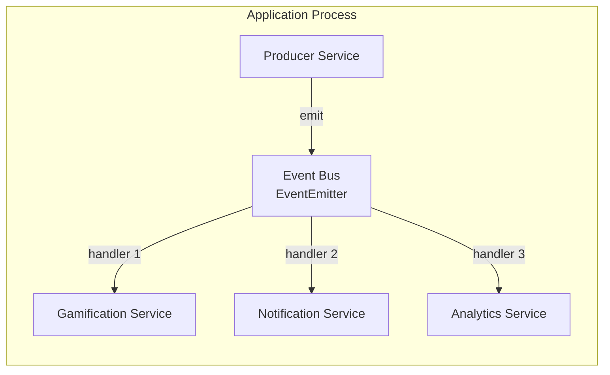
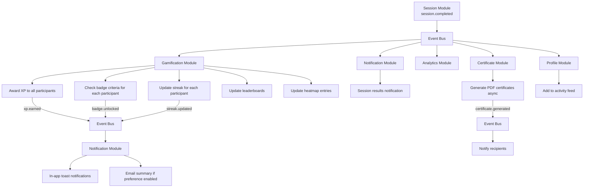

# 06 — Event Catalog

**Document ID:** AERO-EVT-006  
**Version:** 1.0  
**Last Updated:** 2026-07-16  
**Author:** Event Architect  
**Status:** Approved  
**Classification:** Internal — Engineering

---

## Table of Contents

1. [Purpose](#1-purpose)
2. [Event System Architecture](#2-event-system-architecture)
3. [Event Naming Convention](#3-event-naming-convention)
4. [Event Base Schema](#4-event-base-schema)
5. [Identity Events](#5-identity-events)
6. [Organization Events](#6-organization-events)
7. [Quiz Events](#7-quiz-events)
8. [Session Events](#8-session-events)
9. [Marketplace Events](#9-marketplace-events)
10. [Gamification Events](#10-gamification-events)
11. [Notification Events](#11-notification-events)
12. [Certificate Events](#12-certificate-events)
13. [Analytics Events](#13-analytics-events)
14. [Profile Events](#14-profile-events)
15. [System Events](#15-system-events)
16. [Event Flow Diagrams](#16-event-flow-diagrams)
17. [Retry & Error Handling](#17-retry--error-handling)
18. [Future Evolution](#18-future-evolution)
19. [References](#19-references)

---

## 1. Purpose

This document catalogs every domain event in the Aero MAGE platform. Domain events represent facts — things that have happened in the system. They are the primary mechanism for cross-module communication in the modular monolith.

Every event documents:
- **Producer** — Which module emits this event
- **Consumers** — Which modules subscribe to this event
- **Payload** — The data carried by the event
- **Trigger** — What action causes this event
- **Side Effects** — What happens when the event is consumed
- **Retry Strategy** — How failed event handling is managed

---

## 2. Event System Architecture

### 2.1 V1 — In-Process Event Bus

In V1, domain events are implemented using Node.js's built-in `EventEmitter` or a lightweight typed event bus. Events are **synchronous within the same process** but handled asynchronously via `setImmediate` or `process.nextTick` to avoid blocking the request.



### 2.2 V2 — Redis Pub/Sub

When scaling to multiple servers, events are broadcast via Redis pub/sub to all instances.

### 2.3 V3 — Message Broker

For microservice extraction, events are published to RabbitMQ or NATS for reliable, persistent event delivery.

### 2.4 Event Bus Interface

```typescript
interface EventBus {
  emit<T extends DomainEvent>(event: T): void;
  on<T extends DomainEvent>(eventName: string, handler: EventHandler<T>): void;
  off(eventName: string, handler: EventHandler): void;
}

interface DomainEvent {
  eventId: string;        // UUID - unique per event instance
  eventName: string;      // e.g., "session.completed"
  timestamp: string;      // ISO 8601
  version: number;        // Event schema version (default: 1)
  source: string;         // Module that emitted the event
  correlationId?: string; // For request tracing
  payload: Record<string, any>;
}
```

---

## 3. Event Naming Convention

```
{domain}.{action_in_past_tense}
```

| Element | Convention | Examples |
|---------|-----------|----------|
| Domain | Singular noun, lowercase | `user`, `quiz`, `session`, `marketplace` |
| Action | Past tense verb (it happened), lowercase with underscores | `created`, `completed`, `role_changed` |
| Full event | `domain.action` | `user.registered`, `session.completed`, `badge.unlocked` |

---

## 4. Event Base Schema

Every event carries a standardized envelope:

```json
{
  "eventId": "uuid-v4",
  "eventName": "session.completed",
  "timestamp": "2026-07-16T12:00:00.000Z",
  "version": 1,
  "source": "session-module",
  "correlationId": "request-uuid",
  "actor": {
    "userId": "uuid",
    "type": "user|system|scheduler"
  },
  "payload": { }
}
```

---

## 5. Identity Events

### 5.1 user.registered

| Field | Value |
|-------|-------|
| **Producer** | Identity Module (AuthService) |
| **Trigger** | User completes registration (email/password or Google OAuth) |
| **Consumers** | Gamification (create gamification profile), Notification (send welcome email), Analytics (track signup), Profile (create default profile) |

**Payload:**
```json
{
  "userId": "uuid",
  "email": "user@example.com",
  "displayName": "John Doe",
  "registrationMethod": "email|google",
  "referralSource": "string|null"
}
```

### 5.2 user.verified

| Field | Value |
|-------|-------|
| **Producer** | Identity Module (AuthService) |
| **Trigger** | User clicks email verification link |
| **Consumers** | Notification (send verification confirmation), Analytics (track verification rate) |

**Payload:**
```json
{
  "userId": "uuid",
  "verifiedAt": "ISO 8601"
}
```

### 5.3 user.login

| Field | Value |
|-------|-------|
| **Producer** | Identity Module (AuthService) |
| **Trigger** | Successful login (any method) |
| **Consumers** | Gamification (streak tracking, daily login XP), Analytics (track DAU) |

**Payload:**
```json
{
  "userId": "uuid",
  "loginMethod": "email|google",
  "ipAddress": "string",
  "userAgent": "string",
  "deviceType": "desktop|mobile|tablet"
}
```

### 5.4 user.logout

| Field | Value |
|-------|-------|
| **Producer** | Identity Module (AuthService) |
| **Trigger** | User logs out |
| **Consumers** | Analytics (track session duration) |

**Payload:**
```json
{
  "userId": "uuid",
  "sessionDuration": 3600
}
```

### 5.5 user.password_changed

| Field | Value |
|-------|-------|
| **Producer** | Identity Module (PasswordService) |
| **Trigger** | User changes password (via settings or reset) |
| **Consumers** | Notification (security alert email), Audit (log security event) |

**Payload:**
```json
{
  "userId": "uuid",
  "method": "settings|reset",
  "ipAddress": "string"
}
```

### 5.6 user.deactivated

| Field | Value |
|-------|-------|
| **Producer** | Identity Module (UserService) |
| **Trigger** | User deactivates their account |
| **Consumers** | Profile (hide profile), Gamification (freeze leaderboard position), Notification (send confirmation), Analytics |

**Payload:**
```json
{
  "userId": "uuid",
  "reason": "string|null",
  "scheduledDeletionDate": "ISO 8601"
}
```

---

## 6. Organization Events

### 6.1 organization.created

| Field | Value |
|-------|-------|
| **Producer** | Organization Module |
| **Trigger** | User creates a new organization |
| **Consumers** | Analytics, Audit |

**Payload:**
```json
{
  "organizationId": "uuid",
  "name": "string",
  "createdBy": "uuid"
}
```

### 6.2 organization.updated

| Field | Value |
|-------|-------|
| **Producer** | Organization Module |
| **Trigger** | Organization settings, branding, or limits updated |
| **Consumers** | Audit |

**Payload:**
```json
{
  "organizationId": "uuid",
  "updatedBy": "uuid",
  "changes": {
    "field": "string",
    "oldValue": "any",
    "newValue": "any"
  }
}
```

### 6.3 organization.deactivated

| Field | Value |
|-------|-------|
| **Producer** | Organization Module |
| **Trigger** | Organization is deactivated |
| **Consumers** | Notification (notify all members), Analytics, Audit |

**Payload:**
```json
{
  "organizationId": "uuid",
  "deactivatedBy": "uuid",
  "memberCount": 150,
  "scheduledDeletionDate": "ISO 8601"
}
```

### 6.4 department.created

| Field | Value |
|-------|-------|
| **Producer** | Organization Module |
| **Trigger** | New department created within organization |
| **Consumers** | Analytics, Audit |

**Payload:**
```json
{
  "departmentId": "uuid",
  "organizationId": "uuid",
  "name": "string",
  "createdBy": "uuid"
}
```

### 6.5 member.joined

| Field | Value |
|-------|-------|
| **Producer** | Organization Module |
| **Trigger** | User accepted invitation or join request approved |
| **Consumers** | Notification (welcome to org), Analytics |

**Payload:**
```json
{
  "organizationId": "uuid",
  "userId": "uuid",
  "departmentId": "uuid|null",
  "roleId": "uuid",
  "joinMethod": "invitation|join_request"
}
```

### 6.6 member.removed

| Field | Value |
|-------|-------|
| **Producer** | Organization Module |
| **Trigger** | Member removed by admin or left voluntarily |
| **Consumers** | Notification, Analytics, Audit |

**Payload:**
```json
{
  "organizationId": "uuid",
  "userId": "uuid",
  "removedBy": "uuid|self",
  "reason": "string|null"
}
```

### 6.7 member.role_changed

| Field | Value |
|-------|-------|
| **Producer** | Organization Module |
| **Trigger** | Member's role is changed within the organization |
| **Consumers** | Notification, Audit |

**Payload:**
```json
{
  "organizationId": "uuid",
  "userId": "uuid",
  "oldRoleId": "uuid",
  "newRoleId": "uuid",
  "changedBy": "uuid"
}
```

### 6.8 invitation.sent

| Field | Value |
|-------|-------|
| **Producer** | Organization Module |
| **Trigger** | Admin sends invitation |
| **Consumers** | Notification (send invitation email) |

**Payload:**
```json
{
  "invitationId": "uuid",
  "organizationId": "uuid",
  "inviteeEmail": "string",
  "invitedBy": "uuid",
  "roleId": "uuid",
  "expiresAt": "ISO 8601"
}
```

### 6.9 invitation.accepted

| Field | Value |
|-------|-------|
| **Producer** | Organization Module |
| **Trigger** | Invitee accepts invitation |
| **Consumers** | Notification (notify inviter), Analytics |

**Payload:**
```json
{
  "invitationId": "uuid",
  "organizationId": "uuid",
  "userId": "uuid",
  "acceptedAt": "ISO 8601"
}
```

---

## 7. Quiz Events

### 7.1 quiz.created

| Field | Value |
|-------|-------|
| **Producer** | Quiz Module |
| **Trigger** | User creates a new quiz |
| **Consumers** | Gamification (XP for creation), Analytics, Profile (activity feed) |

**Payload:**
```json
{
  "quizId": "uuid",
  "title": "string",
  "createdBy": "uuid",
  "organizationId": "uuid|null",
  "departmentId": "uuid|null",
  "visibility": "private|department|organization|public",
  "questionCount": 0
}
```

### 7.2 quiz.updated

| Field | Value |
|-------|-------|
| **Producer** | Quiz Module |
| **Trigger** | Quiz settings, questions, or content updated |
| **Consumers** | Analytics, Audit |

**Payload:**
```json
{
  "quizId": "uuid",
  "updatedBy": "uuid",
  "changes": ["title", "questions", "settings"]
}
```

### 7.3 quiz.published

| Field | Value |
|-------|-------|
| **Producer** | Quiz Module |
| **Trigger** | Quiz state changes to published |
| **Consumers** | Analytics, Search (index for discovery) |

**Payload:**
```json
{
  "quizId": "uuid",
  "publishedBy": "uuid",
  "questionCount": 15,
  "visibility": "public"
}
```

### 7.4 quiz.archived

| Field | Value |
|-------|-------|
| **Producer** | Quiz Module |
| **Trigger** | Quiz is archived |
| **Consumers** | Search (remove from index), Analytics |

**Payload:**
```json
{
  "quizId": "uuid",
  "archivedBy": "uuid"
}
```

### 7.5 quiz.deleted

| Field | Value |
|-------|-------|
| **Producer** | Quiz Module |
| **Trigger** | Quiz is soft-deleted |
| **Consumers** | Search (remove from index), Marketplace (unpublish listing), Analytics, Audit |

**Payload:**
```json
{
  "quizId": "uuid",
  "deletedBy": "uuid",
  "hadMarketplaceListing": true,
  "scheduledPurgeDate": "ISO 8601"
}
```

### 7.6 question.created

| Field | Value |
|-------|-------|
| **Producer** | Quiz Module |
| **Trigger** | Question added to a quiz or question bank |
| **Consumers** | Analytics |

**Payload:**
```json
{
  "questionId": "uuid",
  "quizId": "uuid|null",
  "type": "single_choice|multiple_choice|...",
  "createdBy": "uuid"
}
```

---

## 8. Session Events

### 8.1 session.created

| Field | Value |
|-------|-------|
| **Producer** | Session Module |
| **Consumers** | Analytics |

**Payload:**
```json
{
  "sessionId": "uuid",
  "quizId": "uuid",
  "hostUserId": "uuid",
  "roomCode": "ABC123",
  "mode": "live|practice|flash|team_battle|tournament",
  "maxParticipants": 500,
  "settings": {
    "allowLateJoin": true,
    "showLeaderboard": true,
    "xpMultiplier": 1.0
  }
}
```

### 8.2 session.started

| Field | Value |
|-------|-------|
| **Producer** | Session Module |
| **Consumers** | Analytics |

**Payload:**
```json
{
  "sessionId": "uuid",
  "participantCount": 42,
  "questionCount": 15,
  "startedAt": "ISO 8601"
}
```

### 8.3 session.paused

| Field | Value |
|-------|-------|
| **Producer** | Session Module |
| **Consumers** | Analytics |

**Payload:**
```json
{
  "sessionId": "uuid",
  "pausedAt": "ISO 8601",
  "currentQuestionIndex": 5,
  "remainingTime": 18
}
```

### 8.4 session.resumed

| Field | Value |
|-------|-------|
| **Producer** | Session Module |
| **Consumers** | Analytics |

**Payload:**
```json
{
  "sessionId": "uuid",
  "resumedAt": "ISO 8601",
  "pauseDuration": 120
}
```

### 8.5 session.completed ⭐

This is the most important event in the system. It triggers XP awards, badge checks, certificate generation, notifications, and analytics.

| Field | Value |
|-------|-------|
| **Producer** | Session Module |
| **Consumers** | Gamification (award XP, check badges, update streaks), Notification (session results), Analytics (record all metrics), Certificate (generate if configured), Profile (update activity feed) |

**Payload:**
```json
{
  "sessionId": "uuid",
  "quizId": "uuid",
  "hostUserId": "uuid",
  "mode": "live",
  "completedAt": "ISO 8601",
  "duration": 1800,
  "questionCount": 15,
  "participantCount": 42,
  "averageScore": 7500,
  "averageAccuracy": 0.72,
  "results": [
    {
      "userId": "uuid|null",
      "guestNickname": "string|null",
      "isGuest": false,
      "rank": 1,
      "totalScore": 12500,
      "correctAnswers": 13,
      "totalQuestions": 15,
      "accuracy": 0.87,
      "averageResponseTime": 8.5,
      "xpEarned": 250
    }
  ],
  "certificateConfig": {
    "enabled": true,
    "types": ["participation", "winner"]
  },
  "xpMultiplier": 1.0
}
```

### 8.6 session.abandoned

| Field | Value |
|-------|-------|
| **Producer** | Session Module (via scheduler/timeout) |
| **Consumers** | Analytics, Notification (notify participants) |

**Payload:**
```json
{
  "sessionId": "uuid",
  "hostUserId": "uuid",
  "lastActivityAt": "ISO 8601",
  "participantCount": 30,
  "questionsCompleted": 8,
  "totalQuestions": 15
}
```

### 8.7 participant.joined

| Field | Value |
|-------|-------|
| **Producer** | Session Module |
| **Consumers** | Analytics |

**Payload:**
```json
{
  "sessionId": "uuid",
  "userId": "uuid|null",
  "guestNickname": "string|null",
  "isGuest": false,
  "joinedAt": "ISO 8601",
  "currentParticipantCount": 43
}
```

### 8.8 participant.left

| Field | Value |
|-------|-------|
| **Producer** | Session Module |
| **Consumers** | Analytics |

**Payload:**
```json
{
  "sessionId": "uuid",
  "userId": "uuid|null",
  "reason": "voluntary|disconnected|kicked",
  "questionsAnswered": 8,
  "currentParticipantCount": 41
}
```

### 8.9 answer.submitted

| Field | Value |
|-------|-------|
| **Producer** | Session Module |
| **Consumers** | Analytics (real-time question analytics) |

**Payload:**
```json
{
  "sessionId": "uuid",
  "questionId": "uuid",
  "userId": "uuid|null",
  "isCorrect": true,
  "pointsAwarded": 950,
  "responseTime": 5.2,
  "questionIndex": 3
}
```

### 8.10 leaderboard.updated

| Field | Value |
|-------|-------|
| **Producer** | Session Module (ScoringEngine) |
| **Consumers** | Analytics |

**Payload:**
```json
{
  "sessionId": "uuid",
  "questionIndex": 5,
  "topEntries": [
    {"userId": "uuid", "rank": 1, "totalScore": 5200},
    {"userId": "uuid", "rank": 2, "totalScore": 4800},
    {"userId": "uuid", "rank": 3, "totalScore": 4500}
  ],
  "totalParticipants": 42
}
```

---

## 9. Marketplace Events

### 9.1 marketplace.published

| Field | Value |
|-------|-------|
| **Producer** | Marketplace Module |
| **Consumers** | Gamification (XP for publishing), Notification (notify followers), Analytics, Search (index listing) |

**Payload:**
```json
{
  "listingId": "uuid",
  "quizId": "uuid",
  "creatorUserId": "uuid",
  "title": "string",
  "category": "string",
  "tags": ["tag1", "tag2"],
  "questionCount": 15,
  "difficulty": "medium"
}
```

### 9.2 marketplace.cloned

| Field | Value |
|-------|-------|
| **Producer** | Marketplace Module |
| **Consumers** | Gamification (XP for creator), Notification (notify creator), Analytics |

**Payload:**
```json
{
  "listingId": "uuid",
  "originalQuizId": "uuid",
  "clonedQuizId": "uuid",
  "clonedBy": "uuid",
  "creatorUserId": "uuid",
  "totalClones": 156
}
```

### 9.3 marketplace.rated

| Field | Value |
|-------|-------|
| **Producer** | Marketplace Module |
| **Consumers** | Notification (notify creator), Analytics, Search (update ranking score) |

**Payload:**
```json
{
  "listingId": "uuid",
  "ratedBy": "uuid",
  "rating": 4,
  "previousRating": null,
  "newAverageRating": 4.2,
  "totalRatings": 45
}
```

### 9.4 marketplace.reported

| Field | Value |
|-------|-------|
| **Producer** | Marketplace Module |
| **Consumers** | Analytics, Audit |

**Payload:**
```json
{
  "listingId": "uuid",
  "reportedBy": "uuid",
  "reason": "inappropriate|spam|copyright|other",
  "description": "string|null",
  "totalReports": 3,
  "threshold": 5
}
```

### 9.5 marketplace.hidden

| Field | Value |
|-------|-------|
| **Producer** | Marketplace Module (auto or moderator) |
| **Consumers** | Notification (notify creator), Search (remove from index), Analytics |

**Payload:**
```json
{
  "listingId": "uuid",
  "creatorUserId": "uuid",
  "reason": "auto_threshold|moderator_action",
  "reportCount": 5
}
```

### 9.6 marketplace.removed

| Field | Value |
|-------|-------|
| **Producer** | Marketplace Module (moderator) |
| **Consumers** | Notification (notify creator with reason), Analytics, Audit |

**Payload:**
```json
{
  "listingId": "uuid",
  "creatorUserId": "uuid",
  "removedBy": "uuid",
  "reason": "string",
  "creatorViolationCount": 2
}
```

---

## 10. Gamification Events

### 10.1 xp.earned

| Field | Value |
|-------|-------|
| **Producer** | Gamification Module |
| **Consumers** | Notification (XP earned toast), Profile (update XP display), Analytics |

**Payload:**
```json
{
  "userId": "uuid",
  "amount": 250,
  "source": "session_completion|quiz_creation|marketplace_publish|daily_login",
  "breakdown": {
    "base": 100,
    "accuracyBonus": 80,
    "speedBonus": 40,
    "streakBonus": 30
  },
  "dailyTotal": 1250,
  "dailyCap": 5000,
  "totalXp": 15750
}
```

### 10.2 level.up

| Field | Value |
|-------|-------|
| **Producer** | Gamification Module |
| **Consumers** | Notification (level up celebration), Profile (update level display), Analytics |

**Payload:**
```json
{
  "userId": "uuid",
  "previousLevel": 4,
  "newLevel": 5,
  "totalXp": 15750,
  "nextLevelXp": 22500,
  "rewards": ["title:Rising Star"]
}
```

### 10.3 badge.unlocked

| Field | Value |
|-------|-------|
| **Producer** | Gamification Module |
| **Consumers** | Notification (badge unlocked celebration), Profile (update badges), Analytics |

**Payload:**
```json
{
  "userId": "uuid",
  "badgeId": "uuid",
  "badgeName": "Quiz Enthusiast",
  "badgeCategory": "participation",
  "badgeRarity": "uncommon",
  "criteria": "Complete 50 quizzes",
  "unlockedAt": "ISO 8601"
}
```

### 10.4 achievement.unlocked

| Field | Value |
|-------|-------|
| **Producer** | Gamification Module |
| **Consumers** | Notification, Profile, Analytics |

**Payload:**
```json
{
  "userId": "uuid",
  "achievementId": "uuid",
  "achievementName": "Century Club",
  "tier": 3,
  "maxTier": 5,
  "description": "Complete 100 quizzes"
}
```

### 10.5 streak.updated

| Field | Value |
|-------|-------|
| **Producer** | Gamification Module |
| **Consumers** | Notification (streak milestone), Analytics |

**Payload:**
```json
{
  "userId": "uuid",
  "currentStreak": 7,
  "longestStreak": 15,
  "streakMultiplier": 1.2,
  "isMilestone": true,
  "milestoneType": "week"
}
```

### 10.6 streak.broken

| Field | Value |
|-------|-------|
| **Producer** | Gamification Module (via scheduler) |
| **Consumers** | Notification (streak lost warning), Analytics |

**Payload:**
```json
{
  "userId": "uuid",
  "brokenStreak": 12,
  "longestStreak": 15,
  "lastActivityDate": "2026-07-14"
}
```

---

## 11. Notification Events

### 11.1 notification.created

| Field | Value |
|-------|-------|
| **Producer** | Notification Module |
| **Consumers** | Analytics |

**Payload:**
```json
{
  "notificationId": "uuid",
  "userId": "uuid",
  "type": "session_result|badge_unlocked|org_invite|...",
  "channel": "in_app",
  "title": "string",
  "body": "string"
}
```

### 11.2 email.sent

| Field | Value |
|-------|-------|
| **Producer** | Notification Module (EmailService) |
| **Consumers** | Analytics |

**Payload:**
```json
{
  "emailId": "uuid",
  "to": "user@example.com",
  "subject": "string",
  "templateId": "uuid",
  "smtpConfig": "system|organization",
  "sentAt": "ISO 8601"
}
```

### 11.3 email.failed

| Field | Value |
|-------|-------|
| **Producer** | Notification Module (EmailService) |
| **Consumers** | Analytics, Audit |

**Payload:**
```json
{
  "emailId": "uuid",
  "to": "user@example.com",
  "error": "SMTP connection refused",
  "attemptNumber": 2,
  "maxAttempts": 3,
  "nextRetryAt": "ISO 8601"
}
```

---

## 12. Certificate Events

### 12.1 certificate.generated

| Field | Value |
|-------|-------|
| **Producer** | Certificate Module |
| **Consumers** | Notification (certificate ready), Analytics |

**Payload:**
```json
{
  "certificateId": "uuid",
  "sessionId": "uuid",
  "userId": "uuid",
  "type": "participation|completion|winner|runner_up",
  "verificationId": "uuid",
  "filePath": "string",
  "generatedAt": "ISO 8601"
}
```

### 12.2 certificate.revoked

| Field | Value |
|-------|-------|
| **Producer** | Certificate Module |
| **Consumers** | Notification (notify holder), Audit |

**Payload:**
```json
{
  "certificateId": "uuid",
  "revokedBy": "uuid",
  "reason": "string",
  "revokedAt": "ISO 8601"
}
```

---

## 13. Analytics Events

### 13.1 report.generated

| Field | Value |
|-------|-------|
| **Producer** | Analytics Module |
| **Consumers** | Notification (report ready for download) |

**Payload:**
```json
{
  "reportId": "uuid",
  "requestedBy": "uuid",
  "type": "quiz_analytics|org_analytics|system_analytics",
  "format": "csv|pdf",
  "dateRange": {"start": "ISO 8601", "end": "ISO 8601"},
  "filePath": "string"
}
```

---

## 14. Profile Events

### 14.1 user.followed

| Field | Value |
|-------|-------|
| **Producer** | Profile Module |
| **Consumers** | Notification (notify followed user), Analytics |

**Payload:**
```json
{
  "followerId": "uuid",
  "followedId": "uuid",
  "followerDisplayName": "string",
  "followedTotalFollowers": 125
}
```

### 14.2 user.unfollowed

| Field | Value |
|-------|-------|
| **Producer** | Profile Module |
| **Consumers** | Analytics |

**Payload:**
```json
{
  "followerId": "uuid",
  "unfollowedId": "uuid"
}
```

---

## 15. System Events

### 15.1 system.config_changed

| Field | Value |
|-------|-------|
| **Producer** | Configuration Module |
| **Consumers** | All modules (hot-reload config) |

**Payload:**
```json
{
  "key": "max_questions_per_quiz",
  "oldValue": 100,
  "newValue": 150,
  "changedBy": "uuid",
  "scope": "system|organization",
  "organizationId": "uuid|null"
}
```

### 15.2 system.feature_flag_changed

| Field | Value |
|-------|-------|
| **Producer** | Configuration Module |
| **Consumers** | All modules (check feature availability) |

**Payload:**
```json
{
  "flagName": "tournaments",
  "oldState": "disabled",
  "newState": "enabled",
  "changedBy": "uuid"
}
```

### 15.3 system.maintenance_scheduled

| Field | Value |
|-------|-------|
| **Producer** | Admin Module |
| **Consumers** | Notification (notify all active users) |

**Payload:**
```json
{
  "scheduledAt": "ISO 8601",
  "estimatedDuration": 3600,
  "reason": "Database migration"
}
```

---

## 16. Event Flow Diagrams

### 16.1 Session Completion Event Flow



---

## 17. Retry & Error Handling

### 17.1 Error Handling Strategy

| Scenario | Strategy |
|----------|----------|
| Event handler throws error | Error is logged; event is marked as failed; does NOT affect other handlers |
| Critical event handler fails (e.g., XP award) | Retry with exponential backoff (3 attempts) |
| Non-critical event handler fails (e.g., analytics) | Log error; continue; no retry |
| All retries exhausted | Event moved to dead letter queue (DLQ); alert triggered |

### 17.2 Event Handler Classification

| Type | Description | Retry | Examples |
|------|-------------|-------|---------|
| **Critical** | Business-affecting; must succeed | Yes (3 retries) | XP award, badge unlock, certificate generation |
| **Important** | Should succeed; temporary failure acceptable | Yes (2 retries) | Email notification, leaderboard update |
| **Best-effort** | Nice to have; failure is acceptable | No | Analytics event, activity feed |

### 17.3 Dead Letter Queue (V2+)

Failed events that exhaust retries are stored in a `dead_letter_event` table:

```json
{
  "id": "uuid",
  "eventName": "session.completed",
  "eventPayload": {},
  "failedHandler": "gamification.awardXP",
  "error": "Database connection timeout",
  "attempts": 3,
  "createdAt": "ISO 8601",
  "resolvedAt": null
}
```

---

## 18. Future Evolution

### 18.1 V2: Redis Pub/Sub

- Events are published to Redis channels
- All Node.js instances receive events
- Enables multi-server event processing

### 18.2 V3: Message Broker

- Events are published to RabbitMQ/NATS
- Persistent event storage
- Consumer groups for load balancing
- Dead letter exchanges for failed events
- Event replay capability
- Schema registry for event versioning

---

## 19. References

| Document | Relationship |
|----------|-------------|
| [05-domain-driven-design.md](./05-domain-driven-design.md) | Domain boundaries producing events |
| [04-system-architecture.md](./04-system-architecture.md) | Event bus in architecture |
| [09-backend-architecture.md](./09-backend-architecture.md) | Event bus implementation |
| [38-websocket-events.md](./38-websocket-events.md) | WebSocket events (different from domain events) |
| [43-scheduler-background-jobs.md](./43-scheduler-background-jobs.md) | Scheduled jobs that emit events |

---

*End of Document — AERO-EVT-006 v1.0*
