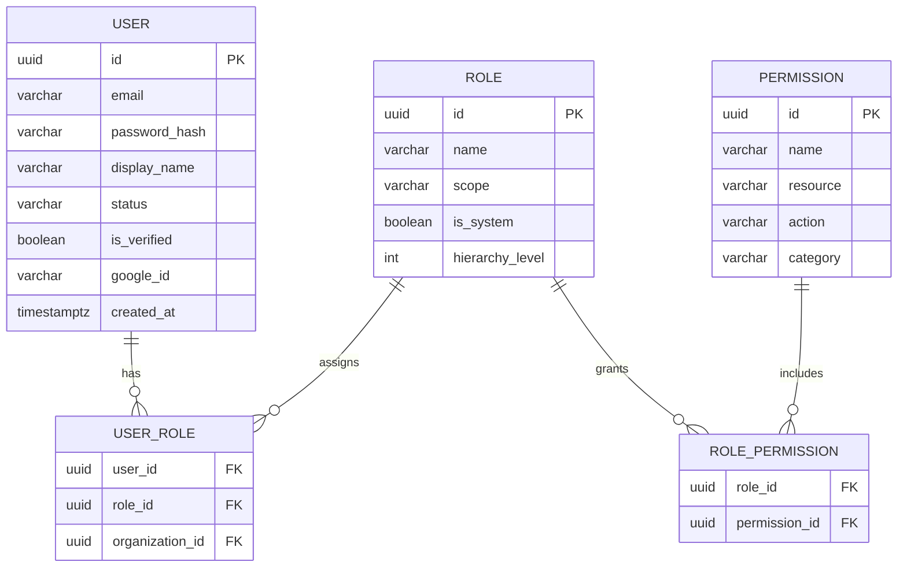
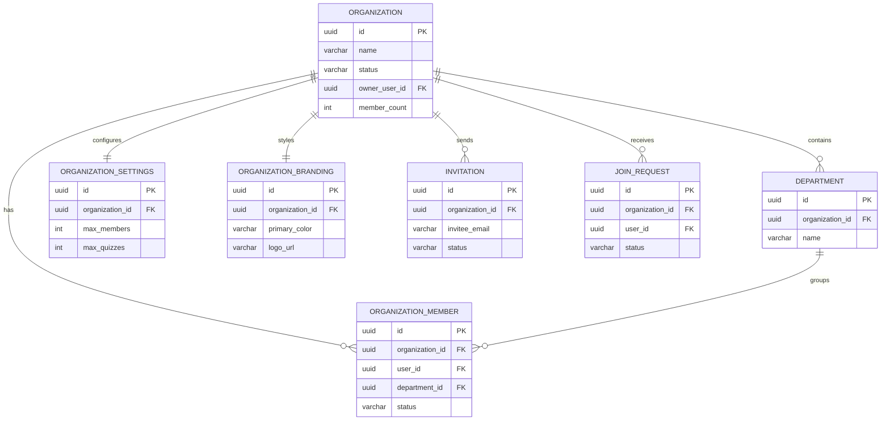
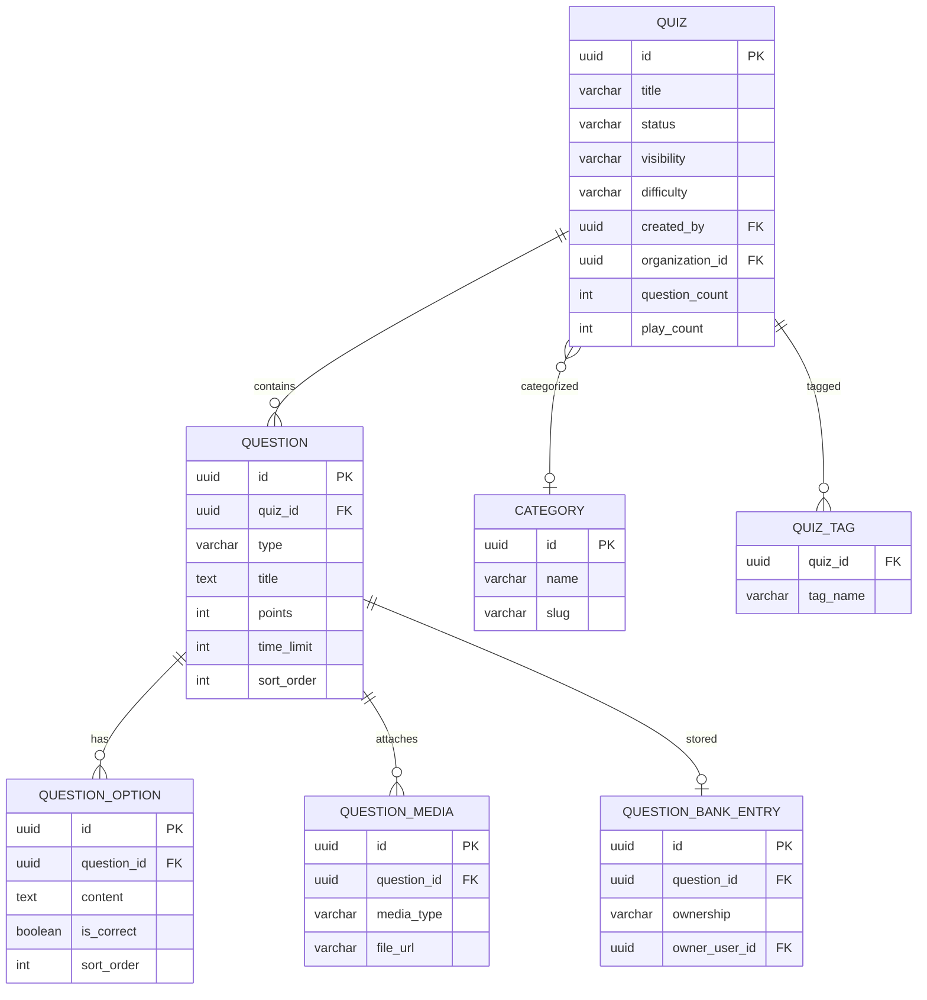
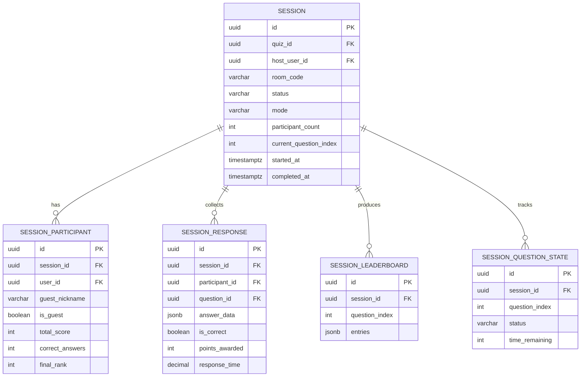
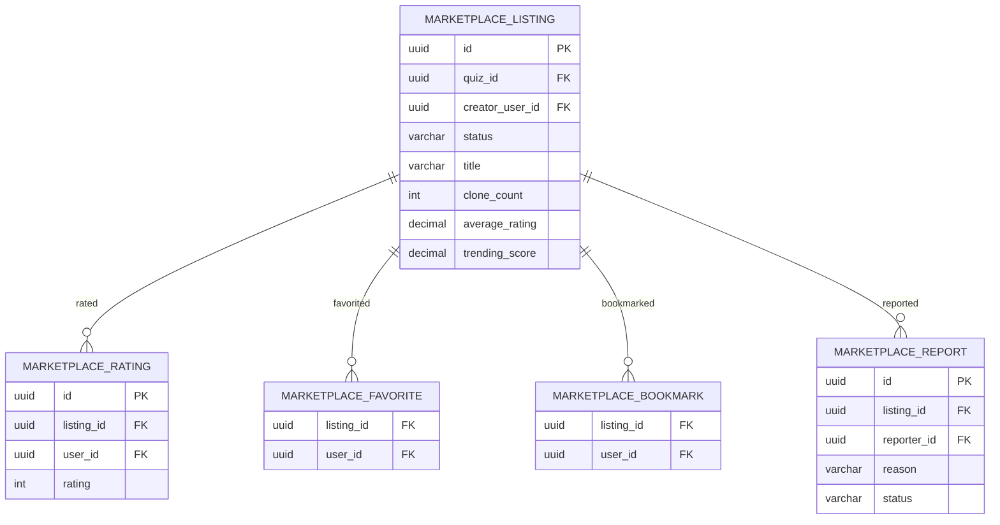
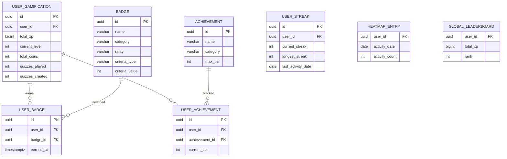
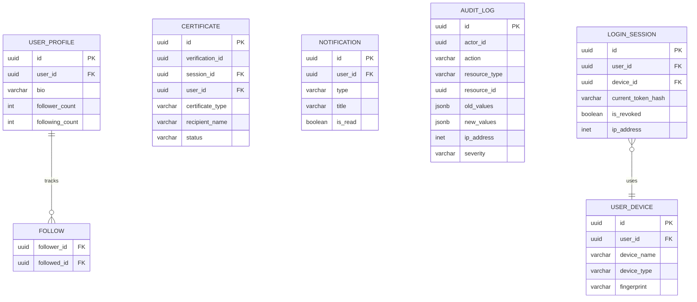
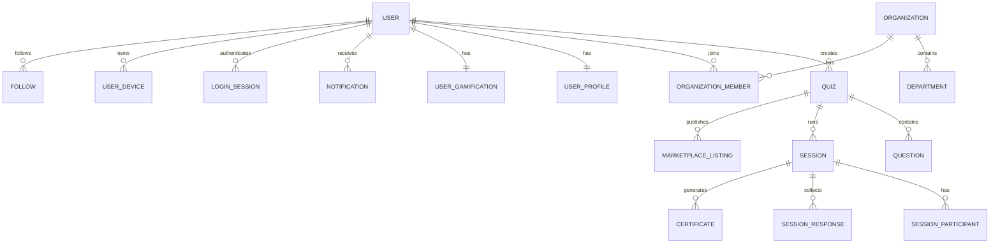
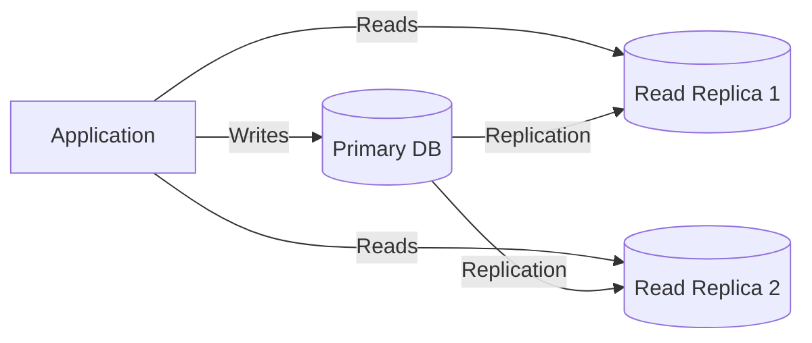

# 07 — Database Design & Architecture

**Document ID:** AERO-DB-007  
**Version:** 1.0  
**Last Updated:** 2026-07-16  
**Author:** Senior Database Architect  
**Status:** Approved  
**Classification:** Internal — Engineering

---

## Table of Contents

1. [Purpose](#1-purpose)
2. [Database Philosophy & Principles](#2-database-philosophy--principles)
3. [Naming Conventions](#3-naming-conventions)
4. [UUID Strategy](#4-uuid-strategy)
5. [Soft Delete Strategy](#5-soft-delete-strategy)
6. [Audit Column Strategy](#6-audit-column-strategy)
7. [ER Diagram — Full System](#7-er-diagram--full-system)
8. [Schema: Identity & Access (RBAC)](#8-schema-identity--access-rbac)
9. [Schema: Organization](#9-schema-organization)
10. [Schema: Quiz & Questions](#10-schema-quiz--questions)
11. [Schema: Live Sessions](#11-schema-live-sessions)
12. [Schema: Marketplace](#12-schema-marketplace)
13. [Schema: Gamification](#13-schema-gamification)
14. [Schema: Profile & Social](#14-schema-profile--social)
15. [Schema: Certificates](#15-schema-certificates)
16. [Schema: Analytics](#16-schema-analytics)
17. [Schema: Notifications](#17-schema-notifications)
18. [Schema: Platform Configuration](#18-schema-platform-configuration)
19. [Schema: Audit & Compliance](#19-schema-audit--compliance)
20. [Schema: File Storage](#20-schema-file-storage)
21. [Schema: Search](#21-schema-search)
22. [Index Strategy & Optimization](#22-index-strategy--optimization)
23. [Query Optimization Patterns](#23-query-optimization-patterns)
24. [Materialized Views](#24-materialized-views)
25. [Database Triggers](#25-database-triggers)
26. [Partitioning Strategy](#26-partitioning-strategy)
27. [Connection Pooling](#27-connection-pooling)
28. [Migration Strategy](#28-migration-strategy)
29. [Sample Records](#29-sample-records)
30. [Performance Benchmarks & Targets](#30-performance-benchmarks--targets)
31. [Future Scaling Strategy](#31-future-scaling-strategy)
32. [References](#32-references)

---

## 1. Purpose

This document is the **complete PostgreSQL database design** for Aero MAGE. It defines every table, column, constraint, index, trigger, view, and optimization strategy. This document is written from the perspective of a Senior Database Architect designing for an enterprise SaaS platform that must scale from 1,000 users to millions.

Every design decision is justified. Every table is normalized appropriately (3NF minimum, with intentional denormalization where performance demands it). Every query path is considered and indexed.

**Database:** PostgreSQL 15+  
**Character Set:** UTF-8 (utf8mb4 equivalent)  
**Timezone:** All timestamps stored in UTC  
**Total Tables:** 65+

---

## 2. Database Philosophy & Principles

| Principle | Implementation |
|-----------|----------------|
| **UUIDs as Primary Keys** | Every table uses `UUID` (v4) as its primary key. No sequential IDs exposed externally. Internal auto-increment `id` (BIGSERIAL) used ONLY as a clustered index for performance. |
| **Soft Delete** | Every entity table has a `deleted_at TIMESTAMPTZ NULL` column. Records are never physically deleted by application code. A scheduler handles permanent purges. |
| **Audit Columns** | Every table has `created_at`, `updated_at`, `created_by`, `updated_by`. |
| **Optimistic Locking** | Tables with concurrent updates have a `version INTEGER DEFAULT 1` column for conflict detection. |
| **Referential Integrity** | Foreign keys are enforced at the database level. No orphaned records. |
| **Normalization** | 3NF minimum. Denormalization only for read-heavy analytics with documented justification. |
| **Enum via Lookup Tables** | Status values and types use VARCHAR(50), NOT database ENUMs. This allows adding new values without schema migrations. |
| **Snake_case Everything** | Tables, columns, indexes, constraints — all snake_case. |
| **Singular Table Names** | `user`, `quiz`, `session` — not `users`, `quizzes`, `sessions`. |
| **Explicit NOT NULL** | Every column is explicitly `NOT NULL` unless NULL has a defined semantic meaning. |
| **Default Values** | Every column has a sensible default where applicable. |
| **Constraint Naming** | All constraints are explicitly named: `pk_`, `fk_`, `uq_`, `ck_`, `idx_`. |

---

## 3. Naming Conventions

| Element | Convention | Example |
|---------|-----------|---------|
| Table | snake_case, singular | `user`, `quiz`, `live_session` |
| Column | snake_case | `created_at`, `display_name`, `is_active` |
| Primary Key | `id` (UUID), `pk_{table}` | `pk_user` |
| Internal ID | `internal_id` (BIGSERIAL, not exposed) | Used for joins/clustering |
| Foreign Key | `{referenced_table}_id` | `user_id`, `quiz_id`, `organization_id` |
| FK Constraint | `fk_{table}_{referenced_table}` | `fk_quiz_user` |
| Unique Constraint | `uq_{table}_{column(s)}` | `uq_user_email` |
| Check Constraint | `ck_{table}_{column}` | `ck_user_status` |
| Index | `idx_{table}_{column(s)}` | `idx_quiz_created_by` |
| Composite Index | `idx_{table}_{col1}_{col2}` | `idx_session_response_session_question` |
| Boolean Columns | `is_` or `has_` prefix | `is_active`, `is_verified`, `has_password` |
| Timestamp Columns | `_at` suffix | `created_at`, `deleted_at`, `verified_at` |
| Count Columns | `_count` suffix | `follower_count`, `clone_count` |
| Junction Tables | `{table1}_{table2}` | `user_role`, `role_permission`, `quiz_tag` |

---

## 4. UUID Strategy

### 4.1 Why UUIDs

| Reason | Explanation |
|--------|-------------|
| **Security** | Sequential IDs expose record count and allow enumeration attacks (`/api/users/1`, `/api/users/2`, ...) |
| **Distributed Safety** | UUIDs can be generated without database coordination, enabling future sharding |
| **Merge Safety** | Data from different environments can be merged without ID conflicts |
| **Privacy** | No information leakage about creation order or volume |

### 4.2 UUID Version

- Use **UUIDv4** (random) for general purpose
- Generated in application code (`crypto.randomUUID()` in Node.js) — not by the database
- Stored as PostgreSQL native `UUID` type (16 bytes, more efficient than VARCHAR(36))

### 4.3 Performance Consideration: Internal IDs

UUIDv4 are random, which causes B-tree index fragmentation. To mitigate:

- Every table has a `internal_id BIGSERIAL` column as the **actual clustered primary key**
- The `id UUID` column is a **unique secondary index**
- Foreign keys reference `id (UUID)` for application use
- Joins use `id (UUID)` since PostgreSQL handles this efficiently with proper indexing
- `internal_id` is NEVER exposed via API — it's purely for database-internal ordering

```sql
CREATE TABLE example (
    internal_id BIGSERIAL PRIMARY KEY,  -- Clustered, sequential, fast inserts
    id UUID NOT NULL DEFAULT gen_random_uuid(),  -- Application-facing ID
    -- ... other columns
    CONSTRAINT uq_example_id UNIQUE (id)
);
```

---

## 5. Soft Delete Strategy

### 5.1 Implementation

Every entity table includes:

```sql
deleted_at TIMESTAMPTZ NULL DEFAULT NULL
```

- `NULL` → Record is active
- `NOT NULL` → Record is soft-deleted (timestamp records when)

### 5.2 Query Convention

All queries MUST include the soft-delete filter unless explicitly querying deleted records:

```sql
-- Standard query (active records only)
SELECT * FROM quiz WHERE deleted_at IS NULL AND ...

-- Admin query (include deleted)
SELECT * FROM quiz WHERE ...

-- Restore
UPDATE quiz SET deleted_at = NULL WHERE id = $1
```

### 5.3 Partial Index for Performance

```sql
-- Only index active records for most queries
CREATE INDEX idx_quiz_active_created_by ON quiz (created_by) WHERE deleted_at IS NULL;
```

### 5.4 Cascade Rules

When a parent entity is soft-deleted:
- Child entities are NOT automatically soft-deleted
- Queries filter by parent's `deleted_at` status via JOIN
- Exception: When an organization is deactivated, all members lose access (checked via org status, not member soft-delete)

### 5.5 Permanent Deletion (Purge)

A scheduled job runs nightly to permanently delete records where:
- `deleted_at < NOW() - INTERVAL '30 days'` (configurable per entity)
- Permanent deletion cascades to all associated records and files

---

## 6. Audit Column Strategy

Every table includes these standard audit columns:

```sql
created_at  TIMESTAMPTZ NOT NULL DEFAULT NOW(),
updated_at  TIMESTAMPTZ NOT NULL DEFAULT NOW(),
created_by  UUID NULL REFERENCES "user"(id),  -- NULL for system-created records
updated_by  UUID NULL REFERENCES "user"(id)
```

An `updated_at` trigger automatically updates the timestamp on every UPDATE:

```sql
CREATE OR REPLACE FUNCTION trigger_set_updated_at()
RETURNS TRIGGER AS $$
BEGIN
    NEW.updated_at = NOW();
    RETURN NEW;
END;
$$ LANGUAGE plpgsql;
```

---

## 7. ER Diagram — Full System

### 7.1 Core Entity Relationships



### 7.1.2 Organization Domain



### 7.1.3 Quiz & Question Domain



### 7.1.4 Live Session Domain



### 7.1.5 Marketplace Domain



### 7.1.6 Gamification Domain



### 7.1.7 Profile, Certificate, Notification & System Domain



### 7.1.8 Cross-Domain Relationships (Overview)



### 7.2 Full Table Count by Domain

| Domain | Tables | Key Tables |
|--------|--------|------------|
| Identity & RBAC | 8 | user, role, permission, role_permission, user_role, refresh_token, email_verification_token, password_reset_token |
| Organization | 7 | organization, department, organization_member, organization_settings, organization_branding, invitation, join_request |
| Quiz & Questions | 7 | quiz, question, question_option, question_media, question_bank_entry, quiz_tag, category |
| Live Sessions | 5 | session, session_participant, session_response, session_leaderboard, session_question_state |
| Marketplace | 7 | marketplace_listing, marketplace_rating, marketplace_favorite, marketplace_bookmark, marketplace_report, marketplace_collection, marketplace_collection_item |
| Gamification | 11 | user_gamification, badge, achievement, user_badge, user_achievement, user_streak, global_leaderboard, season_leaderboard, heatmap_entry, coin_transaction, weekly_challenge |
| Profile & Social | 3 | user_profile, follow, activity_feed |
| Certificates | 2 | certificate, certificate_template |
| Analytics | 4 | analytics_event, analytics_daily, analytics_monthly, scheduled_report |
| Notifications | 4 | notification, notification_template, notification_preference, email_queue |
| Configuration | 2 | system_config, feature_flag |
| Audit | 2 | audit_log, login_history |
| File Storage | 1 | file_upload |
| Search | 1 | search_index |
| **Total** | **64** | |

---

## 8. Schema: Identity & Access (RBAC)

### 8.1 Table: `user`

The central user entity. This is the most referenced table in the system.

```sql
CREATE TABLE "user" (
    internal_id     BIGSERIAL PRIMARY KEY,
    id              UUID NOT NULL DEFAULT gen_random_uuid(),
    email           VARCHAR(255) NOT NULL,
    email_lower     VARCHAR(255) NOT NULL GENERATED ALWAYS AS (LOWER(email)) STORED,
    password_hash   VARCHAR(255) NULL,  -- NULL for Google-only users
    display_name    VARCHAR(50) NOT NULL,
    avatar_url      VARCHAR(500) NULL,
    status          VARCHAR(20) NOT NULL DEFAULT 'unverified',
        -- Values: unverified, active, locked, deactivated, suspended
    is_verified     BOOLEAN NOT NULL DEFAULT FALSE,
    has_password    BOOLEAN NOT NULL DEFAULT FALSE,
    google_id       VARCHAR(100) NULL,
    country         VARCHAR(2) NULL,  -- ISO 3166-1 alpha-2
    timezone        VARCHAR(50) NULL DEFAULT 'UTC',
    last_login_at   TIMESTAMPTZ NULL,
    locked_until    TIMESTAMPTZ NULL,
    failed_login_attempts INTEGER NOT NULL DEFAULT 0,
    deactivated_at  TIMESTAMPTZ NULL,
    version         INTEGER NOT NULL DEFAULT 1,  -- Optimistic locking
    deleted_at      TIMESTAMPTZ NULL,
    created_at      TIMESTAMPTZ NOT NULL DEFAULT NOW(),
    updated_at      TIMESTAMPTZ NOT NULL DEFAULT NOW(),

    CONSTRAINT uq_user_id UNIQUE (id),
    CONSTRAINT uq_user_email_lower UNIQUE (email_lower),
    CONSTRAINT uq_user_google_id UNIQUE (google_id),
    CONSTRAINT ck_user_status CHECK (status IN ('unverified', 'active', 'locked', 'deactivated', 'suspended')),
    CONSTRAINT ck_user_display_name_length CHECK (LENGTH(display_name) BETWEEN 2 AND 50)
);

-- Indexes
CREATE INDEX idx_user_email_lower ON "user" (email_lower) WHERE deleted_at IS NULL;
CREATE INDEX idx_user_status ON "user" (status) WHERE deleted_at IS NULL;
CREATE INDEX idx_user_google_id ON "user" (google_id) WHERE google_id IS NOT NULL AND deleted_at IS NULL;
CREATE INDEX idx_user_display_name ON "user" USING gin (display_name gin_trgm_ops) WHERE deleted_at IS NULL;
CREATE INDEX idx_user_created_at ON "user" (created_at DESC) WHERE deleted_at IS NULL;
CREATE INDEX idx_user_country ON "user" (country) WHERE country IS NOT NULL AND deleted_at IS NULL;

-- Trigger
CREATE TRIGGER trg_user_updated_at BEFORE UPDATE ON "user"
    FOR EACH ROW EXECUTE FUNCTION trigger_set_updated_at();
```

**Design Decisions:**
- `email_lower` is a generated column ensuring case-insensitive uniqueness without runtime `LOWER()` calls
- `password_hash` is nullable because Google OAuth users may not have a password initially
- `has_password` boolean avoids checking `password_hash IS NOT NULL` on every login
- `google_id` is nullable and unique — only set for Google-linked accounts
- `failed_login_attempts` tracks brute-force attempts; reset on successful login
- `locked_until` enables time-based auto-unlock
- Trigram index (`gin_trgm_ops`) on `display_name` enables fuzzy search / partial matching
- Partial indexes (`WHERE deleted_at IS NULL`) exclude soft-deleted records from most queries, saving index space and improving performance

---

### 8.2 Table: `role`

Roles are permission collections. System roles are global; organization roles are scoped.

```sql
CREATE TABLE role (
    internal_id     BIGSERIAL PRIMARY KEY,
    id              UUID NOT NULL DEFAULT gen_random_uuid(),
    name            VARCHAR(50) NOT NULL,
    display_name    VARCHAR(100) NOT NULL,
    description     VARCHAR(500) NULL,
    scope           VARCHAR(20) NOT NULL DEFAULT 'system',
        -- Values: system, organization
    organization_id UUID NULL REFERENCES organization(id) ON DELETE CASCADE,
        -- NULL for system roles; set for org-specific custom roles
    is_system       BOOLEAN NOT NULL DEFAULT FALSE,
        -- TRUE for built-in roles (Guest, User, Super Admin) that cannot be modified
    is_default      BOOLEAN NOT NULL DEFAULT FALSE,
        -- TRUE for the role auto-assigned on registration (User)
    hierarchy_level INTEGER NOT NULL DEFAULT 0,
        -- Higher = more privileged. Used for "cannot assign role above own level" rule
    deleted_at      TIMESTAMPTZ NULL,
    created_at      TIMESTAMPTZ NOT NULL DEFAULT NOW(),
    updated_at      TIMESTAMPTZ NOT NULL DEFAULT NOW(),
    created_by      UUID NULL REFERENCES "user"(id),
    updated_by      UUID NULL REFERENCES "user"(id),

    CONSTRAINT uq_role_id UNIQUE (id),
    CONSTRAINT uq_role_name_scope UNIQUE (name, organization_id),
        -- Role name unique within scope (system or specific org)
    CONSTRAINT ck_role_scope CHECK (scope IN ('system', 'organization')),
    CONSTRAINT ck_role_org_scope CHECK (
        (scope = 'system' AND organization_id IS NULL) OR
        (scope = 'organization' AND organization_id IS NOT NULL)
    )
);

CREATE INDEX idx_role_organization ON role (organization_id) WHERE deleted_at IS NULL;
CREATE INDEX idx_role_scope ON role (scope) WHERE deleted_at IS NULL;
CREATE INDEX idx_role_is_default ON role (is_default) WHERE is_default = TRUE AND deleted_at IS NULL;

CREATE TRIGGER trg_role_updated_at BEFORE UPDATE ON role
    FOR EACH ROW EXECUTE FUNCTION trigger_set_updated_at();
```

**Default System Roles:**

| Name | Display Name | Hierarchy | Is System | Description |
|------|-------------|-----------|-----------|-------------|
| `guest` | Guest | 0 | ✅ | Temporary session-only access. No persistent account. |
| `user` | User | 10 | ✅ | Default registered user. Can create quizzes, participate, use marketplace. |
| `student` | Student | 10 | ❌ | Organization role. Can participate in org quizzes. |
| `faculty` | Faculty | 30 | ❌ | Organization role. Can create org quizzes, view analytics. |
| `moderator` | Moderator | 40 | ❌ | Can moderate marketplace content. |
| `department_admin` | Department Admin | 50 | ❌ | Organization role. Manages a department. |
| `organization_admin` | Organization Admin | 70 | ❌ | Full organization control. |
| `it_admin` | IT Admin | 60 | ❌ | Organization role. Technical configuration. |
| `super_admin` | Super Admin | 100 | ✅ | Full platform control. Bypasses all permission checks. |

---

### 8.3 Table: `permission`

Every granular permission in the system. Uses `resource:action` format.

```sql
CREATE TABLE permission (
    internal_id     BIGSERIAL PRIMARY KEY,
    id              UUID NOT NULL DEFAULT gen_random_uuid(),
    name            VARCHAR(100) NOT NULL,
        -- Format: resource:action (e.g., quiz:create, room:start)
    display_name    VARCHAR(200) NOT NULL,
    description     VARCHAR(500) NULL,
    resource        VARCHAR(50) NOT NULL,
        -- The resource part (e.g., quiz, room, organization, analytics)
    action          VARCHAR(50) NOT NULL,
        -- The action part (e.g., create, read, update, delete, publish, start)
    category        VARCHAR(50) NOT NULL,
        -- Groups permissions for UI display: content, session, organization, platform, analytics
    is_system       BOOLEAN NOT NULL DEFAULT FALSE,
        -- TRUE for platform-level perms; FALSE for org-configurable perms
    created_at      TIMESTAMPTZ NOT NULL DEFAULT NOW(),

    CONSTRAINT uq_permission_id UNIQUE (id),
    CONSTRAINT uq_permission_name UNIQUE (name),
    CONSTRAINT uq_permission_resource_action UNIQUE (resource, action)
);

CREATE INDEX idx_permission_resource ON permission (resource);
CREATE INDEX idx_permission_category ON permission (category);
```

**Complete Permission Registry:**

| Permission Name | Display Name | Resource | Action | Category |
|----------------|-------------|----------|--------|----------|
| `quiz:create` | Create Quiz | quiz | create | content |
| `quiz:read` | View Quiz | quiz | read | content |
| `quiz:update` | Edit Quiz | quiz | update | content |
| `quiz:delete` | Delete Quiz | quiz | delete | content |
| `quiz:publish` | Publish Quiz | quiz | publish | content |
| `quiz:archive` | Archive Quiz | quiz | archive | content |
| `quiz:clone` | Clone Quiz | quiz | clone | content |
| `quiz:import` | Import Questions | quiz | import | content |
| `quiz:export` | Export Questions | quiz | export | content |
| `question:create` | Create Question | question | create | content |
| `question:read` | View Question | question | read | content |
| `question:update` | Edit Question | question | update | content |
| `question:delete` | Delete Question | question | delete | content |
| `question_bank:read` | View Question Bank | question_bank | read | content |
| `question_bank:write` | Write to Question Bank | question_bank | write | content |
| `question_bank:manage` | Manage Question Bank | question_bank | manage | content |
| `room:create` | Create Live Session | room | create | session |
| `room:start` | Start Live Session | room | start | session |
| `room:end` | End Live Session | room | end | session |
| `room:pause` | Pause Live Session | room | pause | session |
| `room:configure` | Configure Session Settings | room | configure | session |
| `participant:kick` | Remove Participant | participant | kick | session |
| `participant:view` | View Participants | participant | view | session |
| `organization:create` | Create Organization | organization | create | organization |
| `organization:read` | View Organization | organization | read | organization |
| `organization:update` | Update Organization | organization | update | organization |
| `organization:delete` | Delete Organization | organization | delete | organization |
| `organization:configure` | Configure Organization | organization | configure | organization |
| `department:create` | Create Department | department | create | organization |
| `department:read` | View Department | department | read | organization |
| `department:update` | Update Department | department | update | organization |
| `department:delete` | Delete Department | department | delete | organization |
| `member:invite` | Invite Members | member | invite | organization |
| `member:approve` | Approve Join Requests | member | approve | organization |
| `member:remove` | Remove Members | member | remove | organization |
| `member:view` | View Members | member | view | organization |
| `role:create` | Create Custom Role | role | create | organization |
| `role:update` | Update Role | role | update | organization |
| `role:delete` | Delete Role | role | delete | organization |
| `role:assign` | Assign Role to User | role | assign | organization |
| `marketplace:publish` | Publish to Marketplace | marketplace | publish | content |
| `marketplace:moderate` | Moderate Marketplace | marketplace | moderate | platform |
| `marketplace:feature` | Feature Marketplace Items | marketplace | feature | platform |
| `analytics:view` | View Analytics | analytics | view | analytics |
| `analytics:view_org` | View Organization Analytics | analytics | view_org | analytics |
| `analytics:view_dept` | View Department Analytics | analytics | view_dept | analytics |
| `analytics:view_system` | View System Analytics | analytics | view_system | analytics |
| `analytics:export` | Export Analytics | analytics | export | analytics |
| `certificate:create` | Create Certificate Config | certificate | create | content |
| `certificate:manage` | Manage Certificates | certificate | manage | content |
| `certificate:revoke` | Revoke Certificate | certificate | revoke | content |
| `notification:send` | Send Notifications | notification | send | platform |
| `notification:manage` | Manage Notifications | notification | manage | platform |
| `audit:view` | View Audit Logs | audit | view | platform |
| `audit:view_org` | View Org Audit Logs | audit | view_org | organization |
| `config:manage` | Manage System Config | config | manage | platform |
| `feature_flag:manage` | Manage Feature Flags | feature_flag | manage | platform |
| `user:manage` | Manage Users | user | manage | platform |
| `user:suspend` | Suspend Users | user | suspend | platform |
| `user:view` | View User Details | user | view | platform |

---

### 8.4 Table: `role_permission` (Junction)

Maps roles to permissions. This is the core of the RBAC system.

```sql
CREATE TABLE role_permission (
    internal_id     BIGSERIAL PRIMARY KEY,
    id              UUID NOT NULL DEFAULT gen_random_uuid(),
    role_id         UUID NOT NULL REFERENCES role(id) ON DELETE CASCADE,
    permission_id   UUID NOT NULL REFERENCES permission(id) ON DELETE CASCADE,
    created_at      TIMESTAMPTZ NOT NULL DEFAULT NOW(),
    created_by      UUID NULL REFERENCES "user"(id),

    CONSTRAINT uq_role_permission_id UNIQUE (id),
    CONSTRAINT uq_role_permission UNIQUE (role_id, permission_id)
);

CREATE INDEX idx_role_permission_role ON role_permission (role_id);
CREATE INDEX idx_role_permission_permission ON role_permission (permission_id);
```

**Default Role → Permission Mapping:**

| Permission | Guest | User | Student | Faculty | Moderator | Dept Admin | Org Admin | IT Admin | Super Admin |
|-----------|-------|------|---------|---------|-----------|------------|-----------|----------|-------------|
| quiz:create | ❌ | ✅ | ❌ | ✅ | ✅ | ✅ | ✅ | ❌ | ✅ |
| quiz:read | ❌ | ✅ | ✅ | ✅ | ✅ | ✅ | ✅ | ✅ | ✅ |
| quiz:update | ❌ | ✅¹ | ❌ | ✅¹ | ✅ | ✅ | ✅ | ❌ | ✅ |
| quiz:delete | ❌ | ✅¹ | ❌ | ✅¹ | ✅ | ✅ | ✅ | ❌ | ✅ |
| quiz:publish | ❌ | ✅ | ❌ | ✅ | ✅ | ✅ | ✅ | ❌ | ✅ |
| quiz:archive | ❌ | ✅¹ | ❌ | ✅¹ | ✅ | ✅ | ✅ | ❌ | ✅ |
| quiz:clone | ❌ | ✅ | ✅ | ✅ | ✅ | ✅ | ✅ | ❌ | ✅ |
| question:create | ❌ | ✅ | ❌ | ✅ | ✅ | ✅ | ✅ | ❌ | ✅ |
| question:update | ❌ | ✅¹ | ❌ | ✅¹ | ✅ | ✅ | ✅ | ❌ | ✅ |
| question:delete | ❌ | ✅¹ | ❌ | ✅¹ | ✅ | ✅ | ✅ | ❌ | ✅ |
| question_bank:read | ❌ | ✅ | ✅ | ✅ | ✅ | ✅ | ✅ | ✅ | ✅ |
| question_bank:write | ❌ | ✅ | ❌ | ✅ | ✅ | ✅ | ✅ | ❌ | ✅ |
| room:create | ❌ | ✅ | ❌ | ✅ | ✅ | ✅ | ✅ | ❌ | ✅ |
| room:start | ❌ | ✅ | ❌ | ✅ | ✅ | ✅ | ✅ | ❌ | ✅ |
| room:end | ❌ | ✅¹ | ❌ | ✅¹ | ✅ | ✅ | ✅ | ❌ | ✅ |
| room:pause | ❌ | ✅¹ | ❌ | ✅¹ | ✅ | ✅ | ✅ | ❌ | ✅ |
| marketplace:publish | ❌ | ✅ | ❌ | ✅ | ✅ | ✅ | ✅ | ❌ | ✅ |
| marketplace:moderate | ❌ | ❌ | ❌ | ❌ | ✅ | ❌ | ✅ | ❌ | ✅ |
| organization:create | ❌ | ✅ | ❌ | ❌ | ❌ | ❌ | ❌ | ❌ | ✅ |
| organization:read | ❌ | ❌ | ✅ | ✅ | ❌ | ✅ | ✅ | ✅ | ✅ |
| organization:update | ❌ | ❌ | ❌ | ❌ | ❌ | ❌ | ✅ | ✅ | ✅ |
| organization:configure | ❌ | ❌ | ❌ | ❌ | ❌ | ❌ | ✅ | ✅ | ✅ |
| department:create | ❌ | ❌ | ❌ | ❌ | ❌ | ❌ | ✅ | ✅ | ✅ |
| department:update | ❌ | ❌ | ❌ | ❌ | ❌ | ✅ | ✅ | ✅ | ✅ |
| member:invite | ❌ | ❌ | ❌ | ❌ | ❌ | ✅ | ✅ | ✅ | ✅ |
| member:approve | ❌ | ❌ | ❌ | ❌ | ❌ | ✅ | ✅ | ✅ | ✅ |
| member:remove | ❌ | ❌ | ❌ | ❌ | ❌ | ✅ | ✅ | ✅ | ✅ |
| role:create | ❌ | ❌ | ❌ | ❌ | ❌ | ❌ | ✅ | ✅ | ✅ |
| role:assign | ❌ | ❌ | ❌ | ❌ | ❌ | ✅ | ✅ | ✅ | ✅ |
| analytics:view | ❌ | ✅¹ | ✅² | ✅ | ❌ | ✅ | ✅ | ✅ | ✅ |
| analytics:view_org | ❌ | ❌ | ❌ | ❌ | ❌ | ❌ | ✅ | ✅ | ✅ |
| analytics:view_system | ❌ | ❌ | ❌ | ❌ | ❌ | ❌ | ❌ | ❌ | ✅ |
| analytics:export | ❌ | ❌ | ❌ | ✅ | ❌ | ✅ | ✅ | ✅ | ✅ |
| certificate:create | ❌ | ✅ | ❌ | ✅ | ❌ | ✅ | ✅ | ❌ | ✅ |
| audit:view | ❌ | ❌ | ❌ | ❌ | ❌ | ❌ | ❌ | ❌ | ✅ |
| audit:view_org | ❌ | ❌ | ❌ | ❌ | ❌ | ❌ | ✅ | ✅ | ✅ |
| config:manage | ❌ | ❌ | ❌ | ❌ | ❌ | ❌ | ❌ | ❌ | ✅ |
| feature_flag:manage | ❌ | ❌ | ❌ | ❌ | ❌ | ❌ | ❌ | ❌ | ✅ |
| user:manage | ❌ | ❌ | ❌ | ❌ | ❌ | ❌ | ❌ | ❌ | ✅ |
| user:suspend | ❌ | ❌ | ❌ | ❌ | ❌ | ❌ | ❌ | ❌ | ✅ |

> ✅¹ = Own resources only (ownership check in service layer)  
> ✅² = Own analytics only

---

### 8.5 Table: `user_role` (Junction)

Assigns roles to users, optionally within an organization context.

```sql
CREATE TABLE user_role (
    internal_id     BIGSERIAL PRIMARY KEY,
    id              UUID NOT NULL DEFAULT gen_random_uuid(),
    user_id         UUID NOT NULL REFERENCES "user"(id) ON DELETE CASCADE,
    role_id         UUID NOT NULL REFERENCES role(id) ON DELETE CASCADE,
    organization_id UUID NULL REFERENCES organization(id) ON DELETE CASCADE,
        -- NULL for system roles; set for org-scoped role assignments
    department_id   UUID NULL REFERENCES department(id) ON DELETE SET NULL,
        -- Optional: role may be scoped to a specific department
    assigned_by     UUID NULL REFERENCES "user"(id),
    assigned_at     TIMESTAMPTZ NOT NULL DEFAULT NOW(),

    CONSTRAINT uq_user_role_id UNIQUE (id),
    CONSTRAINT uq_user_role UNIQUE (user_id, role_id, organization_id, department_id)
        -- A user cannot have the same role assigned twice in the same context
);

CREATE INDEX idx_user_role_user ON user_role (user_id);
CREATE INDEX idx_user_role_role ON user_role (role_id);
CREATE INDEX idx_user_role_org ON user_role (organization_id) WHERE organization_id IS NOT NULL;
CREATE INDEX idx_user_role_user_org ON user_role (user_id, organization_id);
    -- Optimized for "get user's roles in organization X"
```

**Permission Resolution Query:**

```sql
-- Get ALL permissions for a user within an organization context
SELECT DISTINCT p.name
FROM user_role ur
JOIN role_permission rp ON rp.role_id = ur.role_id
JOIN permission p ON p.id = rp.permission_id
JOIN role r ON r.id = ur.role_id
WHERE ur.user_id = $1
  AND (
    ur.organization_id IS NULL  -- System roles (apply everywhere)
    OR ur.organization_id = $2  -- Org-specific roles
  )
  AND r.deleted_at IS NULL;
```

---

### 8.6 Table: `refresh_token`

```sql
CREATE TABLE refresh_token (
    internal_id     BIGSERIAL PRIMARY KEY,
    id              UUID NOT NULL DEFAULT gen_random_uuid(),
    user_id         UUID NOT NULL REFERENCES "user"(id) ON DELETE CASCADE,
    token_hash      VARCHAR(255) NOT NULL,  -- bcrypt hash of the token
    is_used         BOOLEAN NOT NULL DEFAULT FALSE,
    is_revoked      BOOLEAN NOT NULL DEFAULT FALSE,
    expires_at      TIMESTAMPTZ NOT NULL,
    ip_address      INET NULL,
    user_agent      VARCHAR(500) NULL,
    created_at      TIMESTAMPTZ NOT NULL DEFAULT NOW(),

    CONSTRAINT uq_refresh_token_id UNIQUE (id),
    CONSTRAINT uq_refresh_token_hash UNIQUE (token_hash)
);

CREATE INDEX idx_refresh_token_user ON refresh_token (user_id);
CREATE INDEX idx_refresh_token_expires ON refresh_token (expires_at) WHERE is_revoked = FALSE AND is_used = FALSE;
```

### 8.7 Table: `email_verification_token`

```sql
CREATE TABLE email_verification_token (
    internal_id     BIGSERIAL PRIMARY KEY,
    id              UUID NOT NULL DEFAULT gen_random_uuid(),
    user_id         UUID NOT NULL REFERENCES "user"(id) ON DELETE CASCADE,
    token_hash      VARCHAR(255) NOT NULL,
    is_used         BOOLEAN NOT NULL DEFAULT FALSE,
    expires_at      TIMESTAMPTZ NOT NULL,
    created_at      TIMESTAMPTZ NOT NULL DEFAULT NOW(),

    CONSTRAINT uq_email_verification_token_id UNIQUE (id),
    CONSTRAINT uq_email_verification_token_hash UNIQUE (token_hash)
);

CREATE INDEX idx_email_verification_user ON email_verification_token (user_id);
```

### 8.8 Table: `password_reset_token`

```sql
CREATE TABLE password_reset_token (
    internal_id     BIGSERIAL PRIMARY KEY,
    id              UUID NOT NULL DEFAULT gen_random_uuid(),
    user_id         UUID NOT NULL REFERENCES "user"(id) ON DELETE CASCADE,
    token_hash      VARCHAR(255) NOT NULL,
    is_used         BOOLEAN NOT NULL DEFAULT FALSE,
    expires_at      TIMESTAMPTZ NOT NULL,
    ip_address      INET NULL,
    created_at      TIMESTAMPTZ NOT NULL DEFAULT NOW(),

    CONSTRAINT uq_password_reset_token_id UNIQUE (id),
    CONSTRAINT uq_password_reset_token_hash UNIQUE (token_hash)
);

CREATE INDEX idx_password_reset_user ON password_reset_token (user_id);
```

### 8.9 Table: `login_history`

```sql
CREATE TABLE login_history (
    internal_id     BIGSERIAL PRIMARY KEY,
    id              UUID NOT NULL DEFAULT gen_random_uuid(),
    user_id         UUID NOT NULL REFERENCES "user"(id) ON DELETE CASCADE,
    login_method    VARCHAR(20) NOT NULL,  -- email, google, guest
    status          VARCHAR(20) NOT NULL,  -- success, failed, locked
    ip_address      INET NULL,
    user_agent      VARCHAR(500) NULL,
    device_type     VARCHAR(20) NULL,  -- desktop, mobile, tablet
    failure_reason  VARCHAR(100) NULL,
    created_at      TIMESTAMPTZ NOT NULL DEFAULT NOW(),

    CONSTRAINT uq_login_history_id UNIQUE (id),
    CONSTRAINT ck_login_history_status CHECK (status IN ('success', 'failed', 'locked'))
);

CREATE INDEX idx_login_history_user ON login_history (user_id, created_at DESC);
CREATE INDEX idx_login_history_ip ON login_history (ip_address, created_at DESC);
```

---

## 9. Schema: Organization

### 9.1 Table: `organization`

```sql
CREATE TABLE organization (
    internal_id     BIGSERIAL PRIMARY KEY,
    id              UUID NOT NULL DEFAULT gen_random_uuid(),
    name            VARCHAR(100) NOT NULL,
    name_lower      VARCHAR(100) NOT NULL GENERATED ALWAYS AS (LOWER(name)) STORED,
    slug            VARCHAR(100) NOT NULL,
    description     VARCHAR(2000) NULL,
    status          VARCHAR(20) NOT NULL DEFAULT 'active',
        -- Values: active, deactivated, suspended
    owner_user_id   UUID NOT NULL REFERENCES "user"(id),
    member_count    INTEGER NOT NULL DEFAULT 1,  -- Denormalized for performance
    version         INTEGER NOT NULL DEFAULT 1,
    deleted_at      TIMESTAMPTZ NULL,
    created_at      TIMESTAMPTZ NOT NULL DEFAULT NOW(),
    updated_at      TIMESTAMPTZ NOT NULL DEFAULT NOW(),
    created_by      UUID NOT NULL REFERENCES "user"(id),
    updated_by      UUID NULL REFERENCES "user"(id),

    CONSTRAINT uq_organization_id UNIQUE (id),
    CONSTRAINT uq_organization_name_lower UNIQUE (name_lower),
    CONSTRAINT uq_organization_slug UNIQUE (slug),
    CONSTRAINT ck_organization_status CHECK (status IN ('active', 'deactivated', 'suspended')),
    CONSTRAINT ck_organization_name_length CHECK (LENGTH(name) BETWEEN 3 AND 100)
);

CREATE INDEX idx_organization_owner ON organization (owner_user_id) WHERE deleted_at IS NULL;
CREATE INDEX idx_organization_status ON organization (status) WHERE deleted_at IS NULL;

CREATE TRIGGER trg_organization_updated_at BEFORE UPDATE ON organization
    FOR EACH ROW EXECUTE FUNCTION trigger_set_updated_at();
```

### 9.2 Table: `organization_settings`

```sql
CREATE TABLE organization_settings (
    internal_id         BIGSERIAL PRIMARY KEY,
    id                  UUID NOT NULL DEFAULT gen_random_uuid(),
    organization_id     UUID NOT NULL REFERENCES organization(id) ON DELETE CASCADE,
    max_members         INTEGER NOT NULL DEFAULT 500,
    max_quizzes         INTEGER NOT NULL DEFAULT 1000,
    max_questions_per_quiz INTEGER NOT NULL DEFAULT 100,
    max_storage_bytes   BIGINT NOT NULL DEFAULT 10737418240,  -- 10 GB
    max_sessions_per_day INTEGER NOT NULL DEFAULT 100,
    allow_guest_join    BOOLEAN NOT NULL DEFAULT TRUE,
    require_join_approval BOOLEAN NOT NULL DEFAULT FALSE,
    certificate_enabled BOOLEAN NOT NULL DEFAULT TRUE,
    custom_smtp_enabled BOOLEAN NOT NULL DEFAULT FALSE,
    smtp_host           VARCHAR(255) NULL,
    smtp_port           INTEGER NULL,
    smtp_user           VARCHAR(255) NULL,
    smtp_password_encrypted VARCHAR(500) NULL,  -- AES-256 encrypted
    smtp_from_name      VARCHAR(100) NULL,
    smtp_from_email     VARCHAR(255) NULL,
    updated_at          TIMESTAMPTZ NOT NULL DEFAULT NOW(),
    updated_by          UUID NULL REFERENCES "user"(id),

    CONSTRAINT uq_org_settings_id UNIQUE (id),
    CONSTRAINT uq_org_settings_org UNIQUE (organization_id)
);

CREATE TRIGGER trg_org_settings_updated_at BEFORE UPDATE ON organization_settings
    FOR EACH ROW EXECUTE FUNCTION trigger_set_updated_at();
```

### 9.3 Table: `organization_branding`

```sql
CREATE TABLE organization_branding (
    internal_id         BIGSERIAL PRIMARY KEY,
    id                  UUID NOT NULL DEFAULT gen_random_uuid(),
    organization_id     UUID NOT NULL REFERENCES organization(id) ON DELETE CASCADE,
    logo_url            VARCHAR(500) NULL,
    banner_url          VARCHAR(500) NULL,
    primary_color       VARCHAR(7) NOT NULL DEFAULT '#6366F1',  -- Hex color
    secondary_color     VARCHAR(7) NOT NULL DEFAULT '#8B5CF6',
    accent_color        VARCHAR(7) NOT NULL DEFAULT '#EC4899',
    updated_at          TIMESTAMPTZ NOT NULL DEFAULT NOW(),
    updated_by          UUID NULL REFERENCES "user"(id),

    CONSTRAINT uq_org_branding_id UNIQUE (id),
    CONSTRAINT uq_org_branding_org UNIQUE (organization_id),
    CONSTRAINT ck_org_branding_primary CHECK (primary_color ~ '^#[0-9A-Fa-f]{6}$'),
    CONSTRAINT ck_org_branding_secondary CHECK (secondary_color ~ '^#[0-9A-Fa-f]{6}$'),
    CONSTRAINT ck_org_branding_accent CHECK (accent_color ~ '^#[0-9A-Fa-f]{6}$')
);
```

### 9.4 Table: `department`

```sql
CREATE TABLE department (
    internal_id     BIGSERIAL PRIMARY KEY,
    id              UUID NOT NULL DEFAULT gen_random_uuid(),
    organization_id UUID NOT NULL REFERENCES organization(id) ON DELETE CASCADE,
    name            VARCHAR(100) NOT NULL,
    description     VARCHAR(500) NULL,
    member_count    INTEGER NOT NULL DEFAULT 0,  -- Denormalized
    deleted_at      TIMESTAMPTZ NULL,
    created_at      TIMESTAMPTZ NOT NULL DEFAULT NOW(),
    updated_at      TIMESTAMPTZ NOT NULL DEFAULT NOW(),
    created_by      UUID NOT NULL REFERENCES "user"(id),
    updated_by      UUID NULL REFERENCES "user"(id),

    CONSTRAINT uq_department_id UNIQUE (id),
    CONSTRAINT uq_department_name_org UNIQUE (organization_id, name) WHERE (deleted_at IS NULL),
    CONSTRAINT ck_department_name_length CHECK (LENGTH(name) BETWEEN 2 AND 100)
);

CREATE INDEX idx_department_org ON department (organization_id) WHERE deleted_at IS NULL;

CREATE TRIGGER trg_department_updated_at BEFORE UPDATE ON department
    FOR EACH ROW EXECUTE FUNCTION trigger_set_updated_at();
```

### 9.5 Table: `organization_member`

```sql
CREATE TABLE organization_member (
    internal_id     BIGSERIAL PRIMARY KEY,
    id              UUID NOT NULL DEFAULT gen_random_uuid(),
    organization_id UUID NOT NULL REFERENCES organization(id) ON DELETE CASCADE,
    user_id         UUID NOT NULL REFERENCES "user"(id) ON DELETE CASCADE,
    department_id   UUID NULL REFERENCES department(id) ON DELETE SET NULL,
    status          VARCHAR(20) NOT NULL DEFAULT 'active',
        -- Values: active, suspended, removed
    joined_at       TIMESTAMPTZ NOT NULL DEFAULT NOW(),
    removed_at      TIMESTAMPTZ NULL,
    invited_by      UUID NULL REFERENCES "user"(id),

    CONSTRAINT uq_org_member_id UNIQUE (id),
    CONSTRAINT uq_org_member UNIQUE (organization_id, user_id),
    CONSTRAINT ck_org_member_status CHECK (status IN ('active', 'suspended', 'removed'))
);

CREATE INDEX idx_org_member_user ON organization_member (user_id);
CREATE INDEX idx_org_member_org_active ON organization_member (organization_id) WHERE status = 'active';
CREATE INDEX idx_org_member_dept ON organization_member (department_id) WHERE department_id IS NOT NULL AND status = 'active';
```

### 9.6 Table: `invitation`

```sql
CREATE TABLE invitation (
    internal_id     BIGSERIAL PRIMARY KEY,
    id              UUID NOT NULL DEFAULT gen_random_uuid(),
    organization_id UUID NOT NULL REFERENCES organization(id) ON DELETE CASCADE,
    invitee_email   VARCHAR(255) NOT NULL,
    role_id         UUID NOT NULL REFERENCES role(id),
    department_id   UUID NULL REFERENCES department(id) ON DELETE SET NULL,
    status          VARCHAR(20) NOT NULL DEFAULT 'pending',
        -- Values: pending, accepted, declined, expired, revoked
    token_hash      VARCHAR(255) NOT NULL,
    is_multi_use    BOOLEAN NOT NULL DEFAULT FALSE,
    max_uses        INTEGER NULL,
    use_count       INTEGER NOT NULL DEFAULT 0,
    expires_at      TIMESTAMPTZ NOT NULL,
    accepted_at     TIMESTAMPTZ NULL,
    invited_by      UUID NOT NULL REFERENCES "user"(id),
    created_at      TIMESTAMPTZ NOT NULL DEFAULT NOW(),

    CONSTRAINT uq_invitation_id UNIQUE (id),
    CONSTRAINT uq_invitation_token UNIQUE (token_hash),
    CONSTRAINT ck_invitation_status CHECK (status IN ('pending', 'accepted', 'declined', 'expired', 'revoked'))
);

CREATE INDEX idx_invitation_org ON invitation (organization_id, status);
CREATE INDEX idx_invitation_email ON invitation (invitee_email, organization_id);
```

### 9.7 Table: `join_request`

```sql
CREATE TABLE join_request (
    internal_id     BIGSERIAL PRIMARY KEY,
    id              UUID NOT NULL DEFAULT gen_random_uuid(),
    organization_id UUID NOT NULL REFERENCES organization(id) ON DELETE CASCADE,
    user_id         UUID NOT NULL REFERENCES "user"(id) ON DELETE CASCADE,
    status          VARCHAR(20) NOT NULL DEFAULT 'pending',
        -- Values: pending, approved, rejected, withdrawn
    message         VARCHAR(500) NULL,
    rejection_reason VARCHAR(500) NULL,
    reviewed_by     UUID NULL REFERENCES "user"(id),
    reviewed_at     TIMESTAMPTZ NULL,
    created_at      TIMESTAMPTZ NOT NULL DEFAULT NOW(),

    CONSTRAINT uq_join_request_id UNIQUE (id),
    CONSTRAINT uq_join_request_user_org UNIQUE (organization_id, user_id, status),
    CONSTRAINT ck_join_request_status CHECK (status IN ('pending', 'approved', 'rejected', 'withdrawn'))
);

CREATE INDEX idx_join_request_org_pending ON join_request (organization_id) WHERE status = 'pending';
```

---

## 10. Schema: Quiz & Questions

### 10.1 Table: `category`

```sql
CREATE TABLE category (
    internal_id     BIGSERIAL PRIMARY KEY,
    id              UUID NOT NULL DEFAULT gen_random_uuid(),
    name            VARCHAR(100) NOT NULL,
    slug            VARCHAR(100) NOT NULL,
    parent_id       UUID NULL REFERENCES category(id),  -- Hierarchical categories
    icon            VARCHAR(50) NULL,
    sort_order      INTEGER NOT NULL DEFAULT 0,
    is_active       BOOLEAN NOT NULL DEFAULT TRUE,
    created_at      TIMESTAMPTZ NOT NULL DEFAULT NOW(),

    CONSTRAINT uq_category_id UNIQUE (id),
    CONSTRAINT uq_category_slug UNIQUE (slug)
);
```

### 10.2 Table: `quiz`

```sql
CREATE TABLE quiz (
    internal_id         BIGSERIAL PRIMARY KEY,
    id                  UUID NOT NULL DEFAULT gen_random_uuid(),
    title               VARCHAR(200) NOT NULL,
    description         VARCHAR(2000) NULL,
    cover_image_url     VARCHAR(500) NULL,
    status              VARCHAR(20) NOT NULL DEFAULT 'draft',
        -- Values: draft, published, archived
    visibility          VARCHAR(20) NOT NULL DEFAULT 'private',
        -- Values: private, department, organization, public
    difficulty          VARCHAR(20) NOT NULL DEFAULT 'medium',
        -- Values: easy, medium, hard, expert
    language            VARCHAR(10) NOT NULL DEFAULT 'en',
    category_id         UUID NULL REFERENCES category(id),
    question_count      INTEGER NOT NULL DEFAULT 0,  -- Denormalized
    total_points        INTEGER NOT NULL DEFAULT 0,  -- Denormalized
    estimated_duration  INTEGER NULL,  -- Estimated duration in seconds
    timer_mode          VARCHAR(20) NOT NULL DEFAULT 'per_question',
        -- Values: per_question, total
    default_time_limit  INTEGER NOT NULL DEFAULT 30,  -- Default seconds per question
    total_time_limit    INTEGER NULL,  -- Total quiz time limit (if timer_mode = 'total')
    shuffle_questions   BOOLEAN NOT NULL DEFAULT FALSE,
    shuffle_options     BOOLEAN NOT NULL DEFAULT FALSE,
    passing_score       INTEGER NULL,  -- Minimum score to "pass" (percentage, 0-100)
    show_correct_answers BOOLEAN NOT NULL DEFAULT TRUE,
    show_explanations   BOOLEAN NOT NULL DEFAULT TRUE,
    created_by          UUID NOT NULL REFERENCES "user"(id),
    organization_id     UUID NULL REFERENCES organization(id),
    department_id       UUID NULL REFERENCES department(id),
    play_count          INTEGER NOT NULL DEFAULT 0,  -- Denormalized
    version             INTEGER NOT NULL DEFAULT 1,
    deleted_at          TIMESTAMPTZ NULL,
    created_at          TIMESTAMPTZ NOT NULL DEFAULT NOW(),
    updated_at          TIMESTAMPTZ NOT NULL DEFAULT NOW(),
    updated_by          UUID NULL REFERENCES "user"(id),

    CONSTRAINT uq_quiz_id UNIQUE (id),
    CONSTRAINT ck_quiz_status CHECK (status IN ('draft', 'published', 'archived')),
    CONSTRAINT ck_quiz_visibility CHECK (visibility IN ('private', 'department', 'organization', 'public')),
    CONSTRAINT ck_quiz_difficulty CHECK (difficulty IN ('easy', 'medium', 'hard', 'expert')),
    CONSTRAINT ck_quiz_timer_mode CHECK (timer_mode IN ('per_question', 'total')),
    CONSTRAINT ck_quiz_title_length CHECK (LENGTH(title) BETWEEN 3 AND 200),
    CONSTRAINT ck_quiz_time_limit CHECK (default_time_limit BETWEEN 5 AND 300)
);

-- Primary query indexes
CREATE INDEX idx_quiz_created_by ON quiz (created_by) WHERE deleted_at IS NULL;
CREATE INDEX idx_quiz_org ON quiz (organization_id) WHERE organization_id IS NOT NULL AND deleted_at IS NULL;
CREATE INDEX idx_quiz_dept ON quiz (department_id) WHERE department_id IS NOT NULL AND deleted_at IS NULL;
CREATE INDEX idx_quiz_status_visibility ON quiz (status, visibility) WHERE deleted_at IS NULL;
CREATE INDEX idx_quiz_category ON quiz (category_id) WHERE category_id IS NOT NULL AND deleted_at IS NULL;
CREATE INDEX idx_quiz_created_at ON quiz (created_at DESC) WHERE deleted_at IS NULL;

-- Full-text search index
CREATE INDEX idx_quiz_search ON quiz USING gin (
    to_tsvector('english', COALESCE(title, '') || ' ' || COALESCE(description, ''))
) WHERE deleted_at IS NULL AND status = 'published';

CREATE TRIGGER trg_quiz_updated_at BEFORE UPDATE ON quiz
    FOR EACH ROW EXECUTE FUNCTION trigger_set_updated_at();
```

### 10.3 Table: `quiz_tag` (Junction)

```sql
CREATE TABLE quiz_tag (
    internal_id BIGSERIAL PRIMARY KEY,
    quiz_id     UUID NOT NULL REFERENCES quiz(id) ON DELETE CASCADE,
    tag_name    VARCHAR(30) NOT NULL,
    tag_lower   VARCHAR(30) NOT NULL GENERATED ALWAYS AS (LOWER(tag_name)) STORED,

    CONSTRAINT uq_quiz_tag UNIQUE (quiz_id, tag_lower)
);

CREATE INDEX idx_quiz_tag_name ON quiz_tag (tag_lower);
CREATE INDEX idx_quiz_tag_quiz ON quiz_tag (quiz_id);
```

### 10.4 Table: `question`

```sql
CREATE TABLE question (
    internal_id         BIGSERIAL PRIMARY KEY,
    id                  UUID NOT NULL DEFAULT gen_random_uuid(),
    quiz_id             UUID NULL REFERENCES quiz(id) ON DELETE CASCADE,
        -- NULL if the question exists only in the question bank
    question_bank_entry_id UUID NULL,
        -- Reference to bank entry if imported from bank
    type                VARCHAR(30) NOT NULL,
        -- Values: single_choice, multiple_choice, true_false, fill_blank,
        --         ordering, matching, image, audio, video, code, numerical,
        --         formula, poll, survey, drawing, hotspot, drag_drop,
        --         timeline, word_cloud, essay, case_study, puzzle
    title               TEXT NOT NULL,  -- The question text/prompt
    description         TEXT NULL,  -- Optional additional context
    explanation         TEXT NULL,  -- Shown after answering
    hint                VARCHAR(500) NULL,  -- Optional hint
    points              INTEGER NOT NULL DEFAULT 1000,
    time_limit          INTEGER NOT NULL DEFAULT 30,  -- Seconds
    sort_order          INTEGER NOT NULL DEFAULT 0,
    difficulty          VARCHAR(20) NOT NULL DEFAULT 'medium',
    is_required         BOOLEAN NOT NULL DEFAULT TRUE,
    is_scored           BOOLEAN NOT NULL DEFAULT TRUE,
        -- FALSE for polls and surveys
    settings            JSONB NOT NULL DEFAULT '{}',
        -- Type-specific settings (e.g., case_sensitive for fill_blank,
        --   accepted_languages for code, range_tolerance for numerical)
    created_by          UUID NOT NULL REFERENCES "user"(id),
    deleted_at          TIMESTAMPTZ NULL,
    created_at          TIMESTAMPTZ NOT NULL DEFAULT NOW(),
    updated_at          TIMESTAMPTZ NOT NULL DEFAULT NOW(),
    updated_by          UUID NULL REFERENCES "user"(id),

    CONSTRAINT uq_question_id UNIQUE (id),
    CONSTRAINT ck_question_type CHECK (type IN (
        'single_choice', 'multiple_choice', 'true_false', 'fill_blank',
        'ordering', 'matching', 'image', 'audio', 'video', 'code', 'numerical',
        'formula', 'poll', 'survey', 'drawing', 'hotspot', 'drag_drop',
        'timeline', 'word_cloud', 'essay', 'case_study', 'puzzle'
    )),
    CONSTRAINT ck_question_points CHECK (points >= 0),
    CONSTRAINT ck_question_time_limit CHECK (time_limit BETWEEN 5 AND 300)
);

CREATE INDEX idx_question_quiz ON question (quiz_id, sort_order) WHERE deleted_at IS NULL;
CREATE INDEX idx_question_type ON question (type) WHERE deleted_at IS NULL;
CREATE INDEX idx_question_created_by ON question (created_by) WHERE deleted_at IS NULL;

CREATE TRIGGER trg_question_updated_at BEFORE UPDATE ON question
    FOR EACH ROW EXECUTE FUNCTION trigger_set_updated_at();
```

### 10.5 Table: `question_option`

```sql
CREATE TABLE question_option (
    internal_id     BIGSERIAL PRIMARY KEY,
    id              UUID NOT NULL DEFAULT gen_random_uuid(),
    question_id     UUID NOT NULL REFERENCES question(id) ON DELETE CASCADE,
    content         TEXT NOT NULL,  -- Option text or value
    is_correct      BOOLEAN NOT NULL DEFAULT FALSE,
    sort_order      INTEGER NOT NULL DEFAULT 0,
    match_target    VARCHAR(500) NULL,
        -- For matching questions: the target this option matches to
    explanation     TEXT NULL,
        -- Per-option explanation (e.g., "This is wrong because...")
    metadata        JSONB NOT NULL DEFAULT '{}',
        -- Type-specific data (e.g., coordinates for hotspot, code for code questions)

    CONSTRAINT uq_question_option_id UNIQUE (id)
);

CREATE INDEX idx_question_option_question ON question_option (question_id, sort_order);
```

### 10.6 Table: `question_media`

```sql
CREATE TABLE question_media (
    internal_id     BIGSERIAL PRIMARY KEY,
    id              UUID NOT NULL DEFAULT gen_random_uuid(),
    question_id     UUID NOT NULL REFERENCES question(id) ON DELETE CASCADE,
    media_type      VARCHAR(20) NOT NULL,  -- image, audio, video
    file_url        VARCHAR(500) NOT NULL,
    file_size       INTEGER NOT NULL,  -- bytes
    mime_type       VARCHAR(100) NOT NULL,
    alt_text        VARCHAR(255) NULL,
    sort_order      INTEGER NOT NULL DEFAULT 0,
    created_at      TIMESTAMPTZ NOT NULL DEFAULT NOW(),

    CONSTRAINT uq_question_media_id UNIQUE (id),
    CONSTRAINT ck_question_media_type CHECK (media_type IN ('image', 'audio', 'video'))
);

CREATE INDEX idx_question_media_question ON question_media (question_id);
```

### 10.7 Table: `question_bank_entry`

```sql
CREATE TABLE question_bank_entry (
    internal_id     BIGSERIAL PRIMARY KEY,
    id              UUID NOT NULL DEFAULT gen_random_uuid(),
    question_id     UUID NOT NULL REFERENCES question(id) ON DELETE CASCADE,
    ownership       VARCHAR(20) NOT NULL DEFAULT 'private',
        -- Values: private, department, organization, public, shared
    owner_user_id   UUID NOT NULL REFERENCES "user"(id),
    organization_id UUID NULL REFERENCES organization(id),
    department_id   UUID NULL REFERENCES department(id),
    usage_count     INTEGER NOT NULL DEFAULT 0,  -- How many quizzes use this question
    deleted_at      TIMESTAMPTZ NULL,
    created_at      TIMESTAMPTZ NOT NULL DEFAULT NOW(),
    updated_at      TIMESTAMPTZ NOT NULL DEFAULT NOW(),

    CONSTRAINT uq_question_bank_entry_id UNIQUE (id),
    CONSTRAINT ck_qb_ownership CHECK (ownership IN ('private', 'department', 'organization', 'public', 'shared'))
);

CREATE INDEX idx_qb_entry_owner ON question_bank_entry (owner_user_id) WHERE deleted_at IS NULL;
CREATE INDEX idx_qb_entry_org ON question_bank_entry (organization_id, ownership) WHERE deleted_at IS NULL;
CREATE INDEX idx_qb_entry_dept ON question_bank_entry (department_id) WHERE deleted_at IS NULL;
```

---

## 11. Schema: Live Sessions

### 11.1 Table: `session`

```sql
CREATE TABLE session (
    internal_id         BIGSERIAL PRIMARY KEY,
    id                  UUID NOT NULL DEFAULT gen_random_uuid(),
    quiz_id             UUID NOT NULL REFERENCES quiz(id),
    host_user_id        UUID NOT NULL REFERENCES "user"(id),
    room_code           VARCHAR(6) NOT NULL,
    status              VARCHAR(20) NOT NULL DEFAULT 'draft',
        -- Values: draft, scheduled, lobby, countdown, live, paused,
        --         question_result, completed, cancelled, abandoned, archived
    mode                VARCHAR(20) NOT NULL DEFAULT 'live',
        -- Values: live, practice, flash, team_battle, tournament, poll, survey
    participant_count   INTEGER NOT NULL DEFAULT 0,  -- Denormalized
    max_participants    INTEGER NOT NULL DEFAULT 500,
    current_question_index INTEGER NOT NULL DEFAULT -1,
        -- -1 = not started, 0 = first question, etc.
    total_questions     INTEGER NOT NULL DEFAULT 0,
    allow_late_join     BOOLEAN NOT NULL DEFAULT TRUE,
    is_room_locked      BOOLEAN NOT NULL DEFAULT FALSE,
    show_leaderboard    BOOLEAN NOT NULL DEFAULT TRUE,
    xp_multiplier       DECIMAL(3,2) NOT NULL DEFAULT 1.00,
    countdown_seconds   INTEGER NOT NULL DEFAULT 3,
    organization_id     UUID NULL REFERENCES organization(id),
    scheduled_at        TIMESTAMPTZ NULL,
    started_at          TIMESTAMPTZ NULL,
    completed_at        TIMESTAMPTZ NULL,
    duration            INTEGER NULL,  -- Total session duration in seconds
    settings            JSONB NOT NULL DEFAULT '{}',
        -- Additional session-specific settings
    version             INTEGER NOT NULL DEFAULT 1,  -- Optimistic locking for state transitions
    deleted_at          TIMESTAMPTZ NULL,
    created_at          TIMESTAMPTZ NOT NULL DEFAULT NOW(),
    updated_at          TIMESTAMPTZ NOT NULL DEFAULT NOW(),

    CONSTRAINT uq_session_id UNIQUE (id),
    CONSTRAINT ck_session_status CHECK (status IN (
        'draft', 'scheduled', 'lobby', 'countdown', 'live', 'paused',
        'question_result', 'completed', 'cancelled', 'abandoned', 'archived'
    )),
    CONSTRAINT ck_session_mode CHECK (mode IN (
        'live', 'practice', 'flash', 'team_battle', 'tournament', 'poll', 'survey'
    )),
    CONSTRAINT ck_session_xp CHECK (xp_multiplier BETWEEN 0.50 AND 3.00)
);

-- Room code must be unique among active sessions
CREATE UNIQUE INDEX uq_session_room_code_active ON session (room_code)
    WHERE status IN ('lobby', 'countdown', 'live', 'paused', 'question_result');

CREATE INDEX idx_session_host ON session (host_user_id) WHERE deleted_at IS NULL;
CREATE INDEX idx_session_quiz ON session (quiz_id) WHERE deleted_at IS NULL;
CREATE INDEX idx_session_status ON session (status) WHERE deleted_at IS NULL;
CREATE INDEX idx_session_org ON session (organization_id) WHERE organization_id IS NOT NULL AND deleted_at IS NULL;
CREATE INDEX idx_session_created ON session (created_at DESC) WHERE deleted_at IS NULL;
CREATE INDEX idx_session_room_code ON session (room_code) WHERE status IN ('lobby', 'countdown', 'live', 'paused', 'question_result');

CREATE TRIGGER trg_session_updated_at BEFORE UPDATE ON session
    FOR EACH ROW EXECUTE FUNCTION trigger_set_updated_at();
```

### 11.2 Table: `session_participant`

```sql
CREATE TABLE session_participant (
    internal_id     BIGSERIAL PRIMARY KEY,
    id              UUID NOT NULL DEFAULT gen_random_uuid(),
    session_id      UUID NOT NULL REFERENCES session(id) ON DELETE CASCADE,
    user_id         UUID NULL REFERENCES "user"(id),
        -- NULL for guest participants
    guest_nickname  VARCHAR(20) NULL,
        -- Set for guest participants
    is_guest        BOOLEAN NOT NULL DEFAULT FALSE,
    status          VARCHAR(20) NOT NULL DEFAULT 'in_lobby',
        -- Values: joining, in_lobby, active, answering, answered, timed_out,
        --         waiting_for_question, disconnected, completed, left, abandoned, rejected
    total_score     INTEGER NOT NULL DEFAULT 0,
    correct_answers INTEGER NOT NULL DEFAULT 0,
    total_answered  INTEGER NOT NULL DEFAULT 0,
    average_response_time DECIMAL(8,3) NULL,  -- Seconds
    final_rank      INTEGER NULL,
    xp_earned       INTEGER NOT NULL DEFAULT 0,
    joined_at       TIMESTAMPTZ NOT NULL DEFAULT NOW(),
    left_at         TIMESTAMPTZ NULL,
    last_active_at  TIMESTAMPTZ NOT NULL DEFAULT NOW(),

    CONSTRAINT uq_session_participant_id UNIQUE (id),
    CONSTRAINT uq_session_participant_user UNIQUE (session_id, user_id),
    CONSTRAINT uq_session_participant_guest UNIQUE (session_id, guest_nickname),
    CONSTRAINT ck_session_participant_type CHECK (
        (is_guest = TRUE AND guest_nickname IS NOT NULL AND user_id IS NULL) OR
        (is_guest = FALSE AND user_id IS NOT NULL)
    )
);

CREATE INDEX idx_session_participant_session ON session_participant (session_id);
CREATE INDEX idx_session_participant_user ON session_participant (user_id) WHERE user_id IS NOT NULL;
CREATE INDEX idx_session_participant_session_rank ON session_participant (session_id, total_score DESC);
```

### 11.3 Table: `session_response`

```sql
CREATE TABLE session_response (
    internal_id         BIGSERIAL PRIMARY KEY,
    id                  UUID NOT NULL DEFAULT gen_random_uuid(),
    session_id          UUID NOT NULL REFERENCES session(id) ON DELETE CASCADE,
    participant_id      UUID NOT NULL REFERENCES session_participant(id) ON DELETE CASCADE,
    question_id         UUID NOT NULL REFERENCES question(id),
    question_index      INTEGER NOT NULL,
    answer_data         JSONB NOT NULL,
        -- Flexible: {"selected_option_id": "uuid"} or {"text": "answer"} or {"order": [1,3,2]}
    is_correct          BOOLEAN NULL,  -- NULL for polls/surveys/unscored
    points_awarded      INTEGER NOT NULL DEFAULT 0,
    response_time       DECIMAL(8,3) NOT NULL,  -- Seconds from question delivery to submission
    submitted_at        TIMESTAMPTZ NOT NULL DEFAULT NOW(),

    CONSTRAINT uq_session_response_id UNIQUE (id),
    CONSTRAINT uq_session_response_unique UNIQUE (session_id, participant_id, question_id)
        -- One answer per participant per question
);

CREATE INDEX idx_session_response_session ON session_response (session_id, question_index);
CREATE INDEX idx_session_response_participant ON session_response (participant_id);
CREATE INDEX idx_session_response_question ON session_response (question_id);
```

### 11.4 Table: `session_leaderboard`

```sql
CREATE TABLE session_leaderboard (
    internal_id     BIGSERIAL PRIMARY KEY,
    id              UUID NOT NULL DEFAULT gen_random_uuid(),
    session_id      UUID NOT NULL REFERENCES session(id) ON DELETE CASCADE,
    question_index  INTEGER NOT NULL,
        -- -1 = final leaderboard, 0+ = after each question
    entries         JSONB NOT NULL,
        -- Array of {participantId, rank, totalScore, correctAnswers}
    computed_at     TIMESTAMPTZ NOT NULL DEFAULT NOW(),

    CONSTRAINT uq_session_leaderboard_id UNIQUE (id),
    CONSTRAINT uq_session_leaderboard UNIQUE (session_id, question_index)
);

CREATE INDEX idx_session_leaderboard_session ON session_leaderboard (session_id);
```

### 11.5 Table: `session_question_state`

Persists current question state for crash recovery.

```sql
CREATE TABLE session_question_state (
    internal_id     BIGSERIAL PRIMARY KEY,
    id              UUID NOT NULL DEFAULT gen_random_uuid(),
    session_id      UUID NOT NULL REFERENCES session(id) ON DELETE CASCADE,
    question_index  INTEGER NOT NULL,
    question_id     UUID NOT NULL REFERENCES question(id),
    status          VARCHAR(20) NOT NULL DEFAULT 'pending',
        -- Values: pending, active, paused, completed, skipped
    started_at      TIMESTAMPTZ NULL,
    time_remaining  INTEGER NULL,  -- Seconds remaining when paused
    answers_received INTEGER NOT NULL DEFAULT 0,
    completed_at    TIMESTAMPTZ NULL,

    CONSTRAINT uq_session_question_state_id UNIQUE (id),
    CONSTRAINT uq_session_question_state UNIQUE (session_id, question_index)
);

CREATE INDEX idx_session_question_state_session ON session_question_state (session_id);
```

---

## 12. Schema: Marketplace

### 12.1 Table: `marketplace_listing`

```sql
CREATE TABLE marketplace_listing (
    internal_id     BIGSERIAL PRIMARY KEY,
    id              UUID NOT NULL DEFAULT gen_random_uuid(),
    quiz_id         UUID NOT NULL REFERENCES quiz(id),
    creator_user_id UUID NOT NULL REFERENCES "user"(id),
    status          VARCHAR(20) NOT NULL DEFAULT 'published',
        -- Values: published, hidden, unpublished, removed
    title           VARCHAR(200) NOT NULL,
    description     VARCHAR(2000) NULL,
    category_id     UUID NULL REFERENCES category(id),
    difficulty      VARCHAR(20) NOT NULL DEFAULT 'medium',
    language        VARCHAR(10) NOT NULL DEFAULT 'en',
    question_count  INTEGER NOT NULL DEFAULT 0,
    clone_count     INTEGER NOT NULL DEFAULT 0,  -- Denormalized
    rating_count    INTEGER NOT NULL DEFAULT 0,  -- Denormalized
    rating_sum      INTEGER NOT NULL DEFAULT 0,  -- Denormalized (for computing average)
    average_rating  DECIMAL(3,2) NOT NULL DEFAULT 0.00,  -- Denormalized
    favorite_count  INTEGER NOT NULL DEFAULT 0,  -- Denormalized
    view_count      INTEGER NOT NULL DEFAULT 0,  -- Denormalized
    report_count    INTEGER NOT NULL DEFAULT 0,  -- Denormalized
    is_featured     BOOLEAN NOT NULL DEFAULT FALSE,
    trending_score  DECIMAL(10,4) NOT NULL DEFAULT 0.0000,
        -- Calculated by trending algorithm
    published_at    TIMESTAMPTZ NOT NULL DEFAULT NOW(),
    last_updated_at TIMESTAMPTZ NOT NULL DEFAULT NOW(),
    hidden_at       TIMESTAMPTZ NULL,
    removed_at      TIMESTAMPTZ NULL,
    removed_reason  VARCHAR(500) NULL,
    deleted_at      TIMESTAMPTZ NULL,
    created_at      TIMESTAMPTZ NOT NULL DEFAULT NOW(),
    updated_at      TIMESTAMPTZ NOT NULL DEFAULT NOW(),

    CONSTRAINT uq_marketplace_listing_id UNIQUE (id),
    CONSTRAINT ck_marketplace_listing_status CHECK (status IN ('published', 'hidden', 'unpublished', 'removed'))
);

CREATE INDEX idx_marketplace_listing_creator ON marketplace_listing (creator_user_id) WHERE deleted_at IS NULL;
CREATE INDEX idx_marketplace_listing_status ON marketplace_listing (status) WHERE deleted_at IS NULL;
CREATE INDEX idx_marketplace_listing_category ON marketplace_listing (category_id) WHERE status = 'published' AND deleted_at IS NULL;
CREATE INDEX idx_marketplace_listing_trending ON marketplace_listing (trending_score DESC) WHERE status = 'published' AND deleted_at IS NULL;
CREATE INDEX idx_marketplace_listing_rating ON marketplace_listing (average_rating DESC) WHERE status = 'published' AND deleted_at IS NULL;
CREATE INDEX idx_marketplace_listing_newest ON marketplace_listing (published_at DESC) WHERE status = 'published' AND deleted_at IS NULL;
CREATE INDEX idx_marketplace_listing_featured ON marketplace_listing (is_featured) WHERE is_featured = TRUE AND status = 'published' AND deleted_at IS NULL;

-- Full-text search
CREATE INDEX idx_marketplace_listing_search ON marketplace_listing USING gin (
    to_tsvector('english', COALESCE(title, '') || ' ' || COALESCE(description, ''))
) WHERE status = 'published' AND deleted_at IS NULL;

CREATE TRIGGER trg_marketplace_listing_updated_at BEFORE UPDATE ON marketplace_listing
    FOR EACH ROW EXECUTE FUNCTION trigger_set_updated_at();
```

### 12.2 Tables: Rating, Favorite, Bookmark, Report

```sql
CREATE TABLE marketplace_rating (
    internal_id     BIGSERIAL PRIMARY KEY,
    id              UUID NOT NULL DEFAULT gen_random_uuid(),
    listing_id      UUID NOT NULL REFERENCES marketplace_listing(id) ON DELETE CASCADE,
    user_id         UUID NOT NULL REFERENCES "user"(id) ON DELETE CASCADE,
    rating          INTEGER NOT NULL,
    created_at      TIMESTAMPTZ NOT NULL DEFAULT NOW(),
    updated_at      TIMESTAMPTZ NOT NULL DEFAULT NOW(),

    CONSTRAINT uq_marketplace_rating_id UNIQUE (id),
    CONSTRAINT uq_marketplace_rating UNIQUE (listing_id, user_id),
    CONSTRAINT ck_marketplace_rating CHECK (rating BETWEEN 1 AND 5)
);

CREATE TABLE marketplace_favorite (
    internal_id     BIGSERIAL PRIMARY KEY,
    listing_id      UUID NOT NULL REFERENCES marketplace_listing(id) ON DELETE CASCADE,
    user_id         UUID NOT NULL REFERENCES "user"(id) ON DELETE CASCADE,
    created_at      TIMESTAMPTZ NOT NULL DEFAULT NOW(),

    CONSTRAINT uq_marketplace_favorite UNIQUE (listing_id, user_id)
);

CREATE TABLE marketplace_bookmark (
    internal_id     BIGSERIAL PRIMARY KEY,
    listing_id      UUID NOT NULL REFERENCES marketplace_listing(id) ON DELETE CASCADE,
    user_id         UUID NOT NULL REFERENCES "user"(id) ON DELETE CASCADE,
    created_at      TIMESTAMPTZ NOT NULL DEFAULT NOW(),

    CONSTRAINT uq_marketplace_bookmark UNIQUE (listing_id, user_id)
);

CREATE TABLE marketplace_report (
    internal_id     BIGSERIAL PRIMARY KEY,
    id              UUID NOT NULL DEFAULT gen_random_uuid(),
    listing_id      UUID NOT NULL REFERENCES marketplace_listing(id) ON DELETE CASCADE,
    reporter_id     UUID NOT NULL REFERENCES "user"(id) ON DELETE CASCADE,
    reason          VARCHAR(50) NOT NULL,
        -- Values: inappropriate, spam, copyright, misleading, other
    description     VARCHAR(500) NULL,
    status          VARCHAR(30) NOT NULL DEFAULT 'open',
        -- Values: open, auto_actioned, under_review, resolved_no_action,
        --         resolved_hidden, resolved_removed, resolved_user_warned
    reviewed_by     UUID NULL REFERENCES "user"(id),
    reviewed_at     TIMESTAMPTZ NULL,
    resolution_note VARCHAR(500) NULL,
    created_at      TIMESTAMPTZ NOT NULL DEFAULT NOW(),

    CONSTRAINT uq_marketplace_report_id UNIQUE (id),
    CONSTRAINT uq_marketplace_report_user UNIQUE (listing_id, reporter_id)
        -- One report per user per listing
);

CREATE INDEX idx_marketplace_report_listing ON marketplace_report (listing_id);
CREATE INDEX idx_marketplace_report_status ON marketplace_report (status) WHERE status IN ('open', 'auto_actioned', 'under_review');
```

### 12.3 Tables: Collection

```sql
CREATE TABLE marketplace_collection (
    internal_id     BIGSERIAL PRIMARY KEY,
    id              UUID NOT NULL DEFAULT gen_random_uuid(),
    user_id         UUID NOT NULL REFERENCES "user"(id) ON DELETE CASCADE,
    name            VARCHAR(200) NOT NULL,
    description     VARCHAR(1000) NULL,
    is_public       BOOLEAN NOT NULL DEFAULT TRUE,
    item_count      INTEGER NOT NULL DEFAULT 0,
    deleted_at      TIMESTAMPTZ NULL,
    created_at      TIMESTAMPTZ NOT NULL DEFAULT NOW(),
    updated_at      TIMESTAMPTZ NOT NULL DEFAULT NOW(),

    CONSTRAINT uq_marketplace_collection_id UNIQUE (id)
);

CREATE TABLE marketplace_collection_item (
    internal_id     BIGSERIAL PRIMARY KEY,
    collection_id   UUID NOT NULL REFERENCES marketplace_collection(id) ON DELETE CASCADE,
    listing_id      UUID NOT NULL REFERENCES marketplace_listing(id) ON DELETE CASCADE,
    sort_order      INTEGER NOT NULL DEFAULT 0,
    added_at        TIMESTAMPTZ NOT NULL DEFAULT NOW(),

    CONSTRAINT uq_collection_item UNIQUE (collection_id, listing_id)
);
```

---

## 13. Schema: Gamification

### 13.1 Table: `user_gamification`

```sql
CREATE TABLE user_gamification (
    internal_id     BIGSERIAL PRIMARY KEY,
    id              UUID NOT NULL DEFAULT gen_random_uuid(),
    user_id         UUID NOT NULL REFERENCES "user"(id) ON DELETE CASCADE,
    total_xp        BIGINT NOT NULL DEFAULT 0,
    current_level   INTEGER NOT NULL DEFAULT 1,
    xp_to_next_level INTEGER NOT NULL DEFAULT 100,
    total_coins     INTEGER NOT NULL DEFAULT 0,
    current_title   VARCHAR(100) NULL,
    quizzes_played  INTEGER NOT NULL DEFAULT 0,
    quizzes_created INTEGER NOT NULL DEFAULT 0,
    quizzes_won     INTEGER NOT NULL DEFAULT 0,
    total_correct   INTEGER NOT NULL DEFAULT 0,
    total_answered  INTEGER NOT NULL DEFAULT 0,
    total_sessions  INTEGER NOT NULL DEFAULT 0,
    marketplace_publishes INTEGER NOT NULL DEFAULT 0,
    marketplace_clones INTEGER NOT NULL DEFAULT 0,
    daily_xp_earned INTEGER NOT NULL DEFAULT 0,  -- Resets daily
    daily_xp_date   DATE NOT NULL DEFAULT CURRENT_DATE,
    updated_at      TIMESTAMPTZ NOT NULL DEFAULT NOW(),

    CONSTRAINT uq_user_gamification_id UNIQUE (id),
    CONSTRAINT uq_user_gamification_user UNIQUE (user_id),
    CONSTRAINT ck_user_gamification_xp CHECK (total_xp >= 0),
    CONSTRAINT ck_user_gamification_coins CHECK (total_coins >= 0),
    CONSTRAINT ck_user_gamification_level CHECK (current_level >= 1)
);

CREATE TRIGGER trg_user_gamification_updated_at BEFORE UPDATE ON user_gamification
    FOR EACH ROW EXECUTE FUNCTION trigger_set_updated_at();
```

### 13.2 Tables: Badge, Achievement, Streak

```sql
CREATE TABLE badge (
    internal_id     BIGSERIAL PRIMARY KEY,
    id              UUID NOT NULL DEFAULT gen_random_uuid(),
    name            VARCHAR(100) NOT NULL,
    description     VARCHAR(500) NOT NULL,
    icon_url        VARCHAR(500) NULL,
    category        VARCHAR(30) NOT NULL,
        -- Values: creation, participation, social, mastery, special
    rarity          VARCHAR(20) NOT NULL DEFAULT 'common',
        -- Values: common, uncommon, rare, epic, legendary
    criteria_type   VARCHAR(50) NOT NULL,
        -- e.g., quizzes_played, quizzes_created, streak_days, xp_total
    criteria_value  INTEGER NOT NULL,
        -- e.g., 10, 50, 100
    xp_reward       INTEGER NOT NULL DEFAULT 0,
    is_active       BOOLEAN NOT NULL DEFAULT TRUE,
    sort_order      INTEGER NOT NULL DEFAULT 0,
    created_at      TIMESTAMPTZ NOT NULL DEFAULT NOW(),

    CONSTRAINT uq_badge_id UNIQUE (id),
    CONSTRAINT uq_badge_name UNIQUE (name)
);

CREATE TABLE user_badge (
    internal_id     BIGSERIAL PRIMARY KEY,
    id              UUID NOT NULL DEFAULT gen_random_uuid(),
    user_id         UUID NOT NULL REFERENCES "user"(id) ON DELETE CASCADE,
    badge_id        UUID NOT NULL REFERENCES badge(id) ON DELETE CASCADE,
    earned_at       TIMESTAMPTZ NOT NULL DEFAULT NOW(),
    is_pinned       BOOLEAN NOT NULL DEFAULT FALSE,

    CONSTRAINT uq_user_badge_id UNIQUE (id),
    CONSTRAINT uq_user_badge UNIQUE (user_id, badge_id)
);

CREATE INDEX idx_user_badge_user ON user_badge (user_id);
CREATE INDEX idx_user_badge_pinned ON user_badge (user_id) WHERE is_pinned = TRUE;

CREATE TABLE achievement (
    internal_id     BIGSERIAL PRIMARY KEY,
    id              UUID NOT NULL DEFAULT gen_random_uuid(),
    name            VARCHAR(100) NOT NULL,
    description     VARCHAR(500) NOT NULL,
    icon_url        VARCHAR(500) NULL,
    category        VARCHAR(30) NOT NULL,
    tiers           JSONB NOT NULL DEFAULT '[]',
        -- [{tier: 1, value: 10, reward_xp: 100}, {tier: 2, value: 50, reward_xp: 500}, ...]
    max_tier        INTEGER NOT NULL DEFAULT 1,
    is_active       BOOLEAN NOT NULL DEFAULT TRUE,
    created_at      TIMESTAMPTZ NOT NULL DEFAULT NOW(),

    CONSTRAINT uq_achievement_id UNIQUE (id),
    CONSTRAINT uq_achievement_name UNIQUE (name)
);

CREATE TABLE user_achievement (
    internal_id     BIGSERIAL PRIMARY KEY,
    id              UUID NOT NULL DEFAULT gen_random_uuid(),
    user_id         UUID NOT NULL REFERENCES "user"(id) ON DELETE CASCADE,
    achievement_id  UUID NOT NULL REFERENCES achievement(id) ON DELETE CASCADE,
    current_tier    INTEGER NOT NULL DEFAULT 1,
    current_progress INTEGER NOT NULL DEFAULT 0,
    completed_at    TIMESTAMPTZ NULL,
    updated_at      TIMESTAMPTZ NOT NULL DEFAULT NOW(),

    CONSTRAINT uq_user_achievement_id UNIQUE (id),
    CONSTRAINT uq_user_achievement UNIQUE (user_id, achievement_id)
);

CREATE TABLE user_streak (
    internal_id         BIGSERIAL PRIMARY KEY,
    id                  UUID NOT NULL DEFAULT gen_random_uuid(),
    user_id             UUID NOT NULL REFERENCES "user"(id) ON DELETE CASCADE,
    current_streak      INTEGER NOT NULL DEFAULT 0,
    longest_streak      INTEGER NOT NULL DEFAULT 0,
    last_activity_date  DATE NULL,
    streak_started_at   DATE NULL,
    updated_at          TIMESTAMPTZ NOT NULL DEFAULT NOW(),

    CONSTRAINT uq_user_streak_id UNIQUE (id),
    CONSTRAINT uq_user_streak_user UNIQUE (user_id)
);
```

### 13.3 Tables: Leaderboard, Heatmap

```sql
CREATE TABLE global_leaderboard (
    internal_id     BIGSERIAL PRIMARY KEY,
    user_id         UUID NOT NULL REFERENCES "user"(id) ON DELETE CASCADE,
    total_xp        BIGINT NOT NULL DEFAULT 0,
    rank            INTEGER NULL,
    updated_at      TIMESTAMPTZ NOT NULL DEFAULT NOW(),

    CONSTRAINT uq_global_leaderboard_user UNIQUE (user_id)
);

CREATE INDEX idx_global_leaderboard_rank ON global_leaderboard (total_xp DESC);

CREATE TABLE season_leaderboard (
    internal_id     BIGSERIAL PRIMARY KEY,
    user_id         UUID NOT NULL REFERENCES "user"(id) ON DELETE CASCADE,
    season_year     INTEGER NOT NULL,
    season_month    INTEGER NOT NULL,
    season_xp       BIGINT NOT NULL DEFAULT 0,
    rank            INTEGER NULL,

    CONSTRAINT uq_season_leaderboard UNIQUE (user_id, season_year, season_month)
);

CREATE INDEX idx_season_leaderboard_rank ON season_leaderboard (season_year, season_month, season_xp DESC);

CREATE TABLE heatmap_entry (
    internal_id     BIGSERIAL PRIMARY KEY,
    user_id         UUID NOT NULL REFERENCES "user"(id) ON DELETE CASCADE,
    activity_date   DATE NOT NULL,
    activity_count  INTEGER NOT NULL DEFAULT 0,
        -- Number of activities (quizzes played + created + contributions)

    CONSTRAINT uq_heatmap_entry UNIQUE (user_id, activity_date)
);

CREATE INDEX idx_heatmap_entry_user_date ON heatmap_entry (user_id, activity_date DESC);
```

---

## 14. Schema: Profile & Social

```sql
CREATE TABLE user_profile (
    internal_id     BIGSERIAL PRIMARY KEY,
    id              UUID NOT NULL DEFAULT gen_random_uuid(),
    user_id         UUID NOT NULL REFERENCES "user"(id) ON DELETE CASCADE,
    bio             VARCHAR(500) NULL,
    banner_url      VARCHAR(500) NULL,
    website_url     VARCHAR(255) NULL,
    location        VARCHAR(100) NULL,
    follower_count  INTEGER NOT NULL DEFAULT 0,  -- Denormalized
    following_count INTEGER NOT NULL DEFAULT 0,  -- Denormalized
    is_public       BOOLEAN NOT NULL DEFAULT TRUE,
    updated_at      TIMESTAMPTZ NOT NULL DEFAULT NOW(),

    CONSTRAINT uq_user_profile_id UNIQUE (id),
    CONSTRAINT uq_user_profile_user UNIQUE (user_id)
);

CREATE TABLE follow (
    internal_id     BIGSERIAL PRIMARY KEY,
    follower_id     UUID NOT NULL REFERENCES "user"(id) ON DELETE CASCADE,
    followed_id     UUID NOT NULL REFERENCES "user"(id) ON DELETE CASCADE,
    created_at      TIMESTAMPTZ NOT NULL DEFAULT NOW(),

    CONSTRAINT uq_follow UNIQUE (follower_id, followed_id),
    CONSTRAINT ck_follow_no_self CHECK (follower_id != followed_id)
);

CREATE INDEX idx_follow_follower ON follow (follower_id);
CREATE INDEX idx_follow_followed ON follow (followed_id);

CREATE TABLE activity_feed (
    internal_id     BIGSERIAL PRIMARY KEY,
    id              UUID NOT NULL DEFAULT gen_random_uuid(),
    user_id         UUID NOT NULL REFERENCES "user"(id) ON DELETE CASCADE,
    activity_type   VARCHAR(50) NOT NULL,
        -- e.g., quiz_created, quiz_played, badge_earned, marketplace_published
    title           VARCHAR(200) NOT NULL,
    description     VARCHAR(500) NULL,
    reference_type  VARCHAR(50) NULL,  -- quiz, session, badge, marketplace_listing
    reference_id    UUID NULL,
    created_at      TIMESTAMPTZ NOT NULL DEFAULT NOW(),

    CONSTRAINT uq_activity_feed_id UNIQUE (id)
);

CREATE INDEX idx_activity_feed_user ON activity_feed (user_id, created_at DESC);
```

---

## 15. Schema: Certificates

```sql
CREATE TABLE certificate_template (
    internal_id     BIGSERIAL PRIMARY KEY,
    id              UUID NOT NULL DEFAULT gen_random_uuid(),
    name            VARCHAR(100) NOT NULL,
    description     VARCHAR(500) NULL,
    template_data   JSONB NOT NULL,
        -- Layout definition: {fields: [{type, position, style}], background, dimensions}
    certificate_type VARCHAR(20) NOT NULL,
        -- Values: participation, completion, winner, runner_up, custom
    is_system       BOOLEAN NOT NULL DEFAULT FALSE,
    organization_id UUID NULL REFERENCES organization(id) ON DELETE CASCADE,
    is_active       BOOLEAN NOT NULL DEFAULT TRUE,
    created_at      TIMESTAMPTZ NOT NULL DEFAULT NOW(),
    updated_at      TIMESTAMPTZ NOT NULL DEFAULT NOW(),
    created_by      UUID NULL REFERENCES "user"(id),

    CONSTRAINT uq_certificate_template_id UNIQUE (id)
);

CREATE TABLE certificate (
    internal_id         BIGSERIAL PRIMARY KEY,
    id                  UUID NOT NULL DEFAULT gen_random_uuid(),
    verification_id     UUID NOT NULL DEFAULT gen_random_uuid(),
        -- Separate UUID for public verification (not the same as the record ID)
    session_id          UUID NOT NULL REFERENCES session(id),
    participant_id      UUID NOT NULL REFERENCES session_participant(id),
    user_id             UUID NULL REFERENCES "user"(id),
        -- NULL for guest certificates
    template_id         UUID NOT NULL REFERENCES certificate_template(id),
    certificate_type    VARCHAR(20) NOT NULL,
    recipient_name      VARCHAR(100) NOT NULL,
    quiz_title          VARCHAR(200) NOT NULL,
    score               INTEGER NULL,
    rank                INTEGER NULL,
    total_participants  INTEGER NULL,
    organization_name   VARCHAR(100) NULL,
    file_url            VARCHAR(500) NULL,
    status              VARCHAR(20) NOT NULL DEFAULT 'pending',
        -- Values: pending, generating, generated, delivered, downloaded, revoked
    generated_at        TIMESTAMPTZ NULL,
    delivered_at        TIMESTAMPTZ NULL,
    revoked_at          TIMESTAMPTZ NULL,
    revoked_reason      VARCHAR(500) NULL,
    created_at          TIMESTAMPTZ NOT NULL DEFAULT NOW(),

    CONSTRAINT uq_certificate_id UNIQUE (id),
    CONSTRAINT uq_certificate_verification UNIQUE (verification_id),
    CONSTRAINT ck_certificate_type CHECK (certificate_type IN ('participation', 'completion', 'winner', 'runner_up', 'custom')),
    CONSTRAINT ck_certificate_status CHECK (status IN ('pending', 'generating', 'generated', 'delivered', 'downloaded', 'revoked'))
);

CREATE INDEX idx_certificate_session ON certificate (session_id);
CREATE INDEX idx_certificate_user ON certificate (user_id) WHERE user_id IS NOT NULL;
CREATE INDEX idx_certificate_verification ON certificate (verification_id);
```

---

## 16. Schema: Analytics

```sql
CREATE TABLE analytics_event (
    internal_id     BIGSERIAL PRIMARY KEY,
    id              UUID NOT NULL DEFAULT gen_random_uuid(),
    event_type      VARCHAR(50) NOT NULL,
    event_data      JSONB NOT NULL,
    user_id         UUID NULL,
    organization_id UUID NULL,
    session_id      UUID NULL,
    quiz_id         UUID NULL,
    ip_address      INET NULL,
    user_agent      VARCHAR(500) NULL,
    created_at      TIMESTAMPTZ NOT NULL DEFAULT NOW(),

    CONSTRAINT uq_analytics_event_id UNIQUE (id)
);

-- Partitioned by month for performance (see Partitioning Strategy section)
CREATE INDEX idx_analytics_event_type ON analytics_event (event_type, created_at DESC);
CREATE INDEX idx_analytics_event_user ON analytics_event (user_id, created_at DESC) WHERE user_id IS NOT NULL;
CREATE INDEX idx_analytics_event_org ON analytics_event (organization_id, created_at DESC) WHERE organization_id IS NOT NULL;
CREATE INDEX idx_analytics_event_created ON analytics_event (created_at DESC);

CREATE TABLE analytics_daily (
    internal_id         BIGSERIAL PRIMARY KEY,
    metric_date         DATE NOT NULL,
    metric_name         VARCHAR(100) NOT NULL,
    metric_value        BIGINT NOT NULL DEFAULT 0,
    organization_id     UUID NULL,
    department_id       UUID NULL,
    dimensions          JSONB NOT NULL DEFAULT '{}',
        -- Additional grouping dimensions: {category: "...", difficulty: "..."}

    CONSTRAINT uq_analytics_daily UNIQUE (metric_date, metric_name, organization_id, department_id, dimensions)
);

CREATE INDEX idx_analytics_daily_date ON analytics_daily (metric_date DESC, metric_name);
CREATE INDEX idx_analytics_daily_org ON analytics_daily (organization_id, metric_date DESC) WHERE organization_id IS NOT NULL;

CREATE TABLE analytics_monthly (
    internal_id         BIGSERIAL PRIMARY KEY,
    metric_year         INTEGER NOT NULL,
    metric_month        INTEGER NOT NULL,
    metric_name         VARCHAR(100) NOT NULL,
    metric_value        BIGINT NOT NULL DEFAULT 0,
    organization_id     UUID NULL,

    CONSTRAINT uq_analytics_monthly UNIQUE (metric_year, metric_month, metric_name, organization_id)
);
```

---

## 17. Schema: Notifications

```sql
CREATE TABLE notification_template (
    internal_id     BIGSERIAL PRIMARY KEY,
    id              UUID NOT NULL DEFAULT gen_random_uuid(),
    name            VARCHAR(100) NOT NULL,
    notification_type VARCHAR(50) NOT NULL,
    title_template  VARCHAR(200) NOT NULL,
    body_template   TEXT NOT NULL,
    channels        VARCHAR(50)[] NOT NULL DEFAULT ARRAY['in_app'],
        -- Array of: in_app, email, push
    is_active       BOOLEAN NOT NULL DEFAULT TRUE,
    created_at      TIMESTAMPTZ NOT NULL DEFAULT NOW(),

    CONSTRAINT uq_notification_template_id UNIQUE (id),
    CONSTRAINT uq_notification_template_type UNIQUE (notification_type)
);

CREATE TABLE notification (
    internal_id     BIGSERIAL PRIMARY KEY,
    id              UUID NOT NULL DEFAULT gen_random_uuid(),
    user_id         UUID NOT NULL REFERENCES "user"(id) ON DELETE CASCADE,
    type            VARCHAR(50) NOT NULL,
    title           VARCHAR(200) NOT NULL,
    body            TEXT NOT NULL,
    action_url      VARCHAR(500) NULL,
    action_label    VARCHAR(50) NULL,
    reference_type  VARCHAR(50) NULL,
    reference_id    UUID NULL,
    is_read         BOOLEAN NOT NULL DEFAULT FALSE,
    read_at         TIMESTAMPTZ NULL,
    created_at      TIMESTAMPTZ NOT NULL DEFAULT NOW(),

    CONSTRAINT uq_notification_id UNIQUE (id)
);

CREATE INDEX idx_notification_user_unread ON notification (user_id, created_at DESC) WHERE is_read = FALSE;
CREATE INDEX idx_notification_user_all ON notification (user_id, created_at DESC);

CREATE TABLE notification_preference (
    internal_id         BIGSERIAL PRIMARY KEY,
    id                  UUID NOT NULL DEFAULT gen_random_uuid(),
    user_id             UUID NOT NULL REFERENCES "user"(id) ON DELETE CASCADE,
    notification_type   VARCHAR(50) NOT NULL,
    channel_in_app      BOOLEAN NOT NULL DEFAULT TRUE,
    channel_email       BOOLEAN NOT NULL DEFAULT TRUE,
    channel_push        BOOLEAN NOT NULL DEFAULT FALSE,
    updated_at          TIMESTAMPTZ NOT NULL DEFAULT NOW(),

    CONSTRAINT uq_notification_preference_id UNIQUE (id),
    CONSTRAINT uq_notification_preference UNIQUE (user_id, notification_type)
);

CREATE TABLE email_queue (
    internal_id     BIGSERIAL PRIMARY KEY,
    id              UUID NOT NULL DEFAULT gen_random_uuid(),
    to_email        VARCHAR(255) NOT NULL,
    subject         VARCHAR(200) NOT NULL,
    body_html       TEXT NOT NULL,
    body_text       TEXT NULL,
    smtp_config     VARCHAR(20) NOT NULL DEFAULT 'system',
    organization_id UUID NULL,
    status          VARCHAR(20) NOT NULL DEFAULT 'queued',
        -- Values: queued, sending, sent, failed, abandoned
    attempts        INTEGER NOT NULL DEFAULT 0,
    max_attempts    INTEGER NOT NULL DEFAULT 3,
    last_error      TEXT NULL,
    next_retry_at   TIMESTAMPTZ NULL,
    sent_at         TIMESTAMPTZ NULL,
    created_at      TIMESTAMPTZ NOT NULL DEFAULT NOW(),

    CONSTRAINT uq_email_queue_id UNIQUE (id)
);

CREATE INDEX idx_email_queue_pending ON email_queue (next_retry_at) WHERE status IN ('queued', 'failed') AND attempts < max_attempts;
```

---

## 18. Schema: Platform Configuration

```sql
CREATE TABLE system_config (
    internal_id     BIGSERIAL PRIMARY KEY,
    id              UUID NOT NULL DEFAULT gen_random_uuid(),
    key             VARCHAR(100) NOT NULL,
    value           TEXT NOT NULL,
    value_type      VARCHAR(20) NOT NULL DEFAULT 'string',
        -- Values: string, integer, boolean, json
    description     VARCHAR(500) NULL,
    category        VARCHAR(50) NOT NULL DEFAULT 'general',
    is_public       BOOLEAN NOT NULL DEFAULT FALSE,
        -- Public configs can be fetched by frontend
    updated_at      TIMESTAMPTZ NOT NULL DEFAULT NOW(),
    updated_by      UUID NULL REFERENCES "user"(id),

    CONSTRAINT uq_system_config_id UNIQUE (id),
    CONSTRAINT uq_system_config_key UNIQUE (key)
);

CREATE TABLE feature_flag (
    internal_id     BIGSERIAL PRIMARY KEY,
    id              UUID NOT NULL DEFAULT gen_random_uuid(),
    name            VARCHAR(100) NOT NULL,
    description     VARCHAR(500) NULL,
    is_enabled      BOOLEAN NOT NULL DEFAULT FALSE,
    rollout_percentage INTEGER NOT NULL DEFAULT 100,
        -- 0-100: percentage of users seeing this feature
    user_whitelist  UUID[] NULL DEFAULT '{}',
        -- Specific users who always see this feature
    updated_at      TIMESTAMPTZ NOT NULL DEFAULT NOW(),
    updated_by      UUID NULL REFERENCES "user"(id),

    CONSTRAINT uq_feature_flag_id UNIQUE (id),
    CONSTRAINT uq_feature_flag_name UNIQUE (name),
    CONSTRAINT ck_feature_flag_rollout CHECK (rollout_percentage BETWEEN 0 AND 100)
);
```

---

## 19. Schema: Audit & Compliance

```sql
CREATE TABLE audit_log (
    internal_id     BIGSERIAL PRIMARY KEY,
    id              UUID NOT NULL DEFAULT gen_random_uuid(),
    user_id         UUID NULL,  -- NULL for system actions
    action          VARCHAR(50) NOT NULL,
        -- e.g., create, update, delete, login, permission_change
    resource_type   VARCHAR(50) NOT NULL,
        -- e.g., user, quiz, organization, session, role
    resource_id     UUID NULL,
    organization_id UUID NULL,
    old_values      JSONB NULL,
    new_values      JSONB NULL,
    ip_address      INET NULL,
    user_agent      VARCHAR(500) NULL,
    metadata        JSONB NULL DEFAULT '{}',
    created_at      TIMESTAMPTZ NOT NULL DEFAULT NOW(),

    CONSTRAINT uq_audit_log_id UNIQUE (id)
);

-- This table is append-only. No UPDATE or DELETE triggers.
-- Partitioned by month for performance.
CREATE INDEX idx_audit_log_user ON audit_log (user_id, created_at DESC) WHERE user_id IS NOT NULL;
CREATE INDEX idx_audit_log_resource ON audit_log (resource_type, resource_id, created_at DESC);
CREATE INDEX idx_audit_log_org ON audit_log (organization_id, created_at DESC) WHERE organization_id IS NOT NULL;
CREATE INDEX idx_audit_log_action ON audit_log (action, created_at DESC);
CREATE INDEX idx_audit_log_created ON audit_log (created_at DESC);
```

---

## 20. Schema: File Storage

```sql
CREATE TABLE file_upload (
    internal_id     BIGSERIAL PRIMARY KEY,
    id              UUID NOT NULL DEFAULT gen_random_uuid(),
    original_name   VARCHAR(255) NOT NULL,
    stored_name     VARCHAR(255) NOT NULL,  -- UUID-based filename
    file_path       VARCHAR(500) NOT NULL,
    file_url        VARCHAR(500) NOT NULL,
    mime_type       VARCHAR(100) NOT NULL,
    file_size       BIGINT NOT NULL,  -- bytes
    context         VARCHAR(50) NOT NULL,
        -- avatar, banner, quiz_cover, question_image, question_audio,
        -- question_video, org_logo, org_banner, certificate, import
    uploaded_by     UUID NOT NULL REFERENCES "user"(id),
    organization_id UUID NULL REFERENCES organization(id),
    is_temp         BOOLEAN NOT NULL DEFAULT FALSE,
        -- TRUE for uploads not yet associated with an entity
    deleted_at      TIMESTAMPTZ NULL,
    created_at      TIMESTAMPTZ NOT NULL DEFAULT NOW(),

    CONSTRAINT uq_file_upload_id UNIQUE (id),
    CONSTRAINT uq_file_upload_stored_name UNIQUE (stored_name)
);

CREATE INDEX idx_file_upload_uploaded_by ON file_upload (uploaded_by) WHERE deleted_at IS NULL;
CREATE INDEX idx_file_upload_context ON file_upload (context) WHERE deleted_at IS NULL;
CREATE INDEX idx_file_upload_temp ON file_upload (is_temp, created_at) WHERE is_temp = TRUE AND deleted_at IS NULL;
```

---

## 21. Schema: Search

```sql
-- Materialized view for marketplace search
CREATE MATERIALIZED VIEW search_index AS
SELECT
    ml.id AS listing_id,
    ml.title,
    ml.description,
    ml.category_id,
    c.name AS category_name,
    ml.difficulty,
    ml.language,
    ml.question_count,
    ml.average_rating,
    ml.clone_count,
    ml.trending_score,
    ml.published_at,
    ml.creator_user_id,
    u.display_name AS creator_name,
    array_agg(DISTINCT qt.tag_lower) FILTER (WHERE qt.tag_lower IS NOT NULL) AS tags,
    to_tsvector('english',
        COALESCE(ml.title, '') || ' ' ||
        COALESCE(ml.description, '') || ' ' ||
        COALESCE(c.name, '') || ' ' ||
        COALESCE(u.display_name, '')
    ) AS search_vector
FROM marketplace_listing ml
LEFT JOIN category c ON c.id = ml.category_id
LEFT JOIN "user" u ON u.id = ml.creator_user_id
LEFT JOIN quiz q ON q.id = ml.quiz_id
LEFT JOIN quiz_tag qt ON qt.quiz_id = q.id
WHERE ml.status = 'published'
  AND ml.deleted_at IS NULL
GROUP BY ml.id, ml.title, ml.description, ml.category_id, c.name,
         ml.difficulty, ml.language, ml.question_count, ml.average_rating,
         ml.clone_count, ml.trending_score, ml.published_at,
         ml.creator_user_id, u.display_name;

CREATE UNIQUE INDEX idx_search_index_listing ON search_index (listing_id);
CREATE INDEX idx_search_index_vector ON search_index USING gin (search_vector);
CREATE INDEX idx_search_index_tags ON search_index USING gin (tags);
CREATE INDEX idx_search_index_trending ON search_index (trending_score DESC);
CREATE INDEX idx_search_index_rating ON search_index (average_rating DESC);
CREATE INDEX idx_search_index_newest ON search_index (published_at DESC);
```

Refresh strategy:
```sql
-- Refresh after marketplace changes (non-blocking concurrent refresh)
REFRESH MATERIALIZED VIEW CONCURRENTLY search_index;
```

---

## 22. Index Strategy & Optimization

### 22.1 Index Types Used

| Type | PostgreSQL Syntax | Use Case |
|------|------------------|----------|
| **B-tree** (default) | `CREATE INDEX ...` | Equality and range queries (most columns) |
| **GIN** | `USING gin (...)` | Full-text search, array containment, JSONB queries |
| **GiST** | `USING gist (...)` | Geometric/spatial data (future: hotspot questions) |
| **Partial** | `WHERE condition` | Only index active records; reduces index size dramatically |
| **Covering** | `INCLUDE (col)` | Include non-key columns to enable index-only scans |
| **Composite** | `(col1, col2)` | Multi-column queries (leftmost prefix rule applies) |

### 22.2 Critical Composite Indexes

```sql
-- Session responses: "Get all responses for a session, grouped by question"
CREATE INDEX idx_session_response_session_question
    ON session_response (session_id, question_index, is_correct);

-- User roles in org: "Get all of user X's roles in organization Y"
CREATE INDEX idx_user_role_user_org
    ON user_role (user_id, organization_id);

-- Marketplace browsing: "Published listings sorted by trending score"
CREATE INDEX idx_marketplace_published_trending
    ON marketplace_listing (trending_score DESC, published_at DESC)
    WHERE status = 'published' AND deleted_at IS NULL;

-- Notification feed: "Unread notifications for user X"
CREATE INDEX idx_notification_user_unread
    ON notification (user_id, created_at DESC)
    WHERE is_read = FALSE;

-- Quiz listing: "User's quizzes, most recent first"
CREATE INDEX idx_quiz_user_recent
    ON quiz (created_by, created_at DESC)
    WHERE deleted_at IS NULL;

-- Heatmap: "Last 365 days of activity for user X"
CREATE INDEX idx_heatmap_user_year
    ON heatmap_entry (user_id, activity_date DESC);

-- Analytics: "Daily metrics for an org in a date range"
CREATE INDEX idx_analytics_daily_org_date
    ON analytics_daily (organization_id, metric_date DESC, metric_name)
    WHERE organization_id IS NOT NULL;
```

### 22.3 Partial Index Strategy

Partial indexes are used extensively to:
1. Exclude soft-deleted records from query indexes
2. Index only "active" states of entities
3. Reduce index size and improve insert performance

```sql
-- Only index active sessions (not completed/archived)
CREATE INDEX idx_session_active ON session (status)
    WHERE status IN ('lobby', 'countdown', 'live', 'paused', 'question_result');

-- Only index pending invitations
CREATE INDEX idx_invitation_pending ON invitation (organization_id, invitee_email)
    WHERE status = 'pending';

-- Only index unread notifications
CREATE INDEX idx_notification_unread ON notification (user_id)
    WHERE is_read = FALSE;
```

---

## 23. Query Optimization Patterns

### 23.1 Permission Check Query (Most Frequent Query)

```sql
-- Optimized permission check: "Does user X have permission Y in org Z?"
-- This runs on EVERY authenticated API request.
SELECT EXISTS (
    SELECT 1
    FROM user_role ur
    JOIN role_permission rp ON rp.role_id = ur.role_id
    JOIN permission p ON p.id = rp.permission_id
    WHERE ur.user_id = $1
      AND p.name = $2
      AND (ur.organization_id IS NULL OR ur.organization_id = $3)
) AS has_permission;

-- Optimization: Cache this result in-memory (per request) or Redis (V2)
-- Expected execution time: < 2ms with proper indexes
```

### 23.2 Marketplace Search Query

```sql
-- Full-text search with filters and pagination
SELECT
    si.listing_id,
    si.title,
    si.creator_name,
    si.average_rating,
    si.clone_count,
    si.question_count,
    si.difficulty,
    ts_rank(si.search_vector, plainto_tsquery('english', $1)) AS relevance
FROM search_index si
WHERE si.search_vector @@ plainto_tsquery('english', $1)
  AND ($2::uuid IS NULL OR si.category_id = $2)
  AND ($3::varchar IS NULL OR si.difficulty = $3)
  AND ($4::numeric IS NULL OR si.average_rating >= $4)
ORDER BY relevance DESC, si.trending_score DESC
LIMIT $5 OFFSET $6;
```

### 23.3 Leaderboard Query

```sql
-- Session leaderboard: ranked participants by score
SELECT
    sp.id,
    COALESCE(u.display_name, sp.guest_nickname) AS name,
    sp.is_guest,
    sp.total_score,
    sp.correct_answers,
    sp.total_answered,
    RANK() OVER (ORDER BY sp.total_score DESC, sp.correct_answers DESC, sp.average_response_time ASC) AS rank
FROM session_participant sp
LEFT JOIN "user" u ON u.id = sp.user_id
WHERE sp.session_id = $1
  AND sp.status != 'rejected'
ORDER BY rank
LIMIT 100;
```

### 23.4 Heatmap Query

```sql
-- 365-day contribution heatmap for a user
SELECT
    he.activity_date,
    he.activity_count
FROM heatmap_entry he
WHERE he.user_id = $1
  AND he.activity_date >= CURRENT_DATE - INTERVAL '365 days'
ORDER BY he.activity_date;
```

### 23.5 Analytics Aggregation Query

```sql
-- Organization analytics: daily active users over 30 days
SELECT
    ad.metric_date,
    ad.metric_value
FROM analytics_daily ad
WHERE ad.organization_id = $1
  AND ad.metric_name = 'daily_active_users'
  AND ad.metric_date >= CURRENT_DATE - INTERVAL '30 days'
ORDER BY ad.metric_date;
```

---

## 24. Materialized Views

### 24.1 Dashboard Summary Views

```sql
-- System dashboard summary (refreshed every 5 minutes)
CREATE MATERIALIZED VIEW mv_system_dashboard AS
SELECT
    (SELECT COUNT(*) FROM "user" WHERE deleted_at IS NULL) AS total_users,
    (SELECT COUNT(*) FROM "user" WHERE deleted_at IS NULL AND status = 'active') AS active_users,
    (SELECT COUNT(*) FROM "user" WHERE created_at >= CURRENT_DATE) AS users_today,
    (SELECT COUNT(*) FROM organization WHERE deleted_at IS NULL) AS total_organizations,
    (SELECT COUNT(*) FROM quiz WHERE deleted_at IS NULL) AS total_quizzes,
    (SELECT COUNT(*) FROM session WHERE deleted_at IS NULL) AS total_sessions,
    (SELECT COUNT(*) FROM session WHERE status IN ('lobby', 'countdown', 'live', 'paused')) AS active_sessions,
    (SELECT COUNT(*) FROM marketplace_listing WHERE status = 'published' AND deleted_at IS NULL) AS marketplace_listings,
    NOW() AS refreshed_at;

-- Organization dashboard summary
CREATE MATERIALIZED VIEW mv_org_dashboard AS
SELECT
    o.id AS organization_id,
    o.name,
    o.member_count,
    (SELECT COUNT(*) FROM quiz q WHERE q.organization_id = o.id AND q.deleted_at IS NULL) AS quiz_count,
    (SELECT COUNT(*) FROM session s WHERE s.organization_id = o.id AND s.deleted_at IS NULL) AS session_count,
    (SELECT COUNT(*) FROM department d WHERE d.organization_id = o.id AND d.deleted_at IS NULL) AS department_count,
    NOW() AS refreshed_at
FROM organization o
WHERE o.deleted_at IS NULL AND o.status = 'active';
```

### 24.2 Refresh Strategy

| View | Refresh Interval | Method |
|------|-----------------|--------|
| `search_index` | After marketplace changes (event-driven) + every 15 min fallback | `REFRESH MATERIALIZED VIEW CONCURRENTLY` |
| `mv_system_dashboard` | Every 5 minutes | Scheduled job |
| `mv_org_dashboard` | Every 15 minutes | Scheduled job |

---

## 25. Database Triggers

### 25.1 Auto-Update `updated_at`

Applied to every table with an `updated_at` column (see Section 6).

### 25.2 Denormalized Count Triggers

```sql
-- Auto-update organization.member_count
CREATE OR REPLACE FUNCTION trigger_update_org_member_count()
RETURNS TRIGGER AS $$
BEGIN
    IF TG_OP = 'INSERT' AND NEW.status = 'active' THEN
        UPDATE organization SET member_count = member_count + 1 WHERE id = NEW.organization_id;
    ELSIF TG_OP = 'UPDATE' AND OLD.status != 'active' AND NEW.status = 'active' THEN
        UPDATE organization SET member_count = member_count + 1 WHERE id = NEW.organization_id;
    ELSIF TG_OP = 'UPDATE' AND OLD.status = 'active' AND NEW.status != 'active' THEN
        UPDATE organization SET member_count = member_count - 1 WHERE id = NEW.organization_id;
    ELSIF TG_OP = 'DELETE' AND OLD.status = 'active' THEN
        UPDATE organization SET member_count = member_count - 1 WHERE id = OLD.organization_id;
    END IF;
    RETURN COALESCE(NEW, OLD);
END;
$$ LANGUAGE plpgsql;

CREATE TRIGGER trg_org_member_count
AFTER INSERT OR UPDATE OF status OR DELETE ON organization_member
FOR EACH ROW EXECUTE FUNCTION trigger_update_org_member_count();

-- Auto-update quiz.question_count
CREATE OR REPLACE FUNCTION trigger_update_quiz_question_count()
RETURNS TRIGGER AS $$
BEGIN
    IF TG_OP = 'INSERT' AND NEW.deleted_at IS NULL THEN
        UPDATE quiz SET question_count = question_count + 1 WHERE id = NEW.quiz_id;
    ELSIF TG_OP = 'DELETE' OR (TG_OP = 'UPDATE' AND NEW.deleted_at IS NOT NULL AND OLD.deleted_at IS NULL) THEN
        UPDATE quiz SET question_count = question_count - 1 WHERE id = COALESCE(OLD.quiz_id, NEW.quiz_id);
    END IF;
    RETURN COALESCE(NEW, OLD);
END;
$$ LANGUAGE plpgsql;

CREATE TRIGGER trg_quiz_question_count
AFTER INSERT OR UPDATE OF deleted_at OR DELETE ON question
FOR EACH ROW EXECUTE FUNCTION trigger_update_quiz_question_count();

-- Auto-update follower/following counts
CREATE OR REPLACE FUNCTION trigger_update_follow_counts()
RETURNS TRIGGER AS $$
BEGIN
    IF TG_OP = 'INSERT' THEN
        UPDATE user_profile SET follower_count = follower_count + 1 WHERE user_id = NEW.followed_id;
        UPDATE user_profile SET following_count = following_count + 1 WHERE user_id = NEW.follower_id;
    ELSIF TG_OP = 'DELETE' THEN
        UPDATE user_profile SET follower_count = GREATEST(follower_count - 1, 0) WHERE user_id = OLD.followed_id;
        UPDATE user_profile SET following_count = GREATEST(following_count - 1, 0) WHERE user_id = OLD.follower_id;
    END IF;
    RETURN COALESCE(NEW, OLD);
END;
$$ LANGUAGE plpgsql;

CREATE TRIGGER trg_follow_counts
AFTER INSERT OR DELETE ON follow
FOR EACH ROW EXECUTE FUNCTION trigger_update_follow_counts();
```

---

## 26. Partitioning Strategy

### 26.1 Tables to Partition

| Table | Partition Key | Strategy | Reason |
|-------|-------------|----------|--------|
| `analytics_event` | `created_at` | Range (monthly) | Highest volume; enables fast pruning of old data |
| `audit_log` | `created_at` | Range (monthly) | High volume; regulatory retention; easy archival |
| `session_response` | `session_id` hash or `submitted_at` range | Range (monthly) V2+ | High volume after many sessions |
| `notification` | `created_at` | Range (monthly) V2+ | High volume; old notifications can be archived |

### 26.2 Example: Partitioning `analytics_event`

```sql
CREATE TABLE analytics_event (
    internal_id     BIGSERIAL,
    id              UUID NOT NULL DEFAULT gen_random_uuid(),
    event_type      VARCHAR(50) NOT NULL,
    event_data      JSONB NOT NULL,
    user_id         UUID NULL,
    organization_id UUID NULL,
    created_at      TIMESTAMPTZ NOT NULL DEFAULT NOW()
) PARTITION BY RANGE (created_at);

-- Create monthly partitions
CREATE TABLE analytics_event_2026_07 PARTITION OF analytics_event
    FOR VALUES FROM ('2026-07-01') TO ('2026-08-01');

CREATE TABLE analytics_event_2026_08 PARTITION OF analytics_event
    FOR VALUES FROM ('2026-08-01') TO ('2026-09-01');

-- Auto-create future partitions via pg_partman or a scheduled job
```

---

## 27. Connection Pooling

### 27.1 V1 Configuration

```
Pool Size: 20 connections (per PM2 instance)
Total: 20 × 4 instances = 80 connections max
PostgreSQL max_connections: 100

Connection timeout: 5000ms
Idle timeout: 30000ms
Max lifetime: 1800000ms (30 min)
```

### 27.2 V2+ Configuration (with PgBouncer)

```
PgBouncer → PostgreSQL
Pool mode: Transaction
Default pool size: 50
Max client connections: 500
Server max connections: 100
```

---

## 28. Migration Strategy

| Aspect | Implementation |
|--------|----------------|
| **Tool** | `node-pg-migrate` or `knex` migrations |
| **Naming** | `{timestamp}_{description}.sql` (e.g., `20260716120000_create_user_table.sql`) |
| **Direction** | Every migration has `up` and `down` |
| **Review** | All migrations reviewed before deployment |
| **Backups** | Full backup before every migration |
| **Testing** | Migrations tested on staging before production |
| **Version tracking** | Migration history table (`pgmigrations`) |

---

## 29. Sample Records

### 29.1 System Roles

```sql
INSERT INTO role (id, name, display_name, scope, is_system, is_default, hierarchy_level) VALUES
    ('00000000-0000-0000-0000-000000000001', 'guest', 'Guest', 'system', TRUE, FALSE, 0),
    ('00000000-0000-0000-0000-000000000002', 'user', 'User', 'system', TRUE, TRUE, 10),
    ('00000000-0000-0000-0000-000000000003', 'super_admin', 'Super Admin', 'system', TRUE, FALSE, 100);
```

### 29.2 Default Categories

```sql
INSERT INTO category (id, name, slug, sort_order) VALUES
    (gen_random_uuid(), 'Science', 'science', 1),
    (gen_random_uuid(), 'Mathematics', 'mathematics', 2),
    (gen_random_uuid(), 'Technology', 'technology', 3),
    (gen_random_uuid(), 'History', 'history', 4),
    (gen_random_uuid(), 'Geography', 'geography', 5),
    (gen_random_uuid(), 'Language', 'language', 6),
    (gen_random_uuid(), 'Arts', 'arts', 7),
    (gen_random_uuid(), 'Business', 'business', 8),
    (gen_random_uuid(), 'Health', 'health', 9),
    (gen_random_uuid(), 'Entertainment', 'entertainment', 10),
    (gen_random_uuid(), 'Sports', 'sports', 11),
    (gen_random_uuid(), 'Programming', 'programming', 12),
    (gen_random_uuid(), 'General Knowledge', 'general-knowledge', 13);
```

### 29.3 Default Feature Flags

```sql
INSERT INTO feature_flag (id, name, description, is_enabled) VALUES
    (gen_random_uuid(), 'marketplace', 'Enable community marketplace', TRUE),
    (gen_random_uuid(), 'certificates', 'Enable certificate generation', TRUE),
    (gen_random_uuid(), 'gamification', 'Enable XP, badges, and levels', TRUE),
    (gen_random_uuid(), 'tournaments', 'Enable tournament mode', FALSE),
    (gen_random_uuid(), 'team_battles', 'Enable team battle mode', FALSE),
    (gen_random_uuid(), 'puzzle_mode', 'Enable puzzle game mode', FALSE),
    (gen_random_uuid(), 'push_notifications', 'Enable push notifications', FALSE),
    (gen_random_uuid(), 'drawing_questions', 'Enable drawing question type', FALSE),
    (gen_random_uuid(), 'ai_features', 'Enable AI-powered features', FALSE),
    (gen_random_uuid(), 'weekly_challenges', 'Enable weekly challenges', FALSE);
```

---

## 30. Performance Benchmarks & Targets

| Query / Operation | Target Latency | Index Strategy |
|------------------|---------------|----------------|
| User login (email lookup) | < 2ms | B-tree on `email_lower` |
| Permission check | < 3ms | Composite index on `user_role(user_id, organization_id)` + join |
| Quiz listing (by user) | < 5ms | Partial index on `quiz(created_by)` |
| Marketplace search | < 50ms | GIN full-text search index on materialized view |
| Session join (room code lookup) | < 2ms | Partial index on active `session(room_code)` |
| Leaderboard computation | < 20ms | Index on `session_participant(session_id, total_score DESC)` |
| Notification feed (unread) | < 5ms | Partial index on `notification(user_id) WHERE is_read = FALSE` |
| Heatmap data (365 days) | < 10ms | Composite index on `heatmap_entry(user_id, activity_date)` |
| Analytics dashboard | < 100ms | Materialized views, refreshed periodically |
| Audit log query | < 50ms | Composite indexes + partitioning |

---

## 31. Future Scaling Strategy

### 31.1 Read Replicas (V2)



- Analytics queries → Read replica
- Marketplace search → Read replica
- Leaderboard queries → Read replica
- Write operations → Primary only

### 31.2 Caching Layer (V2 — Redis)

| Cache | TTL | Invalidation |
|-------|-----|-------------|
| User permissions | 5 min | On role/permission change |
| System config | 10 min | On config update |
| Feature flags | 5 min | On flag change |
| Marketplace trending | 15 min | On scheduled refresh |
| User gamification stats | 1 min | On XP/badge event |
| Session state | Real-time | On every state change |

### 31.3 Potential Sharding (V3+)

If a single PostgreSQL instance cannot handle the load:

| Table Group | Shard Key | Strategy |
|------------|-----------|----------|
| Session data | `session_id` | Hash-based |
| Analytics events | `organization_id` | Range-based |
| User data | `user_id` | Hash-based |
| Marketplace | None (single shard) | Elasticsearch migration |

---

## 32. References

| Document | Relationship |
|----------|-------------|
| [01-master-prd.md](./01-master-prd.md) | Features requiring database storage |
| [02-business-rules.md](./02-business-rules.md) | Business rules enforced by constraints and triggers |
| [03-state-machines.md](./03-state-machines.md) | State values stored in status columns |
| [04-system-architecture.md](./04-system-architecture.md) | Architecture driving database design |
| [05-domain-driven-design.md](./05-domain-driven-design.md) | Domain ownership of tables |
| [08-data-lifecycle.md](./08-data-lifecycle.md) | Data retention and lifecycle rules |
| [22-index-strategy-optimization](#22-index-strategy--optimization) | Index design details |
| [09-backend-architecture.md](./09-backend-architecture.md) | Repository layer accessing these tables |

---

*End of Document — AERO-DB-007 v1.0*
