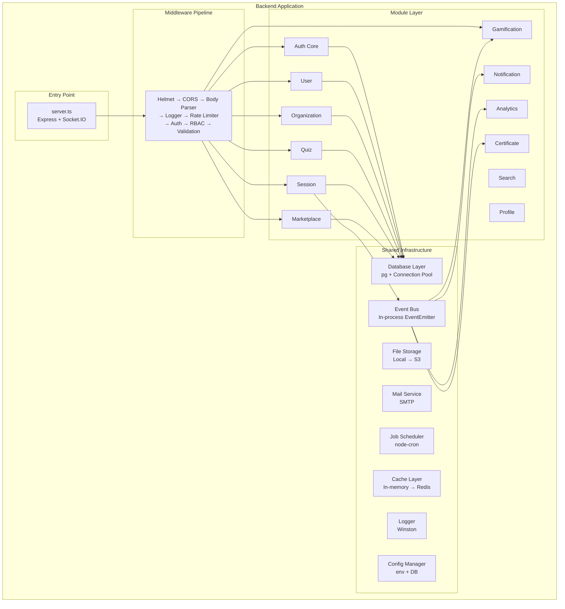
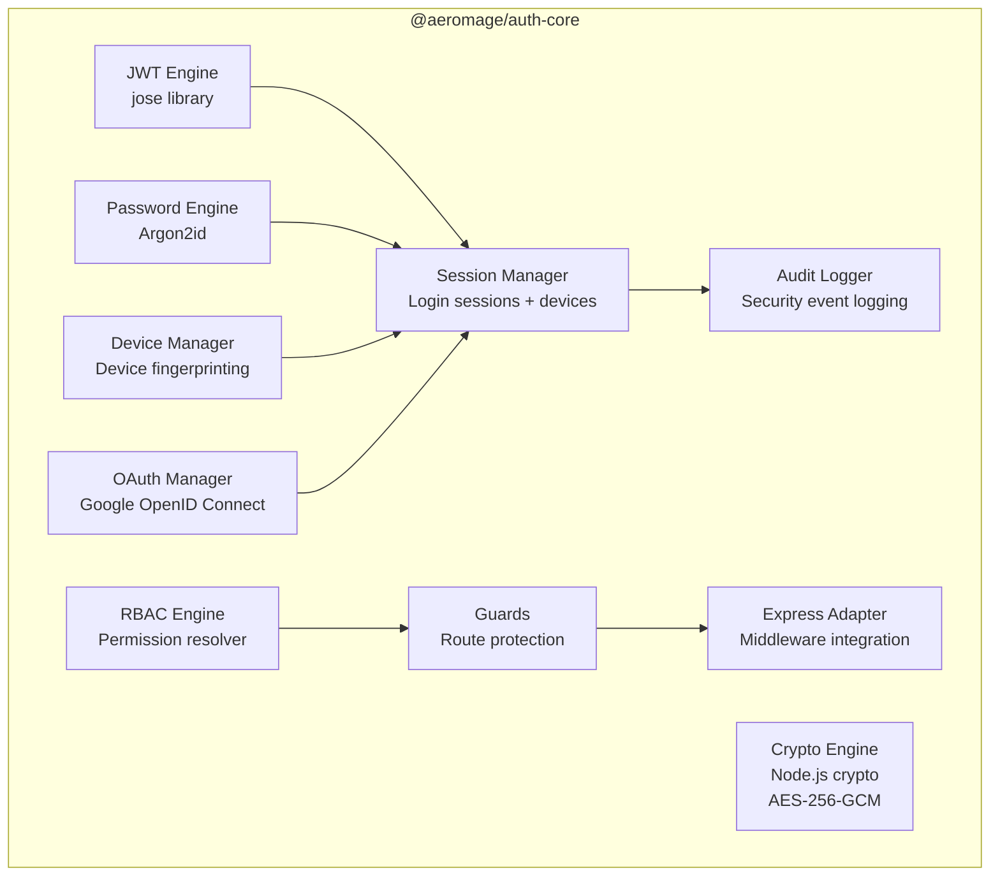
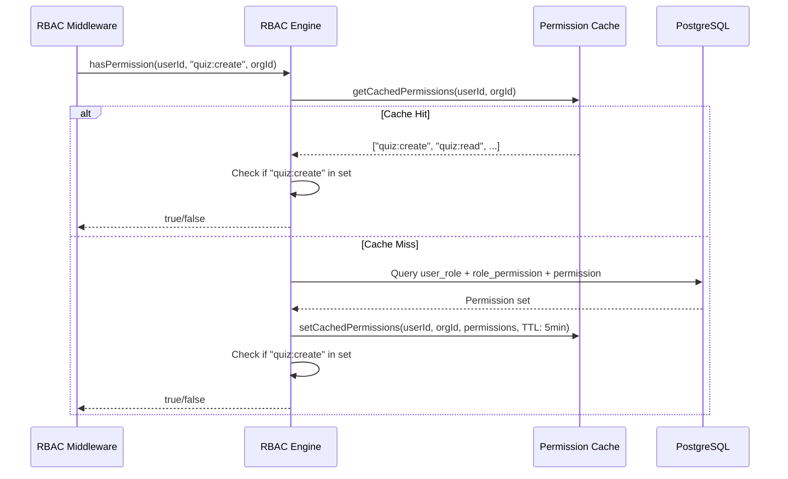

# 09 — Backend Architecture

**Document ID:** AERO-BACK-009  
**Version:** 1.0  
**Last Updated:** 2026-07-16  
**Author:** Principal Software Architect  
**Status:** Approved  
**Classification:** Internal — Engineering

---

## Table of Contents

1. [Purpose](#1-purpose)
2. [Architecture Overview](#2-architecture-overview)
3. [Technology Stack](#3-technology-stack)
4. [Project Root Structure](#4-project-root-structure)
5. [Source Directory Structure](#5-source-directory-structure)
6. [Module Architecture](#6-module-architecture)
7. [Module: Auth Core (@aeromage/auth-core)](#7-module-auth-core)
8. [Module: User](#8-module-user)
9. [Module: Organization](#9-module-organization)
10. [Module: Quiz](#10-module-quiz)
11. [Module: Session (Live Quiz Engine)](#11-module-session-live-quiz-engine)
12. [Module: Marketplace](#12-module-marketplace)
13. [Module: Gamification](#13-module-gamification)
14. [Module: Certificate](#14-module-certificate)
15. [Module: Analytics](#15-module-analytics)
16. [Module: Notification](#16-module-notification)
17. [Module: Search](#17-module-search)
18. [Module: Profile](#18-module-profile)
19. [Shared Infrastructure](#19-shared-infrastructure)
20. [Middleware Pipeline](#20-middleware-pipeline)
21. [Error Handling Architecture](#21-error-handling-architecture)
22. [Validation Architecture (Zod)](#22-validation-architecture-zod)
23. [Database Access Layer](#23-database-access-layer)
24. [Event Bus Architecture](#24-event-bus-architecture)
25. [Background Jobs Architecture](#25-background-jobs-architecture)
26. [Testing Architecture](#26-testing-architecture)
27. [Configuration Architecture](#27-configuration-architecture)
28. [Logging Architecture](#28-logging-architecture)
29. [References](#29-references)

---

## 1. Purpose

This document defines the complete backend architecture for Aero MAGE, including the full directory structure, module decomposition, middleware pipeline, data access patterns, and infrastructure layer. Every folder, every file convention, and every module boundary is documented here.

---

## 2. Architecture Overview



---

## 3. Technology Stack

### 3.1 Core Dependencies

```json
{
  "dependencies": {
    "express": "^4.21.x",
    "socket.io": "^4.8.x",
    "pg": "^8.13.x",
    "argon2": "^0.41.x",
    "jose": "^5.9.x",
    "zod": "^3.24.x",
    "uuid": "^11.x",
    "helmet": "^8.x",
    "cookie-parser": "^1.4.x",
    "express-rate-limit": "^7.5.x",
    "cors": "^2.8.x",
    "morgan": "^1.10.x",
    "winston": "^3.17.x",
    "dotenv": "^16.4.x",
    "multer": "^1.4.x",
    "node-cron": "^3.0.x",
    "nodemailer": "^6.9.x",
    "sharp": "^0.33.x"
  },
  "devDependencies": {
    "typescript": "^5.6.x",
    "tsx": "^4.19.x",
    "vitest": "^2.1.x",
    "supertest": "^7.x",
    "@types/express": "^5.x",
    "@types/pg": "^8.x",
    "@types/node": "^22.x",
    "@types/cookie-parser": "^1.x",
    "@types/cors": "^2.x",
    "@types/morgan": "^1.x",
    "@types/multer": "^1.x",
    "@types/nodemailer": "^6.x",
    "eslint": "^9.x",
    "prettier": "^3.x"
  }
}
```

### 3.2 Packages NOT Used (and Why)

| Package | Reason for Exclusion |
|---------|---------------------|
| ❌ `passport` | Adds unnecessary abstraction. Our auth is custom and deeply integrated with RBAC. Passport plugins add maintenance burden. |
| ❌ `express-auth` / `auth.js` | Too opinionated for enterprise RBAC. We need full control over token lifecycle, device tracking, and audit logging. |
| ❌ `jsonwebtoken` | Legacy API. `jose` is standards-compliant (JWS, JWE, JWK), supports key rotation, and is actively maintained. |
| ❌ `bcrypt` / `bcryptjs` | Still secure, but Argon2id is OWASP-recommended for 2026. Memory-hard, better GPU resistance, configurable parameters. |
| ❌ `joi` | Zod provides TypeScript-native type inference. Shared schemas between frontend and backend. Better DX. |
| ❌ `mongoose` | We use PostgreSQL, not MongoDB. |
| ❌ `sequelize` / `typeorm` | We use raw SQL via `pg` with a repository pattern. ORMs add overhead, hide query performance issues, and generate suboptimal SQL. |
| ❌ `express-validator` | Zod handles all validation with type safety. |

---

## 4. Project Root Structure

```
aeromage/
│
├── .env                          # Environment variables (gitignored)
├── .env.example                  # Template with all required variables
├── .env.test                     # Test environment variables
├── .eslintrc.cjs                 # ESLint configuration
├── .gitignore                    # Git ignore rules
├── .prettierrc                   # Prettier configuration
├── docker-compose.yml            # Local development (PostgreSQL)
├── ecosystem.config.cjs          # PM2 production configuration
├── knexfile.ts                   # Database migration configuration
├── package.json                  # Dependencies and scripts
├── tsconfig.json                 # TypeScript configuration
├── vitest.config.ts              # Test configuration
│
├── docs/                         # Project documentation (this repo)
│   ├── README.md
│   ├── 01-master-prd.md
│   ├── ...
│   ├── decisions/
│   ├── diagrams/
│   ├── changelog/
│   └── templates/
│
├── scripts/                      # DevOps and utility scripts
│   ├── seed.ts                   # Database seeding
│   ├── migrate.ts                # Migration runner
│   ├── create-admin.ts           # Create first super admin
│   ├── generate-keys.ts          # Generate JWT key pairs
│   └── health-check.ts           # Server health check
│
├── migrations/                   # Database migrations (sequential)
│   ├── 20260716_001_create_extensions.sql
│   ├── 20260716_002_create_user_table.sql
│   ├── 20260716_003_create_role_tables.sql
│   ├── 20260716_004_create_organization_tables.sql
│   ├── 20260716_005_create_quiz_tables.sql
│   ├── 20260716_006_create_session_tables.sql
│   ├── 20260716_007_create_marketplace_tables.sql
│   ├── 20260716_008_create_gamification_tables.sql
│   ├── 20260716_009_create_certificate_tables.sql
│   ├── 20260716_010_create_notification_tables.sql
│   ├── 20260716_011_create_analytics_tables.sql
│   ├── 20260716_012_create_profile_tables.sql
│   ├── 20260716_013_create_config_tables.sql
│   ├── 20260716_014_create_audit_tables.sql
│   ├── 20260716_015_create_file_tables.sql
│   ├── 20260716_016_create_triggers.sql
│   ├── 20260716_017_create_views.sql
│   ├── 20260716_018_create_indexes.sql
│   └── 20260716_019_seed_defaults.sql
│
├── seeds/                        # Seed data
│   ├── 001_roles.ts
│   ├── 002_permissions.ts
│   ├── 003_role_permissions.ts
│   ├── 004_categories.ts
│   ├── 005_feature_flags.ts
│   ├── 006_system_config.ts
│   ├── 007_notification_templates.ts
│   ├── 008_certificate_templates.ts
│   ├── 009_badges.ts
│   └── 010_achievements.ts
│
├── uploads/                      # File storage (V1 — local, gitignored)
│   ├── avatars/
│   ├── banners/
│   ├── quiz-covers/
│   ├── question-media/
│   │   ├── images/
│   │   ├── audio/
│   │   └── video/
│   ├── certificates/
│   ├── org-logos/
│   ├── org-banners/
│   └── imports/
│
├── logs/                         # Application logs (gitignored)
│   ├── app.log
│   ├── error.log
│   ├── audit.log
│   └── access.log
│
├── keys/                         # JWT key pairs (gitignored, generated)
│   ├── access-token.private.pem
│   ├── access-token.public.pem
│   ├── refresh-token.private.pem
│   └── refresh-token.public.pem
│
├── src/                          # Application source code
│   └── (see Section 5)
│
└── tests/                        # Test files
    └── (see Section 26)
```

---

## 5. Source Directory Structure

```
src/
│
├── server.ts                     # Application entry point
├── app.ts                        # Express app configuration
├── socket.ts                     # Socket.IO server configuration
│
├── config/                       # Configuration management
│   ├── index.ts                  # Config loader & validator
│   ├── app.config.ts             # Application configuration
│   ├── database.config.ts        # Database connection config
│   ├── auth.config.ts            # Auth-specific config (token expiry, etc.)
│   ├── cors.config.ts            # CORS origins and options
│   ├── rateLimit.config.ts       # Rate limit rules per route group
│   ├── upload.config.ts          # File upload limits and types
│   ├── mail.config.ts            # SMTP configuration
│   ├── socket.config.ts          # Socket.IO configuration
│   └── logger.config.ts          # Logging configuration
│
├── shared/                       # Shared kernel (used by all modules)
│   ├── types/                    # TypeScript type definitions
│   │   ├── index.ts              # Re-exports
│   │   ├── common.types.ts       # Pagination, SortOrder, DateRange, etc.
│   │   ├── express.types.ts      # Extended Request/Response types
│   │   ├── socket.types.ts       # Socket event types
│   │   ├── auth.types.ts         # TokenPayload, AuthUser, etc.
│   │   ├── rbac.types.ts         # Permission, Role, PermissionCheck
│   │   ├── quiz.types.ts         # Quiz, Question, QuestionType, etc.
│   │   ├── session.types.ts      # Session, Participant, Score, etc.
│   │   ├── organization.types.ts # Organization, Department, Member
│   │   ├── marketplace.types.ts  # Listing, Rating, Report, etc.
│   │   ├── gamification.types.ts # XP, Level, Badge, Streak, etc.
│   │   ├── notification.types.ts # Notification, Template, Preference
│   │   ├── analytics.types.ts    # Metric, Aggregate, Report
│   │   ├── certificate.types.ts  # Certificate, Template, Verification
│   │   └── profile.types.ts      # Profile, Follow, ActivityFeed
│   │
│   ├── errors/                   # Custom error classes
│   │   ├── index.ts              # Re-exports
│   │   ├── AppError.ts           # Base error class
│   │   ├── AuthError.ts          # AUTH_001 - AUTH_099
│   │   ├── AuthorizationError.ts # AUTHZ_001 - AUTHZ_099
│   │   ├── ValidationError.ts    # VAL_001 - VAL_099
│   │   ├── NotFoundError.ts      # NOT_FOUND_001 - NOT_FOUND_099
│   │   ├── ConflictError.ts      # CONFLICT_001 - CONFLICT_099
│   │   ├── RateLimitError.ts     # RATE_001 - RATE_099
│   │   ├── FileError.ts          # FILE_001 - FILE_099
│   │   └── StateTransitionError.ts # STATE_001 - STATE_099
│   │
│   ├── constants/                # Application-wide constants
│   │   ├── index.ts
│   │   ├── permissions.ts        # Permission name constants
│   │   ├── roles.ts              # Default role constants
│   │   ├── errorCodes.ts         # Error code registry
│   │   ├── events.ts             # Domain event name constants
│   │   ├── sessionStates.ts      # Session state machine constants
│   │   ├── httpStatus.ts         # HTTP status code constants
│   │   └── limits.ts             # System-wide limits and defaults
│   │
│   ├── utils/                    # Pure utility functions
│   │   ├── index.ts
│   │   ├── uuid.ts               # UUID generation helpers
│   │   ├── pagination.ts         # Pagination calculator
│   │   ├── slug.ts               # Slug generator
│   │   ├── sanitize.ts           # Input sanitization
│   │   ├── dateTime.ts           # Date/time helpers (UTC)
│   │   ├── roomCode.ts           # Room code generator
│   │   ├── profanityFilter.ts    # Nickname/name profanity checker
│   │   ├── fileUtils.ts          # File type/size validation helpers
│   │   └── responseEnvelope.ts   # Standard API response wrapper
│   │
│   ├── interfaces/               # Shared interfaces/contracts
│   │   ├── IRepository.ts        # Base repository interface
│   │   ├── IService.ts           # Base service interface
│   │   ├── IEventHandler.ts      # Event handler interface
│   │   ├── IStorageProvider.ts    # Storage provider interface
│   │   ├── IMailProvider.ts      # Mail provider interface
│   │   └── ICacheProvider.ts     # Cache provider interface
│   │
│   └── schemas/                  # Shared Zod schemas
│       ├── index.ts
│       ├── pagination.schema.ts  # { page, limit, sortBy, sortOrder }
│       ├── uuid.schema.ts        # UUID validation schema
│       └── common.schema.ts      # Reusable field schemas
│
├── infrastructure/               # Infrastructure layer (cross-cutting)
│   ├── database/
│   │   ├── index.ts              # Database connection pool export
│   │   ├── pool.ts               # pg.Pool configuration
│   │   ├── transaction.ts        # Transaction helper (withTransaction)
│   │   └── queryBuilder.ts       # Type-safe query builder helpers
│   │
│   ├── events/
│   │   ├── index.ts              # Event bus export
│   │   ├── eventBus.ts           # Typed EventEmitter wrapper
│   │   ├── eventTypes.ts         # Event name → payload type map
│   │   └── eventLogger.ts        # Log all emitted events (debug)
│   │
│   ├── storage/
│   │   ├── index.ts              # Storage provider export
│   │   ├── StorageProvider.ts    # Interface
│   │   ├── LocalStorageProvider.ts   # V1: Local filesystem
│   │   └── S3StorageProvider.ts      # V2: AWS S3 (stub)
│   │
│   ├── mail/
│   │   ├── index.ts              # Mail service export
│   │   ├── mailService.ts        # Nodemailer wrapper
│   │   ├── mailQueue.ts          # Email queue processor
│   │   └── templates/            # Email HTML templates
│   │       ├── verification.html
│   │       ├── passwordReset.html
│   │       ├── invitation.html
│   │       ├── sessionResults.html
│   │       ├── certificateReady.html
│   │       ├── welcome.html
│   │       └── securityAlert.html
│   │
│   ├── cache/
│   │   ├── index.ts              # Cache provider export
│   │   ├── CacheProvider.ts      # Interface
│   │   ├── MemoryCacheProvider.ts    # V1: In-memory (Map)
│   │   └── RedisCacheProvider.ts     # V2: Redis (stub)
│   │
│   ├── jobs/
│   │   ├── index.ts              # Job scheduler export
│   │   ├── scheduler.ts          # node-cron job registry
│   │   ├── jobs/
│   │   │   ├── cleanupExpiredTokens.ts
│   │   │   ├── cleanupSoftDeleted.ts
│   │   │   ├── processEmailQueue.ts
│   │   │   ├── refreshMaterializedViews.ts
│   │   │   ├── aggregateAnalytics.ts
│   │   │   ├── updateTrendingScores.ts
│   │   │   ├── checkStreaks.ts
│   │   │   ├── expireInvitations.ts
│   │   │   ├── archiveCompletedSessions.ts
│   │   │   └── cleanupTempFiles.ts
│   │   └── jobLogger.ts          # Job execution logging
│   │
│   └── logger/
│       ├── index.ts              # Logger export
│       ├── winstonLogger.ts      # Winston configuration
│       └── requestLogger.ts      # Morgan middleware
│
├── middleware/                   # Express middleware
│   ├── index.ts                  # Re-exports
│   ├── authenticate.ts           # JWT verification middleware
│   ├── authorize.ts              # RBAC permission check middleware
│   ├── validate.ts               # Zod schema validation middleware
│   ├── rateLimiter.ts            # Rate limiting middleware factory
│   ├── errorHandler.ts           # Centralized error handler
│   ├── notFoundHandler.ts        # 404 handler
│   ├── requestId.ts              # Attach UUID to every request
│   ├── fileUpload.ts             # Multer configuration middleware
│   ├── featureFlag.ts            # Feature flag gate middleware
│   ├── orgContext.ts             # Extract org context from request
│   ├── auditLog.ts               # Automatic audit logging middleware
│   └── sanitizeInput.ts          # XSS/injection prevention
│
├── modules/                      # Feature modules (see Section 6+)
│   ├── auth/                     # Auth Core module
│   ├── user/                     # User module
│   ├── organization/             # Organization module
│   ├── quiz/                     # Quiz module
│   ├── session/                  # Live Session module
│   ├── marketplace/              # Marketplace module
│   ├── gamification/             # Gamification module
│   ├── certificate/              # Certificate module
│   ├── analytics/                # Analytics module
│   ├── notification/             # Notification module
│   ├── search/                   # Search module
│   ├── profile/                  # Profile module
│   ├── admin/                    # Admin/Super Admin module
│   └── upload/                   # File upload module
│
└── routes/                       # Route registration
    ├── index.ts                  # Master router (/api/v1/*)
    ├── auth.routes.ts            # /api/v1/auth/*
    ├── user.routes.ts            # /api/v1/users/*
    ├── organization.routes.ts    # /api/v1/organizations/*
    ├── department.routes.ts      # /api/v1/organizations/:orgId/departments/*
    ├── member.routes.ts          # /api/v1/organizations/:orgId/members/*
    ├── quiz.routes.ts            # /api/v1/quizzes/*
    ├── question.routes.ts        # /api/v1/quizzes/:quizId/questions/*
    ├── questionBank.routes.ts    # /api/v1/question-banks/*
    ├── session.routes.ts         # /api/v1/sessions/*
    ├── marketplace.routes.ts     # /api/v1/marketplace/*
    ├── gamification.routes.ts    # /api/v1/gamification/*
    ├── certificate.routes.ts     # /api/v1/certificates/*
    ├── analytics.routes.ts       # /api/v1/analytics/*
    ├── notification.routes.ts    # /api/v1/notifications/*
    ├── search.routes.ts          # /api/v1/search/*
    ├── profile.routes.ts         # /api/v1/profiles/*
    ├── upload.routes.ts          # /api/v1/uploads/*
    ├── admin.routes.ts           # /api/v1/admin/*
    ├── health.routes.ts          # /api/v1/health
    └── verify.routes.ts          # /verify/:certificateId (public)
```

---

## 6. Module Architecture

Every module follows the exact same internal structure. No exceptions.

### 6.1 Standard Module Structure

```
modules/{moduleName}/
│
├── index.ts                      # Module public interface (barrel export)
│
├── {module}.controller.ts        # HTTP request handling
│   - Parses request (params, body, query)
│   - Calls service methods
│   - Formats response
│   - NO business logic here
│
├── {module}.service.ts           # Business logic
│   - Orchestrates operations
│   - Enforces business rules
│   - Calls repository for data access
│   - Emits domain events
│   - Calls other module services (via public interface)
│   - ALL business rules are here
│
├── {module}.repository.ts        # Data access
│   - SQL queries
│   - Parameterized queries only (no string interpolation)
│   - Returns domain objects (not raw rows)
│   - Handles pagination
│   - Applies soft-delete filters
│
├── {module}.validator.ts         # Zod validation schemas
│   - Create/Update DTOs
│   - Query parameter schemas
│   - Exports schemas for middleware
│
├── {module}.types.ts             # Module-specific TypeScript types
│   - Interfaces, enums, types
│   - Used only within this module
│
├── {module}.events.ts            # Event handlers
│   - Subscribes to relevant domain events
│   - Processes side effects
│   - Each handler is a pure function
│
├── {module}.mapper.ts            # Data transformation
│   - DB row → Domain object
│   - Domain object → API response DTO
│   - Strips sensitive fields
│
└── {module}.constants.ts         # Module-specific constants
    - Error codes, default values
    - State machine definitions
```

### 6.2 Module Rules

| Rule | Description |
|------|-------------|
| **No cross-module DB access** | Module A MUST NOT write SQL that touches Module B's tables. Call Module B's service instead. |
| **Controllers are thin** | Controllers call ONE service method. No chaining. No logic. |
| **Services own business rules** | ALL validation beyond schema (business rules) lives in the service layer. |
| **Repositories are dumb** | Repositories execute SQL and return data. No business logic. |
| **Events for side effects** | If a service triggers behavior in another module, emit an event. |
| **Barrel exports** | Each module's `index.ts` exports ONLY what other modules need. Everything else is internal. |
| **No circular imports** | If A imports from B, then B MUST NOT import from A. Use events instead. |

---

## 7. Module: Auth Core

The authentication and authorization engine. This is the most critical module and follows a specialized sub-module architecture.

### 7.1 Architecture Diagram



### 7.2 Directory Structure

```
modules/auth/
│
├── index.ts                      # Public exports
│
├── auth.controller.ts            # Auth HTTP endpoints
│   ├── POST /auth/register
│   ├── POST /auth/login
│   ├── POST /auth/logout
│   ├── POST /auth/refresh
│   ├── POST /auth/google
│   ├── POST /auth/forgot-password
│   ├── POST /auth/reset-password
│   ├── POST /auth/verify-email
│   ├── POST /auth/resend-verification
│   ├── POST /auth/guest/join
│   ├── GET  /auth/me
│   ├── GET  /auth/sessions          (active login sessions)
│   └── DELETE /auth/sessions/:id    (revoke session)
│
├── auth.service.ts               # Auth business logic orchestrator
├── auth.repository.ts            # Auth data access
├── auth.validator.ts             # Zod schemas for auth endpoints
├── auth.types.ts                 # Auth-specific types
├── auth.events.ts                # Auth event handlers
├── auth.mapper.ts                # User → AuthUser DTO mapping
├── auth.constants.ts             # Auth error codes, token config
│
├── engines/                      # Specialized auth engines
│   ├── jwt.engine.ts             # JWT creation & verification (jose)
│   │   ├── signAccessToken(payload): Promise<string>
│   │   ├── signRefreshToken(payload): Promise<string>
│   │   ├── verifyAccessToken(token): Promise<JWTPayload>
│   │   ├── verifyRefreshToken(token): Promise<JWTPayload>
│   │   └── rotateKeys(): Promise<void>
│   │
│   ├── password.engine.ts        # Password hashing (Argon2id)
│   │   ├── hashPassword(plain): Promise<string>
│   │   ├── verifyPassword(plain, hash): Promise<boolean>
│   │   └── needsRehash(hash): boolean
│   │
│   ├── crypto.engine.ts          # Encryption (AES-256-GCM)
│   │   ├── encrypt(data, key): EncryptedPayload
│   │   ├── decrypt(encrypted, key): string
│   │   ├── generateSecureToken(bytes): string
│   │   ├── hashToken(token): string   (SHA-256 for DB storage)
│   │   └── generateRoomCode(): string
│   │
│   ├── rbac.engine.ts            # Permission resolution
│   │   ├── hasPermission(userId, permission, orgId?): Promise<boolean>
│   │   ├── getUserPermissions(userId, orgId?): Promise<string[]>
│   │   ├── getUserRoles(userId, orgId?): Promise<Role[]>
│   │   ├── isSuperAdmin(userId): Promise<boolean>
│   │   └── canAssignRole(assignerUserId, targetRoleId): Promise<boolean>
│   │
│   └── oauth.engine.ts           # Google OAuth handler
│       ├── getAuthorizationUrl(): string
│       ├── exchangeCode(code): Promise<GoogleProfile>
│       └── verifyIdToken(idToken): Promise<GoogleProfile>
│
├── managers/                     # Session & device management
│   ├── session.manager.ts        # Login session lifecycle
│   │   ├── createSession(userId, device, ip): Promise<SessionData>
│   │   ├── refreshSession(refreshToken): Promise<TokenPair>
│   │   ├── revokeSession(sessionId): Promise<void>
│   │   ├── revokeAllSessions(userId): Promise<void>
│   │   ├── getActiveSessions(userId): Promise<SessionInfo[]>
│   │   └── detectTokenReuse(refreshToken): Promise<boolean>
│   │
│   └── device.manager.ts         # Device fingerprinting
│       ├── identifyDevice(userAgent, ip): DeviceInfo
│       ├── registerDevice(userId, device): Promise<DeviceRecord>
│       ├── getKnownDevices(userId): Promise<DeviceRecord[]>
│       └── isNewDevice(userId, device): Promise<boolean>
│
├── guards/                       # Route protection middleware
│   ├── authenticated.guard.ts    # Require valid JWT
│   ├── verified.guard.ts         # Require verified email
│   ├── permission.guard.ts       # Require specific permission(s)
│   ├── role.guard.ts             # Require specific role(s)
│   ├── superAdmin.guard.ts       # Require Super Admin
│   ├── ownerOrAdmin.guard.ts     # Require resource owner or admin
│   └── featureFlag.guard.ts      # Require feature flag enabled
│
└── audit/                        # Security audit logging
    ├── auditLogger.ts            # Auth-specific audit logger
    ├── auditEvents.ts            # Auth audit event types
    └── auditFormatter.ts         # Formats audit log entries
```

### 7.3 JWT Engine — Technical Details

```typescript
// jwt.engine.ts (using jose library)

import { SignJWT, jwtVerify, importPKCS8, importSPKI } from 'jose';

// Key management — RSA key pairs loaded from PEM files
// Access token: RS256 with 15-minute expiry
// Refresh token: RS256 with 30-day expiry (stored hashed in DB)

interface AccessTokenPayload {
  sub: string;          // User UUID
  email: string;
  type: 'access';
  iat: number;
  exp: number;
  jti: string;          // Unique token ID (for revocation)
}

interface RefreshTokenPayload {
  sub: string;          // User UUID
  type: 'refresh';
  sid: string;          // Session ID (links to login_session table)
  did: string;          // Device ID
  iat: number;
  exp: number;
  jti: string;
}

// Access tokens: short-lived, stateless (no DB lookup on verify)
// Refresh tokens: long-lived, stateful (DB lookup, single-use, hashed)
```

### 7.4 Password Engine — Argon2id Configuration

```typescript
// password.engine.ts

import argon2 from 'argon2';

const ARGON2_CONFIG = {
  type: argon2.argon2id,      // Argon2id — recommended by OWASP
  memoryCost: 65536,          // 64 MB memory
  timeCost: 3,                // 3 iterations
  parallelism: 4,             // 4 threads
  hashLength: 32,             // 256-bit output
};

// Features:
// - Auto-detect if hash needs rehash (when config changes)
// - Timing-safe comparison
// - Memory-hard (GPU-resistant)
```

### 7.5 Crypto Engine — AES-256-GCM

```typescript
// crypto.engine.ts

import crypto from 'node:crypto';

// Encrypt sensitive stored secrets (SMTP passwords, API keys)
// Algorithm: AES-256-GCM (authenticated encryption)
// Key: Derived from ENCRYPTION_KEY env var via HKDF
// IV: 12 bytes, randomly generated per encryption
// Auth Tag: 16 bytes (GCM provides authentication)

interface EncryptedPayload {
  ciphertext: string;   // Base64
  iv: string;           // Base64
  tag: string;          // Base64 (GCM auth tag)
  version: number;      // Schema version for future algorithm changes
}

// Token hashing for DB storage:
// - Refresh tokens hashed with SHA-256 before storage
// - Verification tokens hashed with SHA-256 before storage
// - Password reset tokens hashed with SHA-256 before storage
// Why SHA-256 (not Argon2)? These are high-entropy random tokens,
// not human-chosen passwords. SHA-256 is sufficient and much faster
// for the volume of token lookups.
```

### 7.6 RBAC Engine — Permission Resolution



### 7.7 Cookie Strategy

```typescript
// Refresh token stored in HttpOnly cookie
const COOKIE_CONFIG = {
  httpOnly: true,            // Not accessible via JavaScript
  secure: true,              // Only sent over HTTPS (false in development)
  sameSite: 'lax' as const,  // Protects against CSRF
  path: '/api/v1/auth',      // Only sent to auth endpoints
  maxAge: 30 * 24 * 60 * 60 * 1000,  // 30 days in milliseconds
  domain: process.env.COOKIE_DOMAIN,
  signed: true,              // Signed with cookie-parser secret
};

// Access token: returned in JSON response body
// Stored by frontend in memory (NOT localStorage, NOT cookies)
// Sent in Authorization: Bearer header
```

---

## 8. Module: User

```
modules/user/
│
├── index.ts
├── user.controller.ts
│   ├── GET    /users/me
│   ├── PATCH  /users/me
│   ├── PATCH  /users/me/password
│   ├── PATCH  /users/me/email
│   ├── PATCH  /users/me/avatar
│   ├── DELETE /users/me                (deactivate)
│   ├── GET    /users/:id               (public profile - limited)
│   └── GET    /users/search?q=
│
├── user.service.ts
├── user.repository.ts
├── user.validator.ts
├── user.types.ts
├── user.events.ts
├── user.mapper.ts
└── user.constants.ts
```

---

## 9. Module: Organization

```
modules/organization/
│
├── index.ts
├── organization.controller.ts
│   ├── POST   /organizations
│   ├── GET    /organizations
│   ├── GET    /organizations/:id
│   ├── PATCH  /organizations/:id
│   ├── DELETE /organizations/:id        (deactivate)
│   ├── PATCH  /organizations/:id/branding
│   ├── PATCH  /organizations/:id/settings
│   └── GET    /organizations/:id/stats
│
├── organization.service.ts
├── organization.repository.ts
├── organization.validator.ts
├── organization.types.ts
├── organization.events.ts
├── organization.mapper.ts
├── organization.constants.ts
│
├── submodules/
│   ├── department/
│   │   ├── department.controller.ts
│   │   ├── department.service.ts
│   │   ├── department.repository.ts
│   │   └── department.validator.ts
│   │
│   ├── member/
│   │   ├── member.controller.ts
│   │   ├── member.service.ts
│   │   ├── member.repository.ts
│   │   └── member.validator.ts
│   │
│   ├── invitation/
│   │   ├── invitation.controller.ts
│   │   ├── invitation.service.ts
│   │   ├── invitation.repository.ts
│   │   └── invitation.validator.ts
│   │
│   └── joinRequest/
│       ├── joinRequest.controller.ts
│       ├── joinRequest.service.ts
│       ├── joinRequest.repository.ts
│       └── joinRequest.validator.ts
```

---

## 10. Module: Quiz

```
modules/quiz/
│
├── index.ts
├── quiz.controller.ts
│   ├── POST   /quizzes
│   ├── GET    /quizzes
│   ├── GET    /quizzes/:id
│   ├── PATCH  /quizzes/:id
│   ├── DELETE /quizzes/:id
│   ├── POST   /quizzes/:id/publish
│   ├── POST   /quizzes/:id/unpublish
│   ├── POST   /quizzes/:id/archive
│   ├── POST   /quizzes/:id/restore
│   ├── POST   /quizzes/:id/clone
│   └── GET    /quizzes/:id/stats
│
├── quiz.service.ts
├── quiz.repository.ts
├── quiz.validator.ts
├── quiz.types.ts
├── quiz.events.ts
├── quiz.mapper.ts
├── quiz.constants.ts
│
├── submodules/
│   ├── question/
│   │   ├── question.controller.ts
│   │   │   ├── POST   /quizzes/:quizId/questions
│   │   │   ├── GET    /quizzes/:quizId/questions
│   │   │   ├── GET    /quizzes/:quizId/questions/:id
│   │   │   ├── PATCH  /quizzes/:quizId/questions/:id
│   │   │   ├── DELETE /quizzes/:quizId/questions/:id
│   │   │   └── PATCH  /quizzes/:quizId/questions/reorder
│   │   ├── question.service.ts
│   │   ├── question.repository.ts
│   │   ├── question.validator.ts
│   │   └── question.types.ts
│   │
│   └── questionBank/
│       ├── questionBank.controller.ts
│       │   ├── GET    /question-banks
│       │   ├── GET    /question-banks/:id
│       │   ├── POST   /question-banks/import
│       │   └── GET    /question-banks/export
│       ├── questionBank.service.ts
│       ├── questionBank.repository.ts
│       ├── questionBank.validator.ts
│       └── import/
│           ├── csvImporter.ts
│           └── importValidator.ts
```

---

## 11. Module: Session (Live Quiz Engine)

```
modules/session/
│
├── index.ts
├── session.controller.ts         # REST endpoints (create, get, list)
│   ├── POST   /sessions
│   ├── GET    /sessions
│   ├── GET    /sessions/:id
│   ├── GET    /sessions/:id/results
│   └── GET    /sessions/:id/analytics
│
├── session.service.ts            # Session lifecycle management
├── session.repository.ts         # Session data access
├── session.validator.ts          # REST endpoint validation
├── session.types.ts
├── session.events.ts             # Domain event handlers
├── session.mapper.ts
├── session.constants.ts
│
├── engine/                       # Real-time quiz engine (Socket.IO)
│   ├── sessionEngine.ts          # Main engine orchestrator
│   ├── lobbyManager.ts           # Lobby phase management
│   ├── questionDelivery.ts       # Question delivery pipeline
│   ├── answerCollector.ts        # Answer collection and validation
│   ├── timerManager.ts           # Server-authoritative timers
│   ├── scoringEngine.ts          # Score computation (speed bonus, accuracy)
│   ├── leaderboardManager.ts     # Real-time leaderboard computation
│   ├── recoveryManager.ts        # Disconnect/reconnect handling
│   └── hostControls.ts           # Host actions (pause, skip, end, kick, lock)
│
├── stateMachine/                 # Session state machine
│   ├── sessionStateMachine.ts    # State transitions & guards
│   ├── participantStateMachine.ts # Participant state transitions
│   └── stateTransitions.ts       # Valid transition definitions
│
└── socket/                       # Socket.IO event handlers
    ├── sessionSocket.ts          # Socket namespace (/session)
    ├── socketEvents.ts           # Event name constants
    ├── socketAuth.ts             # Socket authentication middleware
    └── socketHandlers/
        ├── joinHandler.ts
        ├── answerHandler.ts
        ├── hostActionHandler.ts
        └── chatHandler.ts        (V2)
```

---

## 12–18. Remaining Modules (Standard Structure)

Each follows the standard module structure from Section 6.1:

```
modules/marketplace/          # Listings, ratings, reports, collections, moderation
modules/gamification/          # XP, levels, badges, achievements, streaks, leaderboards, heatmap
modules/certificate/           # Templates, generation (PDF), verification, delivery
modules/analytics/             # Event collection, aggregation, dashboards, exports
modules/notification/          # In-app, email, push, templates, preferences, queue
modules/search/                # Full-text search, indexing, autocomplete, filters
modules/profile/               # Public profile, follow/unfollow, activity feed
modules/admin/                 # Super admin endpoints, system config, feature flags
modules/upload/                # File upload, validation, storage management
```

---

## 19. Shared Infrastructure

### 19.1 Database Access Layer

```
infrastructure/database/
│
├── pool.ts                       # pg.Pool singleton
├── transaction.ts                # Transaction wrapper
│
│   Usage:
│   const result = await withTransaction(async (client) => {
│       await client.query('INSERT INTO ...');
│       await client.query('UPDATE ...');
│       return result;
│   });
│
└── queryBuilder.ts               # Type-safe helpers
    │
    ├── buildSelectQuery(table, filters, pagination, sort)
    ├── buildInsertQuery(table, data)
    ├── buildUpdateQuery(table, id, data)
    ├── buildSoftDeleteQuery(table, id)
    └── buildSearchQuery(table, searchVector, query, filters)
```

### 19.2 Event Bus

```typescript
// infrastructure/events/eventBus.ts

class TypedEventBus {
  // Strongly typed events — each event name maps to its payload type
  emit<E extends keyof EventMap>(event: E, payload: EventMap[E]): void;
  on<E extends keyof EventMap>(event: E, handler: (payload: EventMap[E]) => Promise<void>): void;
  off<E extends keyof EventMap>(event: E, handler: Function): void;
}

// All events go through this single bus
// Handlers are registered in each module's .events.ts file
// Handlers are async and errors are caught/logged (don't block emitter)
```

---

## 20. Middleware Pipeline

### 20.1 Global Middleware (Applied to ALL Routes)

```
1. requestId        → Attach X-Request-ID UUID to every request
2. helmet           → Security headers (CSP, HSTS, X-Frame-Options, etc.)
3. cors             → Cross-Origin Resource Sharing
4. cookieParser     → Parse signed cookies (refresh tokens)
5. bodyParser.json  → Parse JSON bodies (limit: 10MB)
6. morgan           → HTTP request logging (access.log)
7. sanitizeInput    → Strip XSS/injection from all inputs
```

### 20.2 Route-Level Middleware (Applied Per Route)

```
8. rateLimiter(config)       → Per-route rate limiting
9. authenticate              → JWT verification (optional or required)
10. authorize(permission)    → RBAC permission check
11. validate(schema)         → Zod schema validation
12. featureFlag(flag)        → Feature flag gate
13. fileUpload(config)       → Multer file upload (upload routes only)
14. auditLog(action)         → Audit logging for mutations
```

### 20.3 Post-Route Middleware

```
15. notFoundHandler          → 404 for unmatched routes
16. errorHandler             → Centralized error handling
```

### 20.4 Example Route Definition

```typescript
// routes/quiz.routes.ts

router.post(
  '/quizzes',
  rateLimiter({ max: 20, windowMs: 60 * 60 * 1000 }),  // 20/hour
  authenticate,                                          // Must be logged in
  authorize('quiz:create'),                              // Must have permission
  validate(createQuizSchema),                            // Validate body with Zod
  auditLog('quiz:create'),                               // Log action
  quizController.create                                  // Handle request
);
```

---

## 21. Error Handling Architecture

### 21.1 Error Class Hierarchy

```
AppError (base)
├── AuthError (401)
│   ├── InvalidCredentialsError
│   ├── TokenExpiredError
│   ├── TokenInvalidError
│   ├── TokenReuseError
│   ├── AccountLockedError
│   └── AccountNotVerifiedError
│
├── AuthorizationError (403)
│   ├── InsufficientPermissionError
│   └── ResourceOwnershipError
│
├── ValidationError (400)
│   ├── SchemaValidationError (Zod errors)
│   ├── BusinessRuleError
│   └── InvalidStateTransitionError
│
├── NotFoundError (404)
│   ├── UserNotFoundError
│   ├── QuizNotFoundError
│   ├── SessionNotFoundError
│   └── OrganizationNotFoundError
│
├── ConflictError (409)
│   ├── DuplicateEmailError
│   ├── DuplicateNameError
│   └── ConcurrentModificationError
│
├── RateLimitError (429)
│
└── InternalError (500)
```

### 21.2 Error Response Format

```json
{
  "success": false,
  "error": {
    "code": "AUTH_001",
    "message": "Invalid email or password",
    "details": null,
    "requestId": "uuid"
  },
  "timestamp": "2026-07-16T12:00:00.000Z"
}
```

---

## 22. Validation Architecture (Zod)

### 22.1 Schema Sharing Strategy

```
shared/schemas/              # Schemas used by both frontend and backend
modules/{module}/*.validator.ts  # Module-specific schemas
```

### 22.2 Example Validator

```typescript
// modules/quiz/quiz.validator.ts

import { z } from 'zod';

export const createQuizSchema = z.object({
  body: z.object({
    title: z.string()
      .min(3, 'Title must be at least 3 characters')
      .max(200, 'Title must not exceed 200 characters')
      .trim(),
    description: z.string()
      .max(2000, 'Description must not exceed 2000 characters')
      .optional(),
    visibility: z.enum(['private', 'department', 'organization', 'public'])
      .default('private'),
    difficulty: z.enum(['easy', 'medium', 'hard', 'expert'])
      .default('medium'),
    categoryId: z.string().uuid().optional(),
    organizationId: z.string().uuid().optional(),
    departmentId: z.string().uuid().optional(),
    settings: z.object({
      defaultTimeLimit: z.number().int().min(5).max(300).default(30),
      shuffleQuestions: z.boolean().default(false),
      shuffleOptions: z.boolean().default(false),
      showCorrectAnswers: z.boolean().default(true),
      showExplanations: z.boolean().default(true),
      passingScore: z.number().int().min(0).max(100).optional(),
    }).default({}),
  }),
});

export type CreateQuizInput = z.infer<typeof createQuizSchema>['body'];
```

### 22.3 Validation Middleware

```typescript
// middleware/validate.ts

import { ZodSchema } from 'zod';

export const validate = (schema: ZodSchema) => {
  return (req, res, next) => {
    const result = schema.safeParse({
      body: req.body,
      query: req.query,
      params: req.params,
    });

    if (!result.success) {
      throw new SchemaValidationError(result.error.issues);
    }

    // Replace req data with parsed (and transformed) values
    req.body = result.data.body;
    req.query = result.data.query;
    req.params = result.data.params;
    next();
  };
};
```

---

## 23. Database Access Layer

### 23.1 Repository Pattern

```typescript
// shared/interfaces/IRepository.ts

interface IRepository<T> {
  findById(id: string): Promise<T | null>;
  findAll(filters: FilterOptions, pagination: PaginationOptions): Promise<PaginatedResult<T>>;
  create(data: Partial<T>): Promise<T>;
  update(id: string, data: Partial<T>): Promise<T>;
  softDelete(id: string): Promise<void>;
  restore(id: string): Promise<void>;
  exists(id: string): Promise<boolean>;
}
```

### 23.2 Transaction Pattern

```typescript
// infrastructure/database/transaction.ts

export async function withTransaction<T>(
  callback: (client: PoolClient) => Promise<T>
): Promise<T> {
  const client = await pool.connect();
  try {
    await client.query('BEGIN');
    const result = await callback(client);
    await client.query('COMMIT');
    return result;
  } catch (error) {
    await client.query('ROLLBACK');
    throw error;
  } finally {
    client.release();
  }
}
```

---

## 24. Event Bus Architecture

```typescript
// infrastructure/events/eventBus.ts

// Registration happens in each module's index.ts:
// eventBus.on('session.completed', gamificationEvents.onSessionCompleted);
// eventBus.on('session.completed', notificationEvents.onSessionCompleted);
// eventBus.on('session.completed', analyticsEvents.onSessionCompleted);
// eventBus.on('session.completed', certificateEvents.onSessionCompleted);

// Each handler runs in its own try/catch:
// - If gamification handler fails, notification handler still runs
// - Failed handlers are logged and retried for critical events
// - Handlers run asynchronously (don't block the emitter)
```

---

## 25. Background Jobs Architecture

```
infrastructure/jobs/
│
├── scheduler.ts                  # Job registry and schedule
│
│   Schedule:
│   ┌─────────────┬──────────────────────┬───────────────┐
│   │ Job Name    │ Schedule             │ Description   │
│   ├─────────────┼──────────────────────┼───────────────┤
│   │ cleanup:tokens │ Every hour        │ Remove expired tokens │
│   │ cleanup:deleted │ Daily at 3 AM    │ Purge soft-deleted records past retention │
│   │ email:process   │ Every 30 seconds │ Process email queue │
│   │ views:refresh   │ Every 5 minutes  │ Refresh materialized views │
│   │ analytics:daily │ Daily at 2 AM    │ Compute daily aggregates │
│   │ trending:update │ Every 15 minutes │ Recalculate trending scores │
│   │ streaks:check   │ Daily at midnight│ Reset broken streaks │
│   │ invitations:expire │ Every hour   │ Expire old invitations │
│   │ sessions:archive │ Every hour      │ Archive completed sessions │
│   │ files:cleanup    │ Daily at 4 AM   │ Remove orphaned temp files │
│   │ leaderboard:season │ 1st of month  │ Archive season, start new │
│   └─────────────┴──────────────────────┴───────────────┘
```

---

## 26. Testing Architecture

```
tests/
│
├── unit/                         # Unit tests (isolated, mocked dependencies)
│   ├── modules/
│   │   ├── auth/
│   │   │   ├── auth.service.test.ts
│   │   │   ├── jwt.engine.test.ts
│   │   │   ├── password.engine.test.ts
│   │   │   ├── crypto.engine.test.ts
│   │   │   └── rbac.engine.test.ts
│   │   ├── quiz/
│   │   │   ├── quiz.service.test.ts
│   │   │   └── quiz.validator.test.ts
│   │   ├── session/
│   │   │   ├── scoringEngine.test.ts
│   │   │   ├── sessionStateMachine.test.ts
│   │   │   └── timerManager.test.ts
│   │   └── ...
│   │
│   ├── shared/
│   │   ├── utils/
│   │   │   ├── pagination.test.ts
│   │   │   ├── roomCode.test.ts
│   │   │   └── profanityFilter.test.ts
│   │   └── errors/
│   │       └── AppError.test.ts
│   │
│   └── infrastructure/
│       ├── events/
│       │   └── eventBus.test.ts
│       └── cache/
│           └── MemoryCacheProvider.test.ts
│
├── integration/                  # Integration tests (real DB, real middleware)
│   ├── auth.integration.test.ts
│   ├── quiz.integration.test.ts
│   ├── session.integration.test.ts
│   ├── organization.integration.test.ts
│   ├── marketplace.integration.test.ts
│   └── gamification.integration.test.ts
│
├── e2e/                          # End-to-end tests (full API flow)
│   ├── auth.e2e.test.ts
│   ├── quizLifecycle.e2e.test.ts
│   ├── sessionFlow.e2e.test.ts
│   └── guestJoinFlow.e2e.test.ts
│
├── fixtures/                     # Test data
│   ├── users.fixture.ts
│   ├── quizzes.fixture.ts
│   ├── sessions.fixture.ts
│   └── organizations.fixture.ts
│
├── helpers/                      # Test utilities
│   ├── testDb.ts                 # Test database setup/teardown
│   ├── testAuth.ts               # Generate test JWT tokens
│   ├── testFactory.ts            # Entity factory (create test records)
│   └── testServer.ts             # Create test Express app
│
└── setup.ts                      # Global test setup
```

---

## 27. Configuration Architecture

```typescript
// config/index.ts

// Configuration is loaded once at startup and validated with Zod.
// If validation fails, the server REFUSES to start (fail fast).

const configSchema = z.object({
  NODE_ENV: z.enum(['development', 'test', 'staging', 'production']),
  PORT: z.coerce.number().default(3000),
  
  // Database
  DATABASE_URL: z.string().url(),
  DATABASE_POOL_MIN: z.coerce.number().default(5),
  DATABASE_POOL_MAX: z.coerce.number().default(20),
  
  // Auth
  JWT_ACCESS_EXPIRY: z.string().default('15m'),
  JWT_REFRESH_EXPIRY: z.string().default('30d'),
  JWT_ACCESS_PRIVATE_KEY_PATH: z.string(),
  JWT_ACCESS_PUBLIC_KEY_PATH: z.string(),
  JWT_REFRESH_PRIVATE_KEY_PATH: z.string(),
  JWT_REFRESH_PUBLIC_KEY_PATH: z.string(),
  
  // Encryption
  ENCRYPTION_KEY: z.string().min(32),
  COOKIE_SECRET: z.string().min(32),
  
  // Google OAuth
  GOOGLE_CLIENT_ID: z.string(),
  GOOGLE_CLIENT_SECRET: z.string(),
  GOOGLE_CALLBACK_URL: z.string().url(),
  
  // SMTP
  SMTP_HOST: z.string().optional(),
  SMTP_PORT: z.coerce.number().default(587),
  SMTP_USER: z.string().optional(),
  SMTP_PASS: z.string().optional(),
  SMTP_FROM: z.string().email().optional(),
  
  // CORS
  CORS_ORIGINS: z.string().default('http://localhost:5173'),
  
  // Storage
  UPLOAD_DIR: z.string().default('./uploads'),
  MAX_FILE_SIZE: z.coerce.number().default(52428800), // 50MB
  
  // Frontend
  FRONTEND_URL: z.string().url(),
});

// Loaded from: process.env (populated by .env file via dotenv)
```

---

## 28. Logging Architecture

```typescript
// infrastructure/logger/winstonLogger.ts

// Log Levels:
// error  → Application errors, unhandled exceptions
// warn   → Degraded functionality, deprecated usage
// info   → Significant events (startup, shutdown, config changes)
// http   → HTTP request logging (Morgan)
// debug  → Detailed debugging information

// Log Format (JSON):
{
  "timestamp": "2026-07-16T12:00:00.000Z",
  "level": "info",
  "message": "Quiz created",
  "requestId": "uuid",
  "userId": "uuid",
  "module": "quiz",
  "action": "create",
  "resourceId": "uuid",
  "duration": 45,    // ms
  "metadata": {}
}

// NEVER log:
// - Passwords (plain or hashed)
// - JWT tokens
// - Refresh tokens
// - Credit card numbers
// - Full email addresses (mask: u***@domain.com)
// - API keys or secrets
```

---

## 29. References

| Document | Relationship |
|----------|-------------|
| [04-system-architecture.md](./04-system-architecture.md) | High-level architecture this implements |
| [05-domain-driven-design.md](./05-domain-driven-design.md) | Domain boundaries defining modules |
| [07-database-design.md](./07-database-design.md) | Database tables accessed by repositories |
| [16-rbac.md](./16-rbac.md) | RBAC system details |
| [17-live-quiz-engine.md](./17-live-quiz-engine.md) | Session engine details |
| [38-websocket-events.md](./38-websocket-events.md) | Socket.IO event definitions |
| [39-security.md](./39-security.md) | Security architecture |
| [40-error-reference.md](./40-error-reference.md) | Complete error code reference |

---

*End of Document — AERO-BACK-009 v1.0*
