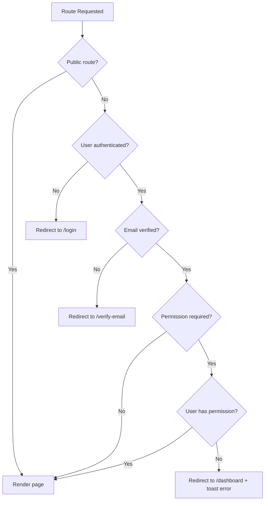
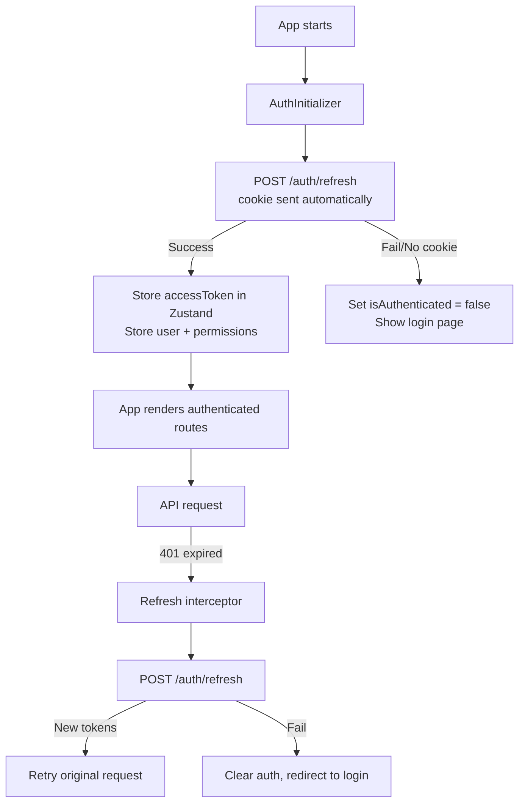

# 10 — Frontend Architecture

**Document ID:** AERO-FRONT-010  
**Version:** 1.0  
**Last Updated:** 2026-07-16  
**Author:** Senior Frontend Architect  
**Status:** Approved  
**Classification:** Internal — Engineering

---

## Table of Contents

1. [Purpose](#1-purpose)
2. [Technology Stack](#2-technology-stack)
3. [Project Root Structure](#3-project-root-structure)
4. [Source Directory Structure](#4-source-directory-structure)
5. [Application Entry & Bootstrap](#5-application-entry--bootstrap)
6. [Routing Architecture](#6-routing-architecture)
7. [Layout System](#7-layout-system)
8. [State Management Architecture](#8-state-management-architecture)
9. [Authentication State & Token Management](#9-authentication-state--token-management)
10. [API Communication Layer](#10-api-communication-layer)
11. [WebSocket Architecture](#11-websocket-architecture)
12. [Component Architecture](#12-component-architecture)
13. [Page Component Architecture](#13-page-component-architecture)
14. [Feature Module: Auth](#14-feature-module-auth)
15. [Feature Module: Quiz](#15-feature-module-quiz)
16. [Feature Module: Session (Live Quiz)](#16-feature-module-session-live-quiz)
17. [Feature Module: Organization](#17-feature-module-organization)
18. [Feature Module: Marketplace](#18-feature-module-marketplace)
19. [Feature Module: Gamification](#19-feature-module-gamification)
20. [Feature Module: Profile](#20-feature-module-profile)
21. [Feature Module: Notification](#21-feature-module-notification)
22. [Feature Module: Certificate](#22-feature-module-certificate)
23. [Feature Module: Analytics](#23-feature-module-analytics)
24. [Feature Module: Settings](#24-feature-module-settings)
25. [Feature Module: Admin](#25-feature-module-admin)
26. [Form Management](#26-form-management)
27. [Error Handling & Error Boundaries](#27-error-handling--error-boundaries)
28. [Performance Optimization](#28-performance-optimization)
29. [Testing Architecture](#29-testing-architecture)
30. [Build & Deployment](#30-build--deployment)
31. [Environment Configuration](#31-environment-configuration)
32. [Coding Standards & Conventions](#32-coding-standards--conventions)
33. [References](#33-references)

---

## 1. Purpose

This document defines the complete frontend architecture for Aero MAGE. Every folder, every component pattern, every state management decision, every hook convention, and every build configuration is documented here. This is the frontend team's bible.

**Framework:** React 19 + Vite 6  
**Language:** TypeScript (strict mode)  
**Theme:** Light only  
**Target:** Desktop-first, fully responsive

---

## 2. Technology Stack

### 2.1 Core Dependencies

```json
{
  "dependencies": {
    "react": "^19.0.x",
    "react-dom": "^19.0.x",
    "react-router-dom": "^7.x",
    "zustand": "^5.x",
    "zod": "^3.24.x",
    "react-hook-form": "^7.54.x",
    "@hookform/resolvers": "^3.x",
    "socket.io-client": "^4.8.x",
    "lucide-react": "^0.468.x",
    "recharts": "^2.15.x",
    "react-hot-toast": "^2.5.x",
    "date-fns": "^4.x",
    "clsx": "^2.1.x",
    "react-dropzone": "^14.3.x",
    "react-dnd": "^16.x",
    "react-dnd-html5-backend": "^16.x",
    "@tanstack/react-query": "^5.62.x",
    "canvas-confetti": "^1.9.x",
    "qrcode.react": "^4.x"
  },
  "devDependencies": {
    "typescript": "^5.6.x",
    "vite": "^6.x",
    "@vitejs/plugin-react-swc": "^4.x",
    "vitest": "^2.1.x",
    "@testing-library/react": "^16.x",
    "@testing-library/jest-dom": "^6.x",
    "@testing-library/user-event": "^14.x",
    "msw": "^2.7.x",
    "eslint": "^9.x",
    "prettier": "^3.x",
    "eslint-plugin-react-hooks": "^5.x",
    "eslint-plugin-react-refresh": "^0.4.x",
    "@types/react": "^19.x",
    "@types/react-dom": "^19.x",
    "@types/canvas-confetti": "^1.x"
  }
}
```

### 2.2 Library Justifications

| Library | Purpose | Why This One |
|---------|---------|-------------|
| **React 19** | UI framework | Latest with Server Components foundation, `use()` hook, Actions, transitions |
| **Vite 6** | Build tool | Fastest HMR, ESBuild + Rollup, native ESM, excellent DX |
| **React Router 7** | Routing | Data loading, nested routes, error boundaries, type-safe links |
| **Zustand 5** | Global state | Tiny (1KB), no boilerplate, no providers, devtools support, persist middleware |
| **TanStack Query 5** | Server state | Caching, deduplication, background refetching, pagination, infinite scroll |
| **React Hook Form 7** | Forms | Uncontrolled components (fast), Zod resolver, minimal re-renders |
| **Zod** | Validation | Shared schemas with backend, TypeScript inference, composable |
| **Socket.IO Client** | WebSocket | Matches backend Socket.IO, auto-reconnect, rooms, namespaces |
| **Recharts** | Charts | React-native, responsive, customizable, good for dashboards |
| **Lucide React** | Icons | Tree-shakeable, consistent style, 1000+ icons, actively maintained |
| **date-fns** | Dates | Tree-shakeable (unlike Moment), immutable, comprehensive |
| **clsx** | Class names | Tiny utility for conditional CSS class composition |
| **React DnD** | Drag & drop | Quiz builder question reordering, flexible backends |
| **react-hot-toast** | Toasts | Lightweight, customizable, promise-based, accessible |
| **canvas-confetti** | Celebrations | Lightweight confetti for achievement/win moments |
| **qrcode.react** | QR codes | Room code QR generation for session lobby |

### 2.3 Libraries NOT Used

| Library | Reason |
|---------|--------|
| ❌ `Redux` / `Redux Toolkit` | Zustand is simpler, faster, less boilerplate. Redux is overkill for our needs. |
| ❌ `TailwindCSS` | User preference: vanilla CSS. Design system uses CSS custom properties. |
| ❌ `styled-components` / `Emotion` | CSS Modules provide scoping without runtime cost. No CSS-in-JS overhead. |
| ❌ `MUI` / `Chakra UI` / `Ant Design` | Custom design system. UI libraries add bundle size and constrain design. |
| ❌ `Axios` | Native `fetch` + TanStack Query wrapper. Axios adds unnecessary dependency. |
| ❌ `Moment.js` | Huge bundle. date-fns is tree-shakeable and modern. |
| ❌ `Formik` | React Hook Form is faster (fewer re-renders), better Zod integration. |
| ❌ `SWR` | TanStack Query has better devtools, mutation support, and infinite query handling. |

---

## 3. Project Root Structure

```
client/
│
├── .env                              # Environment variables (gitignored)
├── .env.example                      # Template
├── .env.development                  # Dev-specific vars
├── .env.production                   # Prod-specific vars
├── .eslintrc.cjs                     # ESLint config
├── .prettierrc                       # Prettier config
├── index.html                        # Vite entry HTML
├── package.json                      # Dependencies
├── tsconfig.json                     # TypeScript config (strict)
├── tsconfig.node.json                # TS config for Vite config
├── vite.config.ts                    # Vite configuration
├── vitest.config.ts                  # Vitest configuration
│
├── public/                           # Static assets (copied as-is)
│   ├── favicon.ico
│   ├── favicon-16x16.png
│   ├── favicon-32x32.png
│   ├── apple-touch-icon.png
│   ├── og-image.png                  # Open Graph image
│   ├── robots.txt
│   ├── sitemap.xml
│   └── manifest.json                 # PWA manifest (V2)
│
├── src/                              # Application source
│   └── (see Section 4)
│
└── tests/                            # Test files
    └── (see Section 29)
```

---

## 4. Source Directory Structure

```
src/
│
├── main.tsx                          # React DOM entry
├── App.tsx                           # Root component (providers + router)
├── index.css                         # Global styles + CSS custom properties
├── reset.css                         # CSS reset / normalize
│
├── assets/                           # Static assets imported in code
│   ├── fonts/
│   │   └── inter-variable.woff2      # Inter font (self-hosted)
│   ├── images/
│   │   ├── logo.svg
│   │   ├── logo-icon.svg
│   │   ├── hero-illustration.svg
│   │   ├── empty-quizzes.svg
│   │   ├── empty-sessions.svg
│   │   ├── empty-notifications.svg
│   │   ├── empty-search.svg
│   │   ├── error-404.svg
│   │   ├── error-500.svg
│   │   └── onboarding/
│   │       ├── step-1.svg
│   │       ├── step-2.svg
│   │       └── step-3.svg
│   └── animations/
│       └── confetti.ts               # Confetti config presets
│
├── config/                           # App configuration
│   ├── index.ts                      # Config export
│   ├── env.ts                        # Environment variable loader
│   ├── routes.ts                     # Route path constants
│   ├── api.ts                        # API endpoint constants
│   ├── socket.ts                     # Socket event name constants
│   ├── permissions.ts                # Permission name constants (mirror backend)
│   └── queryKeys.ts                  # TanStack Query key factory
│
├── styles/                           # Design system styles
│   ├── variables.css                 # CSS custom properties (colors, spacing, etc.)
│   ├── typography.css                # Font face, text utility classes
│   ├── animations.css                # Keyframe animations
│   ├── utilities.css                 # Utility classes (flex, grid, spacing, etc.)
│   └── components/                   # Component-level base styles
│       ├── button.css
│       ├── input.css
│       ├── card.css
│       ├── modal.css
│       ├── table.css
│       ├── badge.css
│       ├── toast.css
│       └── skeleton.css
│
├── components/                       # Shared UI components
│   ├── ui/                           # Primitive UI components
│   │   ├── Button/
│   │   │   ├── Button.tsx
│   │   │   ├── Button.module.css
│   │   │   └── Button.test.tsx
│   │   ├── Input/
│   │   │   ├── Input.tsx
│   │   │   ├── Input.module.css
│   │   │   └── Input.test.tsx
│   │   ├── Select/
│   │   ├── Checkbox/
│   │   ├── Radio/
│   │   ├── Toggle/
│   │   ├── Textarea/
│   │   ├── Modal/
│   │   ├── Dialog/
│   │   ├── Tooltip/
│   │   ├── Popover/
│   │   ├── Dropdown/
│   │   ├── Tabs/
│   │   ├── Badge/
│   │   ├── Avatar/
│   │   ├── Spinner/
│   │   ├── Skeleton/
│   │   ├── ProgressBar/
│   │   ├── Pagination/
│   │   ├── EmptyState/
│   │   ├── FileUpload/
│   │   ├── ColorPicker/
│   │   ├── DatePicker/
│   │   ├── SearchInput/
│   │   ├── RoomCodeInput/
│   │   ├── PasswordInput/
│   │   ├── NumberInput/
│   │   └── ConfirmDialog/
│   │
│   ├── layout/                       # Layout components
│   │   ├── AppLayout/
│   │   │   ├── AppLayout.tsx         # Sidebar + content layout
│   │   │   └── AppLayout.module.css
│   │   ├── AuthLayout/
│   │   │   ├── AuthLayout.tsx        # Split panel layout (login/register)
│   │   │   └── AuthLayout.module.css
│   │   ├── PublicLayout/
│   │   │   ├── PublicLayout.tsx      # Landing page layout
│   │   │   └── PublicLayout.module.css
│   │   ├── SessionLayout/
│   │   │   ├── SessionLayout.tsx     # Full-screen session layout
│   │   │   └── SessionLayout.module.css
│   │   ├── Navbar/
│   │   │   ├── Navbar.tsx
│   │   │   └── Navbar.module.css
│   │   ├── Sidebar/
│   │   │   ├── Sidebar.tsx
│   │   │   ├── SidebarItem.tsx
│   │   │   └── Sidebar.module.css
│   │   ├── BottomTabBar/
│   │   │   ├── BottomTabBar.tsx
│   │   │   └── BottomTabBar.module.css
│   │   ├── PageHeader/
│   │   │   ├── PageHeader.tsx
│   │   │   └── PageHeader.module.css
│   │   ├── Breadcrumb/
│   │   └── Footer/
│   │
│   ├── data/                         # Data display components
│   │   ├── DataTable/
│   │   │   ├── DataTable.tsx         # Sortable, paginated table
│   │   │   ├── DataTable.module.css
│   │   │   └── DataTable.test.tsx
│   │   ├── StatCard/
│   │   ├── Chart/
│   │   │   ├── LineChart.tsx
│   │   │   ├── BarChart.tsx
│   │   │   ├── DonutChart.tsx
│   │   │   └── Sparkline.tsx
│   │   ├── Heatmap/
│   │   │   ├── Heatmap.tsx           # GitHub-style contribution grid
│   │   │   └── Heatmap.module.css
│   │   ├── LeaderboardRow/
│   │   ├── CountdownTimer/
│   │   ├── RoomCodeDisplay/
│   │   └── QuizCard/
│   │       ├── QuizCard.tsx
│   │       └── QuizCard.module.css
│   │
│   └── feedback/                     # Feedback components
│       ├── Toast/
│       ├── ErrorBoundary/
│       │   ├── ErrorBoundary.tsx
│       │   └── ErrorFallback.tsx
│       ├── LoadingPage/
│       ├── ProtectedRoute/
│       ├── PermissionGate/
│       └── FeatureFlagGate/
│
├── hooks/                            # Shared custom hooks
│   ├── useAuth.ts                    # Auth state & methods
│   ├── usePermission.ts             # RBAC permission check
│   ├── useSocket.ts                  # Socket.IO connection manager
│   ├── useDebounce.ts                # Debounce value
│   ├── useLocalStorage.ts            # Persisted state
│   ├── useMediaQuery.ts              # Responsive breakpoint detection
│   ├── useClickOutside.ts            # Click outside handler
│   ├── useClipboard.ts               # Copy to clipboard
│   ├── usePageTitle.ts               # Document title management
│   ├── useInfiniteScroll.ts          # Infinite scroll observer
│   ├── useCountdown.ts               # Countdown timer
│   ├── useConfetti.ts                # Trigger confetti
│   ├── usePrevious.ts                # Track previous value
│   ├── useToggle.ts                  # Boolean toggle
│   └── useKeyboardShortcut.ts        # Keyboard shortcut listener
│
├── stores/                           # Zustand global stores
│   ├── authStore.ts                  # Auth state (user, tokens, permissions)
│   ├── uiStore.ts                    # UI state (sidebar collapsed, modals)
│   ├── socketStore.ts                # Socket connection state
│   ├── notificationStore.ts          # Unread count, notification list
│   ├── sessionStore.ts               # Live session state (host/participant)
│   └── orgStore.ts                   # Current organization context
│
├── services/                         # API service layer
│   ├── api.ts                        # Base fetch wrapper (auth headers, error handling)
│   ├── authService.ts                # Auth API calls
│   ├── userService.ts                # User API calls
│   ├── quizService.ts                # Quiz CRUD API
│   ├── questionService.ts            # Question CRUD API
│   ├── sessionService.ts             # Session API calls
│   ├── organizationService.ts        # Organization API calls
│   ├── departmentService.ts          # Department API calls
│   ├── memberService.ts              # Member management API
│   ├── invitationService.ts          # Invitation API
│   ├── marketplaceService.ts         # Marketplace API
│   ├── gamificationService.ts        # Gamification API
│   ├── certificateService.ts         # Certificate API
│   ├── analyticsService.ts           # Analytics API
│   ├── notificationService.ts        # Notification API
│   ├── profileService.ts             # Profile API
│   ├── uploadService.ts              # File upload API
│   ├── searchService.ts              # Search API
│   ├── adminService.ts               # Admin API
│   └── configService.ts              # System config & feature flags
│
├── queries/                          # TanStack Query hooks
│   ├── useQuizQueries.ts             # Quiz query/mutation hooks
│   ├── useQuestionQueries.ts         # Question query/mutation hooks
│   ├── useSessionQueries.ts          # Session query hooks
│   ├── useOrgQueries.ts              # Organization query hooks
│   ├── useMarketplaceQueries.ts      # Marketplace query hooks
│   ├── useGamificationQueries.ts     # Gamification query hooks
│   ├── useCertificateQueries.ts      # Certificate query hooks
│   ├── useAnalyticsQueries.ts        # Analytics query hooks
│   ├── useNotificationQueries.ts     # Notification query hooks
│   ├── useProfileQueries.ts          # Profile query hooks
│   ├── useAdminQueries.ts            # Admin query hooks
│   └── useSearchQueries.ts           # Search query hooks
│
├── schemas/                          # Zod validation schemas (shared with backend)
│   ├── auth.schema.ts                # Login, register, forgot password
│   ├── quiz.schema.ts                # Create/edit quiz
│   ├── question.schema.ts            # Create/edit question
│   ├── organization.schema.ts        # Create/edit organization
│   ├── session.schema.ts             # Create session config
│   ├── profile.schema.ts             # Edit profile
│   ├── marketplace.schema.ts         # Marketplace forms
│   └── common.schema.ts              # Shared fields (email, uuid, pagination)
│
├── types/                            # TypeScript types
│   ├── api.types.ts                  # API response/request types
│   ├── auth.types.ts                 # User, Token, Permission
│   ├── quiz.types.ts                 # Quiz, Question, Option
│   ├── session.types.ts              # Session, Participant, Response
│   ├── organization.types.ts         # Org, Department, Member
│   ├── marketplace.types.ts          # Listing, Rating, Report
│   ├── gamification.types.ts         # XP, Badge, Achievement, Streak
│   ├── notification.types.ts         # Notification, Preference
│   ├── analytics.types.ts            # Metrics, Charts
│   ├── certificate.types.ts          # Certificate, Template
│   ├── profile.types.ts              # Profile, Follow, Activity
│   └── common.types.ts               # Pagination, SortOrder, etc.
│
├── utils/                            # Pure utility functions
│   ├── formatDate.ts                 # Date formatting helpers
│   ├── formatNumber.ts               # Number formatting (1.2k, 99+)
│   ├── formatDuration.ts             # Duration formatting (2m 30s)
│   ├── formatScore.ts                # Score formatting (8,500 pts)
│   ├── classNames.ts                 # CSS class composition helper
│   ├── truncate.ts                   # Text truncation with ellipsis
│   ├── debounce.ts                   # Debounce function
│   ├── throttle.ts                   # Throttle function
│   ├── generateRoomCode.ts           # Room code display formatter
│   ├── getInitials.ts                # Name → initials for avatar fallback
│   ├── getRelativeTime.ts            # "2 hours ago", "yesterday"
│   ├── getGreeting.ts                # Time-based greeting
│   ├── passwordStrength.ts           # Password strength calculator
│   ├── fileValidation.ts             # Client-side file type/size check
│   └── constants.ts                  # Frontend-only constants
│
├── features/                         # Feature page modules
│   ├── auth/                         # Auth pages
│   ├── dashboard/                    # Dashboard page
│   ├── quiz/                         # Quiz pages
│   ├── session/                      # Session pages (host + participant)
│   ├── organization/                 # Organization pages
│   ├── marketplace/                  # Marketplace pages
│   ├── gamification/                 # Gamification pages
│   ├── profile/                      # Profile pages
│   ├── certificate/                  # Certificate pages
│   ├── analytics/                    # Analytics pages
│   ├── notification/                 # Notification pages
│   ├── settings/                     # Settings pages
│   ├── admin/                        # Admin pages
│   ├── landing/                      # Landing page
│   └── errors/                       # Error pages (404, 500)
│
└── router/                           # Route definitions
    ├── index.tsx                     # Router configuration
    ├── routes.tsx                    # Route tree
    ├── guards.tsx                    # Auth/permission route guards
    └── lazyImports.ts               # Lazy-loaded page imports
```

---

## 5. Application Entry & Bootstrap

### 5.1 Entry Point (`main.tsx`)

```typescript
import { StrictMode } from 'react';
import { createRoot } from 'react-dom/client';
import { App } from './App';
import './reset.css';
import './index.css';

createRoot(document.getElementById('root')!).render(
  <StrictMode>
    <App />
  </StrictMode>
);
```

### 5.2 Root Component (`App.tsx`)

```typescript
import { QueryClientProvider } from '@tanstack/react-query';
import { ReactQueryDevtools } from '@tanstack/react-query-devtools';
import { BrowserRouter } from 'react-router-dom';
import { Toaster } from 'react-hot-toast';
import { ErrorBoundary } from './components/feedback/ErrorBoundary';
import { AuthInitializer } from './features/auth/AuthInitializer';
import { SocketProvider } from './providers/SocketProvider';
import { AppRouter } from './router';
import { queryClient } from './config/queryClient';

export function App() {
  return (
    <ErrorBoundary>
      <QueryClientProvider client={queryClient}>
        <BrowserRouter>
          <AuthInitializer>
            <SocketProvider>
              <AppRouter />
              <Toaster position="top-right" />
            </SocketProvider>
          </AuthInitializer>
        </BrowserRouter>
        <ReactQueryDevtools initialIsOpen={false} />
      </QueryClientProvider>
    </ErrorBoundary>
  );
}
```

**Provider Order (outermost → innermost):**

```
ErrorBoundary           → Catch unhandled errors anywhere
  QueryClientProvider   → TanStack Query cache
    BrowserRouter       → React Router
      AuthInitializer   → Load user from refresh token on app start
        SocketProvider  → Socket.IO connection (after auth known)
          AppRouter     → Route rendering
          Toaster       → Toast notifications
```

---

## 6. Routing Architecture

### 6.1 Route Guard System



### 6.2 Route Tree

```typescript
// router/routes.tsx

const routes = [
  // ── Public Layout ──
  { path: '/', element: <PublicLayout />, children: [
    { index: true, element: <LandingPage /> },
    { path: 'about', element: <AboutPage /> },
    { path: 'privacy', element: <PrivacyPage /> },
    { path: 'terms', element: <TermsPage /> },
    { path: 'verify/:certificateId', element: <CertificateVerifyPage /> },
  ]},

  // ── Auth Layout ──
  { path: '/', element: <AuthLayout />, children: [
    { path: 'login', element: <LoginPage /> },
    { path: 'register', element: <RegisterPage /> },
    { path: 'forgot-password', element: <ForgotPasswordPage /> },
    { path: 'reset-password/:token', element: <ResetPasswordPage /> },
    { path: 'verify-email/:token', element: <VerifyEmailPage /> },
    { path: 'auth/google/callback', element: <GoogleCallbackPage /> },
  ]},

  // ── Guest Session Layout (no sidebar) ──
  { path: '/play', element: <SessionLayout />, children: [
    { path: 'join', element: <GuestJoinPage /> },
    { path: ':roomCode/lobby', element: <ParticipantLobbyPage /> },
    { path: ':roomCode/game', element: <ParticipantGamePage /> },
    { path: ':roomCode/results', element: <ParticipantResultsPage /> },
  ]},

  // ── App Layout (authenticated, sidebar) ──
  { path: '/', element: <ProtectedRoute><AppLayout /></ProtectedRoute>, children: [
    { path: 'dashboard', element: <DashboardPage /> },

    // Quiz
    { path: 'quizzes', element: <QuizListPage /> },
    { path: 'quizzes/create', element: <QuizCreatePage />, guard: 'quiz:create' },
    { path: 'quizzes/:id', element: <QuizDetailPage /> },
    { path: 'quizzes/:id/edit', element: <QuizBuilderPage />, guard: 'quiz:update' },
    { path: 'quizzes/:id/preview', element: <QuizPreviewPage /> },
    { path: 'quizzes/:id/import', element: <QuizImportPage /> },
    { path: 'question-bank', element: <QuestionBankPage /> },

    // Session (host)
    { path: 'sessions/create/:quizId', element: <SessionCreatePage /> },
    { path: 'sessions/:id/lobby', element: <HostLobbyPage /> },
    { path: 'sessions/:id/live', element: <HostLivePage /> },
    { path: 'sessions/:id/results', element: <SessionResultsPage /> },

    // Organization
    { path: 'organizations', element: <OrgListPage /> },
    { path: 'organizations/create', element: <OrgCreatePage /> },
    { path: 'organizations/:id', element: <OrgDashboardPage /> },
    { path: 'organizations/:id/members', element: <OrgMembersPage /> },
    { path: 'organizations/:id/departments', element: <OrgDepartmentsPage /> },
    { path: 'organizations/:id/settings', element: <OrgSettingsPage /> },
    { path: 'organizations/:id/branding', element: <OrgBrandingPage /> },
    { path: 'organizations/:id/analytics', element: <OrgAnalyticsPage /> },
    { path: 'organizations/:id/invitations', element: <OrgInvitationsPage /> },
    { path: 'organizations/:id/roles', element: <OrgRolesPage /> },

    // Marketplace
    { path: 'marketplace', element: <MarketplaceHomePage /> },
    { path: 'marketplace/search', element: <MarketplaceSearchPage /> },
    { path: 'marketplace/:id', element: <MarketplaceDetailPage /> },
    { path: 'marketplace/my-listings', element: <MyListingsPage /> },
    { path: 'marketplace/collections', element: <CollectionsPage /> },

    // Profile
    { path: 'profile', element: <MyProfilePage /> },
    { path: 'profile/edit', element: <EditProfilePage /> },
    { path: 'users/:id', element: <PublicProfilePage /> },
    { path: 'profile/followers', element: <FollowersPage /> },
    { path: 'profile/activity', element: <ActivityFeedPage /> },

    // Gamification
    { path: 'gamification', element: <GamificationDashboardPage /> },
    { path: 'gamification/badges', element: <BadgeGalleryPage /> },
    { path: 'gamification/achievements', element: <AchievementsPage /> },
    { path: 'gamification/leaderboard', element: <LeaderboardPage /> },
    { path: 'gamification/heatmap', element: <HeatmapPage /> },

    // Certificate
    { path: 'certificates', element: <CertificateListPage /> },
    { path: 'certificates/:id', element: <CertificateDetailPage /> },

    // Analytics
    { path: 'analytics', element: <PersonalAnalyticsPage /> },

    // Notifications
    { path: 'notifications', element: <NotificationCenterPage /> },

    // Settings
    { path: 'settings/account', element: <AccountSettingsPage /> },
    { path: 'settings/security', element: <SecuritySettingsPage /> },
    { path: 'settings/notifications', element: <NotificationPrefsPage /> },
    { path: 'settings/privacy', element: <PrivacySettingsPage /> },

    // Admin (Super Admin only)
    { path: 'admin', element: <AdminDashboardPage />, guard: 'config:manage' },
    { path: 'admin/users', element: <UserManagementPage />, guard: 'user:manage' },
    { path: 'admin/config', element: <SystemConfigPage />, guard: 'config:manage' },
    { path: 'admin/feature-flags', element: <FeatureFlagsPage />, guard: 'feature_flag:manage' },
    { path: 'admin/audit', element: <AuditLogsPage />, guard: 'audit:view' },
  ]},

  // ── Error Pages ──
  { path: '*', element: <NotFoundPage /> },
];
```

### 6.3 Code Splitting Strategy

Every feature page is lazy-loaded:

```typescript
// router/lazyImports.ts

export const DashboardPage = lazy(() => import('../features/dashboard/DashboardPage'));
export const QuizListPage = lazy(() => import('../features/quiz/QuizListPage'));
export const QuizBuilderPage = lazy(() => import('../features/quiz/QuizBuilderPage'));
export const HostLivePage = lazy(() => import('../features/session/HostLivePage'));
export const MarketplaceHomePage = lazy(() => import('../features/marketplace/MarketplaceHomePage'));
// ... all pages lazy-loaded
```

**Eagerly loaded (in main bundle):** Auth pages, Dashboard, Layout components, shared UI components.

---

## 7. Layout System

### 7.1 Layout Components

| Layout | Used By | Structure |
|--------|---------|-----------|
| **PublicLayout** | Landing, About, Privacy, Terms, Certificate Verify | Navbar + Content + Footer |
| **AuthLayout** | Login, Register, Forgot Password, Reset Password | Split panel (illustration + form) |
| **AppLayout** | All authenticated pages (68% of app) | Navbar + Sidebar + Content |
| **SessionLayout** | Guest join, Participant lobby/game/results | Full-screen, no sidebar, minimal chrome |

### 7.2 AppLayout Structure

```typescript
// components/layout/AppLayout/AppLayout.tsx

function AppLayout() {
  const { isSidebarCollapsed } = useUIStore();

  return (
    <div className={styles.layout}>
      <Navbar />
      <div className={styles.body}>
        <Sidebar collapsed={isSidebarCollapsed} />
        <main className={styles.content}>
          <Suspense fallback={<LoadingPage />}>
            <Outlet />
          </Suspense>
        </main>
      </div>
    </div>
  );
}
```

### 7.3 Navbar Components

```
┌──────────────────────────────────────────────────────────────┐
│ [Logo]  [☰ toggle sidebar]                                   │
│                                                              │
│         [🔍 Search... Ctrl+K]                                │
│                                                              │
│                           [Org Switcher ▼]                   │
│                           [🔔 Notifications (3)]             │
│                           [Avatar ▼ dropdown]                │
└──────────────────────────────────────────────────────────────┘

Avatar Dropdown:
├── 👤 My Profile
├── ⚙ Settings
├── 🏆 Level 12 (2,450 XP)
├── ────────────
├── 🌙 Appearance (disabled — light only)
├── ❓ Help & Support
├── ────────────
└── 🚪 Logout
```

### 7.4 Sidebar Sections

```
Sidebar (256px expanded / 64px collapsed):

── Main ──
📊 Dashboard           /dashboard
📝 My Quizzes          /quizzes
🎮 Sessions            /sessions
📥 Join Session         /play/join

── Discover ──
🛒 Marketplace         /marketplace
🔍 Question Bank       /question-bank

── Community ──
🏢 Organizations       /organizations
👤 Profile             /profile
🏆 Gamification        /gamification
📜 Certificates        /certificates

── Analytics ──
📊 Analytics           /analytics

── Organization Context (if selected) ──
🏢 {Org Name}
   📊 Dashboard
   👥 Members
   🏗 Departments
   ⚙ Settings

── Account ──
⚙ Settings             /settings/account
🔒 Security            /settings/security

── Admin (Super Admin only) ──
🛡 Admin Panel          /admin
```

---

## 8. State Management Architecture

### 8.1 State Categories

| Category | Tool | Scope | Examples |
|----------|------|-------|---------|
| **Server State** | TanStack Query | Per-query cache | Quiz list, user profile, marketplace listings, analytics data |
| **Client Global State** | Zustand | App-wide | Auth state, current org, sidebar state, notification count |
| **Real-time State** | Zustand + Socket.IO | Session-scoped | Live session state, participants, timer, leaderboard |
| **Form State** | React Hook Form | Component-scoped | Login form, quiz builder, settings forms |
| **Local State** | `useState` | Component-scoped | Modal open/close, dropdown expanded, tab active |
| **URL State** | React Router | URL params/search | Page number, search query, filters, sort order |
| **Persisted State** | Zustand `persist` middleware | localStorage | Sidebar collapsed preference, recent room codes |

### 8.2 Golden Rules

1. **Server state → TanStack Query.** If data comes from an API, it's server state. Never store API data in Zustand.
2. **Zustand is for UI + auth state only.** Sidebar collapsed, current user, current org, socket connection status.
3. **URL is state too.** Pagination, filters, search query — all in URL search params. This enables shareable links and browser back/forward.
4. **No prop drilling past 2 levels.** If data needs to go deeper, use context or Zustand.
5. **Derived state is computed, not stored.** If you can compute it from existing state, don't create a new store field.

### 8.3 Zustand Stores

```typescript
// stores/authStore.ts
interface AuthState {
  user: User | null;
  accessToken: string | null;
  permissions: string[];
  isAuthenticated: boolean;
  isLoading: boolean;                  // True during initial auth check
  
  setUser: (user: User, token: string, permissions: string[]) => void;
  clearAuth: () => void;
  updateAccessToken: (token: string) => void;
  hasPermission: (permission: string) => boolean;
}

// stores/uiStore.ts
interface UIState {
  isSidebarCollapsed: boolean;
  isMobileMenuOpen: boolean;
  isCommandPaletteOpen: boolean;
  activeModal: string | null;
  
  toggleSidebar: () => void;
  toggleMobileMenu: () => void;
  openModal: (id: string) => void;
  closeModal: () => void;
}

// stores/socketStore.ts
interface SocketState {
  isConnected: boolean;
  connectionError: string | null;
  
  setConnected: (connected: boolean) => void;
  setError: (error: string | null) => void;
}

// stores/orgStore.ts
interface OrgState {
  currentOrg: Organization | null;
  
  setCurrentOrg: (org: Organization | null) => void;
  clearOrg: () => void;
}

// stores/notificationStore.ts
interface NotificationState {
  unreadCount: number;
  
  setUnreadCount: (count: number) => void;
  incrementUnread: () => void;
  decrementUnread: () => void;
}

// stores/sessionStore.ts (live quiz session)
interface SessionState {
  session: Session | null;
  participants: Participant[];
  currentQuestion: Question | null;
  currentQuestionIndex: number;
  timeRemaining: number;
  leaderboard: LeaderboardEntry[];
  myScore: number;
  myRank: number;
  status: SessionStatus;
  
  // Actions
  setSession: (session: Session) => void;
  addParticipant: (participant: Participant) => void;
  removeParticipant: (id: string) => void;
  setCurrentQuestion: (question: Question, index: number) => void;
  setTimeRemaining: (seconds: number) => void;
  updateLeaderboard: (entries: LeaderboardEntry[]) => void;
  updateMyScore: (score: number, rank: number) => void;
  setStatus: (status: SessionStatus) => void;
  resetSession: () => void;
}
```

---

## 9. Authentication State & Token Management

### 9.1 Token Storage Strategy

```
┌──────────────────────────────────────────────────────┐
│ ACCESS TOKEN                                          │
│                                                       │
│ Storage: React state (Zustand authStore)              │
│ NOT in localStorage (XSS vulnerable)                  │
│ NOT in cookies (we control the header)                │
│                                                       │
│ Sent: Authorization: Bearer {token} header            │
│ Lifetime: 15 minutes                                  │
│ On expiry: Silent refresh via /auth/refresh            │
└──────────────────────────────────────────────────────┘

┌──────────────────────────────────────────────────────┐
│ REFRESH TOKEN                                         │
│                                                       │
│ Storage: HttpOnly Secure SameSite=Lax cookie          │
│ (managed by browser, not accessible to JS)            │
│                                                       │
│ Sent: Automatically by browser (cookie)               │
│ Lifetime: 30 days                                     │
│ Used: Only on POST /auth/refresh                      │
└──────────────────────────────────────────────────────┘
```

### 9.2 Auth Flow



### 9.3 Refresh Interceptor

```typescript
// services/api.ts

let isRefreshing = false;
let failedQueue: QueuedRequest[] = [];

async function apiRequest(url: string, options: RequestInit) {
  const token = useAuthStore.getState().accessToken;
  
  const response = await fetch(url, {
    ...options,
    headers: {
      'Content-Type': 'application/json',
      ...(token && { Authorization: `Bearer ${token}` }),
      ...options.headers,
    },
    credentials: 'include',  // Send cookies (refresh token)
  });

  if (response.status === 401) {
    // Token expired — attempt silent refresh
    if (!isRefreshing) {
      isRefreshing = true;
      try {
        const refreshResponse = await fetch('/api/v1/auth/refresh', {
          method: 'POST',
          credentials: 'include',
        });
        const data = await refreshResponse.json();
        useAuthStore.getState().updateAccessToken(data.accessToken);
        
        // Retry all queued requests
        failedQueue.forEach(req => req.resolve());
        failedQueue = [];
      } catch {
        useAuthStore.getState().clearAuth();
        window.location.href = '/login';
      } finally {
        isRefreshing = false;
      }
    }
    
    // Queue this request until refresh completes
    return new Promise((resolve) => {
      failedQueue.push({ resolve: () => resolve(apiRequest(url, options)) });
    });
  }

  return response;
}
```

---

## 10. API Communication Layer

### 10.1 API Service Pattern

```typescript
// services/quizService.ts

import { api } from './api';
import type { Quiz, CreateQuizInput, PaginatedResponse } from '../types';

export const quizService = {
  list: (params: QuizListParams) => 
    api.get<PaginatedResponse<Quiz>>('/quizzes', { params }),
  
  getById: (id: string) => 
    api.get<Quiz>(`/quizzes/${id}`),
  
  create: (data: CreateQuizInput) => 
    api.post<Quiz>('/quizzes', data),
  
  update: (id: string, data: Partial<CreateQuizInput>) => 
    api.patch<Quiz>(`/quizzes/${id}`, data),
  
  delete: (id: string) => 
    api.delete(`/quizzes/${id}`),
  
  publish: (id: string) => 
    api.post(`/quizzes/${id}/publish`),
  
  clone: (id: string) => 
    api.post<Quiz>(`/quizzes/${id}/clone`),
};
```

### 10.2 TanStack Query Hooks

```typescript
// queries/useQuizQueries.ts

import { useQuery, useMutation, useQueryClient } from '@tanstack/react-query';
import { quizService } from '../services/quizService';
import { queryKeys } from '../config/queryKeys';

export function useQuizList(params: QuizListParams) {
  return useQuery({
    queryKey: queryKeys.quizzes.list(params),
    queryFn: () => quizService.list(params),
    staleTime: 30_000,      // 30 seconds
  });
}

export function useQuiz(id: string) {
  return useQuery({
    queryKey: queryKeys.quizzes.detail(id),
    queryFn: () => quizService.getById(id),
    enabled: !!id,
  });
}

export function useCreateQuiz() {
  const queryClient = useQueryClient();
  return useMutation({
    mutationFn: quizService.create,
    onSuccess: () => {
      queryClient.invalidateQueries({ queryKey: queryKeys.quizzes.lists() });
      toast.success('Quiz created successfully');
    },
  });
}

export function useDeleteQuiz() {
  const queryClient = useQueryClient();
  return useMutation({
    mutationFn: quizService.delete,
    onSuccess: () => {
      queryClient.invalidateQueries({ queryKey: queryKeys.quizzes.lists() });
      toast.success('Quiz deleted');
    },
  });
}
```

### 10.3 API Response Format

```typescript
// Successful response
interface ApiResponse<T> {
  success: true;
  data: T;
  meta?: PaginationMeta;
  timestamp: string;
}

// Error response
interface ApiErrorResponse {
  success: false;
  error: {
    code: string;        // e.g., "AUTH_001"
    message: string;     // Human-readable message
    details?: unknown;   // Validation errors array (Zod)
    requestId: string;
  };
  timestamp: string;
}

// Pagination meta
interface PaginationMeta {
  page: number;
  limit: number;
  total: number;
  totalPages: number;
  hasNext: boolean;
  hasPrev: boolean;
}
```

---

## 11. WebSocket Architecture

### 11.1 Connection Management

```typescript
// hooks/useSocket.ts

function useSocket() {
  const { accessToken } = useAuthStore();
  const { setConnected, setError } = useSocketStore();

  useEffect(() => {
    if (!accessToken) return;

    const socket = io(`${API_URL}/session`, {
      auth: { token: accessToken },
      transports: ['websocket'],
      reconnection: true,
      reconnectionAttempts: 5,
      reconnectionDelay: 1000,
    });

    socket.on('connect', () => setConnected(true));
    socket.on('disconnect', () => setConnected(false));
    socket.on('connect_error', (err) => setError(err.message));

    return () => { socket.disconnect(); };
  }, [accessToken]);
}
```

### 11.2 Socket Event Handling in Session

```typescript
// features/session/hooks/useSessionSocket.ts

function useSessionSocket(roomCode: string) {
  const sessionStore = useSessionStore();

  useEffect(() => {
    // Join room
    socket.emit('session:join', { roomCode, nickname });

    // Listen to events
    socket.on('session:participant_joined', sessionStore.addParticipant);
    socket.on('session:participant_left', sessionStore.removeParticipant);
    socket.on('session:question_delivered', sessionStore.setCurrentQuestion);
    socket.on('session:timer_tick', sessionStore.setTimeRemaining);
    socket.on('session:question_result', handleQuestionResult);
    socket.on('session:leaderboard_update', sessionStore.updateLeaderboard);
    socket.on('session:completed', handleSessionCompleted);
    socket.on('session:paused', handleSessionPaused);
    socket.on('session:error', handleError);

    return () => {
      socket.off('session:participant_joined');
      // ... remove all listeners
      socket.emit('session:leave', { roomCode });
    };
  }, [roomCode]);
}
```

---

## 12. Component Architecture

### 12.1 Component File Structure

Every component follows this structure:

```
ComponentName/
├── ComponentName.tsx            # Component logic
├── ComponentName.module.css     # Scoped styles (CSS Modules)
├── ComponentName.test.tsx       # Unit tests
└── index.ts                     # Re-export
```

### 12.2 Component Design Principles

| Principle | Implementation |
|-----------|----------------|
| **Single Responsibility** | One component = one job. Split if doing multiple things. |
| **Composition over Props** | Use `children` and slots instead of 20 boolean props. |
| **Controlled vs Uncontrolled** | Form elements default uncontrolled (React Hook Form). UI elements controlled. |
| **Forward Refs** | All primitive UI components use `forwardRef` for integration. |
| **Semantic HTML** | Use `<button>` not `<div onClick>`. Use `<nav>`, `<main>`, `<section>`. |
| **Accessible by Default** | ARIA attributes, keyboard handlers, focus management built into primitives. |
| **CSS Modules** | All styles are scoped. No global class conflicts. |
| **No Inline Styles** | All styles in CSS modules. Exception: truly dynamic values (e.g., progress width). |

### 12.3 Component API Pattern

```typescript
// components/ui/Button/Button.tsx

interface ButtonProps extends React.ButtonHTMLAttributes<HTMLButtonElement> {
  variant?: 'primary' | 'secondary' | 'ghost' | 'danger';
  size?: 'xs' | 'sm' | 'md' | 'lg' | 'xl';
  isLoading?: boolean;
  leftIcon?: React.ReactNode;
  rightIcon?: React.ReactNode;
  fullWidth?: boolean;
}

export const Button = forwardRef<HTMLButtonElement, ButtonProps>(
  ({ variant = 'primary', size = 'md', isLoading, children, ...props }, ref) => {
    return (
      <button
        ref={ref}
        className={clsx(
          styles.button,
          styles[variant],
          styles[size],
          isLoading && styles.loading,
        )}
        disabled={isLoading || props.disabled}
        {...props}
      >
        {isLoading && <Spinner size="sm" />}
        {leftIcon && <span className={styles.icon}>{leftIcon}</span>}
        {children}
        {rightIcon && <span className={styles.icon}>{rightIcon}</span>}
      </button>
    );
  }
);
```

---

## 13. Page Component Architecture

Every page follows this structure:

```typescript
// features/quiz/QuizListPage.tsx

export default function QuizListPage() {
  // 1. URL state
  const [searchParams, setSearchParams] = useSearchParams();
  const page = Number(searchParams.get('page') || 1);
  const search = searchParams.get('q') || '';

  // 2. Server state
  const { data, isLoading, error } = useQuizList({ page, search, limit: 12 });

  // 3. Local state
  const [viewMode, setViewMode] = useState<'grid' | 'list'>('grid');

  // 4. Hooks
  usePageTitle('My Quizzes');

  // 5. Handlers
  const handleSearch = (query: string) => {
    setSearchParams({ q: query, page: '1' });
  };

  // 6. Early returns
  if (error) return <ErrorFallback error={error} />;

  // 7. Render
  return (
    <>
      <PageHeader
        title={`My Quizzes (${data?.meta.total || 0})`}
        actions={<Button onClick={() => navigate('/quizzes/create')}>+ Create Quiz</Button>}
      />
      
      <FilterBar onSearch={handleSearch} ... />
      
      {isLoading ? (
        <QuizCardSkeleton count={6} />
      ) : data?.data.length === 0 ? (
        <EmptyState
          icon={<FileText />}
          title="No quizzes yet"
          description="Create your first quiz to get started"
          action={<Button>Create Quiz</Button>}
        />
      ) : (
        <>
          <QuizGrid quizzes={data.data} viewMode={viewMode} />
          <Pagination meta={data.meta} onChange={(p) => setSearchParams({ page: String(p) })} />
        </>
      )}
    </>
  );
}
```

---

## 14–25. Feature Modules

Each feature module follows the same internal structure:

```
features/{feature}/
│
├── {Feature}Page.tsx              # Main list/index page
├── {Feature}DetailPage.tsx        # Detail view page
├── {Feature}CreatePage.tsx        # Create page (if applicable)
├── {Feature}EditPage.tsx          # Edit page (if applicable)
│
├── components/                    # Feature-specific components
│   ├── {Feature}Card.tsx
│   ├── {Feature}Form.tsx
│   ├── {Feature}List.tsx
│   ├── {Feature}Filters.tsx
│   └── {Feature}Stats.tsx
│
├── hooks/                         # Feature-specific hooks
│   ├── use{Feature}Socket.ts      # Socket hooks (session only)
│   └── use{Feature}Filters.ts     # Filter state management
│
└── utils/                         # Feature-specific utilities
    └── {feature}Helpers.ts
```

### Feature Module Summary

| Module | Pages | Key Components |
|--------|-------|---------------|
| **auth/** | LoginPage, RegisterPage, ForgotPasswordPage, ResetPasswordPage, VerifyEmailPage, GoogleCallbackPage, AuthInitializer | LoginForm, RegisterForm, PasswordStrengthMeter, GoogleButton |
| **dashboard/** | DashboardPage | StatCards, QuickActions, RecentQuizzes, RecentSessions, MiniHeatmap, NotificationPreview |
| **quiz/** | QuizListPage, QuizCreatePage, QuizBuilderPage, QuizPreviewPage, QuizDetailPage, QuizImportPage, QuestionBankPage | QuizCard, QuizForm, QuestionEditor, QuestionTypeSelector, OptionEditor, MediaUploader, DragDropQuestionList, ImportCSVModal |
| **session/** | SessionCreatePage, HostLobbyPage, HostLivePage, SessionResultsPage, GuestJoinPage, ParticipantLobbyPage, ParticipantGamePage, ParticipantResultsPage | RoomCodeDisplay, QRCodeModal, ParticipantGrid, HostControls, QuestionDisplay, AnswerOptions, Timer, ScoreAnimation, LeaderboardView, FinalResults |
| **organization/** | OrgListPage, OrgCreatePage, OrgDashboardPage, OrgMembersPage, OrgDepartmentsPage, OrgSettingsPage, OrgBrandingPage, OrgAnalyticsPage, OrgInvitationsPage, OrgRolesPage | OrgCard, OrgForm, MemberTable, DepartmentList, RoleEditor, PermissionCheckboxGrid, InvitationForm, BrandingForm, OrgSwitcher |
| **marketplace/** | MarketplaceHomePage, MarketplaceSearchPage, MarketplaceDetailPage, MyListingsPage, CollectionsPage | ListingCard, SearchFilters, RatingStars, ReviewList, CloneButton, FavoriteButton, ReportModal, TrendingSection, CategoryBrowser |
| **gamification/** | GamificationDashboardPage, BadgeGalleryPage, AchievementsPage, LeaderboardPage, HeatmapPage | XPBar, LevelBadge, BadgeCard, BadgeDetailModal, AchievementProgress, StreakCounter, CoinDisplay, LeaderboardTable, Heatmap |
| **profile/** | MyProfilePage, EditProfilePage, PublicProfilePage, FollowersPage, ActivityFeedPage | ProfileHeader, ProfileBanner, FollowButton, FollowersList, ActivityTimeline, ProfileTabs |
| **certificate/** | CertificateListPage, CertificateDetailPage | CertificateCard, CertificatePreview, DownloadButton, VerifyBadge |
| **analytics/** | PersonalAnalyticsPage | PerformanceChart, ScoreDistribution, ResponseTimeHistogram, CategoryBreakdown, DateRangePicker |
| **notification/** | NotificationCenterPage | NotificationCard, NotificationFilters, MarkAllReadButton, UnreadDot |
| **settings/** | AccountSettingsPage, SecuritySettingsPage, NotificationPrefsPage, PrivacySettingsPage | SettingsForm, PasswordChangeForm, SessionList, DeviceList, LoginHistoryTable, NotificationToggleGrid |
| **admin/** | AdminDashboardPage, UserManagementPage, SystemConfigPage, FeatureFlagsPage, AuditLogsPage | AdminStatCards, UserTable, ConfigEditor, FeatureFlagToggle, RolloutSlider, AuditLogTable, AuditLogFilters |

---

## 26. Form Management

### 26.1 Pattern: React Hook Form + Zod

```typescript
// Every form in the app follows this exact pattern:

import { useForm } from 'react-hook-form';
import { zodResolver } from '@hookform/resolvers/zod';
import { createQuizSchema, type CreateQuizInput } from '../../schemas/quiz.schema';

function QuizForm({ onSubmit }: { onSubmit: (data: CreateQuizInput) => void }) {
  const {
    register,
    handleSubmit,
    formState: { errors, isSubmitting },
    control,
    watch,
    reset,
  } = useForm<CreateQuizInput>({
    resolver: zodResolver(createQuizSchema),
    defaultValues: {
      title: '',
      visibility: 'private',
      difficulty: 'medium',
    },
  });

  return (
    <form onSubmit={handleSubmit(onSubmit)}>
      <Input
        label="Title"
        {...register('title')}
        error={errors.title?.message}
      />
      <Select
        label="Difficulty"
        {...register('difficulty')}
        options={[
          { value: 'easy', label: 'Easy' },
          { value: 'medium', label: 'Medium' },
          { value: 'hard', label: 'Hard' },
          { value: 'expert', label: 'Expert' },
        ]}
        error={errors.difficulty?.message}
      />
      <Button type="submit" isLoading={isSubmitting}>
        Create Quiz
      </Button>
    </form>
  );
}
```

### 26.2 Auto-Save Pattern (Quiz Builder)

```typescript
// features/quiz/hooks/useAutoSave.ts

function useAutoSave(quizId: string, formData: QuizFormData) {
  const { mutate: saveQuiz } = useUpdateQuiz();
  const debouncedData = useDebounce(formData, 2000);  // 2 second debounce
  const [saveStatus, setSaveStatus] = useState<'idle' | 'saving' | 'saved' | 'error'>('idle');

  useEffect(() => {
    if (!debouncedData) return;
    setSaveStatus('saving');
    saveQuiz(
      { id: quizId, data: debouncedData },
      {
        onSuccess: () => setSaveStatus('saved'),
        onError: () => setSaveStatus('error'),
      }
    );
  }, [debouncedData]);

  return saveStatus;
}
```

---

## 27. Error Handling & Error Boundaries

### 27.1 Error Boundary Hierarchy

```
App ErrorBoundary (catches everything)
  └── Layout ErrorBoundary
       └── Page ErrorBoundary (per route)
            └── Component ErrorBoundary (complex widgets)
```

### 27.2 Error Display Strategy

| Error Type | Display |
|-----------|---------|
| **Network error** | Toast: "Network error. Check your connection." |
| **401 Unauthorized** | Silent refresh → if fail, redirect to login |
| **403 Forbidden** | Toast: "You don't have permission for this action." |
| **404 Not Found** | Full-page 404 component |
| **409 Conflict** | Inline form error: "This email is already registered." |
| **422 Validation** | Inline field errors (map Zod errors to fields) |
| **429 Rate Limit** | Toast: "Too many requests. Try again in X seconds." |
| **500 Server Error** | Toast: "Something went wrong. Please try again." |
| **Render error** | ErrorBoundary fallback with retry button |

---

## 28. Performance Optimization

| Strategy | Implementation |
|----------|----------------|
| **Code Splitting** | Every page lazy-loaded via `React.lazy()`. Route-based splitting. |
| **Bundle Analysis** | `vite-plugin-bundle-analyzer` in build. Budget: <250KB initial JS. |
| **Image Optimization** | Lazy loading (`loading="lazy"`), WebP format, `srcset` for responsive sizes. |
| **Memoization** | `React.memo` on list items, `useMemo` for expensive computations, `useCallback` for stable handlers. |
| **Virtualization** | Long lists (>100 items) use `react-window` or `@tanstack/react-virtual`. |
| **Prefetching** | Hover on sidebar links prefetches route data via TanStack Query `prefetchQuery`. |
| **Debounced Search** | Search inputs debounced (300ms) before API call. |
| **Optimistic Updates** | Delete, favorite, bookmark — update UI immediately, revert on error. |
| **Stale-While-Revalidate** | TanStack Query staleTime: 30s for lists, 60s for details. Show cached while refetching. |
| **Font Loading** | Self-hosted Inter font. `font-display: swap`. Preloaded in `<head>`. |
| **CSS Modules** | Scoped styles, tree-shakeable. No unused CSS in production. |

---

## 29. Testing Architecture

```
tests/
├── unit/                             # Component unit tests
│   ├── components/
│   │   ├── Button.test.tsx
│   │   ├── Input.test.tsx
│   │   ├── Modal.test.tsx
│   │   └── DataTable.test.tsx
│   ├── hooks/
│   │   ├── useAuth.test.ts
│   │   ├── usePermission.test.ts
│   │   ├── useDebounce.test.ts
│   │   └── useCountdown.test.ts
│   ├── stores/
│   │   ├── authStore.test.ts
│   │   └── sessionStore.test.ts
│   └── utils/
│       ├── formatDate.test.ts
│       ├── passwordStrength.test.ts
│       └── getRelativeTime.test.ts
│
├── integration/                      # Page-level integration tests
│   ├── LoginPage.test.tsx
│   ├── QuizListPage.test.tsx
│   ├── QuizBuilderPage.test.tsx
│   └── MarketplacePage.test.tsx
│
├── mocks/                            # MSW mock handlers
│   ├── handlers/
│   │   ├── auth.handlers.ts
│   │   ├── quiz.handlers.ts
│   │   ├── session.handlers.ts
│   │   └── marketplace.handlers.ts
│   ├── server.ts                     # MSW server setup
│   └── fixtures/
│       ├── users.ts
│       ├── quizzes.ts
│       └── sessions.ts
│
└── setup.ts                          # Test global setup
```

**Testing Stack:**

| Tool | Purpose |
|------|---------|
| **Vitest** | Test runner (Vite-native, fast) |
| **React Testing Library** | Component testing (user-centric) |
| **MSW 2** | API mocking (intercept fetch at network level) |
| **@testing-library/user-event** | Simulate real user interactions |

---

## 30. Build & Deployment

### 30.1 Vite Configuration

```typescript
// vite.config.ts
import { defineConfig } from 'vite';
import react from '@vitejs/plugin-react-swc';
import path from 'path';

export default defineConfig({
  plugins: [react()],
  resolve: {
    alias: {
      '@': path.resolve(__dirname, 'src'),
      '@components': path.resolve(__dirname, 'src/components'),
      '@features': path.resolve(__dirname, 'src/features'),
      '@hooks': path.resolve(__dirname, 'src/hooks'),
      '@stores': path.resolve(__dirname, 'src/stores'),
      '@services': path.resolve(__dirname, 'src/services'),
      '@types': path.resolve(__dirname, 'src/types'),
      '@utils': path.resolve(__dirname, 'src/utils'),
      '@config': path.resolve(__dirname, 'src/config'),
      '@assets': path.resolve(__dirname, 'src/assets'),
      '@styles': path.resolve(__dirname, 'src/styles'),
      '@schemas': path.resolve(__dirname, 'src/schemas'),
      '@queries': path.resolve(__dirname, 'src/queries'),
    },
  },
  server: {
    port: 5173,
    proxy: {
      '/api': {
        target: 'http://localhost:3000',
        changeOrigin: true,
      },
      '/socket.io': {
        target: 'http://localhost:3000',
        ws: true,
      },
    },
  },
  build: {
    target: 'es2022',
    sourcemap: true,
    rollupOptions: {
      output: {
        manualChunks: {
          vendor: ['react', 'react-dom', 'react-router-dom'],
          query: ['@tanstack/react-query'],
          charts: ['recharts'],
          forms: ['react-hook-form', '@hookform/resolvers', 'zod'],
          dnd: ['react-dnd', 'react-dnd-html5-backend'],
        },
      },
    },
  },
});
```

### 30.2 Build Output

```
dist/
├── index.html
├── assets/
│   ├── vendor-[hash].js         # React, Router (50KB gzip)
│   ├── query-[hash].js          # TanStack Query (15KB gzip)
│   ├── charts-[hash].js         # Recharts (lazy, 40KB gzip)
│   ├── forms-[hash].js          # RHF + Zod (12KB gzip)
│   ├── dnd-[hash].js            # DnD (lazy, 15KB gzip)
│   ├── index-[hash].js          # App core (80KB gzip)
│   ├── [page]-[hash].js         # Lazy-loaded pages (5-20KB each)
│   └── index-[hash].css         # All styles (25KB gzip)
└── favicon.ico, og-image.png, etc.
```

**Bundle Budget:**

| Metric | Target |
|--------|--------|
| Initial JS (gzip) | < 150KB |
| Initial CSS (gzip) | < 30KB |
| Largest chunk | < 50KB gzip |
| First Contentful Paint | < 1.5s |
| Time to Interactive | < 3s |
| Lighthouse Performance | > 90 |

---

## 31. Environment Configuration

```bash
# .env.example

VITE_API_URL=http://localhost:3000/api/v1
VITE_SOCKET_URL=http://localhost:3000
VITE_GOOGLE_CLIENT_ID=your-google-client-id
VITE_APP_NAME=Aero MAGE
VITE_APP_URL=http://localhost:5173
VITE_ENABLE_DEVTOOLS=true
```

```typescript
// config/env.ts
export const env = {
  API_URL: import.meta.env.VITE_API_URL,
  SOCKET_URL: import.meta.env.VITE_SOCKET_URL,
  GOOGLE_CLIENT_ID: import.meta.env.VITE_GOOGLE_CLIENT_ID,
  APP_NAME: import.meta.env.VITE_APP_NAME || 'Aero MAGE',
  APP_URL: import.meta.env.VITE_APP_URL,
  IS_DEV: import.meta.env.DEV,
  IS_PROD: import.meta.env.PROD,
  ENABLE_DEVTOOLS: import.meta.env.VITE_ENABLE_DEVTOOLS === 'true',
} as const;
```

---

## 32. Coding Standards & Conventions

### 32.1 File Naming

| Type | Convention | Example |
|------|-----------|---------|
| Components | PascalCase | `QuizCard.tsx` |
| Hooks | camelCase, `use` prefix | `useAuth.ts` |
| Stores | camelCase, `Store` suffix | `authStore.ts` |
| Services | camelCase, `Service` suffix | `quizService.ts` |
| Types | camelCase, `.types.ts` suffix | `quiz.types.ts` |
| Schemas | camelCase, `.schema.ts` suffix | `quiz.schema.ts` |
| Utils | camelCase | `formatDate.ts` |
| CSS Modules | PascalCase, `.module.css` | `Button.module.css` |
| Tests | Same as source, `.test.tsx` | `Button.test.tsx` |
| Pages | PascalCase, `Page` suffix | `QuizListPage.tsx` |

### 32.2 Import Order

```typescript
// 1. React
import { useState, useEffect } from 'react';

// 2. Third-party
import { useQuery } from '@tanstack/react-query';
import { useForm } from 'react-hook-form';

// 3. Internal aliases (@)
import { Button } from '@components/ui/Button';
import { useAuth } from '@hooks/useAuth';
import { quizService } from '@services/quizService';

// 4. Relative imports
import { QuizCard } from './components/QuizCard';

// 5. Types
import type { Quiz } from '@types/quiz.types';

// 6. Styles
import styles from './QuizListPage.module.css';
```

### 32.3 Component Rules

| Rule | Description |
|------|-------------|
| **One component per file** | No multiple exported components in one file |
| **Default export for pages** | Pages use `export default` (required for lazy loading) |
| **Named export for components** | Shared components use named exports |
| **No `any`** | TypeScript strict mode. Zero `any` allowed. Use `unknown` if needed. |
| **No `!` assertion** | Prefer optional chaining (`?.`) or explicit null checks |
| **No commented-out code** | Delete it. Git has history. |
| **Max 300 lines per file** | If a component exceeds 300 lines, split into sub-components |
| **Max 5 props before object** | If a component takes >5 props, group into a config object |

---

## 33. References

| Document | Relationship |
|----------|-------------|
| [11-ui-ux-design.md](./11-ui-ux-design.md) | Visual designs this implements |
| [09-backend-architecture.md](./09-backend-architecture.md) | API endpoints consumed |
| [39-security.md](./39-security.md) | Token management strategy |
| [38-websocket-events.md](./38-websocket-events.md) | Socket.IO events |
| [03-state-machines.md](./03-state-machines.md) | State transitions displayed in UI |
| [04-system-architecture.md](./04-system-architecture.md) | System context |

---

*End of Document — AERO-FRONT-010 v1.0*
