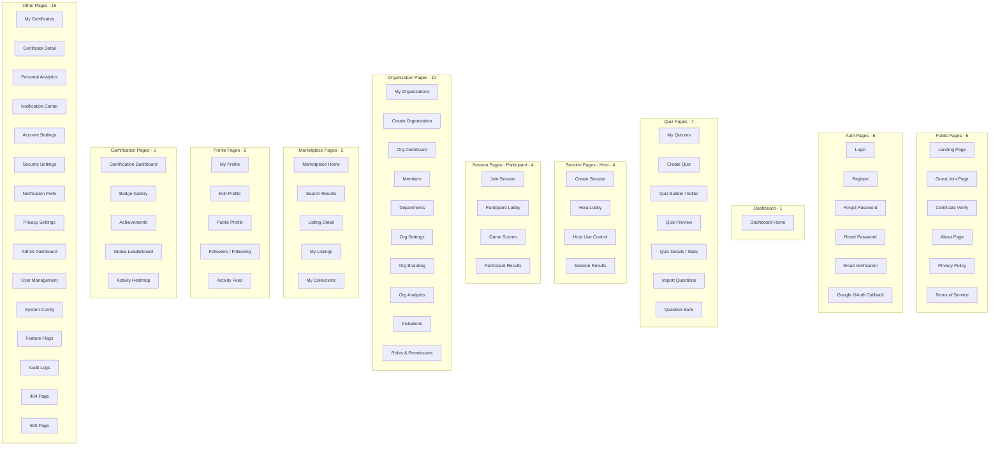
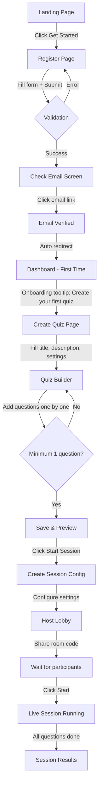
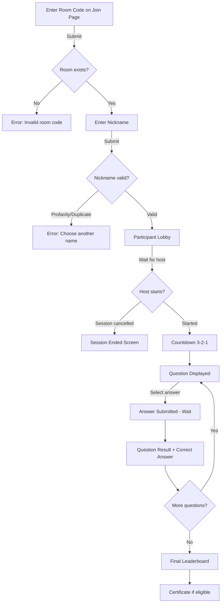
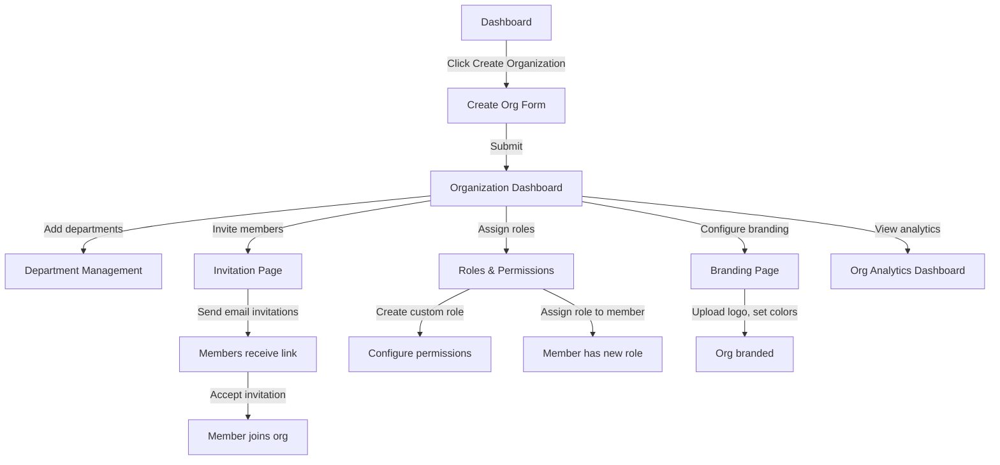
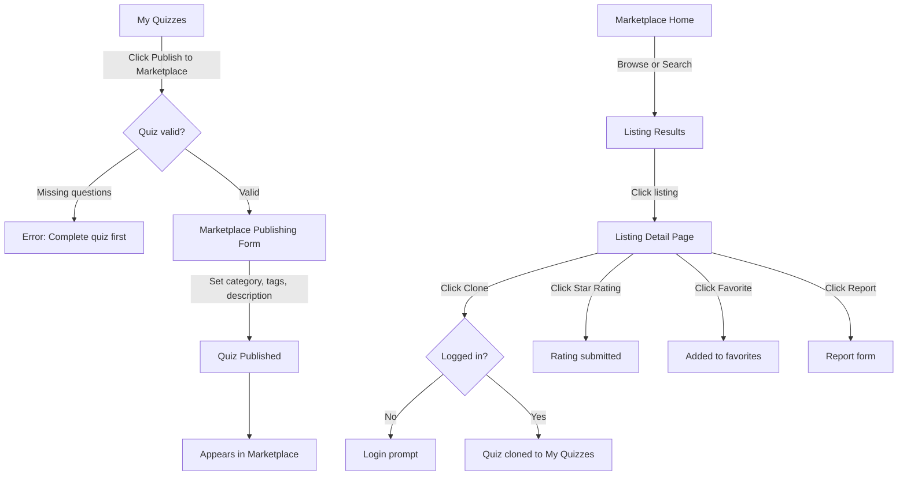
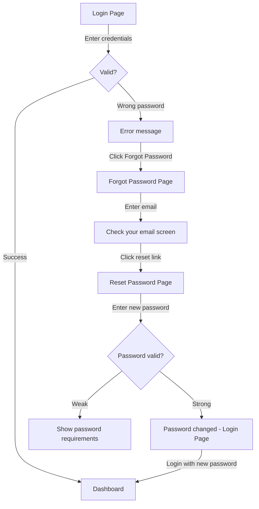

# 11 — UI/UX Design & Page Architecture

**Document ID:** AERO-UI-011  
**Version:** 1.0  
**Last Updated:** 2026-07-16  
**Author:** Lead UI/UX Designer & Frontend Architect  
**Status:** Approved  
**Classification:** Internal — Design & Engineering

---

## Table of Contents

1. [Purpose](#1-purpose)
2. [Design Philosophy](#2-design-philosophy)
3. [Design System — Light Theme](#3-design-system--light-theme)
4. [Typography System](#4-typography-system)
5. [Spacing & Layout System](#5-spacing--layout-system)
6. [Component Library](#6-component-library)
7. [Icon System](#7-icon-system)
8. [Page Map — Complete Application](#8-page-map--complete-application)
9. [User Flow Diagrams](#9-user-flow-diagrams)
10. [Public Pages](#10-public-pages)
11. [Authentication Pages](#11-authentication-pages)
12. [Dashboard & Home](#12-dashboard--home)
13. [Quiz Management Pages](#13-quiz-management-pages)
14. [Live Session Pages — Host](#14-live-session-pages--host)
15. [Live Session Pages — Participant](#15-live-session-pages--participant)
16. [Organization Pages](#16-organization-pages)
17. [Marketplace Pages](#17-marketplace-pages)
18. [Profile & Social Pages](#18-profile--social-pages)
19. [Gamification Pages](#19-gamification-pages)
20. [Certificate Pages](#20-certificate-pages)
21. [Analytics Pages](#21-analytics-pages)
22. [Notification Pages](#22-notification-pages)
23. [Settings Pages](#23-settings-pages)
24. [Admin Pages](#24-admin-pages)
25. [Error Pages](#25-error-pages)
26. [Responsive Design Strategy](#26-responsive-design-strategy)
27. [Accessibility (a11y)](#27-accessibility-a11y)
28. [Animation & Motion Design](#28-animation--motion-design)
29. [Loading & Empty States](#29-loading--empty-states)
30. [Toast & Feedback System](#30-toast--feedback-system)
31. [References](#31-references)

---

## 1. Purpose

This document defines the **complete UI/UX architecture** for Aero MAGE. Every page, every user flow, every component, every color, every interaction is documented here. This serves as the single source of truth for the frontend design and implementation team.

**Theme:** Light theme ONLY (no dark mode).

**Total Pages:** 68

---

## 2. Design Philosophy

| Principle | Description |
|-----------|-------------|
| **Clean & Modern** | Minimal, uncluttered layouts. Generous whitespace. No visual noise. |
| **Vibrant & Engaging** | Bold accent colors, gradient highlights, micro-animations. The platform should feel alive. |
| **Consistent** | Every page uses the same design system. Zero one-off styles. |
| **Responsive First** | Desktop-first design with full mobile adaptation. |
| **Accessible** | WCAG 2.1 AA compliance. Proper contrast ratios. Keyboard navigation. Screen reader support. |
| **Fast** | No layout shifts. Skeleton loaders. Optimistic updates. Instant feedback. |
| **Delightful** | Subtle animations, confetti on achievements, smooth transitions. Moments of joy. |
| **Information Dense Without Clutter** | Show relevant data without overwhelming. Progressive disclosure for complexity. |

---

## 3. Design System — Light Theme

### 3.1 Color Palette

#### Primary Colors

| Token | Hex | Usage |
|-------|-----|-------|
| `--primary-50` | `#EEF2FF` | Lightest tint, subtle backgrounds |
| `--primary-100` | `#E0E7FF` | Hover backgrounds, tag fills |
| `--primary-200` | `#C7D2FE` | Focus rings, borders |
| `--primary-300` | `#A5B4FC` | Active borders |
| `--primary-400` | `#818CF8` | Icons, secondary buttons |
| `--primary-500` | `#6366F1` | **Primary brand color**. Buttons, links, active states. |
| `--primary-600` | `#4F46E5` | Hover on primary buttons |
| `--primary-700` | `#4338CA` | Active/pressed on primary buttons |
| `--primary-800` | `#3730A3` | Deep accents |
| `--primary-900` | `#312E81` | Headings, emphasis text |

#### Secondary Colors

| Token | Hex | Usage |
|-------|-----|-------|
| `--secondary-500` | `#8B5CF6` | Secondary actions, gradients |
| `--accent-500` | `#EC4899` | Highlights, badges, notifications |
| `--teal-500` | `#14B8A6` | Success states, positive indicators |
| `--amber-500` | `#F59E0B` | Warnings, XP/coin indicators |
| `--rose-500` | `#F43F5E` | Errors, destructive actions |

#### Neutral Colors

| Token | Hex | Usage |
|-------|-----|-------|
| `--white` | `#FFFFFF` | Page background, card backgrounds |
| `--gray-25` | `#FCFCFD` | Subtle alternate backgrounds |
| `--gray-50` | `#F9FAFB` | Page backgrounds, table striping |
| `--gray-100` | `#F3F4F6` | Card backgrounds, input backgrounds |
| `--gray-200` | `#E5E7EB` | Borders, dividers |
| `--gray-300` | `#D1D5DB` | Disabled borders, placeholder icons |
| `--gray-400` | `#9CA3AF` | Placeholder text, disabled text |
| `--gray-500` | `#6B7280` | Secondary text, captions |
| `--gray-600` | `#4B5563` | Body text |
| `--gray-700` | `#374151` | Strong body text |
| `--gray-800` | `#1F2937` | Headings, important text |
| `--gray-900` | `#111827` | Page titles, high emphasis |

#### Semantic Colors

| Token | Background | Border | Text | Usage |
|-------|-----------|--------|------|-------|
| `--success` | `#ECFDF5` | `#6EE7B7` | `#065F46` | Success messages, positive status |
| `--warning` | `#FFFBEB` | `#FCD34D` | `#92400E` | Warnings, pending status |
| `--error` | `#FEF2F2` | `#FCA5A5` | `#991B1B` | Errors, destructive actions |
| `--info` | `#EFF6FF` | `#93C5FD` | `#1E40AF` | Information, tips |

#### Gradients

| Token | Gradient | Usage |
|-------|---------|-------|
| `--gradient-primary` | `linear-gradient(135deg, #6366F1, #8B5CF6)` | Primary buttons, hero sections |
| `--gradient-accent` | `linear-gradient(135deg, #8B5CF6, #EC4899)` | Feature highlights, CTA |
| `--gradient-warm` | `linear-gradient(135deg, #F59E0B, #EC4899)` | XP bars, achievement unlocks |
| `--gradient-cool` | `linear-gradient(135deg, #6366F1, #14B8A6)` | Session backgrounds, progress |
| `--gradient-surface` | `linear-gradient(180deg, #F9FAFB, #FFFFFF)` | Page background subtle gradient |

### 3.2 Shadows

| Token | Value | Usage |
|-------|-------|-------|
| `--shadow-xs` | `0 1px 2px rgba(0,0,0,0.05)` | Subtle elevation |
| `--shadow-sm` | `0 1px 3px rgba(0,0,0,0.1), 0 1px 2px rgba(0,0,0,0.06)` | Cards, inputs |
| `--shadow-md` | `0 4px 6px rgba(0,0,0,0.07), 0 2px 4px rgba(0,0,0,0.06)` | Dropdowns, popovers |
| `--shadow-lg` | `0 10px 15px rgba(0,0,0,0.1), 0 4px 6px rgba(0,0,0,0.05)` | Modals, floating panels |
| `--shadow-xl` | `0 20px 25px rgba(0,0,0,0.1), 0 10px 10px rgba(0,0,0,0.04)` | Overlays, page-level modals |
| `--shadow-glow` | `0 0 20px rgba(99,102,241,0.15)` | Focus states, active cards |

### 3.3 Border Radius

| Token | Value | Usage |
|-------|-------|-------|
| `--radius-sm` | `6px` | Inputs, tags, small elements |
| `--radius-md` | `8px` | Cards, buttons |
| `--radius-lg` | `12px` | Modals, panels |
| `--radius-xl` | `16px` | Large cards, feature sections |
| `--radius-2xl` | `24px` | Hero sections, rounded panels |
| `--radius-full` | `9999px` | Pills, avatars, badges |

---

## 4. Typography System

**Font Family:** `Inter` (Google Fonts) — clean, modern, excellent readability.

**Fallback:** `system-ui, -apple-system, BlinkMacSystemFont, 'Segoe UI', sans-serif`

| Token | Size | Weight | Line Height | Usage |
|-------|------|--------|-------------|-------|
| `--text-xs` | 12px | 400 | 16px | Captions, timestamps, fine print |
| `--text-sm` | 14px | 400 | 20px | Secondary text, table cells, form labels |
| `--text-base` | 16px | 400 | 24px | Body text, paragraphs |
| `--text-lg` | 18px | 500 | 28px | Card titles, sub-section headers |
| `--text-xl` | 20px | 600 | 28px | Section headers |
| `--text-2xl` | 24px | 600 | 32px | Page sub-titles |
| `--text-3xl` | 30px | 700 | 36px | Page titles |
| `--text-4xl` | 36px | 700 | 40px | Hero headlines |
| `--text-5xl` | 48px | 800 | 48px | Landing page hero, big numbers |
| `--text-6xl` | 60px | 800 | 60px | Landing page super-hero |

**Mono Font (Code):** `'JetBrains Mono', 'Fira Code', monospace`

---

## 5. Spacing & Layout System

### 5.1 Spacing Scale

| Token | Value | Usage |
|-------|-------|-------|
| `--space-0` | 0px | — |
| `--space-1` | 4px | Tight spacing, inline gaps |
| `--space-2` | 8px | Icon-to-text gap, compact elements |
| `--space-3` | 12px | Form field gaps |
| `--space-4` | 16px | Card padding, section gaps |
| `--space-5` | 20px | — |
| `--space-6` | 24px | Card padding (large), group gaps |
| `--space-8` | 32px | Section spacing |
| `--space-10` | 40px | Page section gaps |
| `--space-12` | 48px | Major section breaks |
| `--space-16` | 64px | Page top/bottom padding |
| `--space-20` | 80px | Hero section padding |

### 5.2 Layout Breakpoints

| Breakpoint | Width | Target |
|-----------|-------|--------|
| `--mobile` | 0 – 639px | Phones |
| `--tablet` | 640 – 1023px | Tablets |
| `--desktop` | 1024 – 1279px | Laptops |
| `--wide` | 1280 – 1535px | Desktops |
| `--ultrawide` | 1536px+ | Large monitors |

### 5.3 Layout Grid

```
Desktop Layout:
┌──────────────────────────────────────────────────────┐
│ Top Navigation Bar (64px height, sticky)             │
├─────────┬────────────────────────────────────────────┤
│ Sidebar │ Main Content Area                          │
│ (256px) │ (max-width: 1200px, centered)              │
│         │                                            │
│ Nav     │ ┌─ Page Header ────────────────────────┐   │
│ Items   │ │ Title + Breadcrumb + Actions         │   │
│         │ └──────────────────────────────────────┘   │
│ Org     │                                            │
│ Switcher│ ┌─ Page Content ───────────────────────┐   │
│         │ │                                      │   │
│ User    │ │  Cards / Tables / Forms              │   │
│ Avatar  │ │                                      │   │
│         │ └──────────────────────────────────────┘   │
├─────────┴────────────────────────────────────────────┤
│ (No footer on dashboard pages)                       │
└──────────────────────────────────────────────────────┘

Mobile Layout:
┌──────────────────────┐
│ Top Bar + Hamburger  │
├──────────────────────┤
│                      │
│ Full-width Content   │
│                      │
├──────────────────────┤
│ Bottom Tab Bar (56px)│
└──────────────────────┘
```

---

## 6. Component Library

### 6.1 Buttons

| Variant | Appearance | Usage |
|---------|-----------|-------|
| **Primary** | Gradient background (`--gradient-primary`), white text, rounded-md, shadow-sm | Main CTA: "Create Quiz", "Start Session", "Save" |
| **Secondary** | White background, primary border, primary text | Secondary actions: "Cancel", "Back", "Clone" |
| **Ghost** | Transparent background, primary text, hover: primary-50 bg | Tertiary actions: "View All", "Show More" |
| **Danger** | Rose-500 background, white text | Destructive: "Delete", "Remove", "Leave Organization" |
| **Danger Ghost** | Transparent, rose text, hover: rose-50 bg | Soft destructive: "Remove Member" |
| **Icon Button** | Circle or square, gray-100 bg, icon center | Action icons: edit, delete, menu, close |
| **FAB** | Circular, gradient, shadow-lg, floating | Mobile: "Create Quiz" floating action |

**Button Sizes:**

| Size | Height | Font Size | Padding |
|------|--------|-----------|---------|
| `xs` | 28px | 12px | 8px 12px |
| `sm` | 32px | 14px | 8px 16px |
| `md` | 40px | 14px | 10px 20px |
| `lg` | 48px | 16px | 12px 24px |
| `xl` | 56px | 18px | 16px 32px |

**States:** Default → Hover (darken + slight scale 1.02) → Active (darken more + scale 0.98) → Disabled (opacity 0.5, no pointer) → Loading (spinner replaces text)

### 6.2 Form Inputs

| Component | Description |
|-----------|-------------|
| **Text Input** | Gray-100 background, gray-200 border, 40px height, 8px radius. Focus: primary-500 border + shadow-glow |
| **Textarea** | Same as input, auto-resize, min 80px |
| **Select** | Custom dropdown with search (for long lists). Chevron icon right. |
| **Checkbox** | 20×20, rounded-sm, primary-500 when checked, animated checkmark |
| **Radio** | 20×20, rounded-full, primary dot when selected |
| **Toggle Switch** | 44×24, gray-300 track → primary-500 track when on, white circle thumb, animated |
| **Number Input** | Text input with +/- stepper buttons |
| **Color Picker** | Swatch grid + hex input + preview |
| **Date Picker** | Calendar dropdown, month/year navigation |
| **File Upload** | Dashed border zone, drag-and-drop support, preview thumbnail |
| **Rich Text Editor** | Toolbar (bold, italic, underline, code, link), markdown preview (V2) |

### 6.3 Cards

| Type | Description |
|------|-------------|
| **Quiz Card** | Cover image (200px), title, category badge, difficulty badge, question count, play count, author avatar+name, 3-dot menu. Shadow-sm, hover: shadow-md + translate-y(-2px). |
| **Session Card** | Status badge (color-coded), quiz title, room code, participant count, date, duration. |
| **Organization Card** | Logo/avatar, name, member count, role badge, status indicator. |
| **Marketplace Card** | Cover, title, creator, star rating, clone count, difficulty, category tag. |
| **Badge Card** | Badge icon (centered, 64px), name, rarity glow effect, earned date. |
| **Stat Card** | Icon (left), big number, label, trend arrow (up/down), mini sparkline. |
| **Notification Card** | Icon (type), title, body preview, time ago, read/unread dot. |

### 6.4 Modals & Dialogs

| Type | Width | Usage |
|------|-------|-------|
| **Confirmation Dialog** | 400px | "Are you sure?" with cancel + confirm buttons |
| **Form Modal** | 560px | Create/Edit entity (organization, department, etc.) |
| **Large Modal** | 720px | Quiz import, bulk operations |
| **Full-screen Modal** | 100vw | Quiz Builder (on mobile) |
| **Bottom Sheet** | 100vw, slide up | Mobile-only, action menus |
| **Command Palette** | 640px, top-center | Global search (Ctrl+K) |

### 6.5 Navigation

| Component | Description |
|-----------|-------------|
| **Top Navbar** | 64px height, white bg, shadow-xs. Logo left, search center, notifications + user right. Sticky. |
| **Sidebar** | 256px width, white bg, collapsible to 64px (icons only). Sections: Main, Organization, Account. |
| **Breadcrumb** | Slash-separated path. Last item is current page (non-clickable). |
| **Tabs** | Underline-style tabs. Active tab: primary-500 underline + primary text. |
| **Pagination** | Page numbers + prev/next arrows + "showing X of Y" text. |
| **Bottom Tab Bar** | Mobile only. 5 icons: Home, Quizzes, Join, Marketplace, Profile. |

### 6.6 Data Display

| Component | Description |
|-----------|-------------|
| **Table** | Alternating row colors (white/gray-50), sticky header, sortable columns, row hover highlight. |
| **Badge/Tag** | Pill shape, colored by status. Green=active, amber=pending, red=error, blue=info, purple=premium. |
| **Avatar** | Round, 32/40/48/64/96px. Fallback: initials on primary-100 bg. Online indicator dot. |
| **Progress Bar** | Rounded track (gray-200), fill with gradient. Label optional. |
| **Donut Chart** | For percentage breakdowns. Animated on first render. |
| **Bar Chart** | Vertical bars, tooltip on hover. |
| **Line Chart** | Smooth lines, area fill option, responsive. |
| **Heatmap** | GitHub-style contribution grid. 4 intensity levels + empty. |
| **Sparkline** | Tiny inline chart (40×20px) for trends in stat cards. |
| **Countdown Timer** | Large digits with colon separator, animated. Used in live sessions. |
| **Room Code Display** | Large, spaced, monospace characters. Copy button. |
| **Leaderboard Row** | Rank medal (1st/2nd/3rd special), avatar, name, score, trend. |

### 6.7 Feedback & Overlays

| Component | Description |
|-----------|-------------|
| **Toast** | Top-right, auto-dismiss (5s). Types: success (green), error (red), warning (amber), info (blue). |
| **Skeleton Loader** | Gray shimmer blocks matching content shape. Used on every data-loading state. |
| **Spinner** | 20px circular spinner with primary-500. Used in buttons and inline loading. |
| **Empty State** | Centered illustration, title, description, CTA button. |
| **Confetti** | Particle explosion for celebrations (badge earned, quiz won, level up). |
| **Tooltip** | Dark tooltip on hover, 6px radius, arrow. Max 200px width. |
| **Popover** | Card-style dropdown with content. Triggered on click. |

---

## 7. Icon System

**Library:** Lucide React (open-source, consistent style, 1000+ icons)

**Icon Sizes:**

| Size | Pixels | Usage |
|------|--------|-------|
| `xs` | 14px | Inline with small text |
| `sm` | 16px | Button icons, table actions |
| `md` | 20px | Navigation items, form icons |
| `lg` | 24px | Card icons, feature icons |
| `xl` | 32px | Empty state icons, dashboard |
| `2xl` | 48px | Hero sections, big features |

---

## 8. Page Map — Complete Application

### 8.1 All Pages (68 Pages)



### 8.2 URL Routing Map

| Route | Page | Auth Required | Permission |
|-------|------|--------------|------------|
| `/` | Landing Page | ❌ | — |
| `/join` | Guest Join | ❌ | — |
| `/join/:roomCode` | Guest Join (prefilled) | ❌ | — |
| `/verify/:certificateId` | Certificate Verification | ❌ | — |
| `/about` | About | ❌ | — |
| `/privacy` | Privacy Policy | ❌ | — |
| `/terms` | Terms of Service | ❌ | — |
| `/login` | Login | ❌ (redirect if logged in) | — |
| `/register` | Register | ❌ (redirect if logged in) | — |
| `/forgot-password` | Forgot Password | ❌ | — |
| `/reset-password/:token` | Reset Password | ❌ | — |
| `/verify-email/:token` | Email Verification | ❌ | — |
| `/auth/google/callback` | Google OAuth Callback | ❌ | — |
| `/dashboard` | Dashboard Home | ✅ | — |
| `/quizzes` | My Quizzes | ✅ | `quiz:read` |
| `/quizzes/create` | Create Quiz | ✅ | `quiz:create` |
| `/quizzes/:id/edit` | Quiz Builder | ✅ | `quiz:update` (own) |
| `/quizzes/:id/preview` | Quiz Preview | ✅ | `quiz:read` (own) |
| `/quizzes/:id` | Quiz Details | ✅ | `quiz:read` (own) |
| `/quizzes/:id/import` | Import Questions | ✅ | `quiz:import` |
| `/question-bank` | Question Bank | ✅ | `question_bank:read` |
| `/sessions/create/:quizId` | Create Session | ✅ | `room:create` |
| `/sessions/:id/lobby` | Host Lobby | ✅ | `room:start` |
| `/sessions/:id/live` | Host Live Control | ✅ | `room:start` |
| `/sessions/:id/results` | Session Results | ✅ | — |
| `/play/join` | Join Session (participant) | ❌ | — |
| `/play/:roomCode/lobby` | Participant Lobby | ❌ | — |
| `/play/:roomCode/game` | Game Screen | ❌ | — |
| `/play/:roomCode/results` | Participant Results | ❌ | — |
| `/organizations` | My Organizations | ✅ | — |
| `/organizations/create` | Create Organization | ✅ | `organization:create` |
| `/organizations/:id` | Org Dashboard | ✅ | `organization:read` |
| `/organizations/:id/members` | Members | ✅ | `member:view` |
| `/organizations/:id/departments` | Departments | ✅ | `department:read` |
| `/organizations/:id/settings` | Org Settings | ✅ | `organization:configure` |
| `/organizations/:id/branding` | Org Branding | ✅ | `organization:configure` |
| `/organizations/:id/analytics` | Org Analytics | ✅ | `analytics:view_org` |
| `/organizations/:id/invitations` | Invitations | ✅ | `member:invite` |
| `/organizations/:id/roles` | Roles & Permissions | ✅ | `role:create` |
| `/marketplace` | Marketplace Home | ✅ | — |
| `/marketplace/search` | Search Results | ✅ | — |
| `/marketplace/:id` | Listing Detail | ✅ | — |
| `/marketplace/my-listings` | My Listings | ✅ | `marketplace:publish` |
| `/marketplace/collections` | My Collections | ✅ | — |
| `/profile` | My Profile | ✅ | — |
| `/profile/edit` | Edit Profile | ✅ | — |
| `/users/:id` | Public Profile | ✅ | — |
| `/profile/followers` | Followers / Following | ✅ | — |
| `/profile/activity` | Activity Feed | ✅ | — |
| `/gamification` | Gamification Dashboard | ✅ | — |
| `/gamification/badges` | Badge Gallery | ✅ | — |
| `/gamification/achievements` | Achievements | ✅ | — |
| `/gamification/leaderboard` | Global Leaderboard | ✅ | — |
| `/gamification/heatmap` | Activity Heatmap | ✅ | — |
| `/certificates` | My Certificates | ✅ | — |
| `/certificates/:id` | Certificate Detail | ✅ | — |
| `/analytics` | Personal Analytics | ✅ | `analytics:view` |
| `/notifications` | Notification Center | ✅ | — |
| `/settings/account` | Account Settings | ✅ | — |
| `/settings/security` | Security Settings | ✅ | — |
| `/settings/notifications` | Notification Prefs | ✅ | — |
| `/settings/privacy` | Privacy Settings | ✅ | — |
| `/admin` | Admin Dashboard | ✅ | `config:manage` |
| `/admin/users` | User Management | ✅ | `user:manage` |
| `/admin/config` | System Config | ✅ | `config:manage` |
| `/admin/feature-flags` | Feature Flags | ✅ | `feature_flag:manage` |
| `/admin/audit` | Audit Logs | ✅ | `audit:view` |

---

## 9. User Flow Diagrams

### 9.1 New User Registration → First Quiz Flow



### 9.2 Guest Participant Flow



### 9.3 Organization Admin Flow



### 9.4 Marketplace Flow



### 9.5 Login → Password Reset Flow



---

## 10. Public Pages

### 10.1 Landing Page (`/`)

```
┌─────────────────────────────────────────────────────────────┐
│ NAVBAR: Logo │ Features │ Marketplace │ About ─── Login │ Get Started │
├─────────────────────────────────────────────────────────────┤
│                                                             │
│              HERO SECTION (full viewport height)            │
│                                                             │
│   "Learning Made Interactive."                              │
│   "Create quizzes. Run live sessions.                       │
│    Engage learners in real-time."                           │
│                                                             │
│   [Get Started Free]  [Join a Session →]                    │
│                                                             │
│   Illustration: animated quiz session mockup                │
│                                                             │
├─────────────────────────────────────────────────────────────┤
│                                                             │
│   FEATURES GRID (3 columns)                                 │
│                                                             │
│   ┌──────────┐  ┌──────────┐  ┌──────────┐                 │
│   │ 📝       │  │ 🎮       │  │ 🏆       │                 │
│   │ Create   │  │ Live     │  │ Gamified │                 │
│   │ Quizzes  │  │ Sessions │  │ Learning │                 │
│   │ 22+ types│  │ Real-time│  │ XP,Badge │                 │
│   └──────────┘  └──────────┘  └──────────┘                 │
│                                                             │
│   ┌──────────┐  ┌──────────┐  ┌──────────┐                 │
│   │ 🏢       │  │ 🛒       │  │ 📊       │                 │
│   │ Orgs     │  │ Market   │  │ Analytics│                 │
│   │ Teams    │  │ Share    │  │ Insights │                 │
│   └──────────┘  └──────────┘  └──────────┘                 │
│                                                             │
├─────────────────────────────────────────────────────────────┤
│                                                             │
│   HOW IT WORKS (3-step visual)                              │
│   1. Create → 2. Host → 3. Engage                          │
│                                                             │
├─────────────────────────────────────────────────────────────┤
│                                                             │
│   SOCIAL PROOF / STATS                                      │
│   "10,000+ quizzes created" "50,000+ sessions"              │
│                                                             │
├─────────────────────────────────────────────────────────────┤
│                                                             │
│   CTA SECTION (gradient background)                         │
│   "Ready to transform learning?"                            │
│   [Create Your Free Account]                                │
│                                                             │
├─────────────────────────────────────────────────────────────┤
│ FOOTER: Links │ Social │ © 2026 Aero MAGE                   │
└─────────────────────────────────────────────────────────────┘
```

**Interactions:**
- Hero illustration: animated SVG showing quiz cards floating / connecting
- Feature cards: hover → subtle lift + icon color change
- Stats: count-up animation when section scrolls into view
- Smooth scroll navigation between sections
- "Join a Session" button → redirects to `/join`
- If user is already logged in, redirect to `/dashboard`

### 10.2 Guest Join Page (`/join`)

```
┌──────────────────────────────────────────┐
│           AERO MAGE Logo                 │
│                                          │
│   ┌──────────────────────────────┐       │
│   │                              │       │
│   │     Join a Live Session      │       │
│   │                              │       │
│   │   Enter the 6-digit code     │       │
│   │   shown on the host screen   │       │
│   │                              │       │
│   │   ┌──┐ ┌──┐ ┌──┐ ┌──┐ ┌──┐ ┌──┐   │
│   │   │  │ │  │ │  │ │  │ │  │ │  │   │
│   │   └──┘ └──┘ └──┘ └──┘ └──┘ └──┘   │
│   │                              │       │
│   │   [Join Game →]              │       │
│   │                              │       │
│   │   ─── or ───                 │       │
│   │                              │       │
│   │   Have an account?           │       │
│   │   [Login] to track progress  │       │
│   │                              │       │
│   └──────────────────────────────┘       │
│                                          │
│   Fun animated background pattern        │
└──────────────────────────────────────────┘
```

**Functionality:**
- 6-digit room code input (auto-focus, auto-advance between digits)
- Submit validates room code via API
- If valid → transition to nickname entry
- If invalid → shake animation + "Room not found" error
- If room is locked → "This room is locked" error
- If room is full → "Room is full" error

### 10.3 Certificate Verification Page (`/verify/:certificateId`)

```
┌──────────────────────────────────────────┐
│ Logo                                     │
│                                          │
│   ┌──────────────────────────────┐       │
│   │   ✅ Verified Certificate    │       │
│   │                              │       │
│   │   This certificate was       │       │
│   │   issued by Aero MAGE        │       │
│   │                              │       │
│   │   Recipient: John Doe        │       │
│   │   Quiz: JavaScript Basics    │       │
│   │   Score: 85%                 │       │
│   │   Date: July 16, 2026        │       │
│   │   Organization: Tech Academy │       │
│   │                              │       │
│   │   Certificate ID: XXXX-XXXX  │       │
│   │                              │       │
│   │   [Download PDF]             │       │
│   └──────────────────────────────┘       │
└──────────────────────────────────────────┘
```

---

## 11. Authentication Pages

### 11.1 Login Page (`/login`)

```
┌───────────────────────────────────────────────────────────────┐
│                                                               │
│   ┌─────────────────────┐    ┌───────────────────────────┐   │
│   │                     │    │                           │   │
│   │   Brand Illustration │    │   Welcome Back            │   │
│   │   or gradient panel  │    │                           │   │
│   │   with tagline       │    │   [Continue with Google]  │   │
│   │                     │    │                           │   │
│   │   "Where Learning   │    │   ──── or ────            │   │
│   │    Meets Play"      │    │                           │   │
│   │                     │    │   Email                    │   │
│   │   3 rotating        │    │   ┌───────────────────┐   │   │
│   │   testimonials      │    │   │                   │   │   │
│   │                     │    │   └───────────────────┘   │   │
│   │                     │    │                           │   │
│   │                     │    │   Password                │   │
│   │                     │    │   ┌───────────────────┐   │   │
│   │                     │    │   │             👁    │   │   │
│   │                     │    │   └───────────────────┘   │   │
│   │                     │    │                           │   │
│   │                     │    │   [Forgot Password?]      │   │
│   │                     │    │                           │   │
│   │                     │    │   [Log In]                 │   │
│   │                     │    │                           │   │
│   │                     │    │   Don't have an account?  │   │
│   │                     │    │   [Register →]            │   │
│   │                     │    │                           │   │
│   └─────────────────────┘    └───────────────────────────┘   │
│                                                               │
└───────────────────────────────────────────────────────────────┘
```

**Functionality:**
- Google OAuth button (top, most prominent)
- Divider "or" between Google and email/password
- Email: validated on blur (format check)
- Password: show/hide toggle (eye icon)
- "Forgot Password?" link → `/forgot-password`
- Submit: loading spinner in button, disable form
- Success: redirect to `/dashboard`
- Error: inline error message below form (shake animation)
- Rate limit: show "Too many attempts. Try again in X minutes."
- Already logged in: redirect to `/dashboard`

### 11.2 Register Page (`/register`)

```
Same split layout as Login, right panel:

│   Create Your Account                    │
│                                          │
│   [Continue with Google]                 │
│                                          │
│   ──── or ────                           │
│                                          │
│   Display Name                           │
│   ┌──────────────────────────┐           │
│   │                          │           │
│   └──────────────────────────┘           │
│                                          │
│   Email                                  │
│   ┌──────────────────────────┐           │
│   │                          │           │
│   └──────────────────────────┘           │
│                                          │
│   Password          Strength: ████░ Good │
│   ┌──────────────────────────┐           │
│   │                    👁    │           │
│   └──────────────────────────┘           │
│   8+ chars • Uppercase • Digit • Special │
│                                          │
│   Confirm Password                       │
│   ┌──────────────────────────┐           │
│   │                    👁    │           │
│   └──────────────────────────┘           │
│                                          │
│   ☐ I agree to Terms & Privacy Policy    │
│                                          │
│   [Create Account]                       │
│                                          │
│   Already have an account? [Login →]     │
```

**Functionality:**
- Display name: 2–50 chars, real-time validation
- Email: format validation on blur, check availability on blur (debounced)
- Password: strength meter (4 levels: weak/fair/good/strong), color-coded bar
- Password requirements shown as mini checklist (checked items turn green)
- Confirm password: match validation
- Terms checkbox required
- Submit: creates account → shows "Check your email" screen
- Google OAuth: auto-creates account with verified email

### 11.3 Forgot Password (`/forgot-password`)

```
Centered card (480px):

│   Forgot Password?                       │
│                                          │
│   Enter your email and we'll send        │
│   a reset link.                          │
│                                          │
│   Email                                  │
│   ┌──────────────────────────┐           │
│   │                          │           │
│   └──────────────────────────┘           │
│                                          │
│   [Send Reset Link]                      │
│                                          │
│   [← Back to Login]                      │
```

**After Submit:**

```
│   ✉️ Check Your Email                    │
│                                          │
│   We've sent a reset link to             │
│   j***@example.com                       │
│                                          │
│   Didn't receive it?                     │
│   [Resend] (countdown timer: 60s)        │
│                                          │
│   [← Back to Login]                      │
```

### 11.4 Reset Password (`/reset-password/:token`)

```
Centered card:

│   Reset Your Password                    │
│                                          │
│   New Password       Strength: ████░     │
│   ┌──────────────────────────┐           │
│   │                    👁    │           │
│   └──────────────────────────┘           │
│                                          │
│   Confirm New Password                   │
│   ┌──────────────────────────┐           │
│   │                    👁    │           │
│   └──────────────────────────┘           │
│                                          │
│   [Reset Password]                       │
```

---

## 12. Dashboard & Home

### 12.1 Dashboard (`/dashboard`)

```
┌──────────────────────────────────────────────────────────────────┐
│ [Logo] ──── [🔍 Search...   Ctrl+K] ──── [🔔 3] [Avatar ▼]    │
├─────────┬────────────────────────────────────────────────────────┤
│         │                                                        │
│ 📊 Home │  Good Morning, John! 👋                                │
│ 📝 Quiz │                                                        │
│ 🎮 Sess │  ┌──────────┐ ┌──────────┐ ┌──────────┐ ┌──────────┐ │
│ 🏢 Orgs │  │ 12       │ │ 45       │ │ 8        │ │ 2,450    │ │
│ 🛒 Mkt  │  │ Quizzes  │ │ Sessions │ │ Active   │ │ Total XP │ │
│ 🏆 Game │  │ Created  │ │ Hosted   │ │ Today    │ │ Level 5  │ │
│ 📊 Stats│  │ ↑ 2 new  │ │ ↑ 3 new  │ │          │ │ ████░    │ │
│ 📜 Cert │  └──────────┘ └──────────┘ └──────────┘ └──────────┘ │
│         │                                                        │
│ ─────── │  Quick Actions                                         │
│ ⚙ Set  │  [+ Create Quiz] [▶ Start Session] [📥 Join Session]  │
│ 👤 Prof │                                                        │
│         │  Recent Quizzes ──────────────────── [View All →]      │
│         │  ┌───────────┐ ┌───────────┐ ┌───────────┐            │
│         │  │ JS Basics │ │ React 101 │ │ CSS Quiz  │            │
│         │  │ 10 Q • Pub│ │ 5 Q • Drf │ │ 15 Q • Pub│            │
│         │  │ ▶ 23 plays│ │ ✏ Draft   │ │ ▶ 8 plays │            │
│         │  └───────────┘ └───────────┘ └───────────┘            │
│         │                                                        │
│         │  Recent Sessions ─────────────────── [View All →]      │
│         │  ┌─────────────────────────────────────────────────┐  │
│         │  │ Room  │ Quiz        │ Players │ Date   │ Status │  │
│         │  │ A3F2K1│ JS Basics   │ 24      │ Today  │ ✅ Done│  │
│         │  │ B7G4H2│ React 101   │ 12      │ Yester │ ✅ Done│  │
│         │  └─────────────────────────────────────────────────┘  │
│         │                                                        │
│         │  Activity Heatmap (mini) ──────── [View Full →]        │
│         │  ░░█░░░█████░░░█░██░░░░█░░░█░░█████░░░                │
│         │                                                        │
│         │  Notifications ──────────────────── [View All →]       │
│         │  • 🏆 You earned "Quiz Creator" badge!         2h ago │
│         │  • 👤 3 new members joined Tech Academy        5h ago │
│         │  • 📝 Your quiz "CSS Quiz" was cloned          1d ago │
│         │                                                        │
└─────────┴────────────────────────────────────────────────────────┘
```

**Dashboard Functionality:**
- **Stat Cards:** 4 key metrics with trend indicators (up/down arrow + value vs last week)
- **Quick Actions:** 3 primary CTAs always visible
- **Recent Quizzes:** Last 4 quizzes as cards, horizontal scroll on mobile
- **Recent Sessions:** Table with last 5 sessions
- **Mini Heatmap:** Last 90 days of activity (like GitHub)
- **Notifications:** Last 3 unread notifications with "View All" link
- **Organization Switcher:** In sidebar, dropdown to switch org context
- **Greeting:** Time-based (Good Morning/Afternoon/Evening) + user's display name
- **First-time user:** Show onboarding overlay with 3-step tutorial

---

## 13. Quiz Management Pages

### 13.1 My Quizzes (`/quizzes`)

```
┌─────────────────────────────────────────────────────────────┐
│ Page Header                                                 │
│ My Quizzes (12)          [+ Create Quiz]                    │
│                                                             │
│ Filters:                                                    │
│ [All ▼] [Status: All ▼] [Difficulty: All ▼] [🔍 Search...] │
│                                                             │
│ View: [Grid ■■] [List ≡]                  Sort: [Newest ▼] │
│                                                             │
│ ┌───────────────┐ ┌───────────────┐ ┌───────────────┐      │
│ │ 🖼 Cover      │ │ 🖼 Cover      │ │ 🖼 Cover      │      │
│ │               │ │               │ │               │      │
│ │ JS Basics     │ │ React 101     │ │ CSS Mastery   │      │
│ │ Science       │ │ Programming   │ │ Technology    │      │
│ │ ⚡Easy │ 10 Q │ │ ⚡Med  │ 5 Q  │ │ ⚡Hard │ 15 Q │      │
│ │ ▶ 23 plays   │ │ ✏ Draft       │ │ ▶ 8 plays    │      │
│ │ ⋮ menu       │ │ ⋮ menu       │ │ ⋮ menu       │      │
│ └───────────────┘ └───────────────┘ └───────────────┘      │
│                                                             │
│ ┌───────────────┐ ┌───────────────┐                        │
│ │ 🖼 Cover      │ │ + Create New  │                        │
│ │               │ │    Quiz       │                        │
│ │ Python Quiz   │ │               │                        │
│ │ Programming   │ │    (dashed    │                        │
│ │ ⚡Med  │ 8 Q  │ │     border)   │                        │
│ │ 📦 Archived   │ │               │                        │
│ │ ⋮ menu       │ │               │                        │
│ └───────────────┘ └───────────────┘                        │
│                                                             │
│ [← 1 2 3 →]                      Showing 1-9 of 12        │
└─────────────────────────────────────────────────────────────┘
```

**Card Menu (⋮) Options:**
- ✏️ Edit Quiz
- ▶️ Start Session
- 👁 Preview
- 📊 View Analytics
- 📋 Clone
- 🌐 Publish to Marketplace (if published status)
- 📥 Export Questions
- 📦 Archive / Restore
- 🗑 Delete (danger)

### 13.2 Quiz Builder (`/quizzes/:id/edit`)

```
┌─────────────────────────────────────────────────────────────────┐
│ [← Back to Quizzes] │ Quiz Builder │ Auto-saved ✓ │ [Preview] [Publish] │
├─────────────────────────────────────────────────────────────────┤
│                                                                 │
│  ┌─ Quiz Settings (collapsible panel) ───────────────────────┐ │
│  │ Title: [JavaScript Fundamentals                        ]  │ │
│  │ Description: [Test your knowledge of core JS concepts  ]  │ │
│  │                                                           │ │
│  │ Category: [Programming ▼]  Difficulty: [Medium ▼]        │ │
│  │ Visibility: [Private ▼]    Language: [English ▼]          │ │
│  │                                                           │ │
│  │ ⚙ Timer: [Per Question ▼] Default: [30 sec ▼]            │ │
│  │ ☐ Shuffle Questions  ☐ Shuffle Options                    │ │
│  │ ☑ Show Correct Answers  ☑ Show Explanations               │ │
│  │ Passing Score: [70] %                                     │ │
│  │                                                           │ │
│  │ Cover Image: [📷 Upload] or [🎨 Generate]                │ │
│  │ Tags: [javascript] [fundamentals] [+ Add Tag]             │ │
│  └───────────────────────────────────────────────────────────┘ │
│                                                                 │
│  Questions (5) ─────────────────────── [+ Add Question ▼]      │
│                                                                 │
│  ┌─ Q1 ──────────────────────────────────────────────────────┐ │
│  │ [≡ drag] Single Choice                    [⋮ menu] [🗑]  │ │
│  │                                                           │ │
│  │ Question: What does `typeof null` return?                 │ │
│  │                                                           │ │
│  │ ○ "null"                                                  │ │
│  │ ● "object"  ✅ (correct)                                  │ │
│  │ ○ "undefined"                                             │ │
│  │ ○ "boolean"                                               │ │
│  │                                                           │ │
│  │ Points: [1000]  Time: [30s]  Required: [✓]               │ │
│  │                                                           │ │
│  │ [+ Add Explanation] [+ Add Hint] [+ Add Media]           │ │
│  └───────────────────────────────────────────────────────────┘ │
│                                                                 │
│  ┌─ Q2 ──────────────────────────────────────────────────────┐ │
│  │ [≡ drag] True / False                     [⋮ menu] [🗑]  │ │
│  │                                                           │ │
│  │ Question: JavaScript is a compiled language.              │ │
│  │                                                           │ │
│  │ ○ True                                                    │ │
│  │ ● False  ✅                                               │ │
│  │                                                           │ │
│  │ Explanation: "JavaScript is an interpreted language..."   │ │
│  └───────────────────────────────────────────────────────────┘ │
│                                                                 │
│  ┌─ Q3 ──────────────────────────────────────────────────────┐ │
│  │ [≡ drag] Fill in the Blank                [⋮ menu] [🗑]  │ │
│  │ ...                                                       │ │
│  └───────────────────────────────────────────────────────────┘ │
│                                                                 │
│  [+ Add Question]                                               │
│  Type: [Single Choice] [Multiple Choice] [True/False]           │
│        [Fill Blank] [Ordering] [Matching] [Poll]                │
│        [Image] [Audio] [Video] [Code] [Numerical]               │
│                                                                 │
│  [+ Import from Question Bank]  [+ Import CSV]                  │
│                                                                 │
│  ──────────────────────────────────────────────────────────── │
│  Summary: 5 questions │ 5,000 total points │ ~2.5 min est.    │
│  [Save Draft] [Preview] [Publish]                              │
└─────────────────────────────────────────────────────────────────┘
```

**Quiz Builder Functionality:**
- **Drag-and-drop reordering** of questions
- **22 question types** selectable from a type picker
- **Auto-save** every 30 seconds (debounced) — shows "Saving..." → "Saved ✓"
- **Per-question settings:** points, time limit, required flag
- **Media upload:** per question (image, audio, video)
- **Explanation:** shown to participants after answering
- **Hint:** optional, shown before answering
- **Question menu (⋮):** Duplicate, Move Up/Down, Save to Question Bank, Delete
- **Import:** from question bank (search + select) or CSV file upload
- **Keyboard shortcuts:** Ctrl+S (save), Ctrl+Enter (add question)
- **Undo/Redo:** Ctrl+Z / Ctrl+Shift+Z (state history)
- **Validation:** red border on incomplete questions, error count in header

---

## 14. Live Session Pages — Host

### 14.1 Host Lobby (`/sessions/:id/lobby`)

```
┌─────────────────────────────────────────────────────────────┐
│                                                             │
│   JavaScript Fundamentals              [⚙ Settings] [✕]    │
│                                                             │
│          ┌──────────────────────┐                           │
│          │                      │                           │
│          │   Room Code          │                           │
│          │                      │                           │
│          │   A  3  F  2  K  1   │   ← Large, monospace     │
│          │                      │                           │
│          │   [📋 Copy] [QR 📱]  │                           │
│          │                      │                           │
│          │  join at:             │                           │
│          │  aeromage.com/join    │                           │
│          │                      │                           │
│          └──────────────────────┘                           │
│                                                             │
│   Participants (7)                     Max: 500             │
│   ┌─────────────────────────────────────────────────┐      │
│   │ 😎 CoolPlayer42  │ 🦊 FoxRunner  │ 🎮 GamePro  │      │
│   │ 🐱 CatLover99   │ 🌟 StarGazer  │ 🎯 QuizKing │      │
│   │ 🚀 RocketMan    │              │              │      │
│   └─────────────────────────────────────────────────┘      │
│                                                             │
│   ☐ Lock Room (no more joins)                               │
│   ☐ Require authenticated users only                        │
│                                                             │
│                                                             │
│                  [▶ START GAME]                              │
│              (Need at least 1 participant)                   │
│                                                             │
└─────────────────────────────────────────────────────────────┘
```

**Lobby Functionality:**
- Room code displayed prominently (6 characters, spaced, large font)
- Copy button copies room code to clipboard (toast: "Copied!")
- QR code button shows modal with QR code linking to join page
- Participant list updates in real-time (WebSocket)
- New participant: smooth fade-in animation with random emoji
- Host can kick participants (hover → X button)
- Lock room toggle: prevents new joins
- Start button: disabled until ≥1 participant; pulses to draw attention
- Settings gear: edit session settings before starting (time limit, XP multiplier, etc.)
- Participant count updates live with animation

### 14.2 Host Live Control (`/sessions/:id/live`)

```
┌─────────────────────────────────────────────────────────────┐
│ Q 3 of 10     │ 👥 24 participants    │ [⏸ Pause] [⏹ End] │
├─────────────────────────────────────────────────────────────┤
│                                                             │
│   What does `typeof null` return in JavaScript?             │
│                                                             │
│   ┌───────────────────┐  ┌───────────────────┐             │
│   │ A) "null"         │  │ B) "object"  ✅   │             │
│   │    ████░░░░ 8     │  │    █████████ 14   │             │
│   └───────────────────┘  └───────────────────┘             │
│   ┌───────────────────┐  ┌───────────────────┐             │
│   │ C) "undefined"    │  │ D) "boolean"      │             │
│   │    ██░░░░░░ 2     │  │    ░░░░░░░░ 0     │             │
│   └───────────────────┘  └───────────────────┘             │
│                                                             │
│                    ⏱ 12s remaining                          │
│                    ████████░░░░░░░░░ progress bar           │
│                                                             │
│   Answered: 24/24 ✓           Correct: 14 (58%)            │
│   Average Time: 8.3s          Fastest: CoolPlayer42 (2.1s) │
│                                                             │
│   [⏭ Skip Question]  [📊 Show Results]  [➡ Next Question]  │
│                                                             │
├─────────────────────────────────────────────────────────────┤
│ Live Leaderboard (top 5)                                    │
│ 🥇 CoolPlayer42    4,200 pts  │  🥈 StarGazer  3,800 pts  │
│ 🥉 QuizKing        3,500 pts  │  4. FoxRunner   3,100 pts  │
│ 5. GamePro         2,900 pts  │                             │
└─────────────────────────────────────────────────────────────┘
```

**Host Live Controls:**
- **Timer:** Server-authoritative countdown, animated circular or bar timer
- **Answer distribution:** Real-time bar chart showing how many selected each option
- **Correct answer highlight:** Green border on correct option after timer expires
- **Response tracker:** "24/24 answered" updates in real-time
- **Statistics:** Average response time, fastest responder
- **Pause button:** Pauses timer, shows "Paused" overlay to all participants
- **Skip button:** Skips current question (marks as skipped for all)
- **Show Results:** Shows correct answer and explanation to participants
- **Next Question:** Advances to next question (with countdown)
- **End button:** Ends session early (confirmation dialog)
- **Mini leaderboard:** Top 5 after each question, animated rank changes

### 14.3 Session Results (`/sessions/:id/results`)

```
┌─────────────────────────────────────────────────────────────┐
│ Session Complete! 🎉                    [📥 Export] [Share] │
│ JavaScript Fundamentals │ 10 questions │ 24 participants    │
│                                                             │
│ ┌─ Final Leaderboard ───────────────────────────────────┐   │
│ │ 🥇 CoolPlayer42    4,200 pts  10/10  avg 3.2s       │   │
│ │ 🥈 StarGazer       3,800 pts   9/10  avg 5.1s       │   │
│ │ 🥉 QuizKing        3,500 pts   9/10  avg 6.3s       │   │
│ │ 4. FoxRunner       3,100 pts   8/10  avg 4.8s       │   │
│ │ 5. GamePro         2,900 pts   8/10  avg 7.2s       │   │
│ │ ... (scrollable, all 24 participants)                 │   │
│ └───────────────────────────────────────────────────────┘   │
│                                                             │
│ ┌─ Question Analytics ──────────────────────────────────┐   │
│ │ Q │ Question                  │ Correct │ Avg Time │   │
│ │ 1 │ typeof null returns...    │  58% ██ │  8.3s    │   │
│ │ 2 │ JS is compiled?          │  83% ███│  4.1s    │   │
│ │ 3 │ === vs ==                 │  71% ██ │  6.7s    │   │
│ │ ...                                                   │   │
│ └───────────────────────────────────────────────────────┘   │
│                                                             │
│ ┌─ Session Summary ─────────────────────────────────────┐   │
│ │ Average Score: 72%  │  Completion Rate: 100%          │   │
│ │ Hardest: Q1 (58%)   │  Easiest: Q7 (96%)              │   │
│ │ Avg Response Time: 5.8s  │  Duration: 8m 32s          │   │
│ └───────────────────────────────────────────────────────┘   │
│                                                             │
│ [Generate Certificates]  [Start New Session]  [Go to Quiz]  │
└─────────────────────────────────────────────────────────────┘
```

---

## 15. Live Session Pages — Participant

### 15.1 Participant Lobby

```
┌───────────────────────────────────────┐
│                                       │
│           AERO MAGE                   │
│                                       │
│   You're in! 🎉                      │
│                                       │
│   JavaScript Fundamentals             │
│   Hosted by: Jane Smith               │
│   10 Questions │ ~5 min               │
│                                       │
│   ┌───────────────────────────┐       │
│   │                           │       │
│   │    Waiting for host       │       │
│   │    to start the game...   │       │
│   │                           │       │
│   │    🔄 (animated spinner)  │       │
│   │                           │       │
│   │    7 players waiting      │       │
│   │                           │       │
│   └───────────────────────────┘       │
│                                       │
│   Your nickname: CoolPlayer42 😎      │
│                                       │
│   [Leave Game]                        │
│                                       │
└───────────────────────────────────────┘
```

### 15.2 Participant Game Screen (Answering)

```
┌───────────────────────────────────────┐
│ Q 3/10               ⏱ 18s          │
│ ████████████░░░░░░░░ timer bar       │
│                                       │
│                                       │
│   What does `typeof null`             │
│   return in JavaScript?               │
│                                       │
│   ┌─────────────────────────────┐     │
│   │  A)  "null"                 │     │
│   └─────────────────────────────┘     │
│   ┌─────────────────────────────┐     │
│   │  B)  "object"               │     │  ← each option is a
│   └─────────────────────────────┘     │     large tap target
│   ┌─────────────────────────────┐     │
│   │  C)  "undefined"            │     │
│   └─────────────────────────────┘     │
│   ┌─────────────────────────────┐     │
│   │  D)  "boolean"              │     │
│   └─────────────────────────────┘     │
│                                       │
│   Score: 2,400 pts  │  Rank: #3       │
└───────────────────────────────────────┘
```

**After selecting:**

```
│   ✅ Correct! +800 points             │
│   Speed Bonus: +200 (2.1s)           │
│                                       │
│   "object" is the correct answer.     │
│                                       │
│   typeof null returns "object" due    │
│   to a legacy bug in JavaScript.      │
│                                       │
│   Your Score: 3,200 pts (+1,000)      │
│   Your Rank: #2 (↑1)                 │
│                                       │
│   Waiting for next question...        │
```

### 15.3 Participant Final Results

```
┌───────────────────────────────────────┐
│                                       │
│   🎉 Session Complete!               │
│                                       │
│   Your Final Rank                     │
│                                       │
│          🥈                           │
│          2nd Place                    │
│                                       │
│   Score: 7,800 / 10,000              │
│   Correct: 8/10 (80%)               │
│   Avg Time: 5.2s                     │
│                                       │
│   ┌──── Rewards Earned ────┐         │
│   │  +150 XP               │         │
│   │  🏅 "Speed Demon" badge │         │
│   └─────────────────────────┘         │
│                                       │
│   ┌──── Leaderboard ───────┐         │
│   │ 🥇 StarGazer    8,200  │         │
│   │ 🥈 You          7,800  │  ← highlighted
│   │ 🥉 QuizKing     7,100  │         │
│   │ 4. FoxRunner    6,500  │         │
│   │ 5. GamePro      5,900  │         │
│   └─────────────────────────┘         │
│                                       │
│   [📜 View Certificate]              │
│   [🏠 Back to Home]                  │
│   [Create an account to save!]        │ ← guest only
│                                       │
└───────────────────────────────────────┘
```

---

## 16. Organization Pages

### 16.1 My Organizations (`/organizations`)

```
┌─────────────────────────────────────────────────────────────┐
│ My Organizations (3)              [+ Create Organization]   │
│                                                             │
│ ┌─────────────────────────────────────────────────────┐     │
│ │ 🏢 Tech Academy            ⭐ Owner    │ ⚙ Manage │     │
│ │ 45 members │ 12 departments │ Active               │     │
│ └─────────────────────────────────────────────────────┘     │
│ ┌─────────────────────────────────────────────────────┐     │
│ │ 🏫 CS Department           👨‍🏫 Faculty  │ View    │     │
│ │ 120 members │ 5 departments │ Active               │     │
│ └─────────────────────────────────────────────────────┘     │
│ ┌─────────────────────────────────────────────────────┐     │
│ │ 📚 Study Group             👤 Student  │ View    │     │
│ │ 8 members │ 1 department │ Active                  │     │
│ └─────────────────────────────────────────────────────┘     │
│                                                             │
│ Pending Invitations (1)                                     │
│ ┌─────────────────────────────────────────────────────┐     │
│ │ 🏢 Design Studio  │  Role: Member │  [Accept] [Decline] │
│ └─────────────────────────────────────────────────────┘     │
└─────────────────────────────────────────────────────────────┘
```

### 16.2 Organization Dashboard (`/organizations/:id`)

```
┌─────────────────────────────────────────────────────────────┐
│ ← Organizations │ Tech Academy 🏢          [⚙ Settings]    │
│ Your Role: Owner │ Since Jan 2026                           │
│                                                             │
│ Tabs: [Overview] [Members] [Departments] [Quizzes]         │
│       [Sessions] [Analytics] [Roles] [Invitations]         │
│                                                             │
│ ┌──────────┐ ┌──────────┐ ┌──────────┐ ┌──────────┐       │
│ │ 45       │ │ 12       │ │ 87       │ │ 234      │       │
│ │ Members  │ │ Depts    │ │ Quizzes  │ │ Sessions │       │
│ └──────────┘ └──────────┘ └──────────┘ └──────────┘       │
│                                                             │
│ Recent Activity                                             │
│ • John created quiz "React Hooks" ── 2h ago                │
│ • 3 new members joined via invitation ── 5h ago            │
│ • Sarah started a session with 32 participants ── 1d ago   │
│                                                             │
│ Top Quizzes                         Top Contributors       │
│ 1. JavaScript (45 sessions)         1. Jane Smith (12 quiz)│
│ 2. React Basics (32 sessions)       2. John Doe (8 quiz)   │
│ 3. CSS Layout (28 sessions)         3. Sarah Lee (6 quiz)  │
└─────────────────────────────────────────────────────────────┘
```

### 16.3 Members Management (`/organizations/:id/members`)

```
│ Members (45)       [+ Invite Members]  [🔍 Search]         │
│                                                             │
│ Filters: [All Roles ▼] [All Departments ▼] [Status ▼]     │
│                                                             │
│ ┌──────────────────────────────────────────────────────┐    │
│ │ Avatar │ Name           │ Email          │ Role      │    │
│ │        │                │                │           │    │
│ │ 😊     │ Jane Smith     │ jane@ex.com    │ Owner     │    │
│ │ 😎     │ John Doe       │ john@ex.com    │ Faculty   │    │
│ │ 🎓     │ Alice Chen     │ alice@ex.com   │ Student   │    │
│ │ 🧑‍💻    │ Bob Wilson     │ bob@ex.com     │ IT Admin  │    │
│ │                                                      │    │
│ │ Hover actions: [Change Role ▼] [Change Dept ▼] [⋮]  │    │
│ │ ⋮ menu: View Profile, Send Message, Suspend, Remove  │    │
│ └──────────────────────────────────────────────────────┘    │
│                                                             │
│ [← 1 2 3 →]                    Showing 1-20 of 45         │
```

### 16.4 Roles & Permissions (`/organizations/:id/roles`)

```
│ Roles & Permissions                    [+ Create Role]      │
│                                                             │
│ ┌─ Student ──────────────────────────────────── [Edit] ──┐ │
│ │ Members: 30 │ System: No │ Level: 10                   │ │
│ │                                                         │ │
│ │ Permissions:                                            │ │
│ │ ✅ quiz:read         ✅ question_bank:read              │ │
│ │ ❌ quiz:create       ❌ quiz:update                     │ │
│ │ ❌ room:create       ❌ room:start                      │ │
│ │ ✅ analytics:view (own only)                            │ │
│ └─────────────────────────────────────────────────────────┘ │
│                                                             │
│ ┌─ Faculty ──────────────────────────────────── [Edit] ──┐ │
│ │ Members: 10 │ System: No │ Level: 30                   │ │
│ │                                                         │ │
│ │ Permissions:                                            │ │
│ │ ✅ quiz:create       ✅ quiz:read        ✅ quiz:update │ │
│ │ ✅ quiz:delete(own)  ✅ quiz:publish     ✅ room:create │ │
│ │ ✅ room:start        ✅ analytics:view   ✅ analytics:export│
│ │ ✅ certificate:create ✅ question_bank:write             │ │
│ └─────────────────────────────────────────────────────────┘ │
```

**Create/Edit Role Modal:**
```
│ Create Custom Role                              [✕]        │
│                                                             │
│ Role Name: [_____________________]                         │
│ Description: [___________________]                         │
│ Hierarchy Level: [40] (cannot assign above your own: 70)   │
│                                                             │
│ Permissions:                                                │
│ ┌─ Content ─────────────────────────────────────────┐      │
│ │ ☑ quiz:create    ☑ quiz:read     ☑ quiz:update    │      │
│ │ ☑ quiz:delete    ☑ quiz:publish  ☐ quiz:archive   │      │
│ │ ☑ question:create ☑ question:read ☑ question:update│      │
│ └───────────────────────────────────────────────────┘      │
│ ┌─ Session ─────────────────────────────────────────┐      │
│ │ ☑ room:create    ☑ room:start    ☐ room:configure │      │
│ │ ☐ participant:kick                                 │      │
│ └───────────────────────────────────────────────────┘      │
│ ┌─ Organization ────────────────────────────────────┐      │
│ │ ☐ member:invite  ☐ member:remove  ☐ role:assign   │      │
│ └───────────────────────────────────────────────────┘      │
│ ┌─ Analytics ───────────────────────────────────────┐      │
│ │ ☑ analytics:view  ☐ analytics:view_org ☐ analytics:export│
│ └───────────────────────────────────────────────────┘      │
│                                                             │
│ [Cancel]  [Create Role]                                    │
```

---

## 17. Marketplace Pages

### 17.1 Marketplace Home (`/marketplace`)

```
┌─────────────────────────────────────────────────────────────┐
│ Marketplace                                                 │
│ Discover and clone quizzes from the community               │
│                                                             │
│ [🔍 Search quizzes, topics, creators...                   ] │
│                                                             │
│ 🔥 Trending ──────────────────────────── [View All →]      │
│ ┌──────────┐ ┌──────────┐ ┌──────────┐ ┌──────────┐       │
│ │🖼 Cover  │ │🖼 Cover  │ │🖼 Cover  │ │🖼 Cover  │       │
│ │JS Basics │ │React 101 │ │Python    │ │AI Quiz   │       │
│ │⭐4.8 (23)│ │⭐4.7 (18)│ │⭐4.9 (45)│ │⭐4.6 (12)│       │
│ │📋 142    │ │📋 89     │ │📋 231    │ │📋 67     │       │
│ │by Jane S.│ │by John D.│ │by Sarah L│ │by Bob W. │       │
│ └──────────┘ └──────────┘ └──────────┘ └──────────┘       │
│                                                             │
│ ⭐ Featured ─────────────────────────── [View All →]       │
│ (horizontal scroll cards)                                   │
│                                                             │
│ 📚 Browse by Category                                       │
│ ┌────────┐ ┌────────┐ ┌────────┐ ┌────────┐ ┌────────┐    │
│ │Science │ │Math    │ │Tech    │ │History │ │Language│    │
│ │ 234    │ │ 189    │ │ 456    │ │ 123    │ │ 98     │    │
│ └────────┘ └────────┘ └────────┘ └────────┘ └────────┘    │
│                                                             │
│ 🆕 Newest ───────────────────────────── [View All →]       │
│ (quiz cards)                                                │
│                                                             │
│ ⭐ Highest Rated ────────────────────── [View All →]       │
│ (quiz cards)                                                │
└─────────────────────────────────────────────────────────────┘
```

### 17.2 Listing Detail (`/marketplace/:id`)

```
┌─────────────────────────────────────────────────────────────┐
│ ← Back to Marketplace                                       │
│                                                             │
│ ┌────────────────┐  JavaScript Fundamentals                 │
│ │   🖼 Cover      │  by Jane Smith  │  [Follow]            │
│ │   Image         │                                         │
│ │   (300×200)     │  ⭐ 4.8 (23 ratings) │ 📋 142 clones   │
│ │                 │  ❤ 56 favorites │ 👁 1.2k views        │
│ └────────────────┘                                         │
│                                                             │
│ [📋 Clone to My Quizzes]  [❤ Favorite]  [🔖 Bookmark]     │
│                                                             │
│ Details                                                     │
│ Category: Programming  │  Difficulty: ⚡Medium              │
│ Questions: 10  │  Language: English  │  Time: ~5 min       │
│                                                             │
│ Description:                                                │
│ Test your knowledge of core JavaScript concepts including   │
│ types, closures, prototypes, async/await, and more.         │
│                                                             │
│ Tags: [javascript] [fundamentals] [web] [programming]      │
│                                                             │
│ Question Types:                                             │
│ Single Choice (5) │ True/False (2) │ Fill Blank (3)        │
│                                                             │
│ ┌─ Ratings & Reviews ────────────────────────────────┐     │
│ │ ⭐⭐⭐⭐⭐  12  │  ⭐⭐⭐⭐  8  │  ⭐⭐⭐  3  │         │
│ │                                                     │     │
│ │ ⭐⭐⭐⭐⭐ "Great quiz for beginners!" — Alice      │     │
│ │ ⭐⭐⭐⭐  "Good content, missing closures" — Bob    │     │
│ └─────────────────────────────────────────────────────┘     │
│                                                             │
│ More by Jane Smith ──────────────────── [View Profile →]   │
│ ┌──────────┐ ┌──────────┐ ┌──────────┐                    │
│ │ React 101│ │ CSS Quiz │ │ Node.js  │                    │
│ └──────────┘ └──────────┘ └──────────┘                    │
│                                                             │
│ [🚩 Report this quiz]                                      │
└─────────────────────────────────────────────────────────────┘
```

---

## 18. Profile & Social Pages

### 18.1 My Profile / Public Profile (`/profile`, `/users/:id`)

```
┌─────────────────────────────────────────────────────────────┐
│ ┌─ Banner Image (full width, 200px height) ─────────────┐  │
│ │                                                        │  │
│ └────────────────────────────────────────────────────────┘  │
│                                                             │
│ ┌─ Profile Header ──────────────────────────────────────┐  │
│ │  [Avatar]     John Doe                    [Edit Profile]│  │
│ │  (96px)       @johndoe │ Mumbai, IN                    │  │
│ │               Level 12 │ ████████░░ 2,450/3,000 XP     │  │
│ │                                                        │  │
│ │  "Passionate about interactive learning and quizzes"   │  │
│ │                                                        │  │
│ │  127 Followers  │  45 Following  │  [Follow] button    │  │
│ │                                                        │  │
│ │  Badges: 🏅🎯🏆🎮⭐ (+8 more)                         │  │
│ └────────────────────────────────────────────────────────┘  │
│                                                             │
│ Tabs: [Quizzes (12)] [Activity] [Badges (13)] [Stats]     │
│                                                             │
│ ── Quizzes Tab ──                                          │
│ ┌──────────┐ ┌──────────┐ ┌──────────┐                    │
│ │ Quiz Card│ │ Quiz Card│ │ Quiz Card│                    │
│ └──────────┘ └──────────┘ └──────────┘                    │
│                                                             │
│ ── Activity Tab ──                                         │
│ • Created "React Hooks Quiz" ── 2h ago                     │
│ • Earned "Quiz Creator" badge ── 1d ago                    │
│ • Hosted session with 32 players ── 3d ago                 │
│ • Published "CSS Grid" to marketplace ── 1w ago            │
│                                                             │
│ ── Stats Tab ──                                            │
│ ┌──────────┐ ┌──────────┐ ┌──────────┐ ┌──────────┐       │
│ │ 12       │ │ 45       │ │ 87%      │ │ 2,450    │       │
│ │ Quizzes  │ │ Sessions │ │ Avg Score│ │ Total XP │       │
│ └──────────┘ └──────────┘ └──────────┘ └──────────┘       │
│                                                             │
│ Contribution Heatmap (365 days)                             │
│ ░░█░░░█████░░░█░██░░░░█░░░█░░████░░░█████░░░█░██░░░       │
└─────────────────────────────────────────────────────────────┘
```

---

## 19. Gamification Pages

### 19.1 Gamification Dashboard (`/gamification`)

```
┌─────────────────────────────────────────────────────────────┐
│ Your Progress 🏆                                            │
│                                                             │
│ ┌─────────────────────────────────────────────────────────┐ │
│ │  Level 12                                               │ │
│ │  ████████████████████░░░░░░░░  2,450 / 3,000 XP        │ │
│ │  550 XP to Level 13                                     │ │
│ │                                                         │ │
│ │  Title: "Quiz Architect"                                │ │
│ │  🪙 1,200 Coins                                        │ │
│ └─────────────────────────────────────────────────────────┘ │
│                                                             │
│ ┌──────────┐ ┌──────────┐ ┌──────────┐ ┌──────────┐       │
│ │ 45       │ │ 12       │ │ 8        │ │ 23 🔥    │       │
│ │ Quizzes  │ │ Quizzes  │ │ Quizzes  │ │ Day      │       │
│ │ Played   │ │ Created  │ │ Won      │ │ Streak   │       │
│ └──────────┘ └──────────┘ └──────────┘ └──────────┘       │
│                                                             │
│ Recent Badges ────────────────────── [View All (13) →]     │
│ ┌──────┐ ┌──────┐ ┌──────┐ ┌──────┐ ┌──────┐             │
│ │ 🏅   │ │ 🎯   │ │ 🏆   │ │ 🎮   │ │ ⭐   │             │
│ │ Quiz │ │Speed │ │First │ │10    │ │100   │             │
│ │Maker │ │Demon │ │Win   │ │Games │ │Streak│             │
│ │ Rare │ │Common│ │ Epic │ │Rare  │ │Legend│             │
│ └──────┘ └──────┘ └──────┘ └──────┘ └──────┘             │
│                                                             │
│ Achievements in Progress ─────────── [View All →]          │
│ Quiz Creator:  ████████░░ Tier 3/5 (80 of 100 quizzes)    │
│ Social Star:   ███░░░░░░░ Tier 1/5 (30 of 100 followers)  │
│ Session Master: ██████░░░░ Tier 2/5 (60 of 100 sessions)  │
│                                                             │
│ Contribution Heatmap ────────────── [View Full →]          │
│ ░░█░░░█████░░░█░██░░░░█░░░█░░████░░░█████░░░█░██░         │
│ Less ░░░░████ More   │  This year: 234 activities          │
│                                                             │
│ Season Leaderboard (July 2026) ──── [View Full →]          │
│ 🥇 StarGazer 12,400 │ 🥈 QuizKing 11,200 │ 🥉 You 10,800 │
└─────────────────────────────────────────────────────────────┘
```

### 19.2 Badge Gallery (`/gamification/badges`)

```
│ Badge Gallery                                               │
│ Earned: 13/48  │  Common (5) │ Uncommon (4) │ Rare (3)    │
│                 │  Epic (1) │ Legendary (0)                │
│                                                             │
│ Filter: [All ▼] [Category ▼]                               │
│                                                             │
│ ── Earned ──                                               │
│ ┌──────┐ ┌──────┐ ┌──────┐ ┌──────┐ ┌──────┐ ...         │
│ │ 🏅   │ │ 🎯   │ │ 🏆   │ │ 🎮   │ │ ⭐   │             │
│ │ glow │ │ glow │ │ glow │ │ glow │ │ glow │  ← colored  │
│ │effect│ │effect│ │effect│ │effect│ │effect│    by rarity │
│ │ Name │ │ Name │ │ Name │ │ Name │ │ Name │             │
│ └──────┘ └──────┘ └──────┘ └──────┘ └──────┘             │
│                                                             │
│ ── Locked (35) ──                                          │
│ ┌──────┐ ┌──────┐ ┌──────┐ ┌──────┐ ...                   │
│ │ 🔒   │ │ 🔒   │ │ 🔒   │ │ 🔒   │   ← grayscale,      │
│ │      │ │      │ │      │ │      │     with progress     │
│ │ Name │ │ Name │ │ Name │ │ Name │     indicator         │
│ │ 3/10 │ │ 0/50 │ │ 7/10 │ │ 0/1  │                      │
│ └──────┘ └──────┘ └──────┘ └──────┘                       │
```

**Badge Detail Modal (click on badge):**
```
│   🏆 First Victory                                         │
│   Rarity: ✨ Epic                                          │
│                                                             │
│   "Win your first live session."                           │
│                                                             │
│   Earned: July 10, 2026                                    │
│   XP Reward: +500 XP                                       │
│   Holders: 12,345 users (8.2% of all users)               │
│                                                             │
│   [Pin to Profile]  [Share]                                │
```

---

## 20. Certificate Pages

### 20.1 My Certificates (`/certificates`)

```
│ My Certificates (8)                                        │
│                                                             │
│ ┌─────────────────────────────────────────────────────┐     │
│ │ 📜 Certificate of Completion                       │     │
│ │ JavaScript Fundamentals │ July 16, 2026            │     │
│ │ Score: 85% │ Rank: 2nd of 24                       │     │
│ │ Issued by: Tech Academy                            │     │
│ │ [View] [Download PDF] [Share] [Verify]             │     │
│ └─────────────────────────────────────────────────────┘     │
│ ...more certificates                                       │
```

---

## 21. Analytics Pages

### 21.1 Personal Analytics (`/analytics`)

```
│ Your Analytics                           Period: [Last 30d ▼]│
│                                                             │
│ ┌──────────┐ ┌──────────┐ ┌──────────┐ ┌──────────┐       │
│ │ 87%      │ │ 45       │ │ 5.2s     │ │ 12       │       │
│ │ Avg Score│ │ Sessions │ │ Avg Time │ │ Quizzes  │       │
│ │ ↑ 3%    │ │ ↑ 12    │ │ ↓ 0.8s  │ │ ↑ 2     │       │
│ └──────────┘ └──────────┘ └──────────┘ └──────────┘       │
│                                                             │
│ Performance Over Time (line chart)                          │
│ ┌─────────────────────────────────────────────────────┐     │
│ │     ╱╲                  ╱╲                          │     │
│ │    ╱  ╲    ╱╲         ╱  ╲        ╱╲               │     │
│ │   ╱    ╲  ╱  ╲       ╱    ╲      ╱  ╲╱╲           │     │
│ │  ╱      ╲╱    ╲     ╱      ╲    ╱      ╲          │     │
│ │ ╱              ╲   ╱        ╲  ╱                   │     │
│ │╱                ╲ ╱          ╲╱                     │     │
│ └─────────────────────────────────────────────────────┘     │
│                                                             │
│ Score Distribution (bar chart)                              │
│ Strongest: Science (92%) │ Weakest: History (71%)          │
│                                                             │
│ Response Time Distribution (histogram)                      │
│ ┌─ 0-5s: ████████ 45%                                      │
│ │ 5-10s: ██████ 30%                                         │
│ │ 10-15s: ███ 15%                                           │
│ │ 15+s: ██ 10%                                              │
│ └───────────────────                                        │
```

---

## 22. Notification Pages

### 22.1 Notification Center (`/notifications`)

```
│ Notifications              [Mark All Read]  [⚙ Preferences] │
│                                                             │
│ Filters: [All] [Unread (3)] [Mentions] [System]            │
│                                                             │
│ Today                                                       │
│ ┌─────────────────────────────────────────────────────┐     │
│ │ 🔵 🏆 Achievement Unlocked!                 2h ago │     │
│ │    You earned the "Quiz Creator" badge              │     │
│ │    [View Badge →]                                   │     │
│ ├─────────────────────────────────────────────────────┤     │
│ │ 🔵 👥 New Members                            5h ago │     │
│ │    3 new members joined Tech Academy               │     │
│ │    [View Members →]                                │     │
│ ├─────────────────────────────────────────────────────┤     │
│ │ 🔵 📋 Quiz Cloned                           8h ago │     │
│ │    Your quiz "CSS Grid" was cloned by Sarah Lee    │     │
│ │    [View in Marketplace →]                         │     │
│ └─────────────────────────────────────────────────────┘     │
│                                                             │
│ Yesterday                                                   │
│ ┌─────────────────────────────────────────────────────┐     │
│ │ ○ 📊 Session Complete                       1d ago │     │
│ │    "JS Basics" session ended. 24 participants.     │     │
│ │    [View Results →]                                │     │
│ └─────────────────────────────────────────────────────┘     │
│                                                             │
│ [Load More]                                                 │
```

---

## 23. Settings Pages

### 23.1 Account Settings (`/settings/account`)

```
│ Settings                                                    │
│                                                             │
│ Tabs: [Account] [Security] [Notifications] [Privacy]       │
│                                                             │
│ ── Account ──                                              │
│                                                             │
│ Profile Photo                                               │
│ [Avatar] [Change Photo] [Remove]                           │
│                                                             │
│ Display Name: [John Doe_______________]                    │
│ Email: [john@example.com_____________]                     │
│ Country: [India ▼]                                         │
│ Timezone: [Asia/Kolkata ▼]                                 │
│                                                             │
│ [Save Changes]                                              │
│                                                             │
│ ── Change Password ──                                      │
│ Current Password: [_______________]                         │
│ New Password: [_______________]  Strength: ████░           │
│ Confirm: [_______________]                                  │
│ [Update Password]                                           │
│                                                             │
│ ── Connected Accounts ──                                   │
│ Google: john@gmail.com  [Disconnect]                       │
│                                                             │
│ ── Danger Zone ──                                          │
│ [Deactivate Account]  (30-day recovery window)             │
```

### 23.2 Security Settings (`/settings/security`)

```
│ ── Active Sessions ──                                      │
│                                                             │
│ ┌────────────────────────────────────────────────────┐      │
│ │ 🖥 Chrome 127 on Windows 11        This device     │      │
│ │   Mumbai, IN │ Last active: Now                    │      │
│ ├────────────────────────────────────────────────────┤      │
│ │ 📱 Safari on iPhone 16              [Revoke]       │      │
│ │   Delhi, IN │ Last active: 2h ago                  │      │
│ ├────────────────────────────────────────────────────┤      │
│ │ 💻 Firefox on macOS                 [Revoke]       │      │
│ │   Mumbai, IN │ Last active: 3d ago                 │      │
│ └────────────────────────────────────────────────────┘      │
│ [Revoke All Other Sessions]                                │
│                                                             │
│ ── Known Devices ──                                        │
│ Chrome on Windows (trusted) │ Safari on iPhone │ Firefox   │
│                                                             │
│ ── Login History ──                                        │
│ ┌───────────────────────────────────────────────────┐      │
│ │ Date        │ Method │ IP          │ Device │ Status │   │
│ │ Today 10:00 │ Email  │ 203.x.x.42 │ Chrome │ ✅     │   │
│ │ Yester 18:00│ Google │ 203.x.x.42 │ Safari │ ✅     │   │
│ │ Jul 14 09:00│ Email  │ 192.x.x.10 │ Firefox│ ❌     │   │
│ └───────────────────────────────────────────────────┘      │
```

---

## 24. Admin Pages

### 24.1 Admin Dashboard (`/admin`)

```
│ Admin Dashboard                         [🔄 Refresh]       │
│                                                             │
│ System Health: ✅ All systems operational                   │
│                                                             │
│ ┌──────────┐ ┌──────────┐ ┌──────────┐ ┌──────────┐       │
│ │ 15,234   │ │ 2,456    │ │ 8,901    │ │ 12       │       │
│ │ Users    │ │ Orgs     │ │ Quizzes  │ │ Active   │       │
│ │ ↑ 234   │ │ ↑ 45    │ │ ↑ 123   │ │ Sessions │       │
│ └──────────┘ └──────────┘ └──────────┘ └──────────┘       │
│                                                             │
│ User Growth (30 days)     │  Session Volume (30 days)      │
│ ┌──── line chart ─────┐   │  ┌──── bar chart ─────┐       │
│ │                     │   │  │                     │       │
│ └─────────────────────┘   │  └─────────────────────┘       │
│                                                             │
│ Recent Audit Events (critical)                              │
│ • Token reuse detected for user X ── 1h ago  🔴             │
│ • Super Admin config change ── 3h ago  🟡                   │
│ • New organization created ── 5h ago  🟢                    │
│                                                             │
│ Quick Links:                                                │
│ [User Management] [System Config] [Feature Flags]          │
│ [Audit Logs] [System Analytics] [Marketplace Moderation]   │
```

### 24.2 Feature Flags (`/admin/feature-flags`)

```
│ Feature Flags                           [+ Create Flag]    │
│                                                             │
│ ┌────────────────────────────────────────────────────────┐  │
│ │ Flag Name        │ Status │ Rollout │ Updated      │ │  │
│ │ marketplace      │ ✅ ON  │ 100%   │ Jul 10, 2026 │ │  │
│ │ certificates     │ ✅ ON  │ 100%   │ Jul 10, 2026 │ │  │
│ │ gamification     │ ✅ ON  │ 100%   │ Jul 10, 2026 │ │  │
│ │ tournaments      │ ❌ OFF │ 0%     │ Jul 15, 2026 │ │  │
│ │ team_battles     │ ❌ OFF │ 0%     │ Jul 15, 2026 │ │  │
│ │ ai_features      │ 🟡 ON  │ 10%   │ Jul 16, 2026 │ │  │
│ └────────────────────────────────────────────────────────┘  │
│                                                             │
│ Click row to edit:                                          │
│ ┌──────────────────────────────────────────┐                │
│ │ ai_features                              │                │
│ │ "Enable AI-powered features"             │                │
│ │                                          │                │
│ │ Enabled: [✓ toggle]                      │                │
│ │ Rollout: [───●────] 10%                  │                │
│ │ Whitelist: [user1-uuid, user2-uuid]      │                │
│ │                                          │                │
│ │ [Save]                                   │                │
│ └──────────────────────────────────────────┘                │
```

---

## 25. Error Pages

### 25.1 404 Page

```
┌──────────────────────────────────────┐
│                                      │
│            (illustration)            │
│          Astronaut floating          │
│           in space                   │
│                                      │
│         404 — Page Not Found         │
│                                      │
│     The page you're looking for      │
│     doesn't exist or was moved.      │
│                                      │
│     [Go to Dashboard]  [Go Home]     │
│                                      │
└──────────────────────────────────────┘
```

### 25.2 500 Page

```
│         500 — Something Went Wrong        │
│                                           │
│     We're working on fixing this.         │
│     Please try again in a few minutes.    │
│                                           │
│     [Refresh Page]  [Contact Support]     │
```

---

## 26. Responsive Design Strategy

| Breakpoint | Layout Changes |
|-----------|---------------|
| **Desktop (1024+)** | Sidebar + main content side-by-side. Cards in 3-4 column grid. Tables with all columns. |
| **Tablet (640-1023)** | Sidebar collapsed to icons. Cards in 2-column grid. Tables hide non-essential columns. |
| **Mobile (0-639)** | No sidebar — bottom tab bar instead. Cards in 1-column stack. Tables become card lists. Quiz builder: full-screen modal per question. Host view: simplified controls. |

### Mobile-Specific Adaptations

| Feature | Desktop | Mobile |
|---------|---------|--------|
| Navigation | Sidebar (256px) | Bottom tab bar (5 icons) |
| Quiz Cards | Grid (3-4 cols) | Full-width stack |
| Quiz Builder | All-in-one scroll | Step-by-step wizard |
| Session Host | Side-by-side panels | Tab switching |
| Tables | Full columns | Card-based list |
| Modals | Centered (480-720px) | Full-screen bottom sheet |
| Search | Inline in navbar | Full-screen overlay |
| Notifications | Dropdown panel | Full page |

---

## 27. Accessibility (a11y)

| Requirement | Implementation |
|------------|----------------|
| **Keyboard Navigation** | All interactive elements focusable. Tab order logical. Focus ring visible (primary-200, 2px). |
| **Screen Readers** | All images have alt text. ARIA labels on icons. Live regions for real-time updates. |
| **Color Contrast** | All text meets WCAG AA (4.5:1 for normal, 3:1 for large). Tested with axe-core. |
| **Focus Management** | Focus trapped in modals. Focus restored on modal close. Skip-to-content link. |
| **Form Accessibility** | Labels linked to inputs. Error messages associated via aria-describedby. Required fields marked. |
| **Motion** | `prefers-reduced-motion` respected. Animations disabled when set. |
| **Headings** | Single h1 per page. Logical heading hierarchy (h1 → h2 → h3). |
| **Touch Targets** | Minimum 44×44px touch targets on mobile. |

---

## 28. Animation & Motion Design

| Animation | Trigger | Duration | Easing |
|-----------|---------|----------|--------|
| Page transition | Route change | 200ms | ease-out |
| Card hover lift | Mouse enter | 150ms | ease-out |
| Modal appear | Open | 250ms | ease-out (scale 0.95→1 + fade) |
| Modal dismiss | Close | 200ms | ease-in |
| Toast slide in | Show | 300ms | ease-out (slide from right) |
| Toast dismiss | Auto/manual | 200ms | ease-in |
| Button press | Click | 100ms | ease-in-out (scale 0.98) |
| Skeleton shimmer | Loading | 1.5s loop | linear |
| Confetti burst | Achievement/win | 2s | physics-based |
| Counter roll | Stat change | 500ms | ease-out |
| Progress bar fill | Value change | 600ms | ease-in-out |
| Leaderboard reorder | Rank change | 400ms | ease-in-out |
| Question appear | New question | 300ms | ease-out (slide up + fade) |
| Timer tick | Each second | — | — |
| Answer reveal | Show correct | 400ms | spring |

---

## 29. Loading & Empty States

### Loading States

| Context | Loading UI |
|---------|-----------|
| **Page load** | Full-page skeleton matching target layout |
| **Card grid** | Skeleton cards (shimmer rectangles matching card shape) |
| **Table** | Skeleton rows (5 rows of shimmer bars) |
| **Single entity** | Skeleton matching entity detail layout |
| **Button action** | Spinner replaces button text, button disabled |
| **Form submit** | Button spinner + overlay on form |
| **Image** | Gray placeholder → fade-in on load |
| **Infinite scroll** | Spinner at bottom of list |

### Empty States

| Context | Empty State |
|---------|------------|
| **No quizzes** | 📝 illustration + "Create your first quiz" + [Create Quiz] button |
| **No sessions** | 🎮 illustration + "Host your first session" + [Start Session] button |
| **No organizations** | 🏢 illustration + "Create or join an organization" + [Create] [Join] |
| **No notifications** | 🔔 illustration + "You're all caught up!" |
| **No search results** | 🔍 illustration + "No results for '{query}'" + suggestions |
| **No certificates** | 📜 illustration + "Participate in sessions to earn certificates" |
| **No badges** | 🏅 illustration + "Complete activities to earn badges" |
| **No members** | 👥 illustration + "Invite members to get started" + [Invite] |

---

## 30. Toast & Feedback System

| Type | Color | Icon | Auto-dismiss | Example |
|------|-------|------|-------------|---------|
| **Success** | Green (success semantic) | ✅ | 5s | "Quiz saved successfully" |
| **Error** | Red (error semantic) | ❌ | 8s | "Failed to save quiz. Try again." |
| **Warning** | Amber (warning semantic) | ⚠️ | 6s | "Session will end in 5 minutes" |
| **Info** | Blue (info semantic) | ℹ️ | 5s | "New participant joined" |
| **Achievement** | Purple (gradient) | 🏆 | 8s | "Badge earned: Quiz Creator!" |

**Toast Position:** Top-right corner, stacked (max 3 visible)  
**Toast Actions:** Optional action button (e.g., "Undo" for delete)  
**Toast Dismissal:** Click X or auto-dismiss after timer

---

## 31. References

| Document | Relationship |
|----------|-------------|
| [01-master-prd.md](./01-master-prd.md) | Features driving page requirements |
| [09-backend-architecture.md](./09-backend-architecture.md) | API endpoints consumed by pages |
| [10-frontend-architecture.md](./10-frontend-architecture.md) | React component architecture |
| [03-state-machines.md](./03-state-machines.md) | State transitions displayed in UI |
| [16-rbac.md](./16-rbac.md) | Permission-based UI element visibility |
| [38-websocket-events.md](./38-websocket-events.md) | Real-time events driving live session UI |

---

*End of Document — AERO-UI-011 v1.0*
