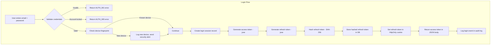
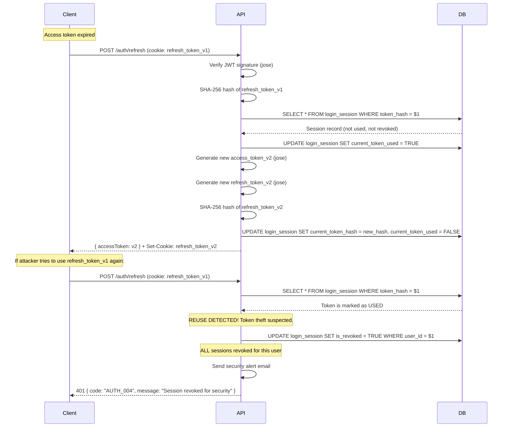
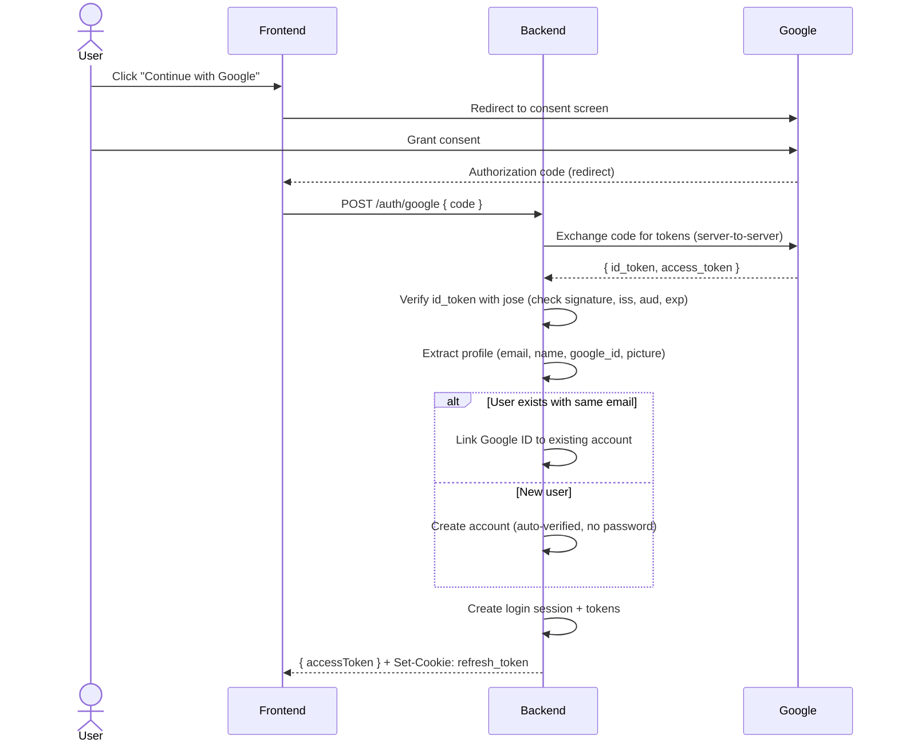

# 39 — Security Architecture

**Document ID:** AERO-SEC-039  
**Version:** 1.0  
**Last Updated:** 2026-07-16  
**Author:** Security Engineer  
**Status:** Approved  
**Classification:** Internal — Confidential

---

## Table of Contents

1. [Purpose](#1-purpose)
2. [Security Stack Overview](#2-security-stack-overview)
3. [Authentication Architecture](#3-authentication-architecture)
4. [Password Security (Argon2id)](#4-password-security-argon2id)
5. [JWT Architecture (jose)](#5-jwt-architecture-jose)
6. [Token Lifecycle & Rotation](#6-token-lifecycle--rotation)
7. [Refresh Token Security](#7-refresh-token-security)
8. [Cookie Security](#8-cookie-security)
9. [OAuth 2.0 / OpenID Connect (Google)](#9-oauth-20--openid-connect-google)
10. [Guest Authentication](#10-guest-authentication)
11. [Authorization (RBAC)](#11-authorization-rbac)
12. [Transport Security (TLS 1.3)](#12-transport-security-tls-13)
13. [Encryption at Rest (AES-256-GCM)](#13-encryption-at-rest-aes-256-gcm)
14. [Security Headers (Helmet)](#14-security-headers-helmet)
15. [Input Validation & Sanitization (Zod)](#15-input-validation--sanitization-zod)
16. [Rate Limiting & Brute-Force Protection](#16-rate-limiting--brute-force-protection)
17. [CSRF Protection](#17-csrf-protection)
18. [SQL Injection Prevention](#18-sql-injection-prevention)
19. [XSS Prevention](#19-xss-prevention)
20. [Session & Device Management](#20-session--device-management)
21. [Audit Logging (Enhanced)](#21-audit-logging-enhanced)
22. [Secure File Upload](#22-secure-file-upload)
23. [Secret Management](#23-secret-management)
24. [WebSocket Security](#24-websocket-security)
25. [Account Security Features](#25-account-security-features)
26. [Vulnerability Mitigation Matrix](#26-vulnerability-mitigation-matrix)
27. [Security Checklist](#27-security-checklist)
28. [Incident Response Plan](#28-incident-response-plan)
29. [References](#29-references)

---

## 1. Purpose

This document defines the complete security architecture for Aero MAGE. Every security decision, every cryptographic choice, and every protection mechanism is documented here. This document is **confidential** and must not be shared with external parties.

---

## 2. Security Stack Overview

| Layer | Technology | Purpose |
|-------|-----------|---------|
| **Password Hashing** | **Argon2id** | Memory-hard, GPU-resistant password hashing (OWASP recommended) |
| **JWT** | **jose** | Standards-compliant JWT creation and verification (JWS, JWE, JWK) |
| **Encryption** | **Node.js `crypto` (AES-256-GCM)** | Encrypt sensitive stored data (SMTP passwords, API keys) |
| **Transport** | **TLS 1.3** | Encrypt all traffic (HTTPS, WSS) |
| **Cookies** | **HttpOnly + Secure + SameSite=Lax** | Protect refresh tokens from XSS |
| **Validation** | **Zod** | Type-safe input validation shared between frontend and backend |
| **Rate Limiting** | **express-rate-limit** | Brute-force protection per-route |
| **Headers** | **Helmet** | Security headers (CSP, HSTS, X-Frame-Options, etc.) |
| **OAuth** | **Google OAuth 2.0 / OpenID Connect** | Standard third-party authentication |
| **Random Tokens** | **`crypto.randomBytes()`** | Cryptographically secure random token generation |
| **Token Storage** | **SHA-256 hash in PostgreSQL** | Tokens stored hashed, never in plaintext |
| **RBAC** | **Custom engine** | Fine-grained `resource:action` permission system |

### 2.1 Packages Used

```bash
npm install argon2 jose zod uuid helmet cookie-parser express-rate-limit dotenv
```

### 2.2 Packages Deliberately NOT Used

| Package | Reason |
|---------|--------|
| ❌ `passport` | Adds unnecessary abstraction. Multiple plugins increase attack surface. Harder to customize for enterprise RBAC. |
| ❌ `express-auth` / `auth.js` | Too opinionated. We need full control over token lifecycle, device tracking, and audit logging. |
| ❌ `jsonwebtoken` | Legacy API. `jose` is more modern, supports JWS/JWE/JWK, key rotation, and is standards-compliant (RFC 7515-7519). |
| ❌ `bcrypt` / `bcryptjs` | Still secure, but Argon2id is the 2026 OWASP recommendation. Memory-hard, better GPU/ASIC resistance, configurable memory/time/parallelism. |
| ❌ Third-party encryption libraries | Node.js `crypto` module is battle-tested, maintained by the Node.js security team, and provides AES-256-GCM natively. |

---

## 3. Authentication Architecture

### 3.1 Authentication Methods

| Method | Flow | Token Type |
|--------|------|-----------|
| **Email + Password** | Register → Verify Email → Login → JWT pair | Access + Refresh |
| **Google OAuth** | Google consent → Callback → JWT pair | Access + Refresh |
| **Guest Join** | Enter room code + nickname → Scoped JWT | Guest access token (limited) |

### 3.2 Authentication Flow Diagram



### 3.3 Token Architecture

```
┌─────────────────────────────────────────────────┐
│                 ACCESS TOKEN                     │
│                                                  │
│  Algorithm: RS256 (RSA + SHA-256)               │
│  Library: jose                                   │
│  Expiry: 15 minutes                             │
│  Storage: Frontend memory (NOT localStorage)     │
│  Sent: Authorization: Bearer header              │
│  Stateless: Yes (no DB lookup to verify)        │
│  Content: { sub, email, type: "access", jti }    │
│  Key: RSA-2048 private key (PEM file)           │
└─────────────────────────────────────────────────┘

┌─────────────────────────────────────────────────┐
│                REFRESH TOKEN                     │
│                                                  │
│  Algorithm: RS256 (RSA + SHA-256)               │
│  Library: jose                                   │
│  Expiry: 30 days                                │
│  Storage: HttpOnly Secure cookie                 │
│  Sent: Automatically by browser (cookie)         │
│  Stateful: Yes (hashed in DB, single-use)       │
│  Content: { sub, type: "refresh", sid, did, jti }│
│  Key: Separate RSA-2048 private key             │
│  Rotation: New token issued on every refresh     │
│  Reuse Detection: YES (revoke all on reuse)     │
└─────────────────────────────────────────────────┘
```

---

## 4. Password Security (Argon2id)

### 4.1 Why Argon2id Over bcrypt

| Factor | bcrypt | Argon2id |
|--------|--------|----------|
| **OWASP Recommendation** | Acceptable | **Recommended** (2024+) |
| **Memory Hardness** | No | **Yes** (configurable memory usage) |
| **GPU Resistance** | Moderate | **Strong** (memory-hard stops GPU parallelism) |
| **ASIC Resistance** | Low | **Strong** |
| **Configurable Parameters** | Cost factor only | Memory, time, parallelism, hash length |
| **Max Password Length** | 72 bytes (truncates longer passwords!) | Unlimited |
| **Competition Winner** | — | **Password Hashing Competition 2015** |

### 4.2 Argon2id Configuration

```typescript
const ARGON2_CONFIG = {
  type: argon2.argon2id,        // Hybrid: resistant to side-channel AND GPU attacks
  memoryCost: 65536,            // 64 MB — forces attacker to use significant RAM per attempt
  timeCost: 3,                  // 3 iterations — balances security and login speed
  parallelism: 4,               // 4 parallel threads
  hashLength: 32,               // 256-bit output
  saltLength: 16,               // 128-bit random salt (auto-generated)
};

// Resulting hash format:
// $argon2id$v=19$m=65536,t=3,p=4$<salt>$<hash>
//
// The hash string embeds ALL parameters, so:
// - Verifying old hashes still works after config changes
// - needsRehash() detects when parameters have been updated
```

### 4.3 Password Validation Rules

```
Minimum length:     8 characters
Maximum length:     128 characters (no truncation, unlike bcrypt's 72-byte limit)
Required:           1 uppercase, 1 lowercase, 1 digit, 1 special character
Prohibited:         Common passwords (top 10,000 list), user's email, user's display name
Checked against:    HaveIBeenPwned API (V2, optional)
```

### 4.4 Password Change Flow

```
1. Verify current password (Argon2id)
2. Validate new password against rules
3. Hash new password (Argon2id)
4. Update password in database
5. Invalidate ALL refresh tokens for this user
6. Send security alert email
7. Log audit event (password_changed)
```

---

## 5. JWT Architecture (jose)

### 5.1 Why `jose` Over `jsonwebtoken`

| Factor | jsonwebtoken | jose |
|--------|-------------|------|
| **Standards Compliance** | Partial | **Full** (JWS, JWE, JWK, JWK Set) |
| **Key Rotation** | Manual | **Built-in JWK Set support** |
| **Algorithm Support** | Basic | **Complete** (RS256, PS256, ES256, EdDSA) |
| **Encryption (JWE)** | ❌ No | ✅ Yes (encrypted tokens for V2+) |
| **TypeScript** | Community types | **First-class TypeScript** |
| **Maintenance** | Slow updates | **Active, modern** |
| **Node.js Crypto** | OpenSSL bindings | **Web Crypto API + native** |

### 5.2 Key Management

```
keys/
├── access-token.private.pem     # RSA-2048 private key (sign access tokens)
├── access-token.public.pem      # RSA-2048 public key (verify access tokens)
├── refresh-token.private.pem    # RSA-2048 private key (sign refresh tokens)
└── refresh-token.public.pem     # RSA-2048 public key (verify refresh tokens)
```

**Key Generation:**

```bash
# Generate access token key pair
openssl genrsa -out keys/access-token.private.pem 2048
openssl rsa -in keys/access-token.private.pem -pubout -out keys/access-token.public.pem

# Generate refresh token key pair (SEPARATE keys)
openssl genrsa -out keys/refresh-token.private.pem 2048
openssl rsa -in keys/refresh-token.private.pem -pubout -out keys/refresh-token.public.pem
```

**Why separate key pairs?**
- If the access token key is compromised, refresh tokens remain secure (and vice versa)
- Different rotation schedules (access keys rotated more frequently)
- Defense in depth

### 5.3 Token Payloads

**Access Token:**
```json
{
  "sub": "user-uuid",
  "email": "user@example.com",
  "type": "access",
  "jti": "unique-token-id",
  "iat": 1721145600,
  "exp": 1721146500
}
```

**Refresh Token:**
```json
{
  "sub": "user-uuid",
  "type": "refresh",
  "sid": "login-session-uuid",
  "did": "device-uuid",
  "jti": "unique-token-id",
  "iat": 1721145600,
  "exp": 1723737600
}
```

---

## 6. Token Lifecycle & Rotation

### 6.1 Access Token Lifecycle

```
1. Generated on login (15 min expiry)
2. Sent in JSON response body
3. Stored in frontend memory (React state/context)
4. Included in Authorization: Bearer header on every API request
5. Verified server-side (jose.jwtVerify) — no DB lookup needed
6. When expired → frontend calls /auth/refresh
7. New access token returned
```

### 6.2 Refresh Token Lifecycle

```
1. Generated on login (30 day expiry)
2. Hashed with SHA-256 before DB storage
3. Set as HttpOnly Secure SameSite=Lax cookie
4. Automatically sent by browser on /auth/refresh requests
5. On refresh:
   a. Verify JWT signature
   b. Look up hashed token in DB
   c. Check not used, not revoked, not expired
   d. Mark current token as USED
   e. Generate NEW refresh token
   f. Store new token hash in DB
   g. Return new access + refresh tokens
6. If a USED token is presented (reuse detection):
   a. REVOKE ALL tokens for this user
   b. Log security alert
   c. Send security notification email
   d. Force re-authentication
```

### 6.3 Token Rotation Diagram



---

## 7. Refresh Token Security

| Protection | Implementation |
|-----------|----------------|
| **Never in plaintext** | Stored as SHA-256 hash in database |
| **HttpOnly cookie** | JavaScript cannot read the token |
| **Secure flag** | Only sent over HTTPS |
| **SameSite=Lax** | Not sent in cross-site requests (CSRF protection) |
| **Single-use** | Each refresh token can only be used once |
| **Reuse detection** | If a used token is presented, ALL tokens revoked (theft suspected) |
| **Bound to device** | Refresh token contains device ID — token from wrong device is rejected |
| **Bound to session** | Refresh token linked to login session record |
| **Short path** | Cookie path restricted to `/api/v1/auth` (not sent on other routes) |
| **Signed cookie** | Cookie signed with COOKIE_SECRET to prevent tampering |

---

## 8. Cookie Security

```typescript
const REFRESH_COOKIE_CONFIG = {
  name: 'aero_refresh_token',
  httpOnly: true,                // ✅ Not accessible via document.cookie
  secure: process.env.NODE_ENV === 'production',  // ✅ HTTPS only in production
  sameSite: 'lax' as const,      // ✅ Prevents CSRF (strict would break OAuth redirect)
  path: '/api/v1/auth',          // ✅ Only sent to auth endpoints
  maxAge: 30 * 24 * 60 * 60 * 1000,  // 30 days
  domain: process.env.COOKIE_DOMAIN || undefined,
  signed: true,                  // ✅ Signed with cookie-parser secret
};

// Why SameSite=Lax (not Strict)?
// - Strict blocks cookies on ALL cross-site navigations,
//   including when a user clicks a link to your site from Google/email
// - Lax allows cookies on top-level navigations (GET requests from links)
//   but blocks them on cross-site POST requests (CSRF protection)
// - Since our refresh endpoint is POST-only, Lax provides CSRF protection
//   while allowing normal navigation patterns
```

---

## 9. OAuth 2.0 / OpenID Connect (Google)

### 9.1 Flow



### 9.2 Security Checks

| Check | Description |
|-------|-------------|
| Verify `id_token` signature | Using Google's public keys (JWKS endpoint) |
| Check `iss` | Must be `accounts.google.com` or `https://accounts.google.com` |
| Check `aud` | Must match our Google Client ID |
| Check `exp` | Token must not be expired |
| Check `email_verified` | Google email must be verified |
| Server-to-server code exchange | Authorization code exchanged server-side, never exposed to frontend |

---

## 10. Guest Authentication

```typescript
// Guest JWT — limited scope, short-lived
const guestToken = {
  sub: "guest-" + crypto.randomUUID(),  // Prefixed to identify as guest
  type: "guest",
  sessionId: "session-uuid",
  nickname: "CoolPlayer42",
  permissions: [],  // NO permissions — can only interact with their session via WebSocket
  exp: Math.floor(Date.now() / 1000) + (4 * 60 * 60),  // 4 hours max
};

// Guest tokens:
// - Cannot access ANY REST API endpoints (except /health)
// - Can only communicate via WebSocket within their session
// - Are not stored in the database
// - Expire after 4 hours (session should be done by then)
// - Contain NO email, NO user ID, NO permissions
```

---

## 11. Authorization (RBAC)

See [09-backend-architecture.md → Section 7.6](./09-backend-architecture.md) for detailed RBAC engine implementation.

### 11.1 Permission Check Flow

```
Every authenticated request → authenticate middleware → authorize middleware

1. Extract user ID from JWT
2. Extract required permission from route config (e.g., "quiz:create")
3. Check if Super Admin → ALLOW (bypass all checks)
4. Check cache for user's permissions in org context
5. If cache miss → query DB: user_role → role_permission → permission
6. Check if required permission exists in user's permission set
7. If YES → continue to controller
8. If NO → 403 Forbidden { code: "AUTHZ_001" }
```

### 11.2 Resource-Level Authorization

Beyond RBAC permissions, some operations require **ownership checks**:

```
quiz:update + "Is this the user's quiz?" → ALLOW
quiz:update + "Not their quiz" + "Are they Org Admin for this quiz's org?" → ALLOW
quiz:update + "Not their quiz" + "Not admin" → DENY
```

This is handled in the service layer, not middleware.

---

## 12. Transport Security (TLS 1.3)

| Environment | Protocol | URL |
|------------|----------|-----|
| **Development** | HTTP | `http://localhost:3000` |
| **Staging** | HTTPS (TLS 1.3) | `https://staging.aeromage.com` |
| **Production** | HTTPS (TLS 1.3) | `https://quiz.aeromage.com` |
| **WebSocket (Dev)** | WS | `ws://localhost:3000` |
| **WebSocket (Prod)** | WSS | `wss://quiz.aeromage.com` |

### 12.1 TLS Configuration (Nginx)

```nginx
ssl_protocols TLSv1.3 TLSv1.2;
ssl_prefer_server_ciphers on;
ssl_ciphers 'TLS_AES_256_GCM_SHA384:TLS_CHACHA20_POLY1305_SHA256:TLS_AES_128_GCM_SHA256';
ssl_session_timeout 1d;
ssl_session_cache shared:SSL:10m;
ssl_session_tickets off;
ssl_stapling on;
ssl_stapling_verify on;

# HSTS (handled by Helmet, but also enforced at Nginx level)
add_header Strict-Transport-Security "max-age=63072000; includeSubDomains; preload" always;
```

---

## 13. Encryption at Rest (AES-256-GCM)

### 13.1 What Gets Encrypted

| Data | Encryption | Where Stored |
|------|-----------|-------------|
| User passwords | Argon2id hash (NOT encryption) | PostgreSQL `user.password_hash` |
| Refresh tokens | SHA-256 hash | PostgreSQL `login_session.current_token_hash` |
| Verification tokens | SHA-256 hash | PostgreSQL `email_verification_token.token_hash` |
| Password reset tokens | SHA-256 hash | PostgreSQL `password_reset_token.token_hash` |
| SMTP passwords (org) | **AES-256-GCM encryption** | PostgreSQL `organization_settings.smtp_password_encrypted` |
| API keys (future) | **AES-256-GCM encryption** | PostgreSQL |
| Webhook secrets (future) | **AES-256-GCM encryption** | PostgreSQL |

### 13.2 AES-256-GCM Implementation

```typescript
import crypto from 'node:crypto';

const ALGORITHM = 'aes-256-gcm';
const IV_LENGTH = 12;        // 96-bit IV for GCM
const TAG_LENGTH = 16;       // 128-bit auth tag
const KEY_LENGTH = 32;       // 256-bit key

// Key derivation from ENCRYPTION_KEY env var:
// Using HKDF (HMAC-based Key Derivation Function) to derive
// a proper-length key from the master secret
function deriveKey(masterKey: string, context: string): Buffer {
  return crypto.hkdfSync('sha256', masterKey, '', context, KEY_LENGTH);
}

function encrypt(plaintext: string, masterKey: string): EncryptedPayload {
  const key = deriveKey(masterKey, 'aero-mage-encryption');
  const iv = crypto.randomBytes(IV_LENGTH);
  const cipher = crypto.createCipheriv(ALGORITHM, key, iv, { authTagLength: TAG_LENGTH });

  let ciphertext = cipher.update(plaintext, 'utf8', 'base64');
  ciphertext += cipher.final('base64');
  const tag = cipher.getAuthTag();

  return {
    ciphertext,
    iv: iv.toString('base64'),
    tag: tag.toString('base64'),
    version: 1,
  };
}

function decrypt(encrypted: EncryptedPayload, masterKey: string): string {
  const key = deriveKey(masterKey, 'aero-mage-encryption');
  const iv = Buffer.from(encrypted.iv, 'base64');
  const tag = Buffer.from(encrypted.tag, 'base64');
  const decipher = crypto.createDecipheriv(ALGORITHM, key, iv, { authTagLength: TAG_LENGTH });
  decipher.setAuthTag(tag);

  let plaintext = decipher.update(encrypted.ciphertext, 'base64', 'utf8');
  plaintext += decipher.final('utf8');
  return plaintext;
}

// Why AES-256-GCM?
// - Authenticated encryption: provides both confidentiality AND integrity
// - If ciphertext is tampered with, decryption fails (auth tag mismatch)
// - GCM is parallelizable (fast)
// - NIST recommended
```

---

## 14. Security Headers (Helmet)

```typescript
import helmet from 'helmet';

app.use(helmet({
  contentSecurityPolicy: {
    directives: {
      defaultSrc: ["'self'"],
      scriptSrc: ["'self'"],
      styleSrc: ["'self'", "'unsafe-inline'", "https://fonts.googleapis.com"],
      fontSrc: ["'self'", "https://fonts.gstatic.com"],
      imgSrc: ["'self'", "data:", "https:"],
      connectSrc: ["'self'", "wss:", "https://accounts.google.com"],
      frameSrc: ["'none'"],
      objectSrc: ["'none'"],
      baseUri: ["'self'"],
      formAction: ["'self'"],
    },
  },
  crossOriginEmbedderPolicy: false,  // Needed for external images
  hsts: {
    maxAge: 63072000,               // 2 years
    includeSubDomains: true,
    preload: true,
  },
  referrerPolicy: { policy: 'strict-origin-when-cross-origin' },
  xFrameOptions: { action: 'deny' },
}));

// Headers set:
// Content-Security-Policy     → Prevents XSS, clickjacking, code injection
// Strict-Transport-Security   → Forces HTTPS for 2 years
// X-Content-Type-Options      → nosniff (prevents MIME type confusion)
// X-Frame-Options             → DENY (prevents clickjacking)
// X-XSS-Protection            → 0 (deprecated, CSP is better)
// Referrer-Policy              → Limits referrer information leakage
// Cross-Origin-Opener-Policy   → same-origin
// X-Permitted-Cross-Domain     → none
// X-DNS-Prefetch-Control       → off
```

---

## 15. Input Validation & Sanitization (Zod)

### 15.1 Validation Layers

```
Layer 1: Zod Schema Validation (middleware)
  → Type checking, length limits, format validation, enum validation
  → Strips unknown fields (no mass assignment attacks)
  → Runs BEFORE controller

Layer 2: Business Rule Validation (service layer)
  → Uniqueness checks (email already exists?)
  → Ownership checks (is this their quiz?)
  → State checks (is this quiz editable?)
  → Limit checks (org reached max quizzes?)

Layer 3: Database Constraints (PostgreSQL)
  → CHECK constraints, UNIQUE constraints, NOT NULL, FK constraints
  → Last line of defense
```

### 15.2 Sanitization

```typescript
// All string inputs are sanitized:
// 1. Trim whitespace
// 2. Remove null bytes
// 3. Escape HTML entities (for display contexts)
// 4. Normalize unicode (NFC)

// SQL injection: Prevented by parameterized queries (pg library)
// XSS: Prevented by CSP headers + output encoding
// Path traversal: File names replaced with UUIDs
// Command injection: No shell commands from user input
```

---

## 16. Rate Limiting & Brute-Force Protection

### 16.1 Rate Limit Configuration

| Endpoint Group | Max Requests | Window | Per | Action on Exceed |
|---------------|-------------|--------|-----|-----------------|
| `POST /auth/login` | 5 | 1 min | IP | 429 + Retry-After |
| `POST /auth/register` | 3 | 1 hour | IP | 429 + Retry-After |
| `POST /auth/forgot-password` | 3 | 1 hour | Email | 429 + Retry-After |
| `POST /auth/verify-email` | 5 | 15 min | IP | 429 + Retry-After |
| `POST /auth/resend-verification` | 3 | 1 hour | Email | 429 + Retry-After |
| API (authenticated) | 100 | 1 min | User ID | 429 + Retry-After |
| API (unauthenticated) | 30 | 1 min | IP | 429 + Retry-After |
| File upload | 30 | 1 hour | User ID | 429 + Retry-After |
| Search | 60 | 1 min | User ID | 429 + Retry-After |
| WebSocket messages | 50 | 1 sec | Connection | Disconnect |

### 16.2 Account Lockout

```
After 10 consecutive failed login attempts:
  → Account status = "locked"
  → locked_until = NOW() + 30 minutes
  → Security alert email sent
  → Audit log entry created
  → IP logged

Unlock:
  → Automatic after 30 minutes
  → Manual by Super Admin
  → Password reset unlocks account
```

---

## 17. CSRF Protection

```
Primary CSRF Protection: SameSite=Lax cookie for refresh tokens

Why NOT a CSRF token?
- Our API is stateless (JWT in Authorization header)
- Access tokens are sent in headers, not cookies
- Refresh tokens are in SameSite=Lax cookies (browser won't send on cross-site POST)
- Combined with CORS (only allow our frontend origin), CSRF is mitigated

Additional protection:
- CORS Origin validation (whitelist)
- Referer header validation (optional, defense in depth)
- Custom header requirement (X-Requested-With) for mutations (optional)
```

---

## 18. SQL Injection Prevention

```
Primary: Parameterized queries ONLY

// ✅ CORRECT — Parameterized query
const result = await pool.query(
  'SELECT * FROM "user" WHERE email_lower = $1 AND deleted_at IS NULL',
  [email.toLowerCase()]
);

// ❌ NEVER — String interpolation
const result = await pool.query(
  `SELECT * FROM "user" WHERE email_lower = '${email}'`
);

Rules:
- NO string concatenation in SQL queries
- NO template literals with user input in SQL
- ALL values passed as parameters ($1, $2, etc.)
- Table names and column names NEVER from user input
- ORDER BY column names validated against a whitelist
- LIMIT/OFFSET values parsed as integers
```

---

## 19. XSS Prevention

```
1. Content-Security-Policy header (Helmet)
   → Prevents inline scripts, restricts script sources

2. Output encoding
   → All API responses are JSON (application/json)
   → React auto-escapes JSX output

3. HttpOnly cookies
   → Even if XSS occurs, cookies (refresh tokens) are not accessible

4. Input sanitization
   → Strip HTML from user inputs (display names, bios, quiz titles)

5. No dangerouslySetInnerHTML
   → Frontend NEVER renders raw HTML from user input
```

---

## 20. Session & Device Management

### 20.1 Enhanced Login Session Table

```sql
CREATE TABLE login_session (
    internal_id         BIGSERIAL PRIMARY KEY,
    id                  UUID NOT NULL DEFAULT gen_random_uuid(),
    user_id             UUID NOT NULL REFERENCES "user"(id) ON DELETE CASCADE,
    device_id           UUID NOT NULL REFERENCES user_device(id),
    current_token_hash  VARCHAR(64) NOT NULL,  -- SHA-256 of current refresh token
    current_token_used  BOOLEAN NOT NULL DEFAULT FALSE,
    is_revoked          BOOLEAN NOT NULL DEFAULT FALSE,
    ip_address          INET NOT NULL,
    user_agent          VARCHAR(500) NOT NULL,
    last_active_at      TIMESTAMPTZ NOT NULL DEFAULT NOW(),
    expires_at          TIMESTAMPTZ NOT NULL,
    revoked_at          TIMESTAMPTZ NULL,
    revoke_reason       VARCHAR(50) NULL,
        -- manual, password_change, token_reuse, admin_action, logout
    created_at          TIMESTAMPTZ NOT NULL DEFAULT NOW(),

    CONSTRAINT uq_login_session_id UNIQUE (id),
    CONSTRAINT uq_login_session_token UNIQUE (current_token_hash)
);

CREATE INDEX idx_login_session_user ON login_session (user_id) WHERE is_revoked = FALSE;
CREATE INDEX idx_login_session_token ON login_session (current_token_hash) WHERE is_revoked = FALSE;
```

### 20.2 Device Tracking Table

```sql
CREATE TABLE user_device (
    internal_id     BIGSERIAL PRIMARY KEY,
    id              UUID NOT NULL DEFAULT gen_random_uuid(),
    user_id         UUID NOT NULL REFERENCES "user"(id) ON DELETE CASCADE,
    device_name     VARCHAR(200) NOT NULL,
        -- Parsed from user-agent: "Chrome 127 on Windows 11"
    device_type     VARCHAR(20) NOT NULL,
        -- desktop, mobile, tablet, unknown
    browser         VARCHAR(50) NULL,
    browser_version VARCHAR(20) NULL,
    os              VARCHAR(50) NULL,
    os_version      VARCHAR(20) NULL,
    fingerprint     VARCHAR(64) NOT NULL,
        -- SHA-256 hash of (user_agent + screen_resolution + timezone + language)
    is_trusted      BOOLEAN NOT NULL DEFAULT FALSE,
    last_ip         INET NULL,
    last_used_at    TIMESTAMPTZ NOT NULL DEFAULT NOW(),
    first_seen_at   TIMESTAMPTZ NOT NULL DEFAULT NOW(),
    created_at      TIMESTAMPTZ NOT NULL DEFAULT NOW(),

    CONSTRAINT uq_user_device_id UNIQUE (id),
    CONSTRAINT uq_user_device_fingerprint UNIQUE (user_id, fingerprint)
);

CREATE INDEX idx_user_device_user ON user_device (user_id);
```

### 20.3 Session Management API

```
GET    /auth/sessions           → List active login sessions for current user
DELETE /auth/sessions/:id       → Revoke a specific session (logout that device)
DELETE /auth/sessions           → Revoke ALL sessions (logout everywhere)
GET    /auth/devices            → List known devices
DELETE /auth/devices/:id        → Remove a trusted device
```

---

## 21. Audit Logging (Enhanced)

### 21.1 Enhanced Audit Log Table

```sql
CREATE TABLE audit_log (
    internal_id         BIGSERIAL PRIMARY KEY,
    id                  UUID NOT NULL DEFAULT gen_random_uuid(),

    -- WHO
    actor_id            UUID NULL,          -- User who performed the action (NULL for system)
    actor_type          VARCHAR(20) NOT NULL DEFAULT 'user',
        -- user, system, scheduler, admin, api_key
    actor_email         VARCHAR(255) NULL,  -- Denormalized for query convenience
    actor_display_name  VARCHAR(100) NULL,  -- Denormalized
    actor_roles         TEXT[] NULL,         -- Roles at time of action

    -- WHAT
    action              VARCHAR(50) NOT NULL,
        -- create, update, delete, archive, restore, login, logout,
        -- permission_change, role_assign, publish, unpublish,
        -- approve, reject, suspend, lock, unlock, revoke,
        -- export, import, config_change, feature_flag_change
    action_category     VARCHAR(30) NOT NULL,
        -- auth, data, config, security, moderation, admin
    description         VARCHAR(500) NULL,
        -- Human-readable description: "Created quiz 'JavaScript Basics'"

    -- WHERE (Resource)
    resource_type       VARCHAR(50) NOT NULL,
        -- user, quiz, question, session, organization, department,
        -- member, role, permission, marketplace_listing,
        -- certificate, config, feature_flag, invitation
    resource_id         UUID NULL,
    resource_name       VARCHAR(200) NULL,  -- Denormalized for readability

    -- CONTEXT
    organization_id     UUID NULL,          -- Org context (if applicable)
    organization_name   VARCHAR(100) NULL,  -- Denormalized
    department_id       UUID NULL,

    -- CHANGES
    old_values          JSONB NULL,         -- Previous state
    new_values          JSONB NULL,         -- New state
    changed_fields      TEXT[] NULL,        -- List of changed field names
        -- e.g., ['title', 'description', 'visibility']

    -- REQUEST CONTEXT
    request_id          UUID NULL,          -- Correlation ID for request tracing
    ip_address          INET NULL,
    user_agent          VARCHAR(500) NULL,
    device_type         VARCHAR(20) NULL,   -- desktop, mobile, tablet
    browser             VARCHAR(50) NULL,
    os                  VARCHAR(50) NULL,
    geo_country         VARCHAR(2) NULL,    -- ISO 3166-1 alpha-2 (from IP geolocation)
    geo_city            VARCHAR(100) NULL,

    -- API CONTEXT
    http_method         VARCHAR(10) NULL,   -- GET, POST, PATCH, DELETE
    http_path           VARCHAR(500) NULL,  -- /api/v1/quizzes/uuid
    http_status         INTEGER NULL,       -- Response status code
    response_time_ms    INTEGER NULL,       -- Request duration in ms

    -- METADATA
    severity            VARCHAR(10) NOT NULL DEFAULT 'info',
        -- info, warning, critical
    tags                TEXT[] NULL,        -- Searchable tags for filtering
    metadata            JSONB NULL DEFAULT '{}',
        -- Any additional context not covered above

    -- TIMESTAMP
    created_at          TIMESTAMPTZ NOT NULL DEFAULT NOW(),

    CONSTRAINT uq_audit_log_id UNIQUE (id)
);

-- CRITICAL: This table is APPEND-ONLY
-- NO UPDATE or DELETE operations are allowed
-- Enforced via a trigger that rejects UPDATE/DELETE

CREATE OR REPLACE FUNCTION prevent_audit_modification()
RETURNS TRIGGER AS $$
BEGIN
    RAISE EXCEPTION 'Audit logs are immutable. UPDATE and DELETE are prohibited.';
    RETURN NULL;
END;
$$ LANGUAGE plpgsql;

CREATE TRIGGER trg_audit_log_immutable
BEFORE UPDATE OR DELETE ON audit_log
FOR EACH ROW EXECUTE FUNCTION prevent_audit_modification();

-- Indexes for common query patterns
CREATE INDEX idx_audit_log_actor ON audit_log (actor_id, created_at DESC) WHERE actor_id IS NOT NULL;
CREATE INDEX idx_audit_log_resource ON audit_log (resource_type, resource_id, created_at DESC);
CREATE INDEX idx_audit_log_org ON audit_log (organization_id, created_at DESC) WHERE organization_id IS NOT NULL;
CREATE INDEX idx_audit_log_action ON audit_log (action, created_at DESC);
CREATE INDEX idx_audit_log_category ON audit_log (action_category, created_at DESC);
CREATE INDEX idx_audit_log_severity ON audit_log (severity, created_at DESC) WHERE severity IN ('warning', 'critical');
CREATE INDEX idx_audit_log_created ON audit_log (created_at DESC);
CREATE INDEX idx_audit_log_ip ON audit_log (ip_address, created_at DESC) WHERE ip_address IS NOT NULL;
CREATE INDEX idx_audit_log_tags ON audit_log USING gin (tags) WHERE tags IS NOT NULL;

-- Partitioned by month for performance
-- See database-design.md Section 26 for partitioning details
```

### 21.2 Audit Event Examples

**Login Success:**
```json
{
  "actor_id": "user-uuid",
  "actor_type": "user",
  "actor_email": "john@example.com",
  "actor_display_name": "John Doe",
  "action": "login",
  "action_category": "auth",
  "description": "User logged in via email/password",
  "resource_type": "user",
  "resource_id": "user-uuid",
  "ip_address": "203.0.113.42",
  "user_agent": "Mozilla/5.0 (Windows NT 10.0; Win64; x64) ...",
  "device_type": "desktop",
  "browser": "Chrome 127",
  "os": "Windows 11",
  "geo_country": "IN",
  "geo_city": "Mumbai",
  "http_method": "POST",
  "http_path": "/api/v1/auth/login",
  "http_status": 200,
  "response_time_ms": 245,
  "severity": "info",
  "tags": ["auth", "login", "email"]
}
```

**Quiz Updated:**
```json
{
  "actor_id": "user-uuid",
  "actor_type": "user",
  "actor_email": "jane@example.com",
  "actor_display_name": "Jane Smith",
  "actor_roles": ["user", "faculty"],
  "action": "update",
  "action_category": "data",
  "description": "Updated quiz 'Advanced JavaScript'",
  "resource_type": "quiz",
  "resource_id": "quiz-uuid",
  "resource_name": "Advanced JavaScript",
  "organization_id": "org-uuid",
  "organization_name": "Tech Academy",
  "old_values": { "title": "JavaScript Quiz", "visibility": "private" },
  "new_values": { "title": "Advanced JavaScript", "visibility": "organization" },
  "changed_fields": ["title", "visibility"],
  "request_id": "req-uuid",
  "ip_address": "198.51.100.15",
  "http_method": "PATCH",
  "http_path": "/api/v1/quizzes/quiz-uuid",
  "http_status": 200,
  "response_time_ms": 78,
  "severity": "info",
  "tags": ["quiz", "update", "visibility_change"]
}
```

**Security Alert — Token Reuse Detected:**
```json
{
  "actor_id": null,
  "actor_type": "system",
  "action": "token_reuse_detected",
  "action_category": "security",
  "description": "Refresh token reuse detected for user john@example.com. All sessions revoked.",
  "resource_type": "user",
  "resource_id": "user-uuid",
  "resource_name": "John Doe",
  "ip_address": "192.0.2.100",
  "severity": "critical",
  "tags": ["security", "token_reuse", "session_revocation"],
  "metadata": {
    "original_login_ip": "203.0.113.42",
    "reuse_ip": "192.0.2.100",
    "sessions_revoked": 3,
    "alert_email_sent": true
  }
}
```

### 21.3 Audit Log Query Examples

```sql
-- All actions by a specific user in the last 30 days
SELECT * FROM audit_log
WHERE actor_id = $1 AND created_at >= NOW() - INTERVAL '30 days'
ORDER BY created_at DESC;

-- All security events (critical severity)
SELECT * FROM audit_log
WHERE severity = 'critical' AND created_at >= NOW() - INTERVAL '7 days'
ORDER BY created_at DESC;

-- All changes to a specific resource
SELECT action, description, changed_fields, old_values, new_values, created_at
FROM audit_log
WHERE resource_type = 'quiz' AND resource_id = $1
ORDER BY created_at DESC;

-- Login history from a specific IP
SELECT actor_email, action, description, geo_country, geo_city, created_at
FROM audit_log
WHERE ip_address = $1 AND action IN ('login', 'login_failed')
ORDER BY created_at DESC;

-- Organization activity audit
SELECT * FROM audit_log
WHERE organization_id = $1 AND created_at BETWEEN $2 AND $3
ORDER BY created_at DESC
LIMIT 100 OFFSET $4;
```

---

## 22. Secure File Upload

```
1. Client-side pre-validation (UX only, not security)
2. Multer middleware: parse multipart/form-data
3. MIME type validation (magic bytes, not just extension)
4. File extension validation (whitelist)
5. File size validation (per type)
6. Rename to UUID (prevent path traversal)
7. Store outside web root (prevent direct access)
8. Serve via Nginx static path (separate domain in V2)
9. Reject executable files (EXE, BAT, SH, PHP, etc.)
10. Image validation: verify image headers are valid
11. Optional: virus scan (ClamAV) in V2
```

---

## 23. Secret Management

| Secret | Storage | Access |
|--------|---------|--------|
| Database password | `.env` file (gitignored) | Environment variable |
| JWT private keys | `keys/` directory (gitignored) | File system read |
| Encryption key | `.env` file | Environment variable |
| Cookie secret | `.env` file | Environment variable |
| Google OAuth credentials | `.env` file | Environment variable |
| SMTP credentials (system) | `.env` file | Environment variable |
| SMTP credentials (org) | PostgreSQL (AES-256-GCM encrypted) | Decrypted at runtime |

**Rules:**
- Secrets NEVER committed to Git
- `.env.example` contains placeholder values (not real secrets)
- Production secrets managed via AWS Secrets Manager (V2)
- All secrets validated at startup (fail fast if missing)
- Secrets NEVER logged (Winston filter)

---

## 24. WebSocket Security

```
1. WSS (WebSocket Secure) in production — TLS encrypted
2. JWT authentication on connection (via auth query param or cookie)
3. Token verified server-side before allowing connection
4. Connection rejected if:
   - Token invalid/expired
   - User deactivated/suspended/locked
   - Feature flag disabled
5. Rate limiting: 50 messages/second per connection
6. Namespace isolation: /session namespace for quiz sessions
7. Room isolation: participants can only receive events from their session room
8. Host verification: only the session host can emit host-only events
9. Input validation: all incoming socket messages validated with Zod
10. No sensitive data in socket messages (passwords, tokens, emails)
```

---

## 25. Account Security Features

| Feature | Description |
|---------|-------------|
| **Email verification** | Required for full access. Token expires in 24h. |
| **Password strength** | 8+ chars, mixed case, digits, special chars. Common password check. |
| **Account lockout** | 10 failed login attempts → 30 min lock |
| **New device alert** | Email notification on login from unrecognized device |
| **Session management** | Users can view and revoke active sessions |
| **Device management** | Users can view known devices and remove trusted devices |
| **Password change logout** | Changing password revokes all refresh tokens |
| **Deactivation grace period** | 30-day window to reactivate before permanent deletion |
| **Login history** | Full audit trail of login attempts with IP, device, location |

---

## 26. Vulnerability Mitigation Matrix

| Vulnerability | OWASP Category | Mitigation |
|--------------|----------------|------------|
| SQL Injection | A03:2021 | Parameterized queries (pg library). No string interpolation. |
| XSS | A03:2021 | CSP headers (Helmet). Output encoding (React). HttpOnly cookies. No raw HTML rendering. |
| CSRF | A01:2021 | SameSite=Lax cookies. CORS origin validation. Stateless JWT in headers. |
| Broken Auth | A07:2021 | Argon2id passwords. JWT with rotation. Token reuse detection. Account lockout. |
| Broken Access Control | A01:2021 | RBAC engine. Ownership checks. Server-side authorization on every request. |
| Security Misconfiguration | A05:2021 | Helmet headers. Validated config at startup. No default credentials. |
| Sensitive Data Exposure | A02:2021 | AES-256-GCM encryption. TLS 1.3. No sensitive data in logs. UUID file names. |
| Mass Assignment | A04:2021 | Zod schemas strip unknown fields. DTOs define allowed fields explicitly. |
| Rate Limiting | A04:2021 | express-rate-limit per route group. Account lockout. |
| Token Theft | A07:2021 | Refresh token rotation. Reuse detection. Device binding. HttpOnly cookies. |
| Path Traversal | A01:2021 | UUID file names. No user-controlled file paths. |
| Privilege Escalation | A01:2021 | Cannot assign role above own level. Server-side permission checks. |
| Insecure Deserialization | A08:2021 | JSON only. Zod validation. No eval(). No YAML/XML parsing of user input. |
| Insufficient Logging | A09:2021 | Comprehensive audit log. Security event alerting. Login history. |

---

## 27. Security Checklist

### Pre-Deployment Checklist

- [ ] All secrets in environment variables (not in code)
- [ ] `.env` file in `.gitignore`
- [ ] JWT keys generated and stored securely
- [ ] HTTPS/TLS 1.3 configured
- [ ] CORS origins configured (whitelist only)
- [ ] Helmet security headers configured
- [ ] Rate limiting configured for all endpoints
- [ ] All SQL queries parameterized
- [ ] Zod validation on all endpoints
- [ ] File upload validation (type, size, rename)
- [ ] Audit logging for all mutations
- [ ] Password policy enforced
- [ ] Account lockout configured
- [ ] Refresh token rotation enabled
- [ ] Token reuse detection enabled
- [ ] HttpOnly cookies for refresh tokens
- [ ] Error messages don't leak internal details in production
- [ ] No sensitive data in logs
- [ ] Database backups configured
- [ ] PM2 configured with non-root user

---

## 28. Incident Response Plan

### 28.1 Severity Levels

| Level | Description | Response Time | Example |
|-------|-------------|--------------|---------|
| **P0 — Critical** | Active breach, data exposure | Immediate (15 min) | Token reuse pattern across multiple users, DB credentials leaked |
| **P1 — High** | Vulnerability exploited, single user impact | 1 hour | Account takeover, unauthorized data access |
| **P2 — Medium** | Vulnerability discovered, not yet exploited | 24 hours | XSS vector found, misconfigured CORS |
| **P3 — Low** | Security improvement opportunity | Next sprint | Missing rate limit on non-sensitive endpoint |

### 28.2 Incident Response Steps

```
1. DETECT   → Audit logs, monitoring alerts, user reports
2. CONTAIN  → Revoke compromised tokens, lock affected accounts, disable feature
3. ASSESS   → Determine scope of impact, affected data/users
4. REMEDIATE → Fix vulnerability, patch affected systems
5. NOTIFY   → Inform affected users (if data exposed)
6. REVIEW   → Post-incident review, update security controls
7. DOCUMENT → Full incident report, lessons learned, ADR if architectural change
```

---

## 29. References

| Document | Relationship |
|----------|-------------|
| [07-database-design.md](./07-database-design.md) | Database tables for auth, audit, devices |
| [09-backend-architecture.md](./09-backend-architecture.md) | Auth module implementation |
| [02-business-rules.md](./02-business-rules.md) | Auth and rate limiting business rules |
| [16-rbac.md](./16-rbac.md) | RBAC system details |
| [40-error-reference.md](./40-error-reference.md) | Auth error codes |
| [44-audit-logging.md](./44-audit-logging.md) | Audit logging details |
| [decisions/ADR-001](./decisions/ADR-001-modular-monolith.md) | Architecture decision |

---

*End of Document — AERO-SEC-039 v1.0*
